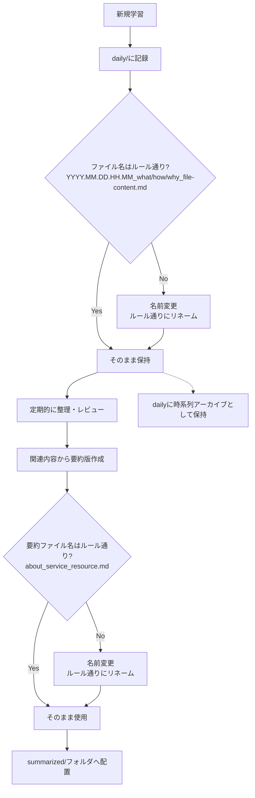

# TIL (Today I Learned)

日々の学習内容を記録するリポジトリです。技術的な発見、理解、実装方法などを体系的に整理しています。

## 📚 コンテンツ構成

### 要約版ドキュメント
- `/summarized/` - 技術別の包括的な要約ドキュメント
  - `about_aws_*.md` - AWSサービスの要約
  - `about_terraform_*.md` - Terraformリソースの要約
  - 各要約は関連するdaily TILsから重要な内容を統合

### Daily TILs
- `/daily/` - 日々の学習記録（タイムスタンプ付き）
  - `YYYY.MM.DD.HH.MM_[what|how|why]_*.md` 形式
  - 学習時点での詳細な記録を保持

## 📝 テンプレート

3種類のテンプレートを使用して、学習内容を構造化しています：

### 1. [What テンプレート](../template/til-file/til_template_what.md)
「〜とは何か」を説明するテンプレート
- 技術や概念の定義
- 主要機能の説明
- 関連技術との関係

### 2. [How テンプレート](../template/til-file/til_template_how.md)
「どのように〜するか」を説明するテンプレート
- 実装手順
- コード例
- ベストプラクティス

### 3. [Why テンプレート](../template/til-file/til_template_why.md)
「なぜ〜なのか」を説明するテンプレート
- 技術選定の理由
- メリット・デメリット
- 比較分析

### 4. [要約テンプレート](../template/summarized-file/SUMMARIZED_TEMPLATE.md)
包括的な要約ドキュメント用テンプレート
- What/Why/Howを統合した体系的な構成
- 複数のdaily TILsから重要な内容を集約
- 実装例とトラブルシューティングを含む

## 🔄 TILストックフロー

### 学習内容の管理フロー



### ストック方針

1. **初期記録（[daily/](daily/)）**
   - すべての新規TILは最初に`daily/`に作成
   - タイムスタンプ付きファイル名で時系列管理
   - 学習直後の生の知識を記録

2. **整理・要約の作成**
   - 定期的に関連する内容をレビュー
   - 技術別に要約ファイルを作成
   - SUMMARIZED_TEMPLATEを使用して構造化
   - dailyファイルは原典として保持

3. **要約ファイルの配置**
   - `/summarized/`フォルダに配置
   - `about_{service}_{resource}.md`形式で命名
   - 関連するdailyファイルへのリンクを含める
   - What/Why/Howセクションで体系的に整理

### ファイル命名規則

**Daily TILファイル**：
```
{timestamp}_{type}_{content}.md
例: 2025.08.01.14.31_how_aws_acm_certificate_terraform_configuration_guide.md
```
- timestamp: `YYYY.MM.DD.HH.MM`形式
- type: `what` / `how` / `why`
- content: 内容を表すスネークケース

**要約ファイル（/summarized/フォルダ）**：
```
about_{service}_{resource}.md
例: about_terraform_aws_lambda_function.md
例: about_aws_s3.md
```
- タイムスタンプなし（最新の統合版）
- 包括的な内容（What/Why/How統合）
- 関連するdaily TILsへのリンクを含む

📌 **関連リンク**：
- [要約テンプレート設定](../template/summarized-file/params.yml)
- [TILテンプレート設定](../template/til-file/params.yml)

## 📂 フォルダアーキテクチャルール

### ディレクトリ構成の原則

1. **技術カテゴリ別の整理**
   - 各技術・サービスごとに専用ディレクトリを作成
   - 関連する複数のファイルがある場合のみサブディレクトリを作成
   - 空のディレクトリは作成しない

2. **ファイル配置のルール**
   - 新規学習 → `daily/`に作成
   - 要約・統合版 → `/summarized/`フォルダに配置
   - dailyファイルは時系列のアーカイブとして保持

3. **命名規則**
   - ディレクトリ名：小文字、ハイフン区切り（例：`step-functions`）
   - dailyファイル：`{timestamp}_{type}_{content}.md`
   - 要約ファイル：`about_{service}_{resource}.md`（タイムスタンプなし）

### フォルダ作成・整理の基準

**要約ファイルを作成する場合**：

- 特定のTerraformリソースやAWSサービスについて複数のdaily TILsが存在
- 関連する内容を統合して包括的な理解を提供したい
- What/Why/Howの観点から体系的に整理する価値がある
- 実装例やトラブルシューティングを含めて実用的なガイドを作成

**要約ファイルの構成**：

- SUMMARIZED_TEMPLATEを使用して一貫した構造を維持
- 概要、キーポイント、What/Why/Howセクション
- ベストプラクティスと実装パターン
- 関連するdaily TILsへのリンク集

**dailyファイルの扱い**：

- すべてのdailyファイルは削除せず保持
- 学習の経緯と詳細を追跡可能に
- 要約ファイルからの参照リンクとして活用

## 📅 Daily TIL

日次の学習記録は以下の命名規則に従います：

```bash
YYYY.MM.DD.HH.MM_[what|how|why]_topic_name.md
```

例：
- `2025.08.01.14.31_how_aws_acm_certificate_terraform_configuration_guide.md`
- `2025.07.28.17.36_what_is-aws-lambda.md`
