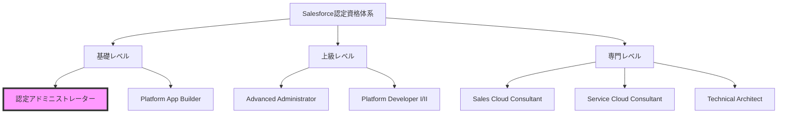
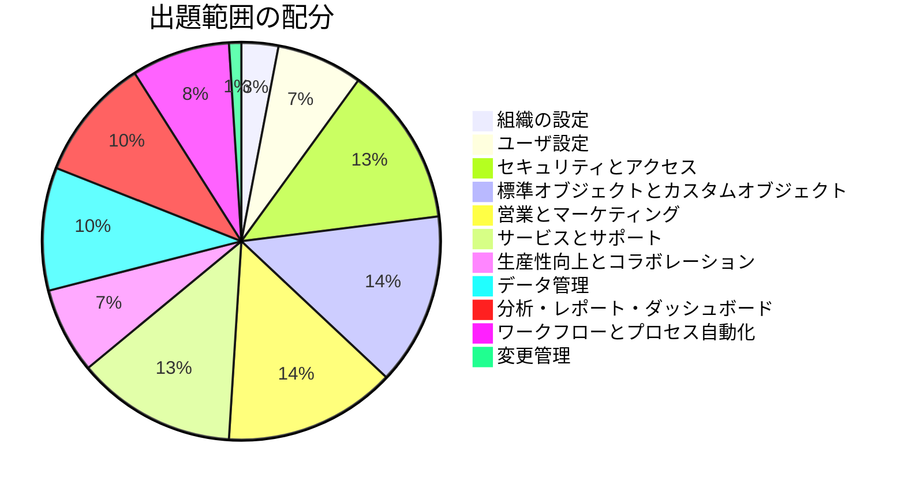
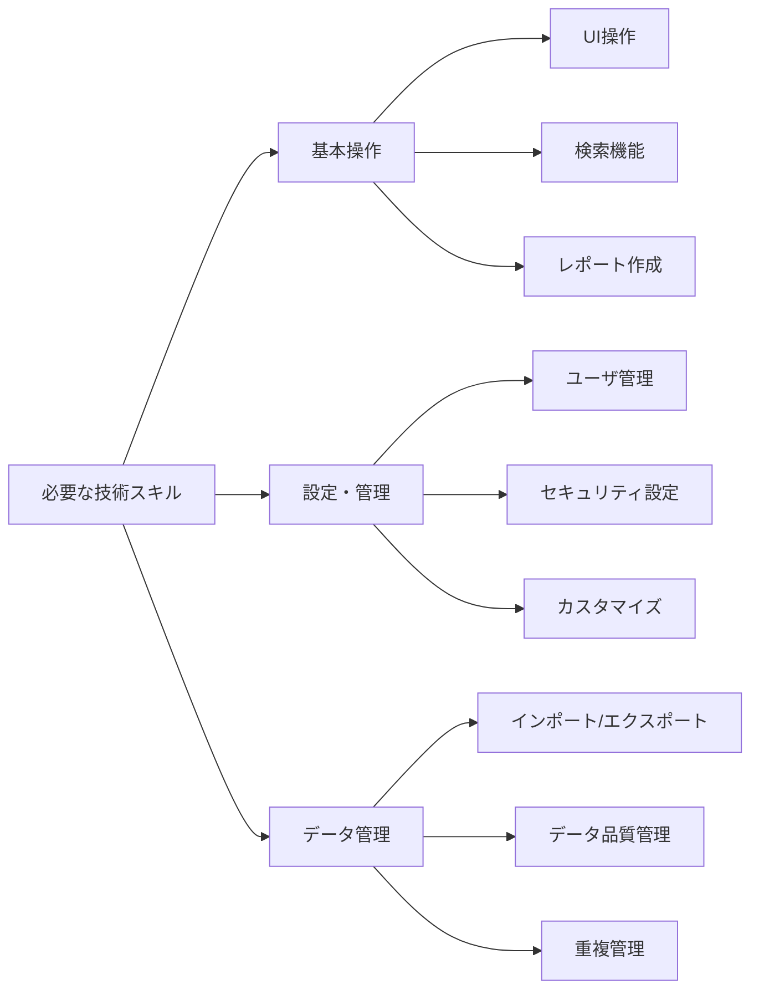
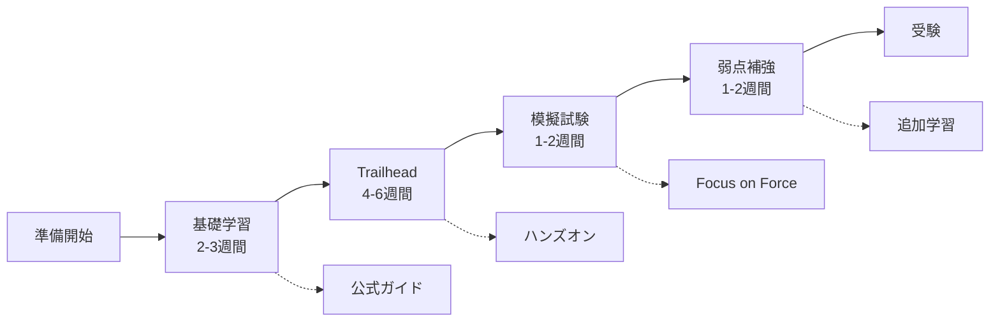

# Salesforce認定アドミニストレーター資格

## What's this file?
> [!NOTE]
> **What**
>
> Salesforce認定アドミニストレーター資格とは何かについて記載しています。

## Conclusion (忙しいとき向け)
> [!IMPORTANT]
> **What** : Salesforce認定アドミニストレーター資格とは何か
>
> **Answer** : Salesforceプラットフォームの基本的な管理・設定スキルを証明する入門レベルの認定資格で、Salesforceキャリアの第一歩となる重要な資格

## 目次

目次を開く

- [1. 資格の概要](#1-資格の概要)
- [2. 試験内容と出題範囲](#2-試験内容と出題範囲)
- [3. 必要なスキルセット](#3-必要なスキルセット)
- [4. 受験要項](#4-受験要項)

## 1. 資格の概要

### 1.1 資格の位置づけ

Salesforce認定アドミニストレーター資格は、Salesforce認定資格体系の中で最も基礎的な資格です。

### 1.2 対象者

- Salesforceを使い始めて6ヶ月以上の管理者
- システム管理者を目指すIT担当者
- Salesforceキャリアを始めたい方
- ビジネスプロセスの改善に携わる方

## 2. 試験内容と出題範囲

### 2.1 試験概要

| 項目 | 詳細 |
|------|------|
| 問題数 | 60問（多肢選択式） |
| 試験時間 | 105分 |
| 合格基準 | 65% |
| 受験料 | 200 USD |
| 言語 | 日本語・英語他 |

### 2.2 出題範囲と配分

### 2.3 主要な出題トピック

**1. セキュリティとアクセス（13%）**
- プロファイルと権限セット
- 組織の共有設定
- ロール階層
- フィールドレベルセキュリティ

**2. 標準オブジェクトとカスタムオブジェクト（14%）**
- オブジェクトのカスタマイズ
- カスタムフィールドの作成
- ページレイアウトの管理
- レコードタイプの設定

**3. 営業とマーケティング（14%）**
- リード管理
- 商談プロセス
- 商品と価格表
- キャンペーン管理

## 3. 必要なスキルセット

### 3.1 技術的スキル

### 3.2 ビジネススキル

- ビジネスプロセスの理解
- 要件定義能力
- ステークホルダーとのコミュニケーション
- 問題解決能力

## 4. 受験要項

### 4.1 受験準備の流れ

### 4.2 推奨される学習リソース

**公式リソース：**
- Salesforce Help & Training
- Trailhead（無料学習プラットフォーム）
- 認定アドミニストレーター試験ガイド

**サードパーティリソース：**
- Focus on Force（有料模擬試験）
- Udemy/Coursera コース
- 日本語学習書籍

### 4.3 受験方法

1. **オンサイト試験**
   - テストセンターでの受験
   - 本人確認書類必要

2. **オンライン監督試験**
   - 自宅からの受験可能
   - Webカメラ必須
   - 静かな環境が必要

## 関連

- [Salesforce認定資格公式サイト](https://trailhead.salesforce.com/credentials/administrator)
- [Trailmix: Admin認定試験準備](https://trailhead.salesforce.com/users/strailhead/trailmixes/prepare-for-your-salesforce-administrator-credential)
- [Salesforce Help](https://help.salesforce.com)
- [管理者向けベストプラクティス](https://admin.salesforce.com)
