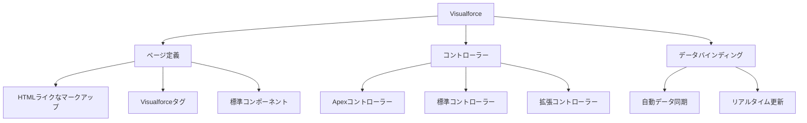
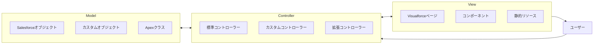
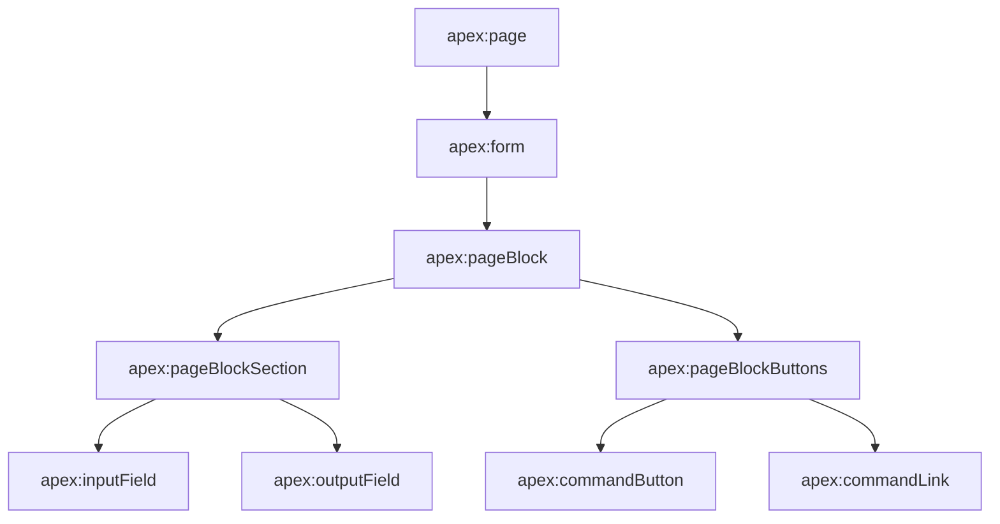
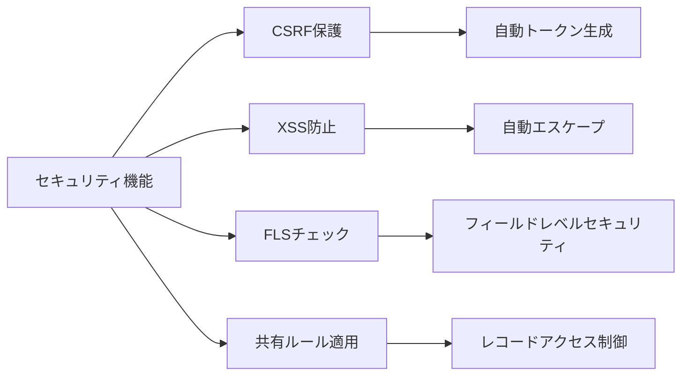
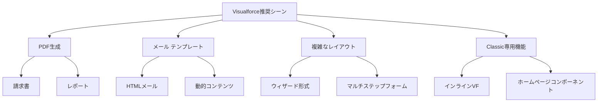
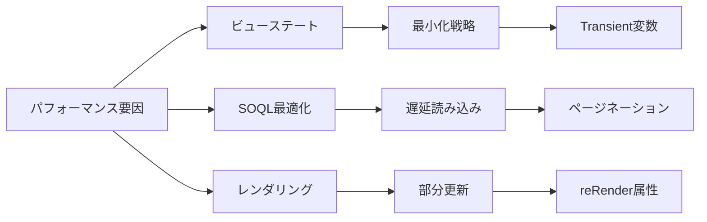
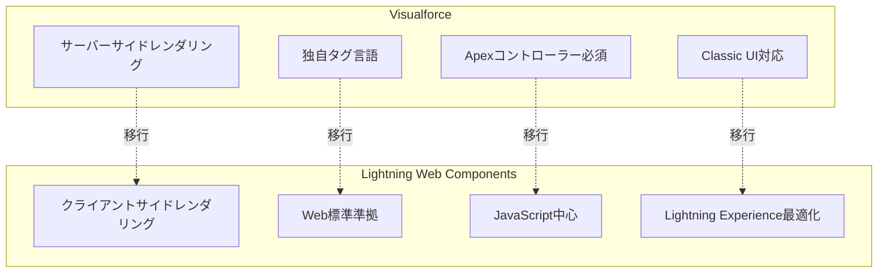
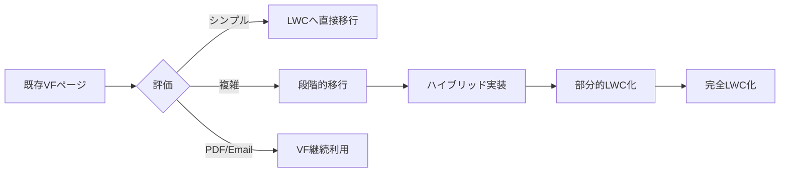

# Salesforce Visualforce

## What's this file?
> [!NOTE]
> **What**
> 
> Salesforce Visualforceとは何かについて記載しています。

## Conclusion (忙しいとき向け)
> [!IMPORTANT]
> **What** : Salesforce Visualforceとは何か
> 
> **Answer** : SalesforceプラットフォームでカスタムUIを構築するためのWebフレームワークで、MVCアーキテクチャに基づいたタグベースのマークアップ言語

## 目次

<details>
<summary>目次を開く</summary>

- [1. Visualforceの概要](#1-visualforceの概要)
- [2. アーキテクチャと構成要素](#2-アーキテクチャと構成要素)
- [3. 主要な機能と特徴](#3-主要な機能と特徴)
- [4. 利用シーンと制限事項](#4-利用シーンと制限事項)
- [5. Lightning Web Componentsとの比較](#5-lightning-web-componentsとの比較)

</details>

## 1. Visualforceの概要

### 1.1 基本的な定義

Visualforceは、Salesforceプラットフォーム上でカスタムユーザーインターフェースを構築するためのWebアプリケーションフレームワークです。



### 1.2 歴史的背景

- **2008年**: Visualforceリリース
- **2014年**: Lightning Experience発表
- **2019年**: Lightning Web Components推奨
- **現在**: レガシーシステムとして保守継続

## 2. アーキテクチャと構成要素

### 2.1 MVCアーキテクチャ



### 2.2 基本的な構文

**Visualforceページの例：**
```xml
<apex:page controller="MyCustomController">
    <apex:form>
        <apex:pageBlock title="アカウント情報">
            <apex:pageBlockSection>
                <apex:inputField value="{!account.Name}"/>
                <apex:inputField value="{!account.Phone}"/>
            </apex:pageBlockSection>
            <apex:pageBlockButtons>
                <apex:commandButton action="{!save}" value="保存"/>
            </apex:pageBlockButtons>
        </apex:pageBlock>
    </apex:form>
</apex:page>
```

### 2.3 コンポーネント階層



## 3. 主要な機能と特徴

### 3.1 標準機能

| 機能 | 説明 |
|------|------|
| データバインディング | {!expression}構文による自動同期 |
| 標準コントローラー | CRUDオペレーションの自動実装 |
| ビューステート | フォーム状態の自動管理 |
| AJAX対応 | 部分的なページ更新 |
| PDFレンダリング | renderAs="pdf"による出力 |

### 3.2 セキュリティ機能



### 3.3 組み込みコンポーネント

**主要なコンポーネント：**
- **apex:pageBlock**: 標準的なSalesforceレイアウト
- **apex:dataTable**: データテーブル表示
- **apex:chart**: グラフ表示
- **apex:map**: 地図表示
- **apex:relatedList**: 関連リスト

## 4. 利用シーンと制限事項

### 4.1 適切な利用シーン



### 4.2 制限事項

| 制限項目 | 制限値 |
|----------|--------|
| ビューステートサイズ | 170KB |
| ページサイズ | 15MB |
| コレクションサイズ | 1,000レコード |
| SOQL クエリ数 | 100 |
| DML ステートメント数 | 150 |

### 4.3 パフォーマンス考慮事項



## 5. Lightning Web Componentsとの比較

### 5.1 技術スタック比較



### 5.2 機能比較表

| 項目 | Visualforce | Lightning Web Components |
|------|-------------|-------------------------|
| レンダリング | サーバーサイド | クライアントサイド |
| 開発言語 | Apex + VFタグ | JavaScript + HTML |
| パフォーマンス | 中程度 | 高速 |
| モバイル対応 | 限定的 | フル対応 |
| 開発効率 | 中程度 | 高い |
| 学習曲線 | 緩やか | やや急 |

### 5.3 移行戦略



## 関連

- [Visualforce開発者ガイド](https://developer.salesforce.com/docs/atlas.en-us.pages.meta/pages/)
- [Visualforceタグリファレンス](https://developer.salesforce.com/docs/atlas.en-us.pages.meta/pages/pages_compref.htm)
- [Lightning Web Components移行ガイド](https://developer.salesforce.com/docs/component-library/tools/lwc-dev)
- [Apexコントローラーベストプラクティス](https://developer.salesforce.com/docs/atlas.en-us.apexcode.meta/apexcode/apex_classes_controller_vf.htm)
- [Visualforceパフォーマンスベストプラクティス](https://developer.salesforce.com/docs/atlas.en-us.salesforce_visualforce_best_practices.meta/salesforce_visualforce_best_practices/)