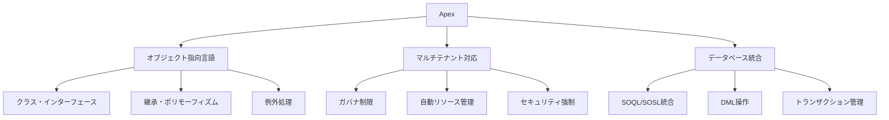
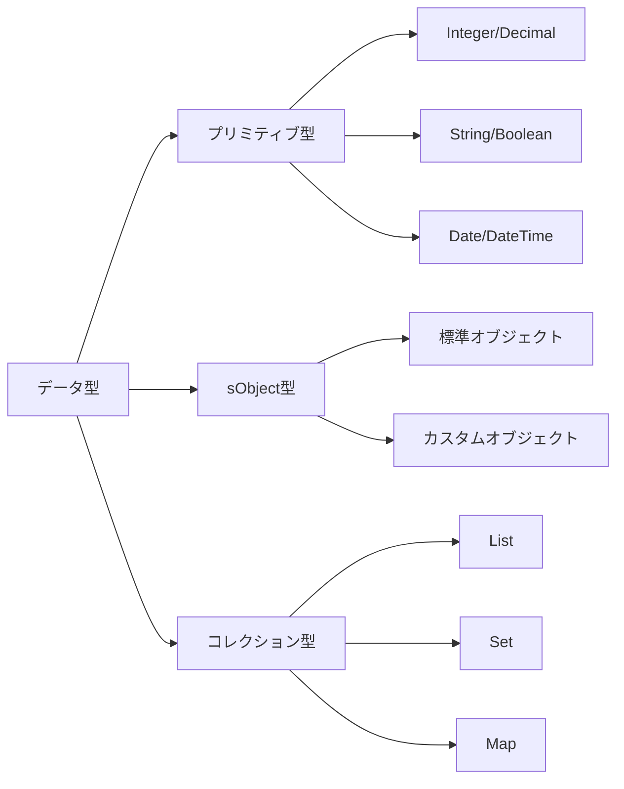
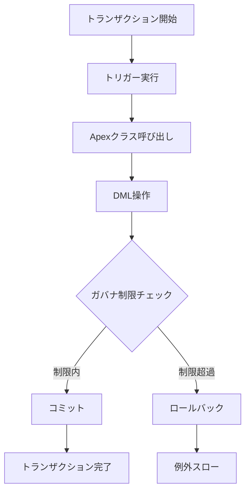
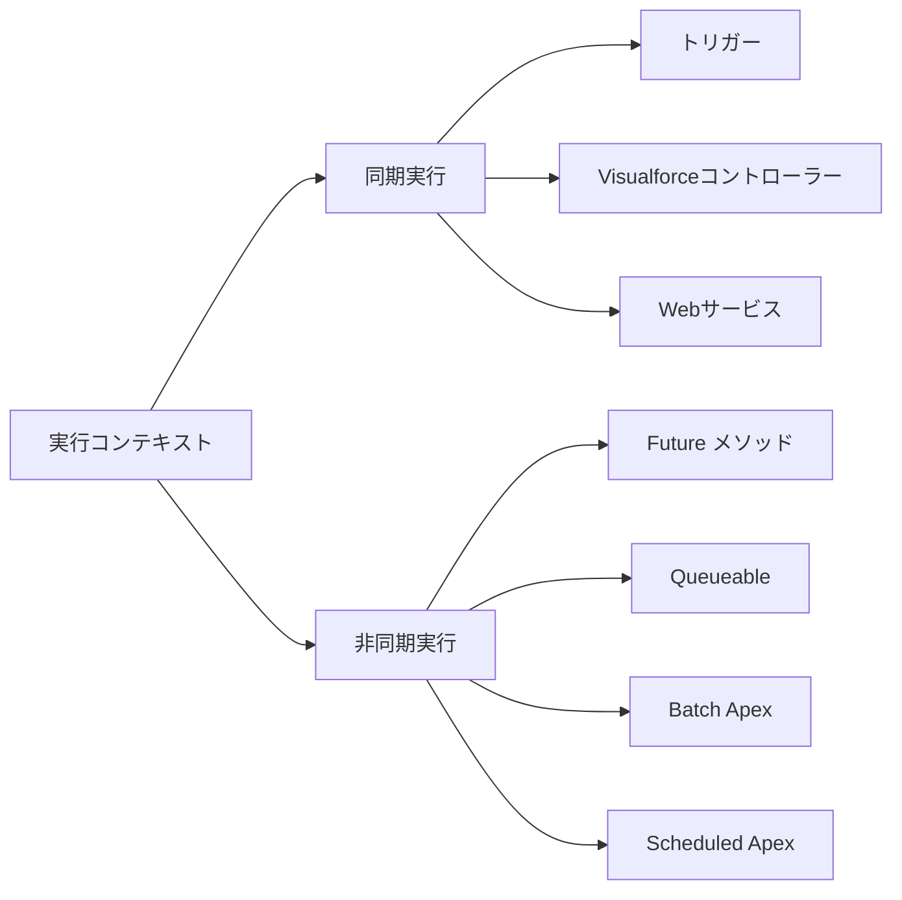
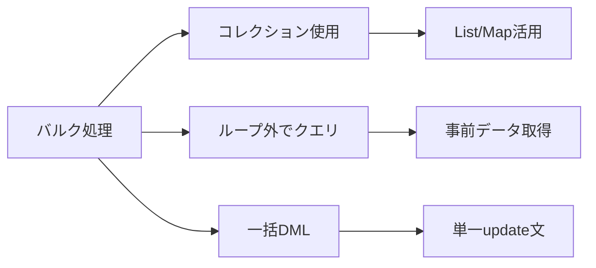
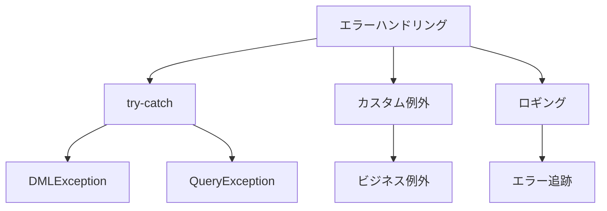

# Salesforce Apex

## What's this file?
> [!NOTE]
> **What**
> 
> Salesforce Apexとは何かについて記載しています。

## Conclusion (忙しいとき向け)
> [!IMPORTANT]
> **What** : Salesforce Apexとは何か
> 
> **Answer** : Salesforceプラットフォーム専用のオブジェクト指向プログラミング言語で、Javaに似た構文を持ち、マルチテナント環境で安全に実行される

## 目次

<details>
<summary>目次を開く</summary>

- [1. Apexの概要](#1-apexの概要)
- [2. 言語の特徴と構文](#2-言語の特徴と構文)
- [3. 実行コンテキストとガバナ制限](#3-実行コンテキストとガバナ制限)
- [4. 主要な利用パターン](#4-主要な利用パターン)
- [5. ベストプラクティス](#5-ベストプラクティス)

</details>

## 1. Apexの概要

### 1.1 基本的な定義

Apexは、Salesforceプラットフォーム上でビジネスロジックを実装するための強力なプログラミング言語です。



### 1.2 Javaとの比較

| 特徴 | Apex | Java |
|------|------|------|
| 実行環境 | Salesforceプラットフォーム | JVM |
| メモリ管理 | 自動（ガバナ制限あり） | ガベージコレクション |
| データベース操作 | SOQL/DML組み込み | JDBC等別途必要 |
| デプロイ | メタデータAPI | WAR/JAR |
| マルチスレッド | 非対応 | 対応 |

## 2. 言語の特徴と構文

### 2.1 基本構文

```apex
public class AccountProcessor {
    // プロパティ
    private String accountName;
    
    // コンストラクタ
    public AccountProcessor(String name) {
        this.accountName = name;
    }
    
    // メソッド
    public void processAccounts() {
        // SOQL クエリ
        List<Account> accounts = [
            SELECT Id, Name, AnnualRevenue 
            FROM Account 
            WHERE Name = :accountName
        ];
        
        // ビジネスロジック
        for (Account acc : accounts) {
            acc.AnnualRevenue = calculateRevenue(acc);
        }
        
        // DML 操作
        update accounts;
    }
    
    private Decimal calculateRevenue(Account acc) {
        // 計算ロジック
        return acc.AnnualRevenue * 1.1;
    }
}
```

### 2.2 データ型とコレクション



### 2.3 SOQL/SOSLの統合

**SOQL（Salesforce Object Query Language）：**
- SQLに似た構文
- リレーションシップクエリ対応
- 集計関数サポート

**SOSL（Salesforce Object Search Language）：**
- 全文検索
- 複数オブジェクト横断検索
- 検索結果のランキング

## 3. 実行コンテキストとガバナ制限

### 3.1 トランザクション境界



### 3.2 主要なガバナ制限

| リソース | 同期実行制限 | 非同期実行制限 |
|----------|-------------|---------------|
| SOQLクエリ数 | 100 | 200 |
| DMLステートメント数 | 150 | 150 |
| CPU時間 | 10,000ms | 60,000ms |
| ヒープサイズ | 6MB | 12MB |
| Callout数 | 100 | 100 |

### 3.3 実行コンテキストの種類



## 4. 主要な利用パターン

### 4.1 トリガー

```apex
trigger AccountTrigger on Account (before insert, after update) {
    if (Trigger.isBefore && Trigger.isInsert) {
        // 挿入前の処理
        for (Account acc : Trigger.new) {
            acc.Description = 'Created on ' + System.today();
        }
    }
    
    if (Trigger.isAfter && Trigger.isUpdate) {
        // 更新後の処理
        AccountHandler.handleAfterUpdate(Trigger.new, Trigger.oldMap);
    }
}
```

### 4.2 バッチ処理

```mermaid
flowchart TD
    A[Batch Apex] --> B[start()]
    B --> C[execute()]
    C --> D[finish()]
    
    B --> E[クエリ実行]
    C --> F[レコード処理]
    D --> G[後処理]
    
    F --> H[200レコードずつ]
    H --> I[並列実行可能]
```

### 4.3 REST API

```apex
@RestResource(urlMapping='/accounts/*')
global class AccountService {
    @HttpGet
    global static Account getAccount() {
        RestRequest req = RestContext.request;
        String accountId = req.requestURI.substring(
            req.requestURI.lastIndexOf('/')+1
        );
        return [SELECT Id, Name FROM Account WHERE Id = :accountId];
    }
    
    @HttpPost
    global static String createAccount(String name, String phone) {
        Account acc = new Account(Name=name, Phone=phone);
        insert acc;
        return acc.Id;
    }
}
```

## 5. ベストプラクティス

### 5.1 バルク処理の実装



### 5.2 テスト駆動開発

**テストクラスの要件：**
- 75%以上のコードカバレッジ
- @isTestアノテーション必須
- テストデータの独立性
- アサーションの適切な使用

```apex
@isTest
private class AccountProcessorTest {
    @testSetup
    static void setup() {
        // テストデータ作成
        List<Account> accounts = new List<Account>();
        for (Integer i = 0; i < 200; i++) {
            accounts.add(new Account(Name='Test ' + i));
        }
        insert accounts;
    }
    
    @isTest
    static void testProcessAccounts() {
        // テスト実行
        Test.startTest();
        AccountProcessor processor = new AccountProcessor('Test 0');
        processor.processAccounts();
        Test.stopTest();
        
        // 検証
        Account result = [SELECT AnnualRevenue FROM Account WHERE Name = 'Test 0'];
        System.assertNotEquals(null, result.AnnualRevenue);
    }
}
```

### 5.3 エラーハンドリング



### 5.4 セキュリティ考慮事項

1. **CRUD/FLSチェック**
   - Schema.sObjectType確認
   - isAccessible()使用

2. **SOQLインジェクション対策**
   - バインド変数使用
   - String.escapeSingleQuotes()

3. **共有ルール適用**
   - with sharing キーワード
   - without sharing の慎重な使用

## 関連

- [Apex開発者ガイド](https://developer.salesforce.com/docs/atlas.en-us.apexcode.meta/apexcode/)
- [Apex リファレンス](https://developer.salesforce.com/docs/atlas.en-us.apexref.meta/apexref/)
- [ガバナ制限と制約](https://developer.salesforce.com/docs/atlas.en-us.salesforce_app_limits_cheatsheet.meta/salesforce_app_limits_cheatsheet/)
- [Apex ベストプラクティス](https://developer.salesforce.com/wiki/apex_code_best_practices)
- [トリガーとバルク処理のパターン](https://developer.salesforce.com/docs/atlas.en-us.apexcode.meta/apexcode/apex_triggers_bulk.htm)