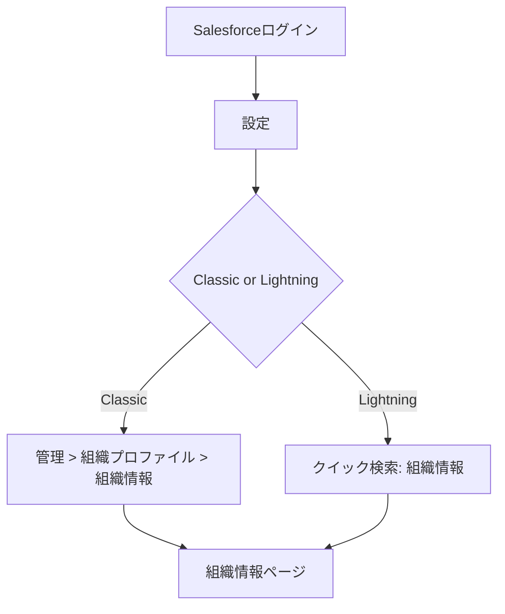
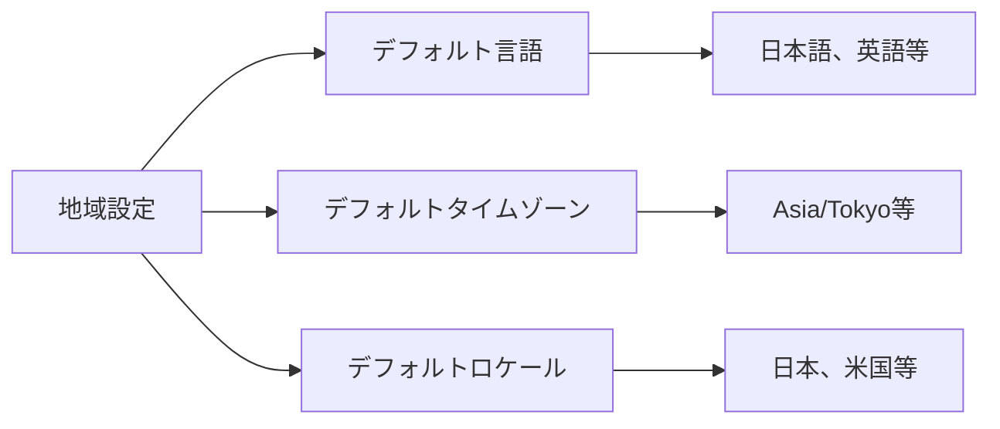
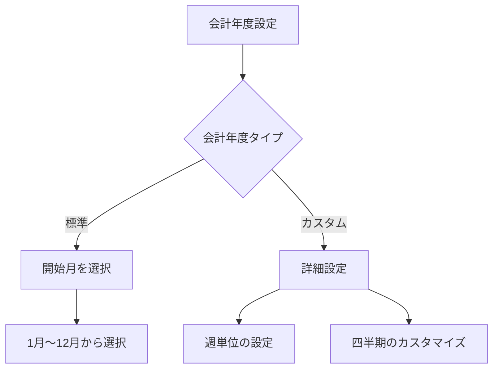
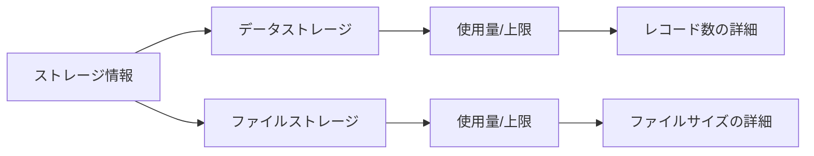
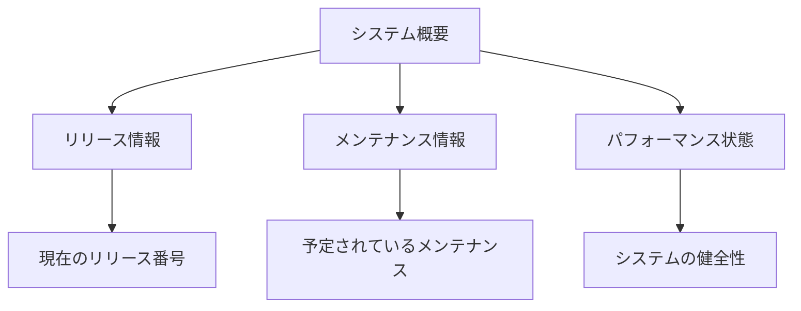

# Salesforceの組織情報ページで設定できる項目

## What's this file?
> [!NOTE]
> **What**
> 
> Salesforceのシステム管理者が組織情報ページで設定できる項目とは何かについて記載しています。

## Conclusion (忙しいとき向け)
> [!IMPORTANT]
> **What** : 組織情報ページで設定できる項目とは何か
> 
> **Answer** : 会社の基本情報、デフォルト設定（言語、タイムゾーン、通貨）、会計年度、ビジネス時間、ライセンス情報の確認などが設定・確認できる

## 目次

<details>
<summary>目次を開く</summary>

- [組織情報ページへのアクセス方法](#組織情報ページへのアクセス方法)
- [基本的な組織情報](#基本的な組織情報)
- [デフォルト設定](#デフォルト設定)
- [会計年度設定](#会計年度設定)
- [ライセンス情報](#ライセンス情報)
- [その他の重要設定](#その他の重要設定)

</details>

## 組織情報ページへのアクセス方法



## 基本的な組織情報

### 組織情報ページの完全な設定項目一覧

| カテゴリー | 設定項目 | 説明 | 編集可否 | 詳細 |
|-----------|---------|------|----------|------|
| **組織詳細** | | | | |
| | 組織ID | 15文字/18文字の一意識別子 | ❌ 不可 | システム全体の識別子 |
| | 組織名 | 会社の正式名称 | ✅ 可能 | [会社情報詳細](#会社情報詳細) |
| | インスタンス | サーバーインスタンス（例：AP15） | ❌ 不可 | パフォーマンスに影響 |
| | インスタンスURL | https://[domain].my.salesforce.com | ❌ 不可 | アクセスURL |
| | 組織タイプ | Production/Sandbox/Developer | ❌ 不可 | システム種別 |
| **連絡先情報** | | | | |
| | 主取引先責任者 | 組織の主要連絡先名 | ✅ 可能 | [会社情報詳細](#会社情報詳細) |
| | 電話 | 会社代表電話番号 | ✅ 可能 | [会社情報詳細](#会社情報詳細) |
| | Fax | 会社FAX番号 | ✅ 可能 | [会社情報詳細](#会社情報詳細) |
| | 住所 | 会社所在地 | ✅ 可能 | [会社情報詳細](#会社情報詳細) |
| **地域設定** | | | | |
| | デフォルト言語 | システムのデフォルト言語 | ✅ 可能 | [デフォルト設定](#デフォルト設定) |
| | デフォルトロケール | 日付、時刻、数値の形式 | ✅ 可能 | [デフォルト設定](#デフォルト設定) |
| | デフォルトタイムゾーン | 組織のタイムゾーン | ✅ 可能 | [デフォルト設定](#デフォルト設定) |
| | 通貨ロケール | 通貨記号と形式 | ✅ 可能 | [デフォルト設定](#デフォルト設定) |
| | 企業通貨 | デフォルト通貨コード | ⚠️ 条件付き | [デフォルト設定](#デフォルト設定) |
| **会計年度** | | | | |
| | 会計年度の開始月 | 標準会計年度の開始月 | ✅ 可能 | [会計年度設定](#会計年度設定) |
| | 会計年度タイプ | 標準/カスタム | ✅ 可能 | [会計年度設定](#会計年度設定) |
| | カスタム会計年度設定 | 週ベースの会計期間 | ✅ 可能 | [会計年度設定](#会計年度設定) |
| **ライセンス情報** | | | | |
| | Salesforceライセンス | フルアクセスライセンス数 | ❌ 不可 | [ライセンス情報](#ライセンス情報) |
| | Salesforce Platformライセンス | プラットフォームライセンス数 | ❌ 不可 | [ライセンス情報](#ライセンス情報) |
| | Chatterライセンス | Chatter専用ライセンス数 | ❌ 不可 | [ライセンス情報](#ライセンス情報) |
| | コミュニティライセンス | 外部ユーザーライセンス数 | ❌ 不可 | [ライセンス情報](#ライセンス情報) |
| | 機能ライセンス | 各種機能ライセンスの使用状況 | ❌ 不可 | [ライセンス情報](#ライセンス情報) |
| **ストレージ** | | | | |
| | データストレージ | レコード保存容量（MB/GB） | ❌ 不可 | [ストレージ使用状況](#1-ストレージ使用状況) |
| | ファイルストレージ | ファイル保存容量（MB/GB） | ❌ 不可 | [ストレージ使用状況](#1-ストレージ使用状況) |
| | BigObjectストレージ | BigObject用ストレージ | ❌ 不可 | [ストレージ使用状況](#1-ストレージ使用状況) |
| **API使用状況** | | | | |
| | API要求（24時間） | 過去24時間のAPI呼び出し数/上限 | ❌ 不可 | [API使用状況](#2-api使用状況) |
| | 一括API要求 | Bulk APIの使用数/上限 | ❌ 不可 | [API使用状況](#2-api使用状況) |
| | ストリーミングAPI | イベント配信数/上限 | ❌ 不可 | [API使用状況](#2-api使用状況) |
| **システム情報** | | | | |
| | エディション | Enterprise/Unlimited等 | ❌ 不可 | [システム概要](#4-システム概要) |
| | リリース | 現在のSalesforceリリース番号 | ❌ 不可 | [システム概要](#4-システム概要) |
| | APIバージョン | 利用可能な最新APIバージョン | ❌ 不可 | [システム概要](#4-システム概要) |
| | ポッド | データセンター情報 | ❌ 不可 | [システム概要](#4-システム概要) |
| **その他の設定** | | | | |
| | Sandbox | 利用可能なSandbox数と種類 | ❌ 不可 | [重要な機能設定](#3-重要な機能設定) |
| | 最終変更日 | 組織情報の最終更新日時 | ❌ 不可 | 監査証跡 |
| | 作成日 | 組織の作成日 | ❌ 不可 | 組織年齢 |

#### 編集可否の詳細説明

- ✅ **可能**: システム管理者が直接編集可能
- ❌ **不可**: 読み取り専用（Salesforceサポートへの連絡が必要）
- ⚠️ **条件付き**: 特定の条件下でのみ変更可能（例：マルチ通貨無効時のみ）

### 会社情報詳細

| 項目 | 説明 | 編集可否 | 注意事項 |
|------|------|----------|----------|
| 組織名 | 会社の正式名称 | ✅ 可能 | 外部連携システムに影響する可能性 |
| 主取引先責任者 | 組織の主要連絡先 | ✅ 可能 | Salesforceサポートからの連絡先 |
| 電話 | 会社の代表電話番号 | ✅ 可能 | 国際電話番号形式も可 |
| Fax | 会社のFAX番号 | ✅ 可能 | オプション項目 |
| 住所 | 会社の所在地（番地、市区町村、都道府県、郵便番号、国） | ✅ 可能 | 請求書送付先として使用 |

### 組織ID情報詳細

```yaml
読み取り専用情報:
  - 組織ID: 15文字または18文字の一意識別子
  - インスタンスURL: https://[ドメイン].my.salesforce.com
  - APIバージョン: 現在のAPIバージョン
  - エディション: Enterprise、Unlimited等
```

## デフォルト設定

### 1. 地域設定



### 2. 通貨設定

| 設定項目 | 内容 | 影響範囲 |
|----------|------|----------|
| 企業通貨 | デフォルト通貨（JPY、USD等） | 全レコード |
| 通貨ロケール | 通貨記号の表示形式 | UI表示 |
| マルチ通貨 | 複数通貨の有効化 | 機能全体 |

### 3. 言語設定の詳細

```yaml
デフォルト言語の影響:
  - 新規ユーザーのデフォルト言語
  - システムメールの言語
  - 標準オブジェクトのラベル
  - エラーメッセージの表示言語
  
設定可能な言語例:
  - 日本語
  - 英語（米国）
  - 中国語（簡体字）
  - 韓国語
  - ドイツ語
  - フランス語
```

## 会計年度設定

### 1. 標準会計年度



### 2. カスタム会計年度

```yaml
カスタム会計年度の設定:
  基準:
    - 4-4-5週
    - 5-4-4週
    - 4-5-4週
    - 13週間×4期
    
  設定項目:
    - 会計年度の開始日
    - 週の開始曜日
    - 各四半期の週数
    - 会計年度の命名規則
```

## ライセンス情報

### 1. ユーザーライセンス

| ライセンスタイプ | 用途 | 確認項目 |
|-----------------|------|----------|
| Salesforce | フルアクセスユーザー | 使用中/利用可能数 |
| Salesforce Platform | カスタムアプリのみ | 使用中/利用可能数 |
| Customer Community | 外部ユーザー | 使用中/利用可能数 |
| Partner Community | パートナーユーザー | 使用中/利用可能数 |

### 2. 機能ライセンス

```yaml
確認可能な機能ライセンス:
  - Marketing User: マーケティング機能
  - Knowledge User: ナレッジベース機能
  - Service Cloud User: サービスクラウド機能
  - Content User: コンテンツ管理
  - Mobile User: モバイルアクセス
  
各ライセンスで確認できる情報:
  - 総数
  - 使用中の数
  - 利用可能な残数
  - 有効期限（該当する場合）
```

## その他の重要設定

### 1. ストレージ使用状況



### 2. API使用状況

| 項目 | 内容 | 重要性 |
|------|------|--------|
| API要求数（24時間） | 過去24時間のAPI呼び出し数 | 高 |
| API要求の上限 | 24時間あたりの上限 | 高 |
| 一括APIの使用状況 | Bulk APIの使用量 | 中 |
| ストリーミングAPI | イベント配信の使用量 | 中 |

### 3. 重要な機能設定

```yaml
組織情報から確認・設定できる機能:
  
  セキュリティ関連:
    - パスワードポリシー設定へのリンク
    - ログイン履歴の確認
    - IPアドレス制限の状態
    
  開発関連:
    - Sandbox情報
    - 開発者コンソールの設定
    - デバッグログの設定
    
  インテグレーション:
    - 接続アプリケーションの数
    - 外部サービスとの連携状態
    - シングルサインオン設定
```

### 4. システム概要



## 設定時の注意事項

### 1. 変更による影響

```yaml
即座に影響する設定:
  - デフォルト言語: 新規ユーザーに即反映
  - タイムゾーン: レポートやスケジュールに影響
  - 通貨設定: 全ての金額フィールドに影響

慎重に検討すべき設定:
  - 会計年度: レポートや予測に大きく影響
  - マルチ通貨: 一度有効化すると無効化不可
  - 組織名: 外部連携に影響する可能性
```

### 2. 権限要件

| 操作 | 必要な権限 |
|------|-----------|
| 閲覧 | 設定・定義を参照 |
| 基本情報編集 | アプリケーションのカスタマイズ |
| 会計年度変更 | アプリケーションのカスタマイズ |
| ライセンス管理 | ユーザの管理 |

### 3. ベストプラクティス

1. **変更前の記録**
   - 現在の設定をスクリーンショットで保存
   - 変更理由を文書化

2. **段階的な変更**
   - Sandboxで先にテスト
   - 影響を受けるユーザーに事前通知

3. **定期的な確認**
   - ライセンス使用状況の月次確認
   - ストレージ使用量の監視
   - API使用量のモニタリング

## 関連

- [Salesforce管理者認定資格](2025.08.12.08.53_what_salesforce_administrator_certificate.md)
- [Salesforce Help: 組織情報の参照](https://help.salesforce.com/s/articleView?id=sf.basics_viewing_org_info.htm&type=5)
- [Salesforce Help: 会社情報の編集](https://help.salesforce.com/s/articleView?id=sf.admin_company_info.htm&type=5)
- [Salesforce Help: カスタム会計年度について](https://help.salesforce.com/s/articleView?id=sf.admin_about_cfy.htm&type=5)
- [Salesforce Help: 会計年度の定義](https://help.salesforce.com/s/articleView?id=sf.admin_fiscal_year_def.htm&type=5)
- [Salesforce Help: デフォルトの言語、ロケール、タイムゾーンの設定](https://help.salesforce.com/s/articleView?id=sf.admin_language_locale_timezone.htm&type=5)
- [Salesforce Help: ユーザライセンスの表示](https://help.salesforce.com/s/articleView?id=sf.users_licenses_view.htm&type=5)
- [Salesforce Help: ストレージの使用状況の監視](https://help.salesforce.com/s/articleView?id=sf.admin_monitorresources.htm&type=5)
- [Salesforce Trailhead: 組織の設定の基本](https://trailhead.salesforce.com/ja/content/learn/modules/lex_implementation_basics/lex_implementation_basics_org_setup)
