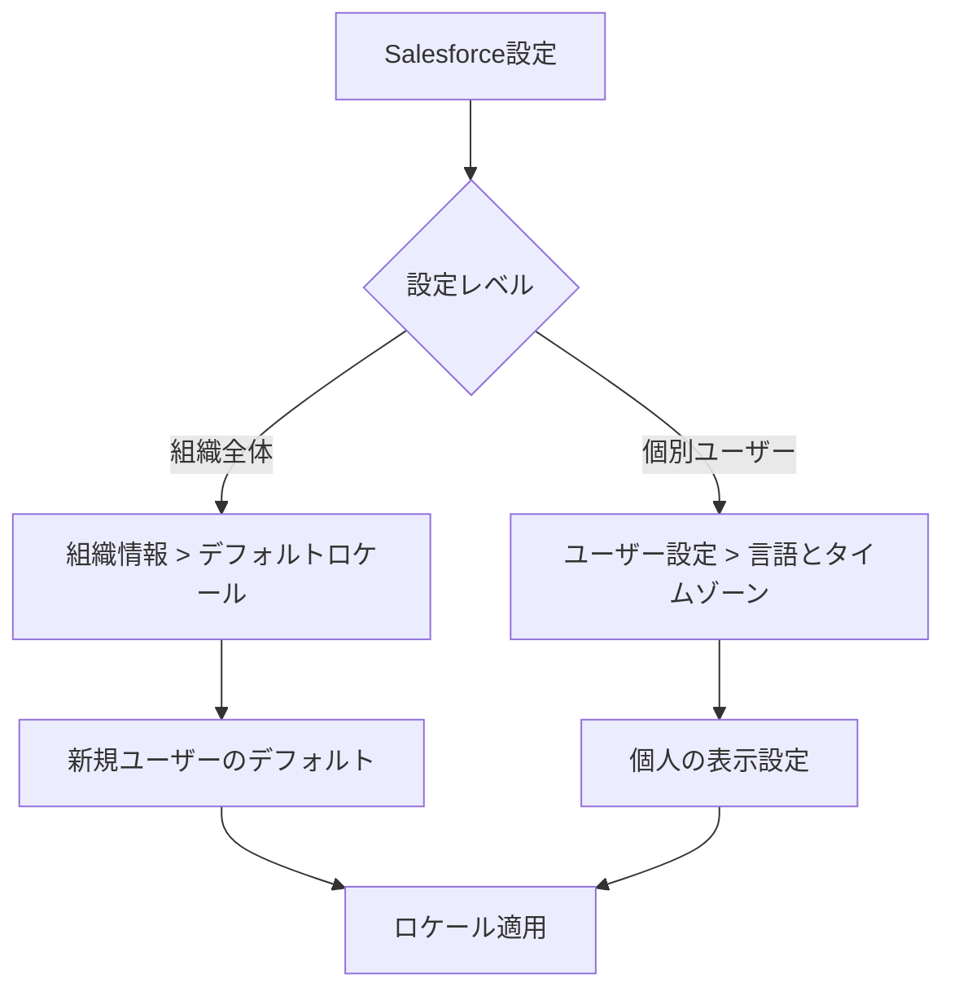
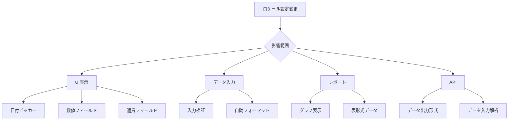
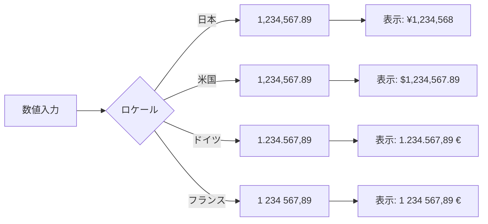
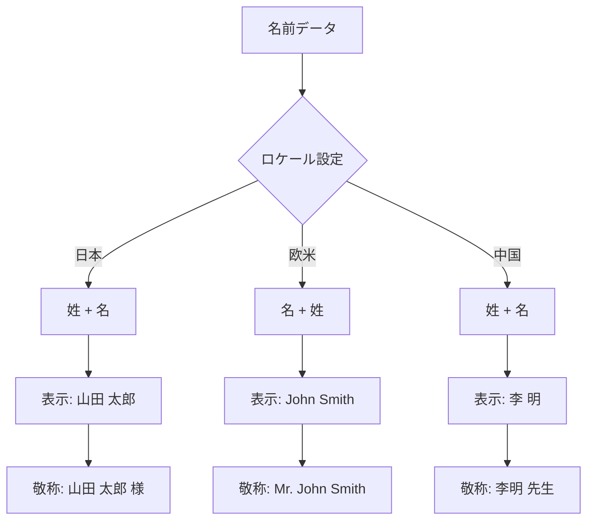

# Salesforceのロケール設定で決定されるパラメータ

## What's this file?
> [!NOTE]
> **What**
> 
> Salesforceのロケール設定によって決定されるパラメータとは何かについて記載しています。

## Conclusion (忙しいとき向け)
> [!IMPORTANT]
> **What** : ロケール設定で決定されるパラメータとは何か
> 
> **Answer** : 日付・時刻・数値・通貨・住所・電話番号・名前の表示形式、およびカレンダーの週開始日などのUIパラメータが自動的に設定される

## 目次

<details>
<summary>目次を開く</summary>

- [ロケールとは](#ロケールとは)
- [ロケール設定で変わるパラメータ一覧](#ロケール設定で変わるパラメータ一覧)
- [主要ロケールの比較](#主要ロケールの比較)
- [設定の影響フロー](#設定の影響フロー)
- [詳細パラメータ解説](#詳細パラメータ解説)

</details>

## ロケールとは

### 定義
ロケールは、特定の地域や文化圏における表示形式の規則を定めた設定セットです。Salesforceでは、ユーザーの地域に応じた適切な表示形式を自動的に適用します。

### ロケール設定の場所


## ロケール設定で変わるパラメータ一覧

### 完全なパラメータテーブル

| カテゴリー | パラメータ | 説明 | 例（日本） | 例（米国） |
|-----------|-----------|------|-----------|-----------|
| **日付形式** | | | | |
| | 日付の表示順序 | 年月日の並び順 | yyyy/MM/dd | MM/dd/yyyy |
| | 日付の区切り文字 | 年月日を区切る文字 | / (スラッシュ) | / (スラッシュ) |
| | 曜日の表示 | 曜日の文字表現 | 月、火、水... | Mon, Tue, Wed... |
| | 月の表示 | 月の文字表現 | 1月、2月... | January, February... |
| **時刻形式** | | | | |
| | 時刻表示形式 | 12時間/24時間 | 24時間（13:00） | 12時間（1:00 PM） |
| | AM/PM表示 | 午前午後の表記 | なし | AM/PM |
| | 時刻の区切り文字 | 時分秒の区切り | : (コロン) | : (コロン) |
| **数値形式** | | | | |
| | 小数点記号 | 小数部分の区切り | . (ピリオド) | . (ピリオド) |
| | 千単位区切り | 3桁ごとの区切り | , (カンマ) | , (カンマ) |
| | 負数の表示 | マイナス値の表現 | -1,234 | (1,234) または -1,234 |
| **通貨形式** | | | | |
| | 通貨記号の位置 | 記号の配置場所 | ¥1,234（前） | $1,234（前） |
| | 通貨記号 | デフォルト通貨記号 | ¥ | $ |
| | 小数桁数 | 通貨の小数表示 | 0桁（¥1,234） | 2桁（$1,234.56） |
| **住所形式** | | | | |
| | 住所の表示順序 | 住所要素の並び | 郵便番号→都道府県→市区町村 | 番地→市→州→郵便番号 |
| | 郵便番号形式 | 郵便番号のパターン | 123-4567 | 12345 or 12345-6789 |
| | 州/都道府県 | 地域区分の名称 | 都道府県 | State |
| **電話番号** | | | | |
| | 国番号 | デフォルト国番号 | +81 | +1 |
| | 表示形式 | 番号の区切り方 | 03-1234-5678 | (123) 456-7890 |
| | 内線表示 | 内線番号の表記 | 内線: | Ext. |
| **名前形式** | | | | |
| | 名前の表示順序 | 姓名の並び順 | 姓 名 | 名 姓 |
| | 敬称の位置 | Mr./Ms.等の位置 | 山田 太郎 様 | Mr. John Smith |
| | ミドルネーム | 中間名の扱い | なし | あり |
| **カレンダー** | | | | |
| | 週の開始日 | カレンダーの始まり | 月曜日 | 日曜日 |
| | 週番号 | 年間週番号の計算 | ISO 8601準拠 | 米国式 |
| | 営業日 | デフォルト営業日 | 月〜金 | 月〜金 |

## 主要ロケールの比較

### アジア地域

| ロケール | 日付 | 時刻 | 数値 | 通貨記号 | 週開始 |
|----------|------|------|------|----------|--------|
| 日本 (ja_JP) | 2024/08/12 | 13:30 | 1,234.56 | ¥ | 月曜 |
| 中国 (zh_CN) | 2024/8/12 | 13:30 | 1,234.56 | ¥ | 月曜 |
| 韓国 (ko_KR) | 2024. 8. 12. | 13:30 | 1,234.56 | ₩ | 日曜 |

### 欧米地域

| ロケール | 日付 | 時刻 | 数値 | 通貨記号 | 週開始 |
|----------|------|------|------|----------|--------|
| 米国 (en_US) | 8/12/2024 | 1:30 PM | 1,234.56 | $ | 日曜 |
| 英国 (en_GB) | 12/08/2024 | 13:30 | 1,234.56 | £ | 月曜 |
| ドイツ (de_DE) | 12.08.2024 | 13:30 | 1.234,56 | € | 月曜 |
| フランス (fr_FR) | 12/08/2024 | 13:30 | 1 234,56 | € | 月曜 |

## 設定の影響フロー



## 詳細パラメータ解説

### 1. 日付と時刻

```yaml
日付形式の詳細:
  短い形式:
    日本: 24/08/12
    米国: 8/12/24
    欧州: 12.08.24
    
  長い形式:
    日本: 2024年8月12日
    米国: August 12, 2024
    欧州: 12 August 2024
    
時刻形式の詳細:
  ビジネス時間:
    日本: 09:00 - 18:00
    米国: 9:00 AM - 6:00 PM
    欧州: 09:00 - 18:00
```

### 2. 数値と通貨



### 3. 住所フォーマット

```yaml
日本の住所形式:
  順序:
    1. 郵便番号: 〒123-4567
    2. 都道府県: 東京都
    3. 市区町村: 千代田区
    4. 町名番地: 霞が関1-2-3
    5. 建物名: 〇〇ビル
    
米国の住所形式:
  順序:
    1. 番地: 123 Main Street
    2. 建物/部屋: Suite 456
    3. 市: New York
    4. 州: NY
    5. 郵便番号: 10001
```

### 4. 電話番号フォーマット

| 国/地域 | 国番号 | 形式例 | 内線付き |
|---------|--------|--------|----------|
| 日本 | +81 | 03-1234-5678 | 03-1234-5678 内線:123 |
| 米国 | +1 | (212) 555-1234 | (212) 555-1234 Ext. 123 |
| 英国 | +44 | 020 7123 4567 | 020 7123 4567 x123 |
| ドイツ | +49 | 030 12345678 | 030 12345678-123 |

### 5. 名前の表示



## 設定時の注意事項

### 1. グローバル組織での考慮事項

```yaml
推奨設定:
  本社所在地:
    - 組織のデフォルトロケール: 本社の地域
    - タイムゾーン: 本社のタイムゾーン
    
  各地域オフィス:
    - ユーザーロケール: 各地域に合わせる
    - レポート: 統一形式を検討
    
  データ統合:
    - API: ISO標準形式を使用
    - インポート/エクスポート: 形式を統一
```

### 2. ロケール変更の影響

| 影響範囲 | 即時反映 | 要再ログイン | 過去データ |
|----------|----------|--------------|------------|
| UI表示 | ✅ | ❌ | 影響なし |
| 新規データ入力 | ✅ | ❌ | 影響なし |
| 既存データ表示 | ✅ | ❌ | 形式のみ変更 |
| レポート | ⚠️ | ✅ | 再実行必要 |
| ダッシュボード | ⚠️ | ✅ | 更新必要 |

### 3. ベストプラクティス

1. **初期設定時に確定**
   - 組織作成時に適切なロケールを選択
   - 後からの変更は影響が大きい

2. **ユーザートレーニング**
   - 各地域の形式の違いを説明
   - 入力規則を文書化

3. **テスト環境での検証**
   - ロケール変更は必ずSandboxでテスト
   - レポートへの影響を確認

4. **統一ルールの策定**
   ```yaml
   例：グローバル企業のルール
     - 金額: すべてUSDで統一
     - 日付: レポートはISO形式
     - 時刻: すべてUTCで記録
   ```

## 関連

- [Salesforce組織情報設定](2025.08.12.19.34_what_salesforce_organization_information_settings.md)
- [Salesforce Help: ロケールの概要](https://help.salesforce.com/s/articleView?id=sf.faq_getstart_what_languages_does.htm&type=5)
- [Salesforce Help: 個人設定でのロケール変更](https://help.salesforce.com/s/articleView?id=sf.basics_about_language_timezone_locale.htm&type=5)
- [Salesforce Trailhead: グローバル化の基本](https://trailhead.salesforce.com/ja/content/learn/modules/lex_localization)