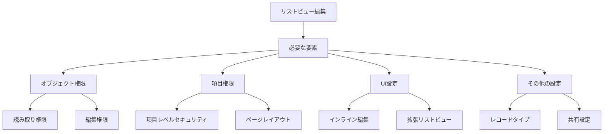
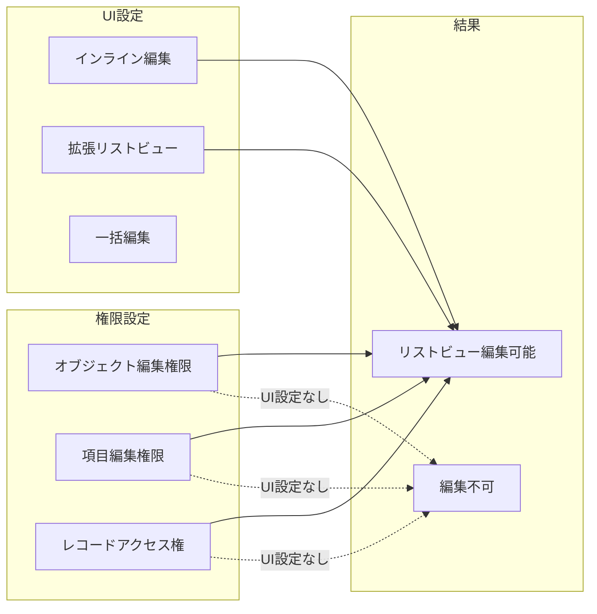
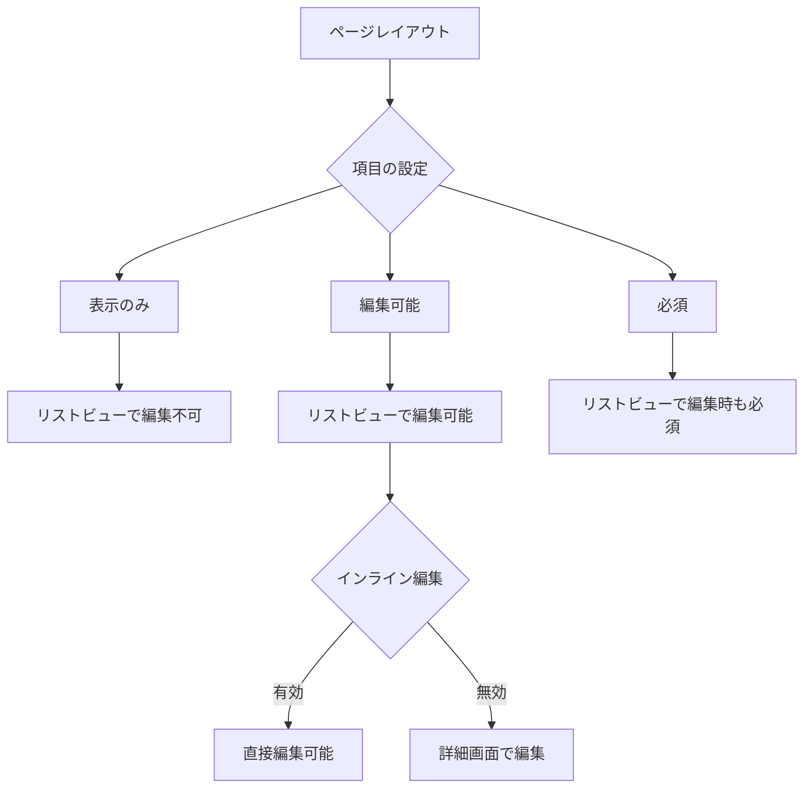
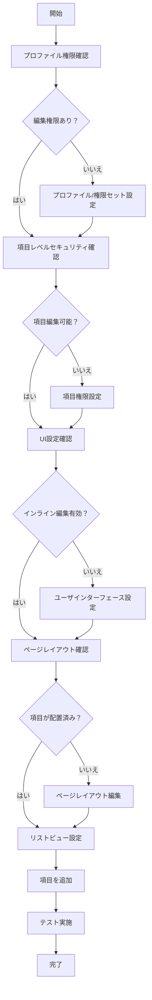
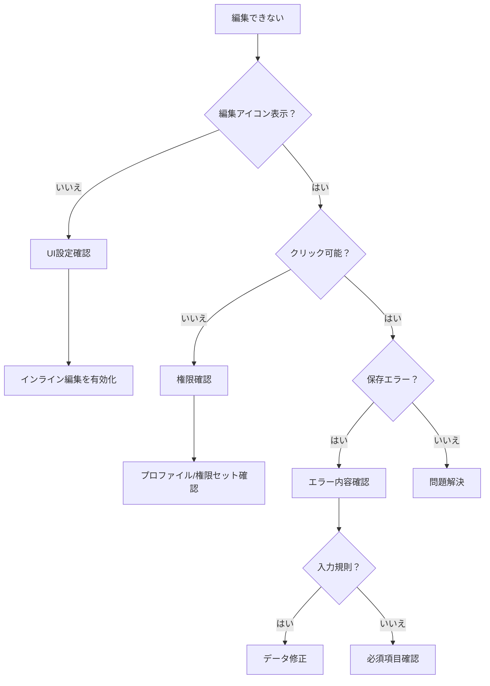

# Salesforceリストビュー編集に必要なUI設定

## What's this file?
> [!NOTE]
> **What**
> 
> プロファイル権限を持つユーザーがリストビューでレコードを編集するために必要なUI設定とは何かについて記載しています。

## Conclusion (忙しいとき向け)
> [!IMPORTANT]
> **What** : リストビュー編集に必要なUI設定とは何か
> 
> **Answer** : リストビューの「インライン編集を有効化」設定、拡張リストビューの有効化、レコードタイプとページレイアウトの適切な割り当てが必要

## 目次

<details>
<summary>目次を開く</summary>

- [リストビュー編集の前提条件](#リストビュー編集の前提条件)
- [必要な権限とUI設定の関係](#必要な権限とui設定の関係)
- [UI設定項目の詳細](#ui設定項目の詳細)
- [設定フロー](#設定フロー)
- [トラブルシューティング](#トラブルシューティング)

</details>

## リストビュー編集の前提条件

### 権限の階層構造



### 基本要件チェックリスト

| カテゴリー | 要件 | 確認場所 |
|-----------|------|----------|
| **プロファイル権限** | | |
| | オブジェクトの編集権限 | プロファイル > オブジェクト設定 |
| | 項目の編集権限 | プロファイル > 項目レベルセキュリティ |
| | 「すべて表示」権限 | プロファイル > オブジェクト設定 |
| **UI設定** | | |
| | インライン編集の有効化 | ユーザインターフェース設定 |
| | 拡張リストビュー | ユーザインターフェース設定 |
| | 関連リストのホバーリンク | ユーザインターフェース設定 |
| **レイアウト設定** | | |
| | ページレイアウトへの項目配置 | オブジェクトマネージャ > ページレイアウト |
| | レコードタイプの割り当て | プロファイル > レコードタイプ設定 |

## 必要な権限とUI設定の関係

### 権限とUI設定の相関関係



### 設定の優先順位

| 優先度 | 設定項目 | 影響 | 上書き可能 |
|--------|----------|------|------------|
| 1 | 組織の共有設定 | レコードアクセスの基本 | 共有ルール、手動共有 |
| 2 | プロファイル権限 | オブジェクト・項目へのアクセス | 権限セット |
| 3 | 項目レベルセキュリティ | 項目の表示・編集 | なし |
| 4 | ページレイアウト | UIでの項目の表示 | 動的フォーム |
| 5 | UI設定 | インライン編集の可否 | 個人設定 |

## UI設定項目の詳細

### 1. ユーザインターフェース設定

```yaml
設定パス: 設定 > ユーザインターフェース

必須設定:
  インライン編集を有効化:
    説明: リストビューでの直接編集を許可
    デフォルト: 有効
    影響: すべてのリストビューに適用
    
  拡張リストビューを有効化:
    説明: 最大200件のレコード表示と一括編集
    デフォルト: 有効
    影響: パフォーマンスとユーザビリティ向上
    
推奨設定:
  関連リストのホバーリンクを有効化:
    説明: マウスオーバーで詳細表示
    利点: 編集前の確認が容易
    
  別ウィンドウでのレポート実行を無効化:
    説明: 同一タブでレポート表示
    利点: 編集後の確認が簡単
```

### 2. リストビュー固有の設定

| 設定項目 | 場所 | 説明 | 必須/推奨 |
|----------|------|------|-----------|
| 表示する項目 | リストビュー編集 | 編集したい項目を含める | 必須 |
| フィルター条件 | リストビュー編集 | 編集可能なレコードのみ表示 | 推奨 |
| 表示件数 | リストビュー設定 | 最大200件まで設定可能 | 推奨 |
| 並び順 | リストビュー設定 | 編集優先度順に並べる | 推奨 |

### 3. ページレイアウトの考慮事項



### 4. レコードタイプの影響

```yaml
レコードタイプ別の考慮事項:
  複数レコードタイプの場合:
    - 各レコードタイプで使用可能な項目が異なる
    - ページレイアウトの割り当てを確認
    - ピックリスト値の制限に注意
    
  単一レコードタイプの場合:
    - マスターレコードタイプを使用
    - すべての項目が利用可能
    - 設定がシンプル
```

## 設定フロー

### 完全な設定手順



### 設定チェックポイント

1. **プロファイル設定**
   ```
   パス: 設定 > ユーザ > プロファイル > [対象プロファイル]
   確認項目:
   - オブジェクト設定: 読み取り、編集にチェック
   - 項目レベルセキュリティ: 編集にチェック
   - レコードタイプ設定: 適切な割り当て
   ```

2. **UI設定**
   ```
   パス: 設定 > ユーザインターフェース
   確認項目:
   - インライン編集を有効化: オン
   - 拡張リストビューを有効化: オン
   ```

3. **リストビュー設定**
   ```
   パス: オブジェクトのタブ > リストビュー > 歯車アイコン
   確認項目:
   - 表示する項目を選択: 編集したい項目を追加
   - 表示するレコード数: 適切に設定
   ```

## トラブルシューティング

### よくある問題と解決方法

| 症状 | 原因 | 解決方法 |
|------|------|----------|
| 編集アイコンが表示されない | インライン編集が無効 | ユーザインターフェース設定で有効化 |
| 特定の項目が編集できない | 項目レベルセキュリティ | プロファイルで項目の編集権限を付与 |
| 一部のレコードのみ編集不可 | 共有設定/所有者 | 共有ルールまたは所有者変更 |
| リストビューに項目が表示されない | リストビュー設定 | リストビューの設定で項目を追加 |
| 保存時にエラー | 入力規則/必須項目 | エラーメッセージを確認し対応 |

### デバッグフローチャート



### パフォーマンスの考慮事項

```yaml
大量データでのリストビュー編集:
  推奨事項:
    - フィルター条件で絞り込み
    - 表示件数を適切に設定（50-100件）
    - 不要な項目は非表示
    
  注意事項:
    - 200件を超える一括編集は不可
    - 複雑な項目（数式、ロールアップ等）は遅延の原因
    - 同時編集ユーザーが多い場合はロック注意
```

## ベストプラクティス

### 1. セキュリティ設定

- 最小権限の原則に従う
- 必要な項目のみ編集可能にする
- 監査証跡の設定を有効化

### 2. ユーザビリティ

- よく使う項目を左側に配置
- 関連する項目をグループ化
- 必須項目を明確に表示

### 3. 運用管理

- 定期的な権限レビュー
- リストビューの標準化
- ユーザートレーニングの実施

## 関連

- [Salesforce組織情報設定](2025.08.12.19.34_what_salesforce_organization_information_settings.md)
- [Salesforce Help: インライン編集](https://help.salesforce.com/s/articleView?id=sf.inline_editing_overview.htm&type=5)
- [Salesforce Help: リストビューの作成と編集](https://help.salesforce.com/s/articleView?id=sf.customviews.htm&type=5)
- [Salesforce Trailhead: データセキュリティ](https://trailhead.salesforce.com/ja/content/learn/modules/data_security)