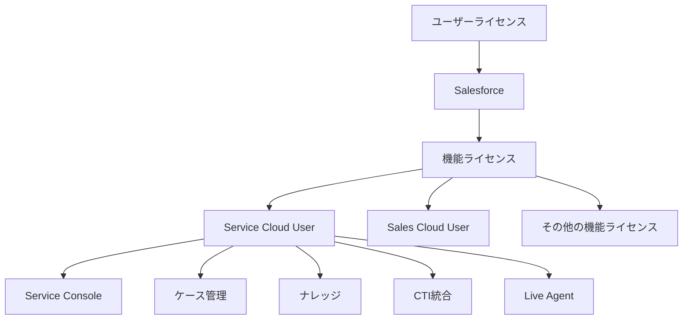
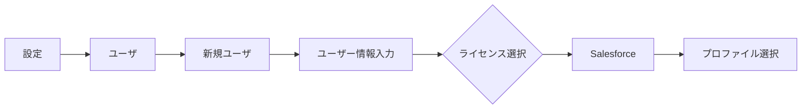
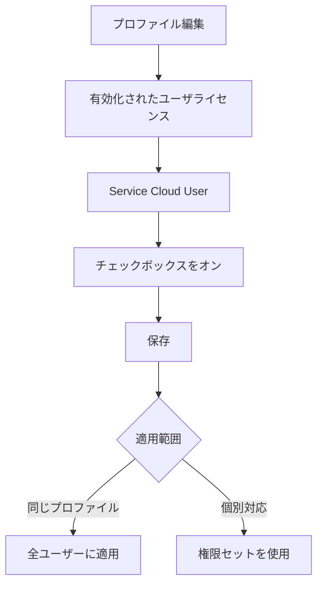
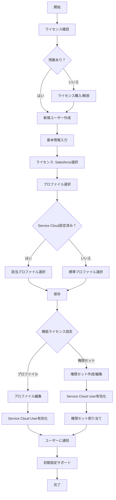

# 新規ユーザーにService Cloud Userライセンスを割り当てる方法

## What's this file?
> [!NOTE]
> **How**
> 
> どのようにSalesforceのシステム管理者として新規ユーザーアカウントにService Cloud Userライセンスを割り当てるかについて記載しています。

## Conclusion (忙しいとき向け)
> [!IMPORTANT]
> **How** : どのようにService Cloud Userライセンスを割り当てるか
> 
> **Answer** : ユーザー作成時にライセンスで「Salesforce」を選択し、プロファイルまたは権限セットで「Service Cloud User」機能ライセンスを有効化する

## 目次

<details>
<summary>目次を開く</summary>

- [Service Cloud Userライセンスとは](#service-cloud-userライセンスとは)
- [前提条件](#前提条件)
- [割り当て手順](#割り当て手順)
- [設定フロー](#設定フロー)
- [注意事項とトラブルシューティング](#注意事項とトラブルシューティング)

</details>

## Service Cloud Userライセンスとは

### ライセンスの種類と関係



### Service Cloud Userで利用可能な機能

| 機能カテゴリー | 具体的な機能 | 説明 |
|---------------|-------------|------|
| **ケース管理** | ケースの作成・編集・解決 | 顧客問い合わせの管理 |
| **Service Console** | 統合エージェントワークスペース | 効率的な顧客対応 |
| **ナレッジベース** | ナレッジ記事の作成・管理 | FAQ・解決策の共有 |
| **エンタイトルメント** | サービス契約管理 | SLA管理 |
| **マイルストン** | 応答時間追跡 | SLA遵守の監視 |
| **Live Agent** | Webチャット機能 | リアルタイム顧客対応 |
| **CTI統合** | 電話システム連携 | コールセンター機能 |
| **オムニチャネル** | 作業の自動割り当て | 負荷分散 |

## 前提条件

### ライセンスの確認

```yaml
必要なライセンス数の確認:
  パス: 設定 > 組織情報
  
  確認項目:
    Salesforceライセンス:
      - 利用可能数: X個
      - 使用済み: Y個
      - 残り: Z個
      
    Service Cloud User機能ライセンス:
      - 利用可能数: X個
      - 使用済み: Y個
      - 残り: Z個
```

### 権限要件

| 必要な権限 | 設定場所 | 説明 |
|-----------|----------|------|
| ユーザの管理 | システム権限 | 新規ユーザー作成に必須 |
| プロファイルと権限セットの管理 | システム権限 | プロファイル編集に必要 |
| すべてのデータの参照 | システム権限 | 推奨 |

## 割り当て手順

### Step 1: 新規ユーザーの作成



#### 必須入力項目

| 項目 | 入力例 | 注意事項 |
|------|--------|----------|
| 姓 | 山田 | 必須項目 |
| 名 | 太郎 | 必須項目 |
| メール | yamada@example.com | 一意である必要 |
| ユーザ名 | yamada@example.com.sandbox | 組織全体で一意 |
| ニックネーム | yamada | コミュニティで表示 |
| ロール | カスタマーサポート | 階層に注意 |
| ライセンス | **Salesforce** | Service Cloud前提 |
| プロファイル | カスタムサポートプロファイル | 権限に応じて選択 |

### Step 2: Service Cloud User機能ライセンスの有効化

#### 方法1: プロファイルでの設定



#### 方法2: 権限セットでの設定

```yaml
権限セット作成手順:
  1. 設定 > 権限セット > 新規
  2. 表示ラベル: Service Cloud Access
  3. API参照名: Service_Cloud_Access
  4. ライセンス: --なし--
  5. 保存
  
権限セット編集:
  1. システム > ユーザライセンス
  2. Service Cloud User: 有効化
  3. 保存
  
ユーザーへの割り当て:
  1. 割り当ての管理
  2. 割り当てを追加
  3. ユーザーを選択
  4. 割り当て
```

### Step 3: 関連設定の確認

| 設定項目 | 確認場所 | 必要な設定 |
|----------|----------|-----------|
| Service Consoleアクセス | アプリケーション設定 | プロファイルで有効化 |
| ケースオブジェクト権限 | プロファイル/権限セット | 作成・編集・削除権限 |
| ナレッジアクセス | ナレッジ設定 | ナレッジユーザーを有効化 |
| オムニチャネル | オムニチャネル設定 | プレゼンス設定を作成 |

## 設定フロー

### 完全な設定フローチャート



### 推奨される実装順序

1. **プロファイル戦略の決定**
   ```yaml
   専用プロファイル作成:
     メリット:
       - 一括管理が容易
       - 標準化された権限
     デメリット:
       - プロファイル数の増加
       - 柔軟性の低下
   
   権限セット活用:
     メリット:
       - 柔軟な権限管理
       - 既存プロファイルの活用
     デメリット:
       - 個別管理の手間
       - 複雑性の増加
   ```

2. **テストユーザーでの検証**
   - Sandboxで設定をテスト
   - 必要な機能へのアクセス確認
   - パフォーマンステスト

3. **本番環境への展開**
   - 変更セットまたはメタデータAPIで移行
   - ユーザートレーニングの実施
   - サポート体制の確立

## 注意事項とトラブルシューティング

### よくある問題と解決方法

| 問題 | 原因 | 解決方法 |
|------|------|----------|
| Service Cloud Userが選択できない | ライセンス不足 | 組織情報で残数確認、必要に応じて購入 |
| Service Consoleが表示されない | アプリケーション権限なし | プロファイルでアプリ表示を設定 |
| ケースが作成できない | オブジェクト権限なし | プロファイルでケース権限を付与 |
| ナレッジが使えない | Knowledge User未設定 | ユーザー詳細でKnowledge Userを有効化 |
| Live Agentが使えない | 追加設定が必要 | Live Agent設定とスキル割り当て |

### ライセンス管理のベストプラクティス

```yaml
定期的な監査:
  頻度: 月次
  確認項目:
    - 未使用ライセンスの特定
    - 退職者のライセンス回収
    - 利用率の分析
    
自動化の検討:
  - ユーザープロビジョニング
  - ライセンス割り当てルール
  - 定期レポート
  
コスト最適化:
  - 機能ライセンスの適切な使用
  - Platformライセンスとの使い分け
  - 季節要因の考慮
```

### セキュリティ考慮事項

1. **最小権限の原則**
   - 必要な機能のみ有効化
   - 段階的な権限付与
   - 定期的な権限レビュー

2. **監査とコンプライアンス**
   ```yaml
   監査項目:
     - ログイン履歴
     - 権限変更履歴
     - データアクセスログ
     - API使用状況
   ```

3. **トレーニングと文書化**
   - ユーザーガイドの作成
   - セキュリティポリシーの周知
   - 定期的な研修の実施

## 追加リソース

### ユーザー向けチェックリスト

```markdown
## Service Cloud新規ユーザーチェックリスト

### 初回ログイン時
- [ ] パスワードの変更
- [ ] 多要素認証の設定
- [ ] プロファイル情報の確認

### 基本設定
- [ ] Service Consoleへのアクセス確認
- [ ] ケース作成のテスト
- [ ] ナレッジ検索の確認
- [ ] 個人設定のカスタマイズ

### 応用設定
- [ ] マクロの作成
- [ ] リストビューのカスタマイズ
- [ ] レポート/ダッシュボードの確認
```

## 関連

- [Salesforce組織情報設定](2025.08.12.19.34_what_salesforce_organization_information_settings.md)
- [Salesforceリストビュー編集設定](2025.08.12.20.05_what_salesforce_listview_edit_ui_settings.md)
- [Salesforce Help: Service Cloud実装ガイド](https://help.salesforce.com/s/articleView?id=sf.service_implementation_guide.htm&type=5)
- [Salesforce Help: ユーザライセンスの概要](https://help.salesforce.com/s/articleView?id=sf.users_licenses_overview.htm&type=5)
- [Salesforce Trailhead: Service Cloudの基本](https://trailhead.salesforce.com/ja/content/learn/modules/service_cloud_basics)