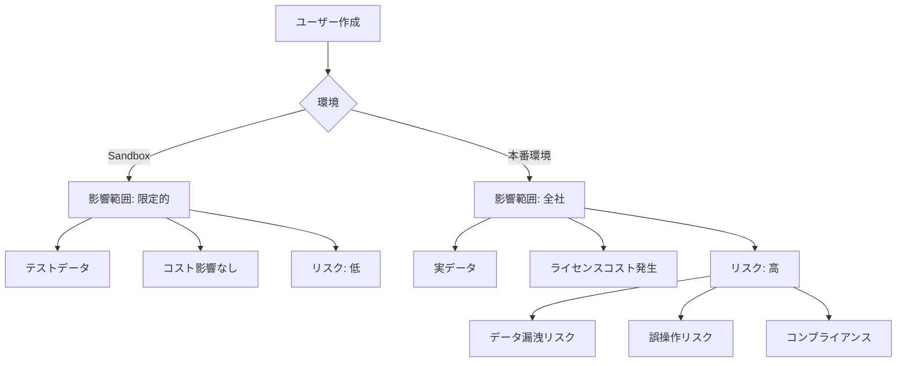
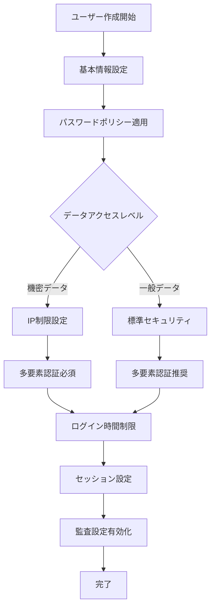
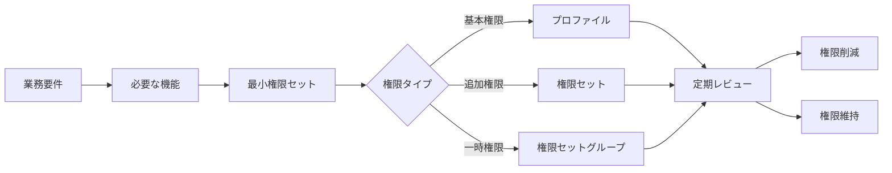
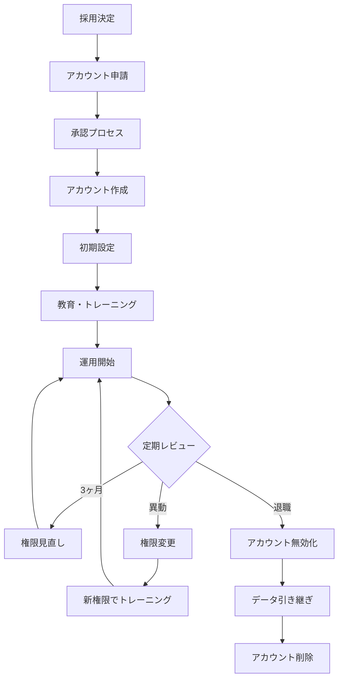
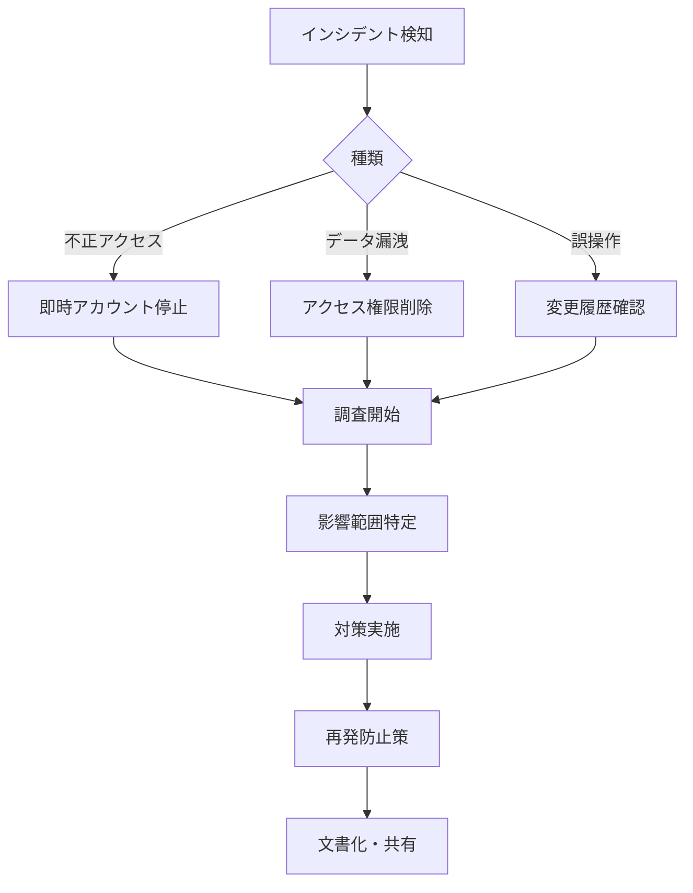

# Salesforce本番環境でユーザー作成時に考慮すべき事項

## What's this file?
> [!NOTE]
> **What**
> 
> Salesforceの本番環境でシステム管理者として新規ユーザーアカウントを作成する際に考慮すべき事項とは何かについて記載しています。

## Conclusion (忙しいとき向け)
> [!IMPORTANT]
> **What** : 本番環境でのユーザー作成時の考慮事項とは何か
> 
> **Answer** : ライセンスコスト、セキュリティ設定、権限の最小化、データアクセス範囲、監査証跡、ユーザー教育、そして既存システムへの影響を総合的に考慮する必要がある

## 目次

<details>
<summary>目次を開く</summary>

- [本番環境とSandboxの違い](#本番環境とsandboxの違い)
- [事前確認チェックリスト](#事前確認チェックリスト)
- [セキュリティ考慮事項](#セキュリティ考慮事項)
- [権限設計の原則](#権限設計の原則)
- [運用上の考慮事項](#運用上の考慮事項)
- [リスクと対策](#リスクと対策)

</details>

## 本番環境とSandboxの違い

### 環境による影響の違い



### 主な違いの比較

| 項目 | Sandbox | 本番環境 | 影響度 |
|------|---------|----------|--------|
| データ | テストデータ | 実データ | 極高 |
| ライセンスコスト | 無料（Sandbox内） | 実費発生 | 高 |
| ユーザー数制限 | Sandboxタイプに依存 | 契約ライセンス数 | 高 |
| 監査要件 | 低 | 高（法規制対応） | 極高 |
| バックアップ | 重要度低 | 必須 | 極高 |
| 変更の影響 | 限定的 | 全社影響 | 極高 |

## 事前確認チェックリスト

### 必須確認項目

```yaml
1. ビジネス要件:
   ☐ 部門責任者の承認
   ☐ 業務内容の明確化
   ☐ アクセス必要範囲の定義
   ☐ 利用期間（無期限/期間限定）
   
2. ライセンス確認:
   ☐ 利用可能ライセンス数
   ☐ ライセンスタイプの適切性
   ☐ 機能ライセンスの必要性
   ☐ コスト承認
   
3. セキュリティ要件:
   ☐ データ分類レベル
   ☐ アクセス制限要件
   ☐ IP制限の必要性
   ☐ 多要素認証の設定
   
4. コンプライアンス:
   ☐ 個人情報取扱い同意
   ☐ セキュリティポリシー同意
   ☐ 監査ログ要件
   ☐ データ保持ポリシー
```

### ライセンス最適化マトリックス

| ユーザータイプ | 推奨ライセンス | 月額コスト目安 | 使用シナリオ |
|---------------|---------------|----------------|-------------|
| フルアクセス管理者 | Salesforce | ¥15,000 | システム管理、全機能利用 |
| 営業担当者 | Salesforce | ¥15,000 | 商談管理、レポート作成 |
| サポート担当者 | Service Cloud | ¥15,000 | ケース管理、顧客対応 |
| 閲覧のみユーザー | Salesforce Platform | ¥3,000 | データ参照、基本レポート |
| 外部ユーザー | Customer Community | ¥1,000〜 | ポータルアクセス |
| 一時的アクセス | Chatter Only | ¥500 | コラボレーションのみ |

## セキュリティ考慮事項

### セキュリティ設定フロー



### 必須セキュリティ設定

| カテゴリー | 設定項目 | 本番環境推奨値 | 理由 |
|-----------|----------|----------------|------|
| **認証** | | | |
| | パスワード複雑性 | 高（英数字記号混在） | 不正アクセス防止 |
| | パスワード有効期限 | 90日 | 定期的な更新強制 |
| | 多要素認証 | 必須 | なりすまし防止 |
| | ログイン試行回数 | 5回 | ブルートフォース対策 |
| **アクセス制御** | | | |
| | IP制限 | 社内IPのみ | 外部からのアクセス防止 |
| | ログイン時間 | 営業時間内 | 時間外アクセス防止 |
| | 同時セッション数 | 1 | 共有防止 |
| **監査** | | | |
| | ログイン履歴 | 180日保持 | 監査証跡 |
| | 項目履歴管理 | 重要項目で有効 | 変更追跡 |
| | レポート実行履歴 | 有効 | データアクセス監視 |

## 権限設計の原則

### 最小権限の原則



### 権限設計マトリックス

```yaml
営業部門ユーザーの例:
  必須権限:
    オブジェクト:
      - リード: 作成、編集、削除
      - 取引先: 作成、編集
      - 商談: 作成、編集
      - 活動: 作成、編集、削除
    
    レコードアクセス:
      - 所有レコード: フルアクセス
      - チームレコード: 編集
      - 他部門: 参照のみ
    
    システム権限:
      - レポート実行: ✓
      - レポート作成: ✓
      - ダッシュボード作成: ✗
      - データエクスポート: ✗
      
  禁止事項:
    - 一括削除
    - 設定変更
    - ユーザー管理
    - データローダー使用
```

## 運用上の考慮事項

### ユーザーライフサイクル管理



### 運用チェックポイント

| タイミング | 確認事項 | アクション | 責任者 |
|-----------|----------|-----------|--------|
| **作成前** | | | |
| | 承認フロー完了 | 申請書の確認 | 部門長 |
| | ライセンス在庫 | 在庫確認・購入判断 | IT管理者 |
| | セキュリティ要件 | リスク評価 | セキュリティ担当 |
| **作成時** | | | |
| | 必須項目入力 | データ品質確保 | システム管理者 |
| | 権限設定 | 最小権限の適用 | システム管理者 |
| | 通知設定 | 適切な通知先設定 | システム管理者 |
| **作成後** | | | |
| | ログイン確認 | 初回ログイン支援 | IT支援 |
| | トレーニング | 必須研修の実施 | 教育担当 |
| | 定期監査 | アクセスログ確認 | セキュリティ担当 |

## リスクと対策

### リスクマトリックス

```yaml
高リスク項目:
  1. 過剰な権限付与:
     影響: データ漏洩、誤操作
     対策: 
       - 権限の定期レビュー
       - 職務分離の徹底
       - 監査ログの監視
       
  2. ライセンス不正使用:
     影響: コンプライアンス違反、追加コスト
     対策:
       - ユーザー共有の禁止
       - 定期的な棚卸し
       - 利用状況モニタリング
       
  3. 退職者アカウント放置:
     影響: 不正アクセス、データ流出
     対策:
       - 退職プロセスとの連携
       - 自動無効化ルール
       - 月次レビュー
```

### インシデント対応フロー



### 予防的コントロール

| コントロール | 実装方法 | 効果 | 優先度 |
|-------------|----------|------|--------|
| プロファイル標準化 | テンプレート作成 | 権限のばらつき防止 | 高 |
| 承認ワークフロー | Salesflowで自動化 | 不正作成防止 | 高 |
| 定期棚卸し | 月次レポート | 不要アカウント削減 | 高 |
| ログイン監視 | Event Monitoring | 異常検知 | 中 |
| 自動無効化 | 最終ログイン基準 | 休眠アカウント対策 | 中 |
| トレーニング必須化 | Mylearn連携 | 誤操作防止 | 中 |

## ベストプラクティス

### Do's（推奨事項）

1. **段階的権限付与**
   - 最初は最小権限から開始
   - 業務習熟度に応じて拡張
   - 不要になった権限は即削除

2. **文書化の徹底**
   ```yaml
   文書化項目:
     - 業務要件と権限の紐付け
     - 承認者と承認日
     - 特殊権限の理由
     - 有効期限（ある場合）
   ```

3. **自動化の活用**
   - ユーザープロビジョニング
   - 定期レビューの通知
   - 異常検知アラート

### Don'ts（禁止事項）

1. **絶対に避けるべきこと**
   - システム管理者権限の安易な付与
   - 複数人でのアカウント共有
   - 包括的なデータエクスポート権限
   - 監査ログの無効化

2. **リスクの高い設定**
   - 「すべてのデータの参照」権限
   - 「すべてのデータの編集」権限
   - API有効化（不要な場合）
   - 無制限のレポート作成権限

## 関連

- [Service Cloud Userライセンス割り当て](2025.08.12.20.12_how_assign_service_cloud_user_license_salesforce.md)
- [Salesforce組織情報設定](2025.08.12.19.34_what_salesforce_organization_information_settings.md)
- [Salesforce Help: ユーザ管理のベストプラクティス](https://help.salesforce.com/s/articleView?id=sf.users_mgmt_best_practices.htm&type=5)
- [Salesforce Help: セキュリティヘルスチェック](https://help.salesforce.com/s/articleView?id=sf.security_health_check.htm&type=5)
- [Salesforce Trailhead: ユーザ管理](https://trailhead.salesforce.com/ja/content/learn/modules/lex_implementation_user_setup_mgmt)