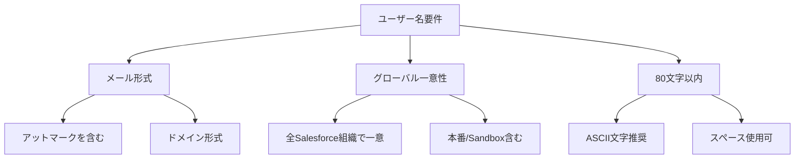
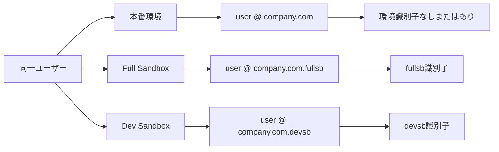
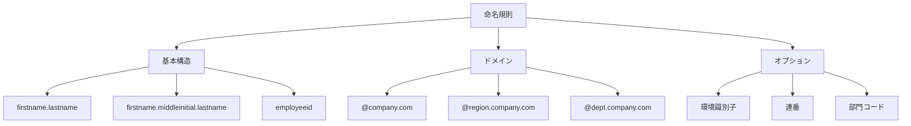
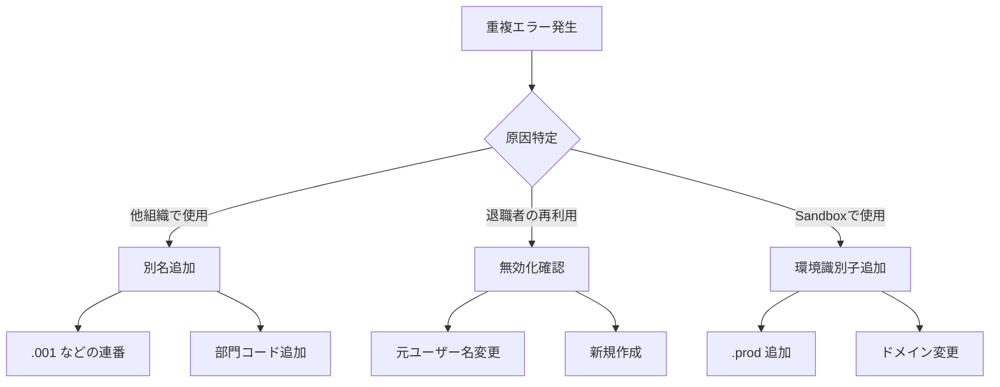
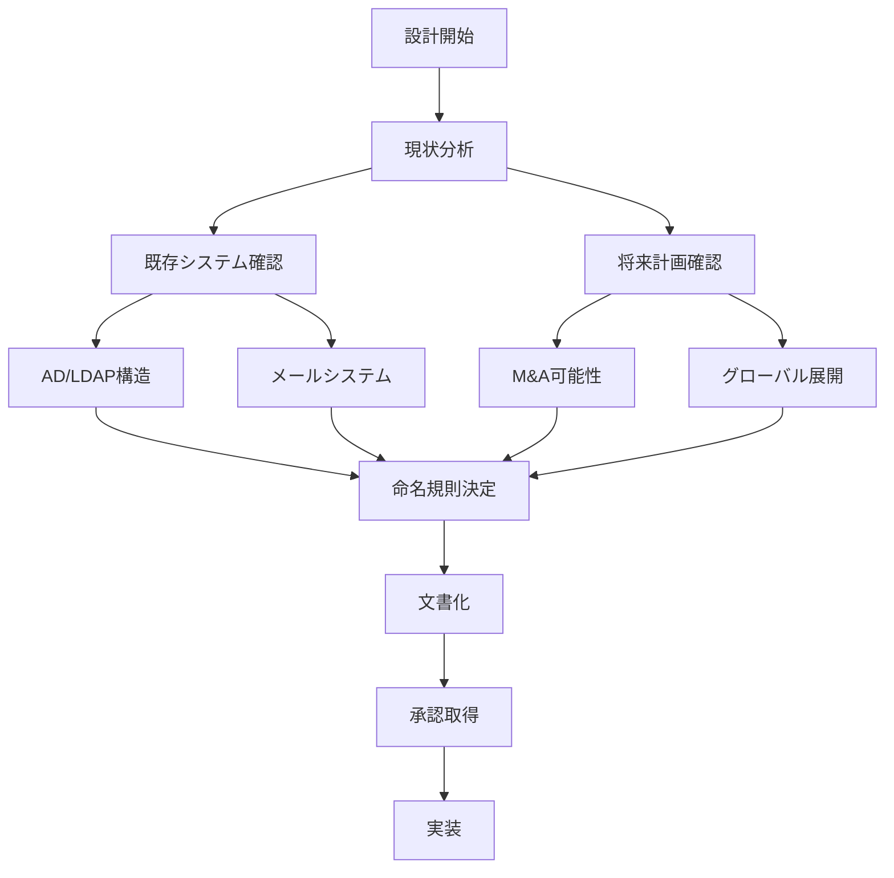

# Salesforce本番環境でのユーザー名に関する考慮事項

## What's this file?
> [!NOTE]
> **What**
>
> Salesforceの本番環境でシステム管理者として新規ユーザーアカウントを作成する際のユーザー名に関する考慮事項とは何かについて記載しています。

## Conclusion (忙しいとき向け)
> [!IMPORTANT]
> **What** : ユーザー名に関する考慮事項とは何か
>
> **Answer** : ユーザー名はグローバルで一意、メール形式必須、環境識別子の付与、命名規則の統一、将来の移行・統合を考慮した設計が必要

## 目次

<details>
<summary>目次を開く</summary>

- [Salesforceユーザー名の基本ルール](#salesforceユーザー名の基本ルール)
- [本番環境特有の考慮事項](#本番環境特有の考慮事項)
- [命名規則と標準化](#命名規則と標準化)
- [よくある問題と対策](#よくある問題と対策)
- [ベストプラクティス](#ベストプラクティス)

</details>

## Salesforceユーザー名の基本ルール

### 必須要件



### ユーザー名の構成要素

| 要素 | 説明 | 例 | 必須/推奨 |
|------|------|-----|-----------|
| ローカル部 | @より前の部分 | taro.yamada | 必須 |
| @マーク | 区切り文字 | @ | 必須 |
| ドメイン部 | 組織識別部分 | company.com | 必須 |
| 環境識別子 | 環境の区別 | .prod | 推奨 |
| 一意性確保 | 重複防止 | .001 | 状況による |

### 実際のメールアドレスとの関係

```yaml
重要な違い:
  ユーザー名:
    - ログインID として使用
    - 実在のメールアドレスである必要なし
    - グローバルで一意が必須

  メールアドレス:
    - 通知の送信先
    - 実在のアドレスが必須
    - 組織内で重複可能

推奨パターン:
  - ユーザー名とメールアドレスを同じにする
  - ただし環境識別子を付与
```

## 本番環境特有の考慮事項

### 環境間の識別



### 本番環境でのユーザー名戦略

| 戦略 | パターン | メリット | デメリット |
|------|----------|---------|-----------|
| **実メールアドレス** | `user@company.com` | 直感的、SSO連携容易 | Sandbox区別が必要 |
| **環境識別子付き** | `user@company.com.prod` | 環境が明確 | SSO設定が複雑 |
| **ドメイン変更** | `user@sfdc.company.com` | 柔軟性高い | 管理が複雑 |
| **別名方式** | `user.prod@company.com` | 視認性良好 | 命名規則の徹底必要 |

### 組織統合・移行の考慮

```yaml
将来のシナリオ:
  1. 組織統合:
     課題: ユーザー名の重複
     対策:
       - 事前に識別子を付与
       - 統合計画を考慮した命名

  2. 組織分割:
     課題: ユーザーの移行
     対策:
       - 部門コードを含める
       - 移行しやすい構造

  3. 企業買収・合併:
     課題: ドメイン変更
     対策:
       - 変更に強い設計
       - 別名の活用
```

## 命名規則と標準化

### 推奨命名規則



### 具体的な命名例

| ユーザータイプ | 命名パターン | 実例 | 使用場面 |
|---------------|-------------|------|----------|
| 一般ユーザー | `firstname.lastname@domain` | `taro.yamada@company.com` | 標準的な使用 |
| 重複対応 | `firstname.lastname.番号@domain` | `taro.yamada.2@company.com` | 同姓同名対応 |
| 部門別 | `firstname.lastname@dept.domain` | `taro.yamada@sales.company.com` | 大規模組織 |
| 地域別 | `firstname.lastname@region.domain` | `taro.yamada@jp.company.com` | グローバル企業 |
| システムユーザー | `system.purpose@domain` | `integration.api@company.com` | 統合用 |
| 共有ユーザー | `team.function@domain` | `support.queue@company.com` | 共有メールボックス |

### 特殊文字の取り扱い

```yaml
使用可能な文字:
  推奨:
    - 英数字 (a-z, A-Z, 0-9)
    - ピリオド (.)
    - ハイフン (-)
    - アンダースコア (_)

  使用可だが非推奨:
    - スペース ( )
    - アポストロフィ (')
    - その他の特殊文字

  禁止:
    - 日本語などのマルチバイト文字
    - 制御文字

名前の変換例:
  - 山田太郎 → taro.yamada
  - O'Brien → obrien (アポストロフィ除去)
  - José → jose (アクセント除去)
  - 李明 → ming.li または mli
```

## よくある問題と対策

### 問題1: ユーザー名の重複



### 問題2: SSO（シングルサインオン）との整合性

| 課題 | 原因 | 解決策 | 実装例 |
|------|------|--------|--------|
| ログイン失敗 | ユーザー名とSSO IDの不一致 | Federation IDの設定 | SAML Attributeでマッピング |
| 環境識別子 | SSOは実メールアドレス使用 | カスタムログインフロー | MyDomainでリダイレクト |
| 大文字小文字 | システム間の扱い差異 | 小文字統一 | username.toLowerCase() |
| 特殊文字 | エンコーディング問題 | シンプルな文字のみ使用 | 英数字とピリオドのみ |

### 問題3: 組織移行時の課題

```yaml
移行シナリオと対策:

  1. Data Loader使用時:
     問題: ユーザー名重複でエラー
     対策:
       - 事前に一括変更
       - 移行先で一時的な名前使用
       - 段階的移行

  2. 組織統合時:
     問題: 両組織に同じユーザー名
     対策:
       - 統合前に片方を変更
       - 組織識別子を追加
       - エイリアス活用

  3. ドメイン変更時:
     問題: 全ユーザーの一括更新
     対策:
       - Data Loaderで一括更新
       - APIによる自動化
       - 段階的な移行計画
```

## ベストプラクティス

### 初期設計時の考慮事項



### 推奨設定チェックリスト

```markdown
## ユーザー名設計チェックリスト

### 基本設計
- [ ] メール形式の遵守
- [ ] 80文字以内の確認
- [ ] ASCII文字のみ使用
- [ ] 小文字統一

### 命名規則
- [ ] firstname.lastname形式
- [ ] 重複時の対応ルール策定
- [ ] 特殊文字の変換ルール
- [ ] 部門/地域コードの使用検討

### 環境管理
- [ ] 本番環境の識別方法
- [ ] Sandbox命名規則
- [ ] 環境間の区別明確化

### 将来性
- [ ] 組織変更への対応
- [ ] スケーラビリティ
- [ ] 移行容易性
- [ ] SSO対応

### 運用
- [ ] 命名規則の文書化
- [ ] 承認プロセス
- [ ] 例外処理ルール
- [ ] 定期的な見直し
```

### 実装例

```yaml
標準的な実装:
  一般ユーザー:
    パターン: {firstname}.{lastname}@{company}.com
    例: taro.yamada@abccorp.com

  重複対応:
    パターン: {firstname}.{lastname}.{number}@{company}.com
    例: taro.yamada.2@abccorp.com

  部門別管理:
    パターン: {firstname}.{lastname}@{dept}.{company}.com
    例: taro.yamada@sales.abccorp.com

  システムユーザー:
    パターン: {system}.{purpose}@{company}.com
    例: api.integration@abccorp.com

Sandbox対応:
  Full Sandbox:
    本番: user@company.com
    Sandbox: user@company.com.fullsb

  Developer Sandbox:
    本番: user@company.com
    Sandbox: user@company.com.dev01
```

### 管理上の注意点

1. **変更管理**
   - ユーザー名変更は影響大
   - 事前の影響調査必須
   - 関連システムへの通知

2. **監査とコンプライアンス**
   - ユーザー名変更履歴の保持
   - 命名規則遵守の監査
   - 定期的なレビュー

3. **ドキュメント管理**
   - 命名規則の明文化
   - 例外事項の記録
   - 変更手順の文書化

## 関連

- [本番環境でのユーザー作成時の考慮事項](2025.08.12.20.19_what_consider_creating_user_production_salesforce.md)
- [Service Cloud Userライセンス割り当て](2025.08.12.20.12_how_assign_service_cloud_user_license_salesforce.md)
- [Salesforce Help: ユーザー名とメールアドレス](https://help.salesforce.com/s/articleView?id=sf.users_username_guidelines.htm&type=5)
- [Salesforce Help: シングルサインオン](https://help.salesforce.com/s/articleView?id=sf.sso_about.htm&type=5)
- [Salesforce Trailhead: ユーザー管理の基本](https://trailhead.salesforce.com/ja/content/learn/modules/lex_implementation_user_setup_mgmt/lex_implementation_user_setup_mgmt_intro)
