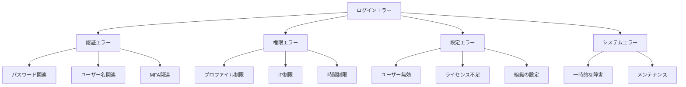
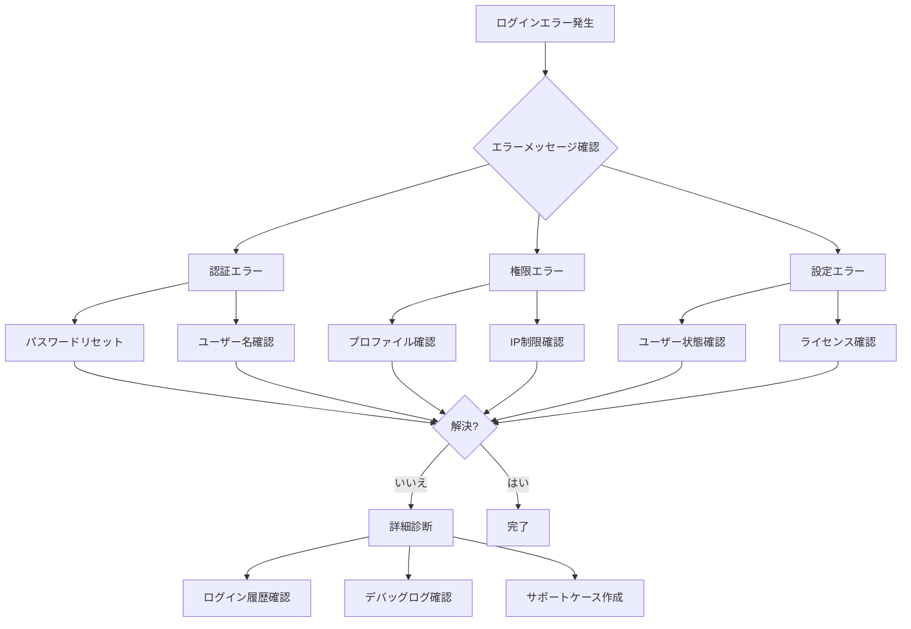
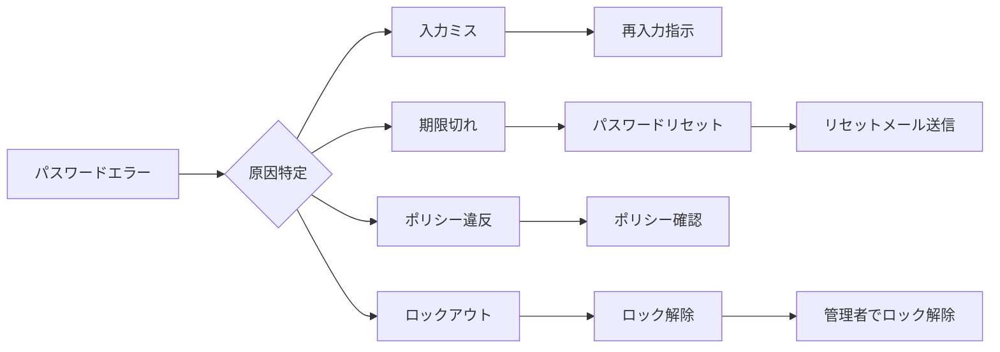
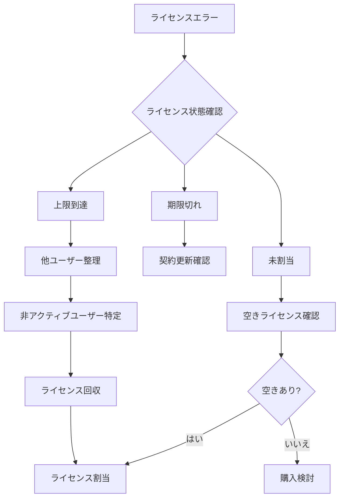
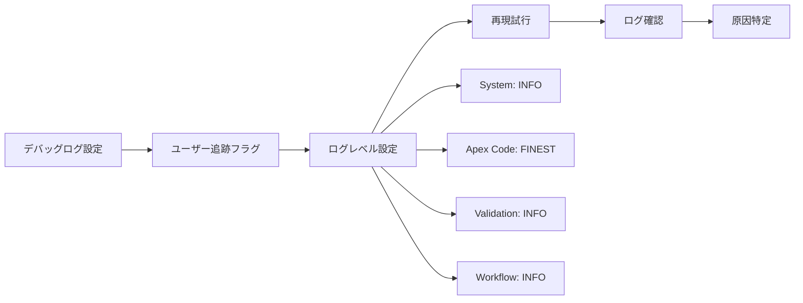
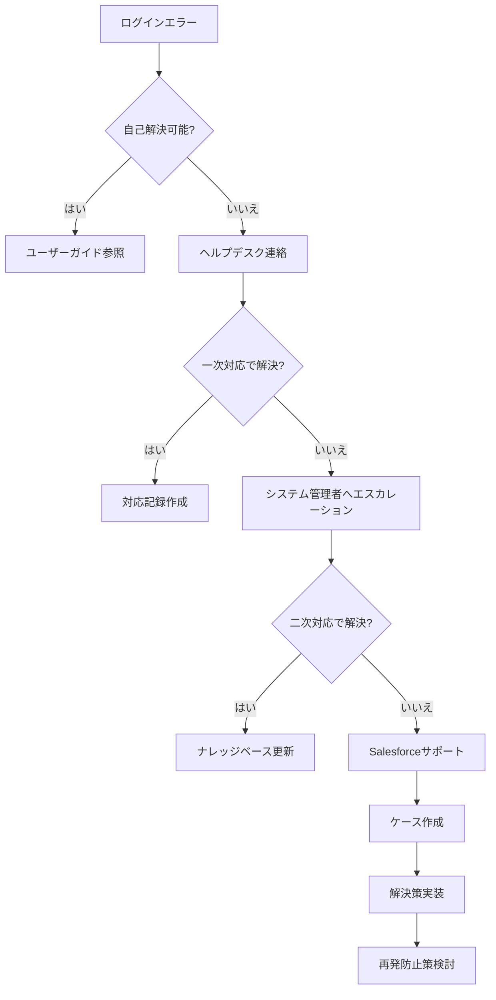

# Salesforce新規ユーザーアカウントのログインエラーをトラブルシューティングする方法

## What's this file?
> [!NOTE]
> **How**
> 
> どのようにSalesforceのシステム管理者として新規ユーザーアカウントでログインエラーが発生した場合にトラブルシューティングするかについて記載しています。

## Conclusion (忙しいとき向け)
> [!IMPORTANT]
> **How** : どのようにログインエラーをトラブルシューティングするか
> 
> **Answer** : エラーメッセージから原因を特定し、ユーザー設定、プロファイル権限、IP制限、パスワードポリシー、ライセンス状態を順次確認する

## 目次

<details>
<summary>目次を開く</summary>

- [よくあるログインエラーの種類](#よくあるログインエラーの種類)
- [トラブルシューティングフロー](#トラブルシューティングフロー)
- [エラー別の対処法](#エラー別の対処法)
- [診断ツールの使用方法](#診断ツールの使用方法)
- [予防策とベストプラクティス](#予防策とベストプラクティス)

</details>

## よくあるログインエラーの種類

### エラーメッセージ一覧

| エラーメッセージ | 主な原因 | 発生頻度 | 重要度 |
|-----------------|----------|----------|---------|
| **ユーザー名またはパスワードが無効です** | 入力ミス、パスワード間違い | 極高 | 中 |
| **アカウントがロックされています** | ログイン試行回数超過 | 高 | 高 |
| **IPアドレスからのアクセスが制限されています** | IP制限設定 | 中 | 高 |
| **このユーザーはアクティブではありません** | ユーザー無効化 | 中 | 極高 |
| **ライセンスが割り当てられていません** | ライセンス不足 | 低 | 極高 |
| **プロファイルでログインが制限されています** | ログイン時間/IP制限 | 中 | 高 |
| **多要素認証が必要です** | MFA未設定 | 高 | 中 |
| **セッションの有効期限が切れました** | タイムアウト | 高 | 低 |

### エラーの分類



## トラブルシューティングフロー

### 基本的な診断フロー



### システム管理者の確認手順

```yaml
Step 1 - 基本情報の確認:
  1. ユーザー詳細ページへアクセス
     パス: 設定 > ユーザ > ユーザ > 該当ユーザー選択
     
  2. 確認項目:
     - アクティブ: チェックあり
     - ユーザライセンス: 適切なライセンス
     - プロファイル: 正しいプロファイル
     - ロール: 設定済み（必要に応じて）

Step 2 - ログイン履歴の確認:
  1. ユーザー詳細ページで「ログイン履歴」クリック
  2. 最新のログイン試行を確認
  3. ステータスとエラーメッセージを記録

Step 3 - プロファイル設定の確認:
  1. プロファイルページへアクセス
  2. ログインIP範囲の確認
  3. ログイン時間の確認
  4. 必要な権限の確認
```

## エラー別の対処法

### 1. パスワード関連エラー



#### 対処手順

| 状況 | 管理者のアクション | ユーザーへの指示 | 所要時間 |
|------|-------------------|------------------|----------|
| パスワード忘れ | リセットリンク送信 | メール確認→再設定 | 5分 |
| アカウントロック | ロック解除実行 | 15分待機後再試行 | 即時 |
| パスワード期限切れ | 強制リセット | 新パスワード設定 | 5分 |
| ポリシー違反 | ポリシー説明 | 要件満たすPW作成 | 10分 |

### 2. IP制限関連エラー

```yaml
診断手順:
  1. 現在のIPアドレス確認:
     - ユーザーに確認依頼
     - whatismyipaddress.com 等で確認
     
  2. 設定場所の確認:
     a) 組織レベル:
        設定 > セキュリティ > ネットワークアクセス
        
     b) プロファイルレベル:
        該当プロファイル > ログインIP範囲
        
  3. 一時的な対処:
     - 信頼済みIPリストに追加
     - VPN接続の確認
     - プロファイル変更（緊急時）

永続的な対処:
  - IP範囲の見直し
  - リモートワーク対応
  - セキュリティとのバランス
```

### 3. ライセンス関連エラー



## 診断ツールの使用方法

### ログイン履歴の活用

```yaml
確認ポイント:
  ステータス列:
    - 成功: 正常ログイン
    - 失敗: エラー詳細確認必要
    - パスワードロックアウト: 試行回数超過
    - 無効なパスワード: パスワード間違い
    
  詳細情報:
    - ソースIP: アクセス元確認
    - ログインタイプ: 通常/API/SAML等
    - ブラウザ: 対応ブラウザ確認
    - プラットフォーム: OS情報
    
活用例:
  1. パターン分析:
     - 特定時間帯のエラー
     - 特定IPからのエラー
     - 特定ブラウザでのエラー
     
  2. セキュリティ監視:
     - 不審なアクセス試行
     - 異常なログインパターン
     - 地理的に離れた場所からのアクセス
```

### デバッグログの設定



### ヘルスチェックの実施

| チェック項目 | 確認方法 | 正常値 | 対処法 |
|-------------|----------|--------|--------|
| パスワードポリシー | 設定 > セキュリティ > パスワードポリシー | 組織基準に準拠 | ポリシー見直し |
| セッション設定 | 設定 > セキュリティ > セッション設定 | タイムアウト2時間以上 | 設定調整 |
| ログイン試行回数 | 設定 > セキュリティ > パスワードポリシー | 5-10回 | 回数調整 |
| IP制限 | 各プロファイル設定 | 必要最小限 | 範囲見直し |

## 予防策とベストプラクティス

### 新規ユーザー作成時のチェックリスト

```markdown
## 必須確認項目
- [ ] ユーザー名の一意性確認
- [ ] メールアドレスの有効性確認
- [ ] 適切なライセンスの割り当て
- [ ] 正しいプロファイルの選択
- [ ] ロールの設定（必要に応じて）
- [ ] 初回ログイン手順の説明
- [ ] パスワードポリシーの説明
- [ ] MFA設定の案内（必須の場合）

## 推奨設定
- [ ] ウェルカムメールの送信
- [ ] ログインIP範囲の事前確認
- [ ] ログイン時間の制限確認
- [ ] 必要な権限セットの付与
- [ ] トレーニング資料の提供
```

### よくある設定ミスと対策

```yaml
1. プロファイル設定ミス:
   問題: 誤ったプロファイル割り当て
   対策:
     - プロファイルテンプレート作成
     - 命名規則の統一
     - 定期的な棚卸し
     
2. IP制限の過剰設定:
   問題: リモートワーク対応不可
   対策:
     - VPN利用の推進
     - 条件付きアクセス
     - MFAとの組み合わせ
     
3. パスワードポリシーの複雑性:
   問題: ユーザビリティ低下
   対策:
     - SSO導入検討
     - パスワードマネージャー推奨
     - 定期的な見直し

4. ライセンス管理の不備:
   問題: 突然のライセンス不足
   対策:
     - 利用状況の可視化
     - アラート設定
     - 予備ライセンス確保
```

### エスカレーションフロー



### 監視とアラート設定

| 監視項目 | しきい値 | アラート先 | 対応優先度 |
|----------|----------|-----------|------------|
| ログイン失敗率 | 10%以上 | 管理者メール | 高 |
| アカウントロック | 5件/日 | Slack通知 | 中 |
| ライセンス使用率 | 90%以上 | 管理者+調達 | 極高 |
| 異常ログイン | 1件 | セキュリティチーム | 極高 |
| パスワードリセット | 20件/日 | ヘルプデスク | 低 |

## 関連

- [Salesforce本番環境でのユーザー作成時の考慮事項](2025.08.12.20.19_what_consider_creating_user_production_salesforce.md)
- [Salesforceユーザー名に関する考慮事項](2025.08.12.20.23_what_salesforce_username_considerations_production.md)
- [Service Cloud Userライセンス割り当て方法](2025.08.12.20.12_how_assign_service_cloud_user_license_salesforce.md)
- [Salesforce Help: ログインの問題のトラブルシューティング](https://help.salesforce.com/s/articleView?id=sf.login_troubleshooting.htm&type=5)
- [Salesforce Help: ユーザーアカウントのロック解除](https://help.salesforce.com/s/articleView?id=sf.users_unlock.htm&type=5)
- [Salesforce Trailhead: Identity の基本](https://trailhead.salesforce.com/ja/content/learn/modules/identity_basics)