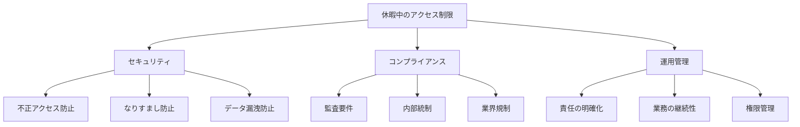
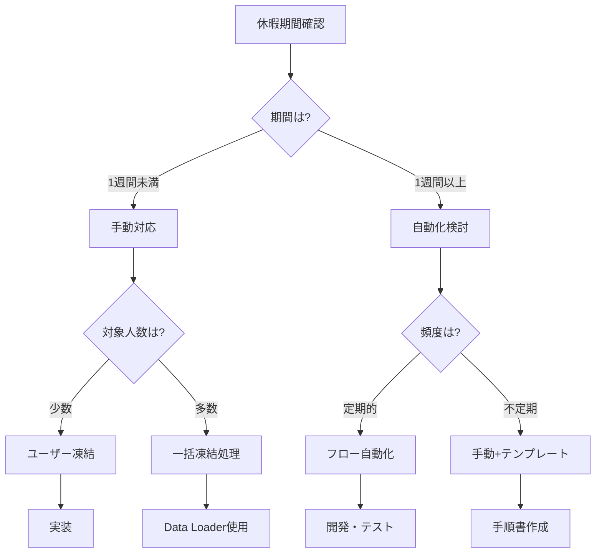
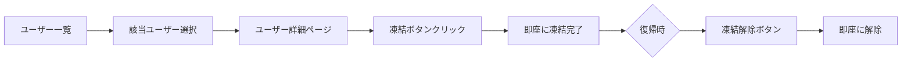
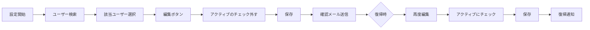
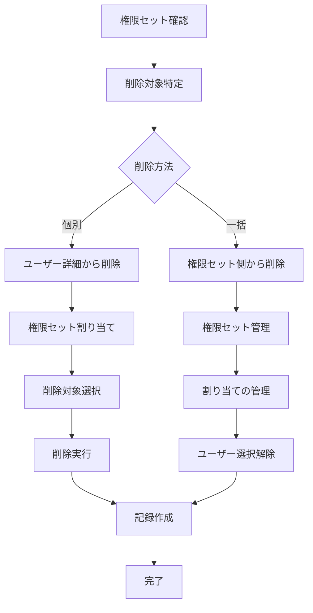
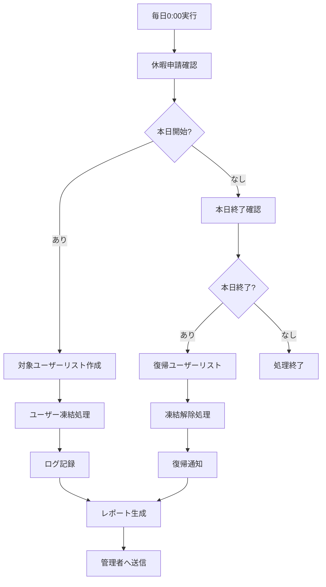
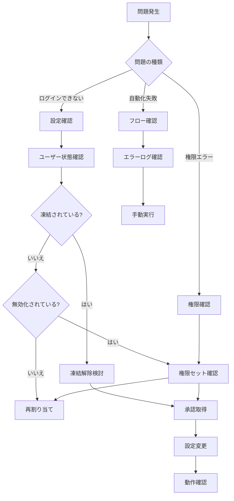

# 休暇中の従業員アカウントのログインを防止する方法

## What's this file?
> [!NOTE]
> **How**
> 
> どのようにSalesforceのシステム管理者として休暇中の従業員アカウントへのログインを防止するかについて記載しています。

## Conclusion (忙しいとき向け)
> [!IMPORTANT]
> **How** : どのように休暇中のログインを防止するか
> 
> **Answer** : Trailhead推奨の「ユーザー凍結」機能を使用。即座に効果があり、ライセンスを維持したまま一時的にアクセスを遮断できる

## 目次

<details>
<summary>目次を開く</summary>

- [休暇中のアクセス制限の必要性](#休暇中のアクセス制限の必要性)
- [実装方法の比較](#実装方法の比較)
- [手動での設定手順](#手動での設定手順)
- [自動化による実装](#自動化による実装)
- [運用上の考慮事項](#運用上の考慮事項)

</details>

## 休暇中のアクセス制限の必要性

### セキュリティとコンプライアンス要件



### リスクシナリオ

| シナリオ | リスクレベル | 影響範囲 | 対策優先度 |
|----------|-------------|----------|------------|
| 認証情報の漏洩 | 極高 | 全データ | 必須 |
| 第三者による不正利用 | 高 | 個人データ | 必須 |
| 本人の誤操作 | 中 | 限定的 | 推奨 |
| 自動処理の継続実行 | 中 | プロセス | 推奨 |
| 通知の見逃し | 低 | 業務遅延 | 任意 |

## 実装方法の比較

### Trailhead推奨方法：ユーザー凍結

> [!TIP]
> **Salesforce Trailheadの推奨**
> 
> 休暇中の従業員アカウントには「凍結（Freeze）」機能の使用が推奨されています。これは以下の理由によります：
> - 即座にログインを防止できる
> - ライセンスを解放せずに維持できる
> - 復帰時にワンクリックで解除可能
> - 監査証跡が残る

### 利用可能な方法一覧

```yaml
1. ユーザー凍結（Trailhead推奨）:
   メリット:
     - 即座に効果発生
     - ライセンス維持
     - 簡単な解除
     - 監査ログ自動記録
   デメリット:
     - 個別設定のみ
     - 自動化には開発必要

2. ユーザーの無効化:
   メリット:
     - 完全なアクセス遮断
     - 実装が簡単
     - 即時反映
   デメリット:
     - 全権限の喪失
     - 再有効化の手間
     - ライセンスは消費継続

2. ログイン時間制限:
   メリット:
     - 柔軟な制御
     - 部分的な制限可能
     - 自動復帰
   デメリット:
     - プロファイル単位
     - 完全遮断ではない
     - 時差考慮が必要

3. 権限セット管理:
   メリット:
     - 細かい制御
     - 段階的な制限
     - 基本権限は維持
   デメリット:
     - 管理が複雑
     - 完全遮断は困難
     - 設定ミスのリスク

4. フローによる自動化:
   メリット:
     - 完全自動化
     - カスタマイズ可能
     - 履歴管理
   デメリット:
     - 開発が必要
     - テスト必須
     - 保守コスト
```

### 実装方法の選択フロー



## 手動での設定手順

### 方法1: ユーザー凍結（Trailhead推奨）



#### 凍結の詳細手順

| ステップ | 操作内容 | 確認事項 | 所要時間 |
|----------|----------|----------|----------|
| 1. アクセス | 設定 > ユーザ > ユーザ | 管理者権限確認 | 30秒 |
| 2. 検索 | ユーザー名で検索 | 正しいユーザー確認 | 1分 |
| 3. 選択 | 該当ユーザーをクリック | ユーザー詳細表示 | 30秒 |
| 4. 凍結 | 「凍結」ボタンクリック | 確認なしで即実行 | 5秒 |
| 5. 確認 | ボタンが「凍結解除」に変化 | 凍結完了 | 5秒 |
| 6. 記録 | 理由をメモに記録 | 監査証跡は自動 | 1分 |

### 方法2: ユーザーの無効化（長期休暇向け）



#### 詳細手順

| ステップ | 操作内容 | 確認事項 | 所要時間 |
|----------|----------|----------|----------|
| 1. アクセス | 設定 > ユーザ > ユーザ | 管理者権限確認 | 30秒 |
| 2. 検索 | ユーザー名で検索 | 正しいユーザー確認 | 1分 |
| 3. 編集 | 編集ボタンクリック | 編集権限確認 | 30秒 |
| 4. 無効化 | アクティブのチェック解除 | 警告メッセージ確認 | 30秒 |
| 5. 保存 | 保存ボタンクリック | エラーなし確認 | 30秒 |
| 6. 記録 | 変更理由を記録 | 監査証跡作成 | 2分 |

### 方法3: プロファイルでのログイン時間制限

```yaml
設定手順:
  1. プロファイル特定:
     - 対象ユーザーのプロファイル確認
     - カスタムプロファイルの検討
     
  2. ログイン時間設定:
     パス: 設定 > プロファイル > 該当プロファイル > ログイン時間
     
     設定例（完全制限）:
       月曜日: 開始 12:00 AM / 終了 12:00 AM
       火曜日: 開始 12:00 AM / 終了 12:00 AM
       水曜日: 開始 12:00 AM / 終了 12:00 AM
       木曜日: 開始 12:00 AM / 終了 12:00 AM
       金曜日: 開始 12:00 AM / 終了 12:00 AM
       土曜日: 開始 12:00 AM / 終了 12:00 AM
       日曜日: 開始 12:00 AM / 終了 12:00 AM
       
  3. 注意事項:
     - タイムゾーンの確認
     - 他のユーザーへの影響
     - 復帰時の再設定
```

### 方法4: 権限セットの一時削除



## 自動化による実装

### フローによる凍結の自動化

```yaml
フロー設計（凍結版）:
  トリガー:
    - レコードトリガーフロー
    - オブジェクト: カスタムオブジェクト「休暇申請」
    - 条件: ステータス = '承認済み' AND 開始日 = TODAY()
    
  アクション:
    1. Apexアクション呼び出し:
       - UserLoginレコードの更新
       - IsFrozen = true
       - 理由をカスタム項目に記録
       
    2. 通知送信:
       - 管理者へメール
       - 本人へ確認メール
       - チームへの通知
       
    3. 復帰スケジュール:
       - 時間ベースワークフロー作成
       - 終了日に凍結解除
       - 復帰通知送信
```

### フローによる無効化の自動化（長期休暇用）

```yaml
フロー設計:
  トリガー:
    - レコードトリガーフロー
    - オブジェクト: カスタムオブジェクト「休暇申請」
    - 条件: ステータス = '承認済み' AND 開始日 = TODAY()
    
  アクション:
    1. ユーザー無効化:
       - ユーザーレコード更新
       - IsActive = false
       - 理由項目に「休暇中」を設定
       
    2. 通知送信:
       - 管理者へメール
       - 本人へ確認メール
       - チームへの通知
       
    3. 復帰スケジュール:
       - 時間ベースワークフロー作成
       - 終了日にユーザー有効化
       - 復帰通知送信

実装例:
  開始条件:
    $Record.Status__c = '承認済み' AND
    $Record.Start_Date__c = TODAY() AND
    $Record.Type__c = '長期休暇'
    
  更新アクション:
    User.IsActive = false
    User.Reason_for_Deactivation__c = '休暇中:' + $Record.End_Date__c
```

### Apexによる凍結機能の実装

```apex
public class VacationFreezeController {
    
    @InvocableMethod(label='休暇中のユーザー凍結' 
                     description='休暇申請に基づいてユーザーを凍結/凍結解除')
    public static void freezeVacationUsers(List<VacationRequest> requests) {
        
        Set<Id> userIdsToFreeze = new Set<Id>();
        Set<Id> userIdsToUnfreeze = new Set<Id>();
        
        for(VacationRequest req : requests) {
            if(req.Status == '承認済み' && req.StartDate <= Date.today()) {
                userIdsToFreeze.add(req.UserId);
            } else if(req.Status == '復帰' && req.EndDate <= Date.today()) {
                userIdsToUnfreeze.add(req.UserId);
            }
        }
        
        // 凍結処理
        if(!userIdsToFreeze.isEmpty()) {
            List<UserLogin> usersToFreeze = [SELECT Id, IsFrozen 
                                            FROM UserLogin 
                                            WHERE UserId IN :userIdsToFreeze];
            for(UserLogin ul : usersToFreeze) {
                ul.IsFrozen = true;
            }
            update usersToFreeze;
        }
        
        // 凍結解除処理
        if(!userIdsToUnfreeze.isEmpty()) {
            List<UserLogin> usersToUnfreeze = [SELECT Id, IsFrozen 
                                              FROM UserLogin 
                                              WHERE UserId IN :userIdsToUnfreeze];
            for(UserLogin ul : usersToUnfreeze) {
                ul.IsFrozen = false;
            }
            update usersToUnfreeze;
        }
        
        createAuditLog(userIdsToFreeze, userIdsToUnfreeze);
    }
    
    private static void createAuditLog(Set<Id> frozen, Set<Id> unfrozen) {
        // 監査ログの作成
    }
}
```

### Apexによる無効化制御（長期休暇用）

```apex
public class VacationAccessController {
    
    @InvocableMethod(label='休暇中のアクセス制御' 
                     description='休暇申請に基づいてユーザーアクセスを制御')
    public static void controlVacationAccess(List<VacationRequest> requests) {
        
        List<User> usersToUpdate = new List<User>();
        Map<Id, String> userReasonMap = new Map<Id, String>();
        
        for(VacationRequest req : requests) {
            if(req.Status == '承認済み' && req.StartDate <= Date.today()) {
                User u = new User(
                    Id = req.UserId,
                    IsActive = false
                );
                usersToUpdate.add(u);
                userReasonMap.put(req.UserId, 
                    '休暇期間: ' + req.StartDate + ' ～ ' + req.EndDate);
            }
        }
        
        if(!usersToUpdate.isEmpty()) {
            update usersToUpdate;
            createAuditLog(userReasonMap);
            sendNotifications(usersToUpdate);
        }
    }
    
    private static void createAuditLog(Map<Id, String> userReasonMap) {
        // 監査ログの作成
    }
    
    private static void sendNotifications(List<User> users) {
        // 通知の送信
    }
}
```

### スケジュールジョブによる定期チェック



## 運用上の考慮事項

### チェックリストとベストプラクティス

```markdown
## 休暇前チェックリスト

### 1週間前
- [ ] 休暇申請の承認確認
- [ ] 業務引き継ぎ完了確認
- [ ] 緊急連絡先の確認
- [ ] 自動処理の停止設定

### 3日前
- [ ] 重要な権限の棚卸し
- [ ] 代理承認者の設定
- [ ] チームへの周知
- [ ] システム設定の最終確認

### 前日
- [ ] ユーザー凍結の実施（Trailhead推奨）
- [ ] 凍結理由の記録
- [ ] 本人への確認連絡
- [ ] 凍結状態の確認

### 休暇中
- [ ] 定期的な監視
- [ ] 緊急時の対応準備
- [ ] アクセス試行の監視

### 復帰時
- [ ] 凍結解除の実施
- [ ] ログイン確認
- [ ] 業務環境の確認
- [ ] 休暇中の変更点共有
```

### 例外処理とエスカレーション

| 状況 | 対応方法 | 承認者 | 記録要否 |
|------|----------|--------|----------|
| 緊急業務発生 | 一時的な凍結解除 | 部門長 | 必須 |
| 休暇延長 | 凍結期間の延長（そのまま） | 直属上司 | 必須 |
| 早期復帰 | 即時凍結解除 | 管理者 | 必須 |
| システム障害 | 手動での凍結/解除 | IT管理者 | 必須 |

### 監査とコンプライアンス

```yaml
記録すべき項目:
  必須項目:
    - 対象ユーザー名
    - 実施日時
    - 実施者
    - 変更内容
    - 理由
    - 期間
    
  推奨項目:
    - 承認者
    - 関連チケット番号
    - 影響範囲
    - 復帰予定日
    - 代理対応者
    
保管要件:
  - 保管期間: 最低1年
  - アクセス権限: 管理者のみ
  - バックアップ: 定期実施
  - 監査対応: 即時提出可能
```

### トラブルシューティング



## 関連

- [ユーザー無効化と凍結の違い](2025.08.12.20.47_what_difference_deactivate_freeze_user_salesforce.md)
- [ログインエラーのトラブルシューティング](2025.08.12.20.37_how_troubleshoot_salesforce_new_user_login_error.md)
- [本番環境でのユーザー作成時の考慮事項](2025.08.12.20.19_what_consider_creating_user_production_salesforce.md)
- [Salesforce Help: ユーザーの凍結と凍結解除](https://help.salesforce.com/s/articleView?id=sf.users_freeze.htm&type=5)
- [Salesforce Help: ユーザーアカウントの無効化](https://help.salesforce.com/s/articleView?id=sf.users_deactivate.htm&type=5)
- [Salesforce Trailhead: ユーザー管理の基本（凍結機能を含む）](https://trailhead.salesforce.com/ja/content/learn/modules/lex_implementation_user_setup_mgmt)