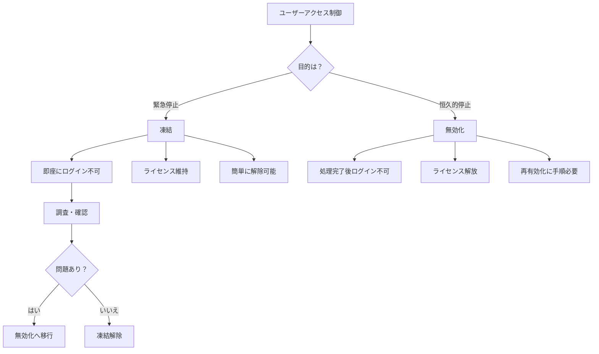
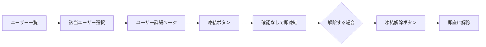
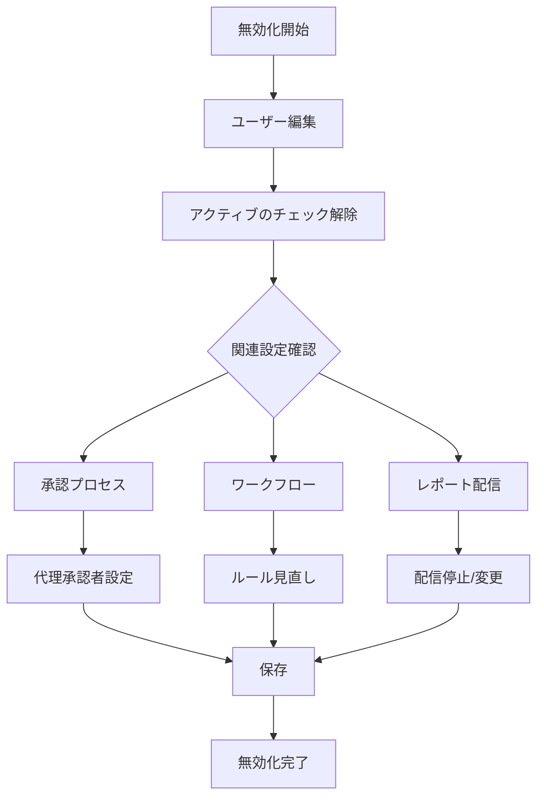
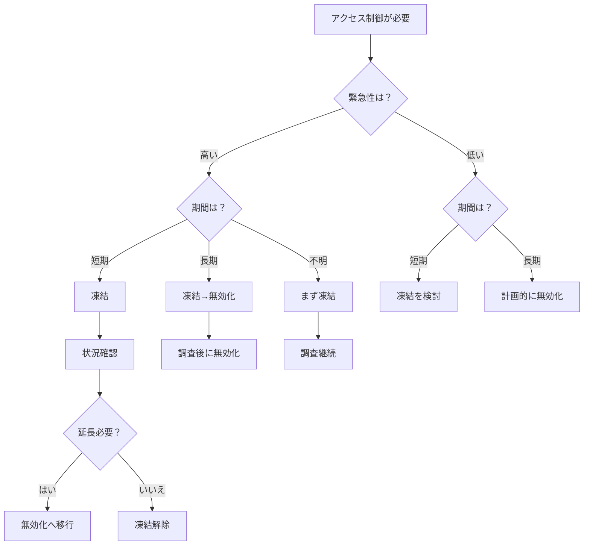
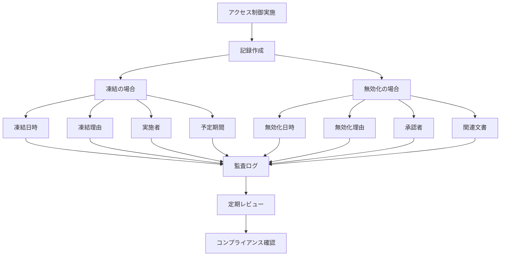

# Salesforceにおけるユーザー「無効化」と「凍結」の違い

## What's this file?
> [!NOTE]
> **What**
> 
> Salesforceのユーザー管理における「無効化（Deactivate）」と「凍結（Freeze）」の違いとは何かについて記載しています。

## Conclusion (忙しいとき向け)
> [!IMPORTANT]
> **What** : ユーザーの無効化と凍結の違いとは何か
> 
> **Answer** : 凍結は即座にログインを防ぐ一時的な措置、無効化はライセンスを解放する恒久的な措置。凍結→無効化の順で使用することが推奨される

## 目次

<details>
<summary>目次を開く</summary>

- [基本的な違い](#基本的な違い)
- [凍結（Freeze）の詳細](#凍結freezeの詳細)
- [無効化（Deactivate）の詳細](#無効化deactivateの詳細)
- [使い分けのガイドライン](#使い分けのガイドライン)
- [実装と運用のベストプラクティス](#実装と運用のベストプラクティス)

</details>

## 基本的な違い

### 機能比較表

| 比較項目 | 凍結（Freeze） | 無効化（Deactivate） |
|----------|----------------|---------------------|
| **即効性** | 即座に有効 | 保存後に有効 |
| **ライセンス** | 解放されない | 解放される |
| **ユーザーレコード** | アクティブのまま | 非アクティブになる |
| **レポート/ビュー** | 表示される | 非表示（設定による） |
| **所有レコード** | 影響なし | 影響なし |
| **実行中のプロセス** | 継続される | 停止される |
| **API アクセス** | ブロック | ブロック |
| **復帰の容易さ** | ワンクリック | 再有効化が必要 |
| **主な用途** | 緊急対応、一時停止 | 退職、長期離脱 |

### 処理フローの違い



## 凍結（Freeze）の詳細

### 凍結の特徴

```yaml
即効性:
  - ボタンクリック後、即座に有効
  - セッション中でも次のアクションでブロック
  - 管理者の操作ミスにも即対応可能

保持される要素:
  - ユーザーライセンス
  - 権限セット割り当て
  - ロール階層での位置
  - 所有レコード
  - 共有設定
  - チーム/グループメンバーシップ

制限される要素:
  - ログイン（Web/API問わず）
  - モバイルアプリアクセス
  - 統合ユーザーとしての処理
  - OAuth認証
```

### 凍結の設定方法



### 凍結が適している場面

| シナリオ | 理由 | 期間の目安 |
|----------|------|------------|
| セキュリティインシデント | 即座の対応が必要 | 調査完了まで |
| 不審なアクティビティ | 確認が必要 | 数時間〜数日 |
| 一時的な離席 | ライセンス維持が必要 | 1週間以内 |
| 権限変更作業中 | 作業中の誤操作防止 | 数分〜数時間 |
| 調査対象者 | 証拠保全 | 調査期間中 |

## 無効化（Deactivate）の詳細

### 無効化の特徴

```yaml
ライセンス管理:
  - ライセンスが即座に解放
  - 他のユーザーへの再割り当て可能
  - コスト削減効果

データへの影響:
  保持される項目:
    - 所有レコード
    - 作成/更新履歴
    - チャッターの投稿
    - 活動履歴
    
  影響を受ける項目:
    - 実行中のワークフロー
    - スケジュール済みレポート
    - ダッシュボードの自動更新
    - 承認プロセス（要対応）

システムへの影響:
  - ユーザー検索で非表示（デフォルト）
  - レポートで「非アクティブ」として表示
  - 新規レコードの所有者に指定不可
```

### 無効化の詳細設定



### 無効化前のチェックリスト

```markdown
## 無効化前の必須確認事項

### レコード所有権
- [ ] 重要レコードの所有者確認
- [ ] 必要に応じて所有者変更
- [ ] 共有ルールの確認

### 自動化プロセス
- [ ] 承認申請の確認と対応
- [ ] ワークフロールールの確認
- [ ] プロセスビルダーの確認
- [ ] フローの確認

### 統合関連
- [ ] API連携の確認
- [ ] 外部システムとの連携
- [ ] シングルサインオン設定

### 定期処理
- [ ] スケジュール済みジョブ
- [ ] レポート配信設定
- [ ] ダッシュボードの更新設定

### コミュニケーション
- [ ] チームへの通知
- [ ] 顧客への影響確認
- [ ] 引き継ぎ完了確認
```

## 使い分けのガイドライン

### 判断フローチャート



### シナリオ別推奨対応

| シナリオ | 推奨対応 | 理由 |
|----------|----------|------|
| **退職者** | 凍結→無効化 | 即座にアクセス遮断し、その後手続き |
| **長期休暇（1ヶ月以上）** | 無効化 | ライセンスコスト削減 |
| **短期休暇（1週間）** | 凍結 | 復帰時の手間を削減 |
| **セキュリティ違反疑い** | 凍結 | 調査のため状態保持 |
| **一時的な権限変更** | 凍結 | 作業完了後すぐ復帰 |
| **部署異動** | 権限変更のみ | アクセス制御は不要 |

## 実装と運用のベストプラクティス

### 推奨プロセス

```yaml
1. 初動対応（凍結）:
   実施タイミング:
     - 退職通知受領時
     - セキュリティアラート発生時
     - 不正アクセス検知時
   
   手順:
     1. ユーザーを凍結
     2. 管理者へ通知
     3. 調査開始
     4. 記録作成

2. 調査・確認フェーズ:
   確認事項:
     - アクセスログ
     - データ変更履歴
     - 所有レコード
     - 実行中プロセス
   
   判断:
     - 問題なし → 凍結解除
     - 短期対応 → 凍結継続
     - 長期対応 → 無効化へ

3. 恒久対応（無効化）:
   準備:
     - 承認取得
     - 影響範囲確認
     - 代替設定
   
   実施:
     - 無効化実行
     - ライセンス再割り当て
     - 文書化
```

### 監査とコンプライアンス



### よくある間違いと対策

| 間違い | 影響 | 正しい対応 |
|--------|------|------------|
| 即座に無効化 | 調査困難 | まず凍結して確認 |
| 凍結のまま放置 | ライセンス無駄 | 定期的にレビュー |
| 記録なし | 監査対応不可 | 必ず理由を記録 |
| 事前確認なし | 業務影響 | チェックリスト使用 |
| 通知なし | 混乱発生 | 関係者へ事前連絡 |

### 自動化の考慮

```apex
// 凍結と無効化を管理するユーティリティクラスの例
public class UserAccessController {
    
    // ユーザーを凍結
    public static void freezeUser(Id userId, String reason) {
        UserLogin ul = [SELECT Id, IsFrozen FROM UserLogin WHERE UserId = :userId LIMIT 1];
        ul.IsFrozen = true;
        update ul;
        
        createAuditLog('Freeze', userId, reason);
    }
    
    // ユーザーの凍結を解除
    public static void unfreezeUser(Id userId, String reason) {
        UserLogin ul = [SELECT Id, IsFrozen FROM UserLogin WHERE UserId = :userId LIMIT 1];
        ul.IsFrozen = false;
        update ul;
        
        createAuditLog('Unfreeze', userId, reason);
    }
    
    // ユーザーを無効化
    public static void deactivateUser(Id userId, String reason) {
        User u = new User(Id = userId, IsActive = false);
        update u;
        
        createAuditLog('Deactivate', userId, reason);
    }
    
    // 監査ログ作成
    private static void createAuditLog(String action, Id userId, String reason) {
        User_Audit_Log__c log = new User_Audit_Log__c(
            Action__c = action,
            User__c = userId,
            Reason__c = reason,
            Performed_By__c = UserInfo.getUserId(),
            Performed_Date__c = Datetime.now()
        );
        insert log;
    }
}
```

## 関連

- [休暇中のログイン防止方法](2025.08.12.20.44_how_prevent_employee_login_during_holiday_salesforce.md)
- [ログインエラーのトラブルシューティング](2025.08.12.20.37_how_troubleshoot_salesforce_new_user_login_error.md)
- [Salesforce Help: ユーザーの凍結と凍結解除](https://help.salesforce.com/s/articleView?id=sf.users_freeze.htm&type=5)
- [Salesforce Help: ユーザーの無効化](https://help.salesforce.com/s/articleView?id=sf.users_deactivate.htm&type=5)
- [Salesforce Trailhead: ユーザー管理の基本](https://trailhead.salesforce.com/ja/content/learn/modules/lex_implementation_user_setup_mgmt)