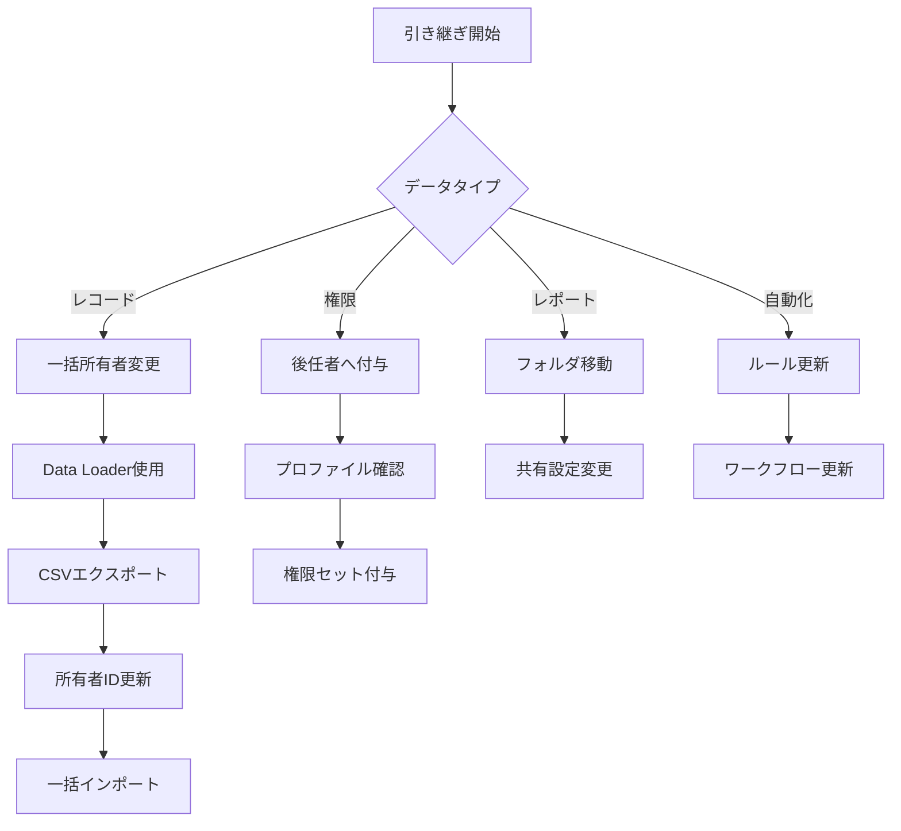

# 退職したユーザーの無効化されたライセンスを扱う方法

## What's this file?
> [!NOTE]
> **How**
> 
> どのようにSalesforceのシステム管理者として退職したユーザーアカウントの無効化されたライセンスを適切に管理・再利用するかについて記載しています。

## Conclusion (忙しいとき向け)
> [!IMPORTANT]
> **How** : どのように退職者のライセンスを管理するか
> 
> **Answer** : ユーザーを無効化してライセンスを即座に解放し、データ移行と監査ログを確保した後、新規ユーザーへ再割り当てする。90日後に完全削除を検討する

## 目次

<details>
<summary>目次を開く</summary>

- [退職者アカウント処理の全体フロー](#退職者アカウント処理の全体フロー)
- [ライセンス管理の基本概念](#ライセンス管理の基本概念)
- [退職時の標準手順](#退職時の標準手順)
- [ライセンスの再利用プロセス](#ライセンスの再利用プロセス)
- [データ保持とコンプライアンス](#データ保持とコンプライアンス)
- [自動化とベストプラクティス](#自動化とベストプラクティス)

</details>

## 退職者アカウント処理の全体フロー

### 処理タイムライン


### 各段階の重要性

| 段階 | 期間 | 主な作業 | 重要度 | リスク |
|------|------|----------|--------|--------|
| **即時対応** | 0日 | アカウント凍結 | 極高 | データ漏洩 |
| **確認期間** | 1-3日 | データ・権限確認 | 高 | 業務影響 |
| **引き継ぎ** | 3-7日 | 所有権移管 | 高 | 業務停滞 |
| **無効化** | 7日後 | ライセンス解放 | 中 | コスト |
| **保管期間** | 30-90日 | 監査対応 | 中 | コンプライアンス |
| **最終処理** | 90日後 | 削除検討 | 低 | ストレージ |

## ライセンス管理の基本概念

### Salesforceライセンスの仕組み

```yaml
ライセンスの状態遷移:
  1. 割り当て済み（アクティブ）:
     - ユーザーがログイン可能
     - 全機能へのアクセス
     - ライセンス消費中
     - コスト発生中
     
  2. 割り当て済み（凍結）:
     - ログイン不可
     - データは保持
     - ライセンス消費継続
     - コスト発生継続
     
  3. 割り当て済み（無効）:
     - ログイン不可
     - データは保持
     - ライセンス解放
     - コスト発生なし
     
  4. 未割り当て:
     - 新規ユーザーへ割り当て可能
     - プール内で待機
     - 即座に利用可能
```

### ライセンスコストの考え方


## 退職時の標準手順

### Step 1: 即時対応（退職当日）


#### 即日実施項目

| タスク | 手順 | 確認事項 | 所要時間 |
|--------|------|----------|----------|
| **1. アカウント凍結** | ユーザー詳細 > 凍結 | 凍結完了確認 | 1分 |
| **2. アクセス確認** | ログイン履歴確認 | 最終アクセス記録 | 2分 |
| **3. 通知設定** | メール転送設定 | 後任者への転送 | 3分 |
| **4. 記録作成** | 退職理由・日付記録 | 監査ログ作成 | 5分 |

### Step 2: データ確認期間（1-3日）

```yaml
確認項目チェックリスト:
  所有レコード:
    - リード: 件数と重要度確認
    - 取引先: アクティブな商談確認
    - 商談: 進行中案件の特定
    - ケース: 未解決ケースの確認
    - カスタムオブジェクト: 業務影響確認
    
  権限と役割:
    - 承認プロセス: 承認待ちアイテム
    - ワークフロー: 実行中のルール
    - 共有設定: 特別な共有ルール
    - チーム設定: 取引先/商談チーム
    
  レポートとダッシュボード:
    - 個人フォルダ: 重要レポート
    - 共有設定: 他ユーザーへの影響
    - スケジュール: 定期配信設定
    
  統合関連:
    - API利用: 外部システム連携
    - SSO設定: シングルサインオン
    - 接続アプリケーション: OAuth設定
```

### Step 3: データ移行と引き継ぎ（3-7日）



### Step 4: ユーザー無効化とライセンス解放

```apex
// 退職者処理の自動化例
public class RetirementProcessor {
    
    public static void processRetiredUser(Id userId, Id newOwnerId) {
        // Step 1: ユーザーを無効化
        User retiredUser = new User(
            Id = userId,
            IsActive = false,
            Title = 'Retired - ' + Date.today()
        );
        update retiredUser;
        
        // Step 2: レコード所有者を一括変更
        transferRecordOwnership(userId, newOwnerId);
        
        // Step 3: 監査ログ作成
        createRetirementAuditLog(userId, newOwnerId);
        
        // Step 4: ライセンス解放通知
        notifyLicenseAvailable(userId);
    }
    
    private static void transferRecordOwnership(Id fromUserId, Id toUserId) {
        // 各オブジェクトのレコードを転送
        List<SObject> recordsToUpdate = new List<SObject>();
        
        // リード
        for(Lead l : [SELECT Id FROM Lead WHERE OwnerId = :fromUserId]) {
            l.OwnerId = toUserId;
            recordsToUpdate.add(l);
        }
        
        // 取引先
        for(Account a : [SELECT Id FROM Account WHERE OwnerId = :fromUserId]) {
            a.OwnerId = toUserId;
            recordsToUpdate.add(a);
        }
        
        // 一括更新
        if(!recordsToUpdate.isEmpty()) {
            update recordsToUpdate;
        }
    }
}
```

## ライセンスの再利用プロセス

### ライセンスプールの管理


### ライセンス最適化戦略

| 戦略 | 実装方法 | 効果 | 推奨度 |
|------|----------|------|--------|
| **定期棚卸し** | 月次でログイン状況確認 | 未使用ライセンス発見 | 必須 |
| **段階的割り当て** | 権限レベルで分類 | コスト最適化 | 高 |
| **共有ライセンス** | チーム単位で管理 | 効率的利用 | 中 |
| **自動回収** | 90日未ログインで無効化 | 自動最適化 | 高 |

### ライセンスタイプ別の考慮事項

```yaml
Salesforceライセンス:
  特徴:
    - フル機能アクセス
    - 最もコストが高い
    - 全オブジェクトアクセス可能
  再利用時の注意:
    - 本当にフル機能が必要か確認
    - Platform Licenseで代替可能か検討
    - 利用頻度を事前評価

Platform License:
  特徴:
    - カスタムアプリのみ
    - コスト効率的
    - 標準CRM機能なし
  適した用途:
    - 承認のみのユーザー
    - データ参照専用
    - 特定業務アプリ利用

Community License:
  特徴:
    - 外部ユーザー向け
    - 大幅にコスト削減
    - 機能制限あり
  使用例:
    - パートナーポータル
    - カスタマーポータル
    - 限定的なアクセス
```

## データ保持とコンプライアンス

### 法的要件への対応


### データ保持ポリシー

| データ種別 | 保持期間 | 保存方法 | アクセス制限 |
|------------|----------|----------|--------------|
| **ログイン履歴** | 2年 | システム内 | 管理者のみ |
| **取引記録** | 7年 | アーカイブ | 監査時のみ |
| **個人情報** | 退職後3年 | 暗号化保存 | 特権管理者 |
| **メール** | 1年 | 別システム | 法務承認要 |
| **活動履歴** | 5年 | 読み取り専用 | 管理者・監査 |

### 監査対応の準備

```yaml
監査時に必要な情報:
  基本情報:
    - 退職日
    - 最終ログイン日時
    - 無効化実施日
    - 実施者名
    
  アクセス記録:
    - ログイン履歴（過去2年分）
    - データエクスポート履歴
    - API利用履歴
    - 異常アクセス記録
    
  変更履歴:
    - 権限変更ログ
    - プロファイル変更
    - 所有レコード移管記録
    - パスワードリセット履歴
    
  承認記録:
    - 退職承認文書
    - データ削除承認
    - 特別アクセス承認
    - 例外処理記録
```

## 自動化とベストプラクティス

### 退職処理の自動化フロー

```apex
// 退職処理自動化のスケジューラー
global class RetirementScheduler implements Schedulable {
    
    global void execute(SchedulableContext ctx) {
        // 凍結から7日経過したユーザーを無効化
        List<User> usersToDeactivate = [
            SELECT Id, Name, Username
            FROM User
            WHERE IsFrozen = true
            AND Retirement_Date__c <= :Date.today().addDays(-7)
            AND IsActive = true
        ];
        
        for(User u : usersToDeactivate) {
            processRetirement(u);
        }
        
        // 90日経過したユーザーの削除候補リスト作成
        generateDeletionCandidates();
    }
    
    private void processRetirement(User retiredUser) {
        // 無効化処理
        retiredUser.IsActive = false;
        update retiredUser;
        
        // ライセンス解放通知
        sendLicenseNotification(retiredUser);
        
        // 監査ログ
        createAuditLog('Automatic Deactivation', retiredUser.Id);
    }
}
```

### ベストプラクティスチェックリスト

```markdown
## 退職処理ベストプラクティス

### 事前準備（退職1ヶ月前）
- [ ] 後任者の特定と準備
- [ ] 重要データの棚卸し
- [ ] 引き継ぎドキュメント作成
- [ ] 権限移管計画策定

### 退職当日
- [ ] アカウント即時凍結
- [ ] セキュリティキー回収
- [ ] VPNアクセス停止
- [ ] 退職理由の記録

### 退職後1週間
- [ ] データ移管完了確認
- [ ] ユーザー無効化実施
- [ ] ライセンス解放確認
- [ ] 後任者へのトレーニング

### 退職後1ヶ月
- [ ] 監査ログレビュー
- [ ] 異常アクセスチェック
- [ ] データアーカイブ
- [ ] コスト削減効果確認

### 退職後3ヶ月
- [ ] 最終データレビュー
- [ ] 削除可否判定
- [ ] コンプライアンス確認
- [ ] プロセス改善提案
```

### KPIとメトリクス


### 継続的改善

| 改善領域 | 現状の課題 | 改善案 | 期待効果 |
|----------|------------|---------|----------|
| **処理速度** | 手動作業が多い | 自動化ツール導入 | 80%時間削減 |
| **データ品質** | 引き継ぎ漏れ | チェックリスト強化 | エラー50%減 |
| **コスト管理** | ライセンス放置 | 自動回収プロセス | 月額20%削減 |
| **セキュリティ** | 凍結遅延 | リアルタイム連携 | リスク90%減 |

## 関連

- [ユーザー無効化と凍結の違い](2025.08.12.20.47_what_difference_deactivate_freeze_user_salesforce.md)
- [休暇中のログイン防止方法](2025.08.12.20.44_how_prevent_employee_login_during_holiday_salesforce.md)
- [本番環境でのユーザー作成時の考慮事項](2025.08.12.20.19_what_consider_creating_user_production_salesforce.md)
- [Salesforce Help: ユーザーライセンスの管理](https://help.salesforce.com/s/articleView?id=sf.users_licenses_managing.htm&type=5)
- [Salesforce Help: データ保持ポリシー](https://help.salesforce.com/s/articleView?id=sf.data_retention.htm&type=5)
- [Salesforce Trailhead: ユーザー管理のベストプラクティス](https://trailhead.salesforce.com/ja/content/learn/modules/user-management)