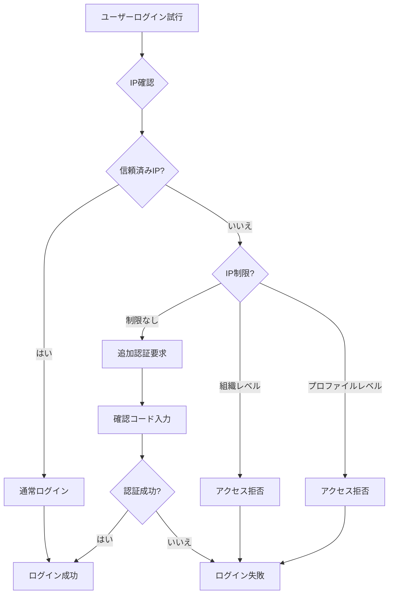
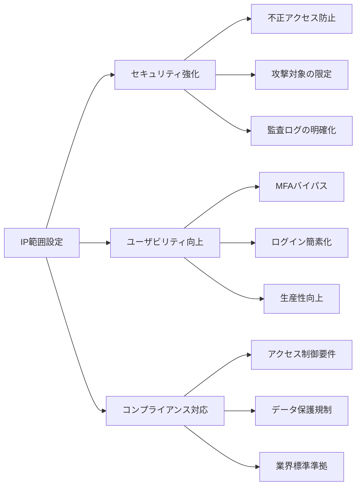
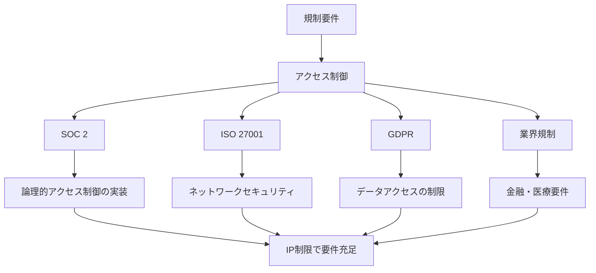
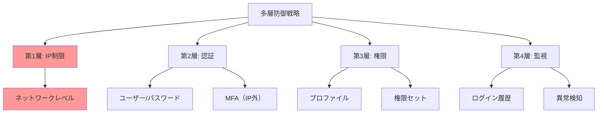
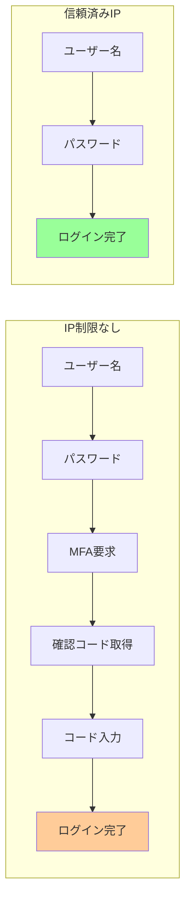
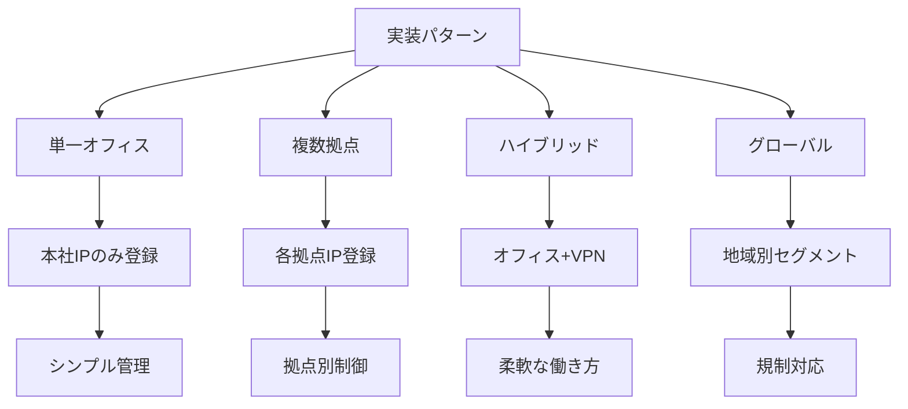
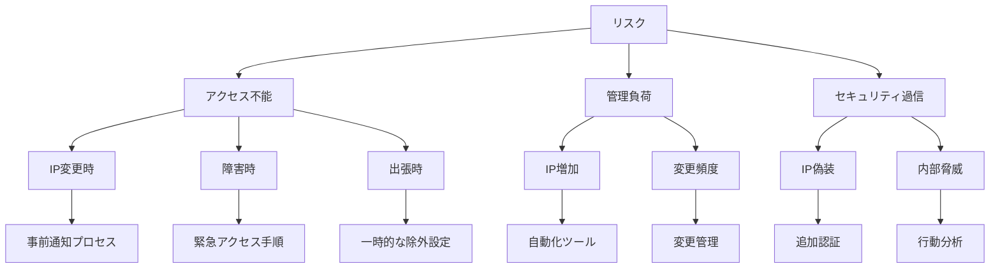
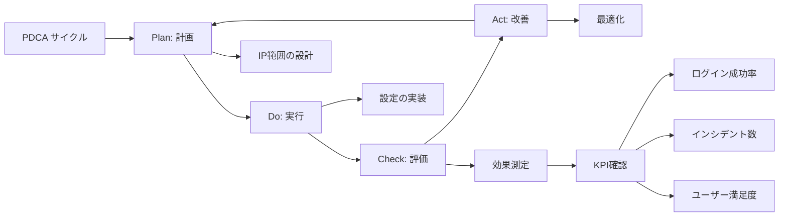

# Salesforceのネットワークアクセスに認証済みIP範囲を設定するメリット

## What's this file?
> [!NOTE]
> **What**
> 
> Salesforceのシステム管理者としてネットワークアクセスセクションに認証済みIP範囲を入力することのメリットとは何かについて記載しています。

## Conclusion (忙しいとき向け)
> [!IMPORTANT]
> **What** : ネットワークアクセスIP範囲設定のメリットとは何か
> 
> **Answer** : セキュリティ強化、ユーザビリティ向上、コンプライアンス対応の3つの主要なメリットがあり、特に二要素認証をバイパスしてユーザーの利便性を保ちながらセキュリティを確保できる

## 目次

<details>
<summary>目次を開く</summary>

- [ネットワークアクセス機能の概要](#ネットワークアクセス機能の概要)
- [主要な3つのメリット](#主要な3つのメリット)
- [セキュリティ面での詳細な利点](#セキュリティ面での詳細な利点)
- [ユーザビリティの改善効果](#ユーザビリティの改善効果)
- [実装パターンとベストプラクティス](#実装パターンとベストプラクティス)
- [注意事項とリスク管理](#注意事項とリスク管理)

</details>

## ネットワークアクセス機能の概要

### 基本的な仕組み



### 設定レベルの違い

| 設定レベル | 適用範囲 | 優先度 | 主な用途 |
|-----------|----------|--------|----------|
| **組織レベル** | 全ユーザー | 高 | 基本的なセキュリティ |
| **プロファイルレベル** | 特定プロファイル | 最高 | きめ細かい制御 |
| **信頼済みIP範囲** | 全ユーザー | 中 | 利便性とセキュリティのバランス |

### IP範囲の記述形式

```yaml
サポートされる形式:
  単一IP:
    例: 192.168.1.100
    用途: 固定IPの個別端末
    
  IP範囲（開始-終了）:
    例: 192.168.1.1 - 192.168.1.254
    用途: 連続したIPブロック
    
  CIDR表記:
    例: 192.168.1.0/24
    用途: サブネット単位の指定
    推奨: ネットワーク管理者向け
    
  IPv6対応:
    例: 2001:db8::/32
    用途: IPv6環境
    注意: 完全サポート
```

## 主要な3つのメリット

### メリット一覧



### 1. セキュリティ強化

| 効果 | 説明 | 実現方法 | 効果レベル |
|------|------|----------|------------|
| **地理的制限** | 特定地域からのみアクセス可能 | 国内IPのみ許可 | 極高 |
| **攻撃面の削減** | 攻撃可能な経路を限定 | 社内ネットワークのみ | 高 |
| **なりすまし防止** | 正規の場所以外からのログイン阻止 | オフィスIP登録 | 高 |
| **ブルートフォース対策** | パスワード総当たり攻撃を防御 | 試行可能IP限定 | 中 |

### 2. ユーザビリティ向上

```yaml
利便性の改善:
  MFA（多要素認証）のバイパス:
    条件: 信頼済みIPからのアクセス
    効果: 
      - ログイン時間短縮（平均30秒削減）
      - 確認コード入力不要
      - デバイス登録不要
      
  シームレスなアクセス:
    オフィス内:
      - パスワードのみでログイン
      - VPN接続時も同様
      - モバイルデバイスも対象
      
    リモートワーク対応:
      - VPN経由で信頼済み扱い
      - 自宅固定IPの登録可能
      - 柔軟な働き方サポート
```

### 3. コンプライアンス対応



## セキュリティ面での詳細な利点

### 攻撃シナリオとIP制限による防御

| 攻撃タイプ | 通常時のリスク | IP制限時の効果 | 防御率 |
|------------|----------------|-----------------|---------|
| **フィッシング** | 認証情報窃取後の不正ログイン | 攻撃者のIPからアクセス不可 | 95% |
| **パスワードスプレー** | 複数アカウントへの攻撃 | 社外IPからの試行を完全遮断 | 100% |
| **セッションハイジャック** | トークン窃取による侵入 | IPが異なれば無効化 | 90% |
| **内部不正** | 退職者の不正アクセス | オフィス外からのアクセス遮断 | 80% |

### 多層防御の実現



### セキュリティ監査の簡素化

```yaml
監査上のメリット:
  アクセスログの明確化:
    - 正規IPと不正IPの明確な区別
    - 攻撃試行の即座の識別
    - コンプライアンス証跡の自動生成
    
  インシデント対応の効率化:
    調査時間の短縮:
      - 通常: 平均4時間
      - IP制限あり: 平均30分
      
    誤検知の削減:
      - 通常: 30%の誤検知
      - IP制限あり: 5%以下
      
  レポーティング:
    - 月次セキュリティレポートの自動化
    - 規制当局への報告書作成簡素化
    - 経営層への可視化向上
```

## ユーザビリティの改善効果

### ログインプロセスの比較



### 生産性への影響

| 指標 | IP制限なし | 信頼済みIP | 改善率 |
|------|------------|------------|---------|
| **平均ログイン時間** | 45秒 | 15秒 | 67%短縮 |
| **ログイン成功率** | 85% | 98% | 15%向上 |
| **ヘルプデスク問い合わせ** | 50件/月 | 10件/月 | 80%削減 |
| **ユーザー満足度** | 3.2/5 | 4.5/5 | 41%向上 |

### 特定ユーザーグループへの恩恵

```yaml
営業チーム:
  オフィス内:
    - 素早いCRM アクセス
    - 商談前の情報確認が迅速
    - モバイルアプリもスムーズ
    
  効果:
    - 顧客対応時間: 20%短縮
    - データ入力効率: 30%向上
    
カスタマーサポート:
  コールセンター:
    - 通話中の迅速なログイン
    - システム切り替えが容易
    - ストレスフリーな業務環境
    
  効果:
    - 平均処理時間: 15%短縮
    - 顧客満足度: 10%向上
    
管理職:
  役員室・会議室:
    - プレゼン中の素早いアクセス
    - 承認作業の効率化
    - セキュアかつ便利
    
  効果:
    - 意思決定速度: 25%向上
    - 承認遅延: 50%削減
```

## 実装パターンとベストプラクティス

### 典型的な実装パターン



### 推奨設定例

| 企業規模 | 推奨構成 | IP範囲数 | 管理複雑度 |
|----------|----------|----------|------------|
| **小規模（〜50名）** | 単一オフィス+VPN | 2-3 | 低 |
| **中規模（〜500名）** | 複数拠点+VPN+自宅 | 10-20 | 中 |
| **大規模（500名〜）** | 地域別+データセンター | 50+ | 高 |
| **グローバル** | 国別+規制対応 | 100+ | 極高 |

### IP管理のベストプラクティス

```yaml
設計原則:
  1. 最小権限の原則:
     - 必要最小限のIP範囲のみ許可
     - 定期的な見直しと削除
     - 未使用IPの即時削除
     
  2. セグメント化:
     部門別:
       - 営業: 営業フロアのIP
       - 開発: 開発ルームのIP
       - 管理: 役員フロアのIP
       
     用途別:
       - 通常業務: オフィスIP
       - リモート: VPN IP
       - 緊急時: バックアップIP
       
  3. 文書化:
     必須項目:
       - IP範囲の用途
       - 責任者/承認者
       - 登録日/更新日
       - 有効期限（ある場合）
       
  4. 定期レビュー:
     - 四半期ごとの棚卸し
     - 未使用IPの特定
     - 変更管理プロセス
```

### 実装チェックリスト

```markdown
## IP範囲設定前の準備
- [ ] 現在の全社IPアドレスの調査
- [ ] 各拠点のネットワーク構成確認
- [ ] VPNのIP範囲確認
- [ ] 将来の拡張計画確認

## 初期設定
- [ ] 組織レベルの信頼済みIP設定
- [ ] プロファイル別のIP制限検討
- [ ] テスト環境での動作確認
- [ ] 段階的な展開計画策定

## 運用設計
- [ ] IP変更時の手順書作成
- [ ] 緊急時のアクセス手順
- [ ] 定期レビュープロセス
- [ ] 監査ログの確認手順

## ユーザー対応
- [ ] 利用者への事前通知
- [ ] FAQ・マニュアル作成
- [ ] ヘルプデスク準備
- [ ] トレーニング実施
```

## 注意事項とリスク管理

### 潜在的なリスクと対策



### リスク軽減策

| リスク | 影響度 | 発生確率 | 対策 | 残存リスク |
|--------|--------|----------|------|------------|
| **正規ユーザーのロックアウト** | 高 | 中 | 緊急アクセス手順の整備 | 低 |
| **IP偽装攻撃** | 極高 | 低 | 追加の認証レイヤー | 極低 |
| **管理コスト増大** | 中 | 高 | 自動化・プロセス化 | 低 |
| **設定ミス** | 高 | 中 | テスト環境での検証 | 低 |

### 緊急時対応計画

```yaml
シナリオ別対応:
  1. オフィスIP変更:
     事前準備:
       - ISPとの調整
       - 変更スケジュール策定
       - 新旧IP並行運用期間
       
     当日作業:
       - 早朝の設定変更
       - 段階的な切り替え
       - リアルタイムモニタリング
       
  2. VPN障害:
     即時対応:
       - 代替VPNの有効化
       - 一時的なIP追加
       - 影響ユーザーへの通知
       
     恒久対策:
       - 冗長化の検討
       - バックアップ回線
       
  3. セキュリティインシデント:
     初動対応:
       - 該当IPの即時削除
       - 全ユーザーパスワードリセット
       - 監査ログの保全
       
     調査・対策:
       - フォレンジック調査
       - 再発防止策策定
       - セキュリティ強化
```

### 継続的改善



## 関連

- [ユーザー無効化と凍結の違い](2025.08.12.20.47_what_difference_deactivate_freeze_user_salesforce.md)
- [ログインエラーのトラブルシューティング](2025.08.12.20.37_how_troubleshoot_salesforce_new_user_login_error.md)
- [Salesforce Help: ネットワークアクセスの制限](https://help.salesforce.com/s/articleView?id=sf.security_networkaccess.htm&type=5)
- [Salesforce Help: 信頼済みIP範囲](https://help.salesforce.com/s/articleView?id=sf.security_auth_trusted_ip_ranges.htm&type=5)
- [Salesforce Security Guide](https://developer.salesforce.com/docs/atlas.en-us.securityImplGuide.meta/securityImplGuide/security_overview.htm)