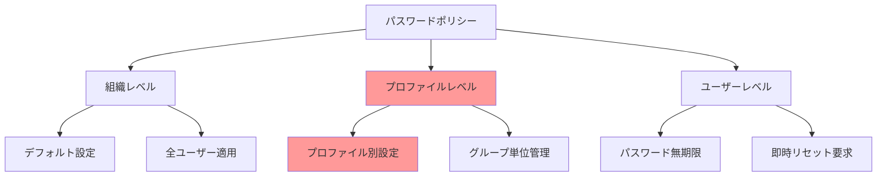
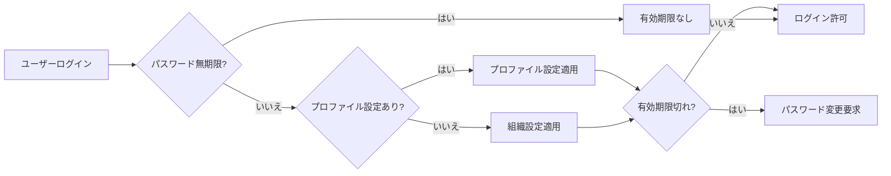
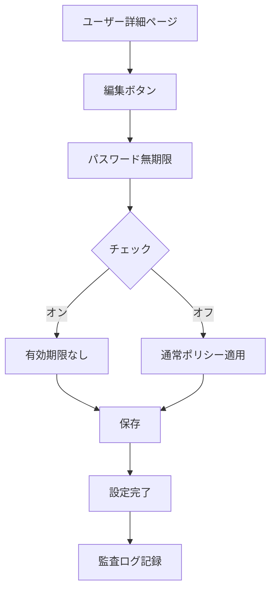
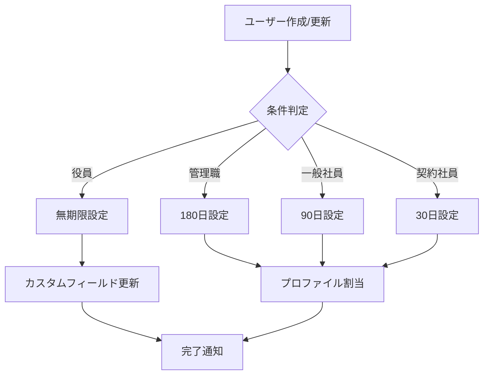
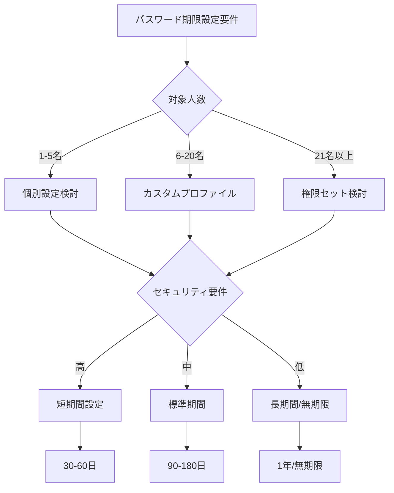
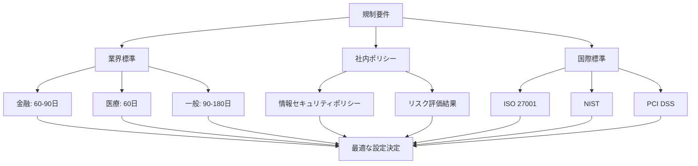

# 特定ユーザーアカウントのパスワード有効期間を設定する方法

## What's this file?
> [!NOTE]
> **How**
> 
> どのようにSalesforceのシステム管理者として特定のユーザーアカウントに対してパスワード有効期間を個別に設定するかについて記載しています。

## Conclusion (忙しいとき向け)
> [!IMPORTANT]
> **How** : どのように特定ユーザーのパスワード有効期間を設定するか
> 
> **Answer** : プロファイルレベルで設定するのが基本だが、個別ユーザーには「パスワード無期限」オプションまたはカスタムプロファイル/権限セットで対応する

## 目次

<details>
<summary>目次を開く</summary>

- [パスワードポリシーの基本構造](#パスワードポリシーの基本構造)
- [設定可能なレベルと優先順位](#設定可能なレベルと優先順位)
- [特定ユーザーへの個別設定方法](#特定ユーザーへの個別設定方法)
- [実装パターンとユースケース](#実装パターンとユースケース)
- [運用上の考慮事項](#運用上の考慮事項)
- [セキュリティとコンプライアンス](#セキュリティとコンプライアンス)

</details>

## パスワードポリシーの基本構造

### Salesforceのパスワード管理階層



### パスワード有効期間の設定項目

| 設定レベル | 設定場所 | 設定可能な値 | 適用優先度 |
|-----------|----------|-------------|------------|
| **組織全体** | セキュリティ > パスワードポリシー | 30/60/90/180日/1年/無期限 | 低 |
| **プロファイル** | 各プロファイル設定 | 組織設定を上書き可能 | 高 |
| **個別ユーザー** | ユーザー詳細 | パスワード無期限のみ | 最高 |

### 現在の設定確認方法

```yaml
確認手順:
  1. 組織レベルの確認:
     パス: 設定 > セキュリティ > パスワードポリシー
     確認項目:
       - ユーザーパスワードの有効期限
       - パスワード履歴の制限
       - パスワードの複雑さ要件
       
  2. プロファイルレベルの確認:
     パス: 設定 > プロファイル > [対象プロファイル]
     確認項目:
       - パスワードポリシー
       - ログイン時間
       - IPアドレス制限
       
  3. ユーザーレベルの確認:
     パス: 設定 > ユーザ > [対象ユーザー]
     確認項目:
       - パスワード無期限のチェック状態
       - 最終パスワード変更日
       - 次回パスワード変更予定日
```

## 設定可能なレベルと優先順位

### 設定の優先順位フロー



### 各レベルの特徴と制限

```yaml
組織レベル:
  メリット:
    - 一括管理が容易
    - 標準的なセキュリティ確保
    - 設定が簡単
  制限:
    - 柔軟性が低い
    - 例外対応が困難
    - 全ユーザー一律
    
プロファイルレベル:
  メリット:
    - グループ単位で管理
    - 役割に応じた設定
    - バランスの良い管理
  制限:
    - プロファイル数の制限
    - 個別対応は不可
    - 設定の複雑化
    
ユーザーレベル:
  メリット:
    - 個別対応可能
    - 即座に反映
    - 例外処理に最適
  制限:
    - 無期限のみ設定可能
    - 管理が煩雑
    - セキュリティリスク
```

## 特定ユーザーへの個別設定方法

### 方法1: パスワード無期限の設定



#### 詳細手順

| ステップ | 操作内容 | 確認事項 | 注意点 |
|----------|----------|----------|--------|
| 1. アクセス | 設定 > ユーザ > ユーザ | 管理者権限 | - |
| 2. 検索 | 対象ユーザーを検索 | 正しいユーザー | 同姓同名注意 |
| 3. 編集 | 編集ボタンクリック | 編集権限 | - |
| 4. 設定 | 「パスワード無期限」チェック | セキュリティポリシー | リスク確認 |
| 5. 保存 | 保存ボタン | エラーなし | 理由を記録 |

### 方法2: カスタムプロファイルの作成

```yaml
手順:
  1. 既存プロファイルのクローン:
     - 対象ユーザーの現在のプロファイルを選択
     - 「クローン」ボタンをクリック
     - 新しい名前を付与（例：営業_パスワード180日）
     
  2. パスワードポリシーの設定:
     - クローンしたプロファイルを編集
     - パスワードポリシーセクションへ
     - 希望の有効期間を設定
     
  3. ユーザーへの割り当て:
     - 対象ユーザーの編集画面
     - プロファイルを新しいものに変更
     - 保存して適用
     
メリット:
  - 柔軟な期間設定
  - グループ化可能
  - 監査しやすい
  
デメリット:
  - プロファイル数増加
  - 管理の複雑化
  - ライセンス制限
```

### 方法3: Apexトリガーによる自動延長

```apex
// パスワード有効期限の自動延長トリガー
trigger ExtendPasswordExpiry on User (before update) {
    
    Set<Id> targetUsers = new Set<Id>();
    
    // 特定条件のユーザーを識別
    for(User u : Trigger.new) {
        User oldUser = Trigger.oldMap.get(u.Id);
        
        // 特定部門のマネージャー等の条件
        if(u.UserRole.Name.contains('Manager') && 
           u.Department == 'Executive') {
            targetUsers.add(u.Id);
        }
    }
    
    // パスワード期限の延長処理
    if(!targetUsers.isEmpty()) {
        List<User> usersToUpdate = [
            SELECT Id, LastPasswordChangeDate 
            FROM User 
            WHERE Id IN :targetUsers
        ];
        
        for(User u : usersToUpdate) {
            // カスタム項目で次回変更日を管理
            u.Next_Password_Change__c = Date.today().addDays(180);
        }
    }
}
```

### 方法4: フローによる条件付き設定



## 実装パターンとユースケース

### 典型的なユースケース

| ユーザータイプ | 推奨設定 | 設定方法 | 理由 |
|---------------|----------|----------|------|
| **システム管理者** | 90日 | プロファイル | セキュリティ重視 |
| **役員・経営層** | 無期限 | 個別設定 | 利便性優先 |
| **一般従業員** | 90-180日 | 組織デフォルト | バランス型 |
| **外部ユーザー** | 30日 | プロファイル | 高セキュリティ |
| **統合ユーザー** | 無期限 | 個別設定 | システム連携 |
| **共有アカウント** | 30日 | プロファイル | リスク管理 |

### 部門別設定パターン

```yaml
営業部門:
  設定: 90日
  理由:
    - 外出が多くモバイル利用
    - 顧客情報へのアクセス
    - 適度なセキュリティ
    
IT部門:
  設定: 60日
  理由:
    - 高権限アクセス
    - システム管理権限
    - セキュリティ意識高
    
経理部門:
  設定: 90日
  理由:
    - 財務データアクセス
    - 定期的な更新必要
    - コンプライアンス
    
カスタマーサポート:
  設定: 180日
  理由:
    - 頻繁なログイン
    - 業務効率重視
    - 限定的な権限
```

### 実装の判断フロー



## 運用上の考慮事項

### パスワード期限管理のベストプラクティス

```markdown
## 定期レビューチェックリスト

### 月次確認
- [ ] パスワード無期限ユーザーのリスト確認
- [ ] 期限切れ間近のユーザー通知
- [ ] 異常なパスワード変更パターン
- [ ] ロックアウトユーザーの確認

### 四半期レビュー
- [ ] プロファイル設定の妥当性
- [ ] 部門別パスワードポリシー評価
- [ ] セキュリティインシデントとの相関
- [ ] ユーザー満足度調査

### 年次見直し
- [ ] 全体ポリシーの改定検討
- [ ] 業界標準との比較
- [ ] 規制要件の変更確認
- [ ] 次年度計画策定
```

### 事前通知の自動化

```apex
// パスワード期限切れ事前通知
public class PasswordExpiryNotification {
    
    @InvocableMethod(label='パスワード期限通知' 
                     description='期限切れ前にユーザーへ通知')
    public static void sendExpiryNotifications() {
        
        // 通知対象の日数
        Integer[] notifyDays = new Integer[]{30, 14, 7, 3, 1};
        
        for(Integer days : notifyDays) {
            List<User> targetUsers = [
                SELECT Id, Email, Name, LastPasswordChangeDate,
                       Profile.PasswordExpires
                FROM User
                WHERE IsActive = true
                AND LastPasswordChangeDate != null
                AND DAY_ONLY(LastPasswordChangeDate) = 
                    DAY_ONLY(Date.today().addDays(-days))
            ];
            
            for(User u : targetUsers) {
                sendNotification(u, days);
            }
        }
    }
    
    private static void sendNotification(User u, Integer daysRemaining) {
        // メール通知の送信
        Messaging.SingleEmailMessage mail = new Messaging.SingleEmailMessage();
        mail.setToAddresses(new String[]{u.Email});
        mail.setSubject('パスワード有効期限のお知らせ');
        mail.setPlainTextBody(
            u.Name + ' 様\n\n' +
            'パスワードの有効期限まで残り ' + daysRemaining + ' 日です。\n' +
            '期限切れ前にパスワードを変更してください。'
        );
        Messaging.sendEmail(new Messaging.SingleEmailMessage[]{mail});
    }
}
```

### トラブルシューティング

| 問題 | 原因 | 解決方法 | 予防策 |
|------|------|----------|--------|
| **頻繁な期限切れ** | 期間が短すぎる | 期間延長を検討 | ユーザーフィードバック収集 |
| **パスワード忘れ** | 複雑すぎる要件 | 要件緩和検討 | パスワードマネージャー推奨 |
| **ロックアウト多発** | 変更タイミング集中 | 段階的な期限設定 | 部門別にずらす |
| **無期限の乱用** | 管理不足 | 定期監査実施 | 承認プロセス導入 |

## セキュリティとコンプライアンス

### 規制要件との整合性



### リスク評価マトリックス

| ユーザータイプ | アクセスレベル | データ機密性 | 推奨期限 | リスクレベル |
|---------------|---------------|-------------|----------|-------------|
| システム管理者 | フルアクセス | 極高 | 30-60日 | 極高 |
| データ管理者 | データ全般 | 高 | 60-90日 | 高 |
| 一般ユーザー | 限定的 | 中 | 90-180日 | 中 |
| 閲覧専用 | 参照のみ | 低 | 180日-1年 | 低 |
| 統合アカウント | API | 高 | 無期限+他の対策 | 特殊 |

### セキュリティ強化オプション

```yaml
パスワード以外の対策:
  多要素認証（MFA）:
    - パスワード期限を延長可能
    - セキュリティレベル維持
    - ユーザビリティ向上
    
  シングルサインオン（SSO）:
    - 企業のAD連携
    - 一元管理
    - パスワード管理の簡素化
    
  リスクベース認証:
    - 異常検知
    - 動的な制御
    - AIによる分析
    
  生体認証:
    - パスワードレス
    - 高セキュリティ
    - ユーザー満足度向上
```

### 監査とレポーティング

```apex
// パスワードポリシー監査レポート
public class PasswordPolicyAudit {
    
    public static void generateAuditReport() {
        
        // 統計情報の収集
        Map<String, Object> stats = new Map<String, Object>();
        
        // パスワード無期限ユーザー
        Integer indefiniteUsers = [
            SELECT COUNT() 
            FROM User 
            WHERE IsActive = true 
            AND PasswordNeverExpires = true
        ];
        stats.put('indefinitePasswordUsers', indefiniteUsers);
        
        // プロファイル別の設定
        List<AggregateResult> profileStats = [
            SELECT Profile.Name, COUNT(Id) userCount
            FROM User
            WHERE IsActive = true
            GROUP BY Profile.Name
        ];
        stats.put('profileDistribution', profileStats);
        
        // 期限切れ間近のユーザー
        Integer expiringUsers = [
            SELECT COUNT()
            FROM User
            WHERE IsActive = true
            AND LastPasswordChangeDate < :Date.today().addDays(-83)
        ];
        stats.put('soonToExpire', expiringUsers);
        
        // レポート生成
        generateReport(stats);
    }
}
```

### コンプライアンス文書テンプレート

```markdown
## パスワードポリシー例外申請書

### 申請者情報
- 氏名: _______________
- 部門: _______________
- 役職: _______________
- 申請日: _______________

### 例外申請内容
- [ ] パスワード無期限設定
- [ ] 期限延長（現行: ___日 → 希望: ___日）
- [ ] その他: _______________

### 申請理由
- [ ] 業務上の必要性
- [ ] システム連携要件
- [ ] その他の技術的理由

### リスク軽減策
- [ ] 多要素認証の使用
- [ ] IPアドレス制限
- [ ] 定期的なアクセスレビュー
- [ ] その他: _______________

### 承認
- 直属上司: _______________ 日付: _______________
- IT管理者: _______________ 日付: _______________
- セキュリティ責任者: _______________ 日付: _______________
```

## 関連

- [ネットワークアクセスIP範囲設定のメリット](2025.08.12.21.05_what_benefits_network_access_ip_range_salesforce.md)
- [ログインエラーのトラブルシューティング](2025.08.12.20.37_how_troubleshoot_salesforce_new_user_login_error.md)
- [ユーザー無効化と凍結の違い](2025.08.12.20.47_what_difference_deactivate_freeze_user_salesforce.md)
- [Salesforce Help: パスワードポリシーの設定](https://help.salesforce.com/s/articleView?id=sf.security_password_policies.htm&type=5)
- [Salesforce Help: ユーザーパスワードの管理](https://help.salesforce.com/s/articleView?id=sf.users_passwords.htm&type=5)
- [Salesforce Security Guide: パスワード管理のベストプラクティス](https://developer.salesforce.com/docs/atlas.en-us.securityImplGuide.meta/securityImplGuide/security_password_mgmt.htm)