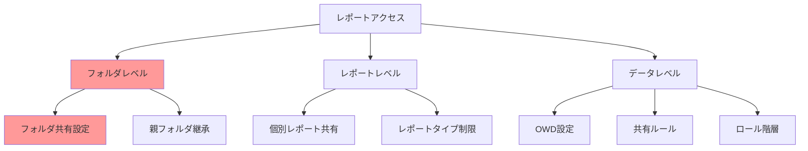
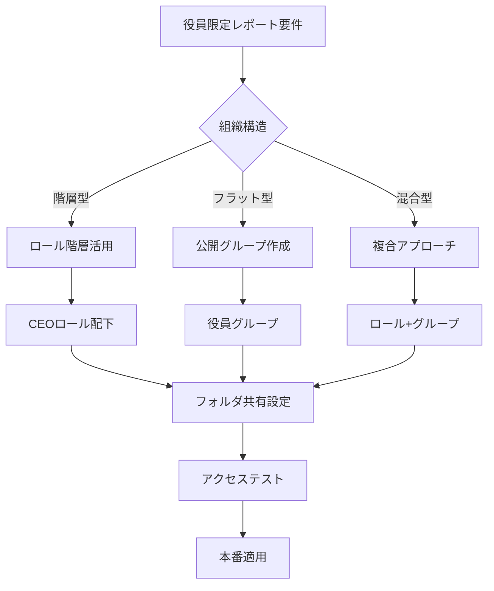
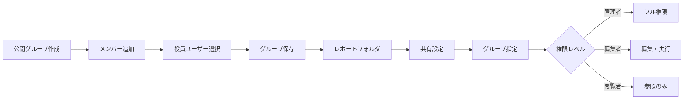
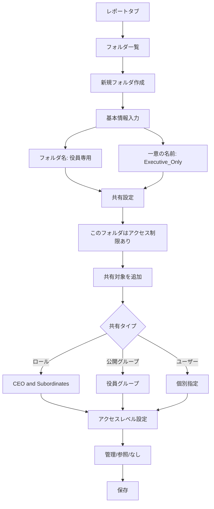
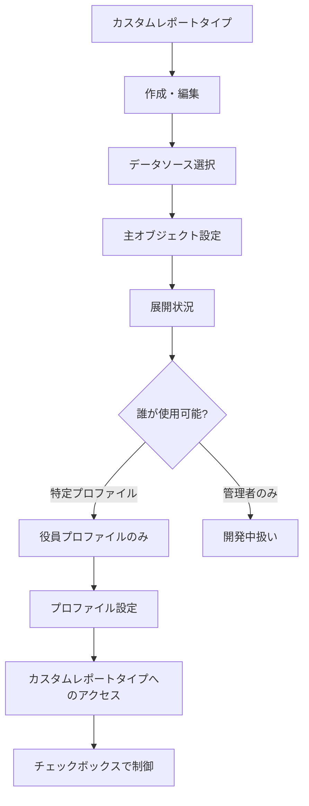
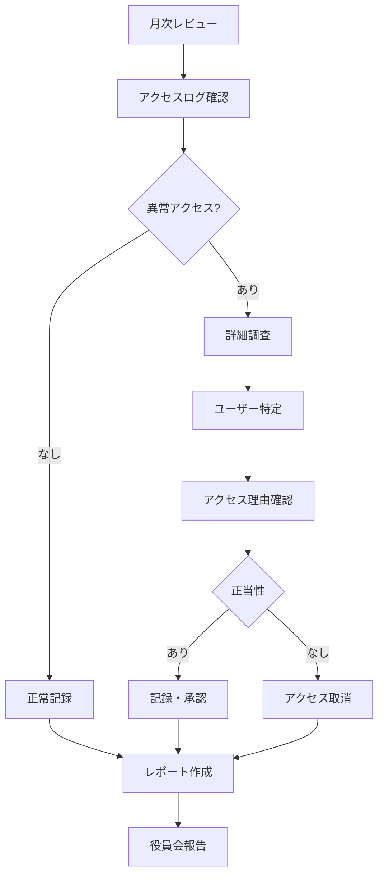
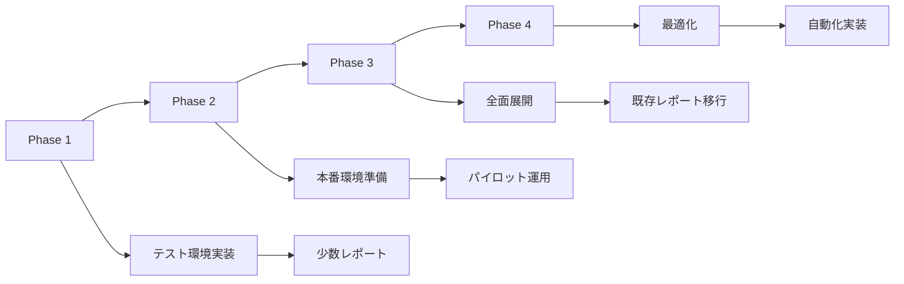

# レポートの閲覧を役員メンバーのみに制限する設定方法

## What's this file?
> [!NOTE]
> **How**
> 
> どのようにSalesforceのシステム管理者として重要なレポートの閲覧権限を役員メンバーのみに制限するかについて記載しています。

## Conclusion (忙しいとき向け)
> [!IMPORTANT]
> **How** : どのようにレポートを役員限定にするか
> 
> **Answer** : レポートフォルダの共有設定で役員ロールまたは公開グループを指定し、他のアクセスをすべて削除。追加でレポートタイプやダッシュボードも制限する

## 目次

<details>
<summary>目次を開く</summary>

- [レポート共有の基本構造](#レポート共有の基本構造)
- [役員限定アクセスの実装方法](#役員限定アクセスの実装方法)
- [フォルダレベルでの制限設定](#フォルダレベルでの制限設定)
- [追加のセキュリティ強化策](#追加のセキュリティ強化策)
- [監査とモニタリング](#監査とモニタリング)
- [ベストプラクティスと注意事項](#ベストプラクティスと注意事項)

</details>

## レポート共有の基本構造

### Salesforceのレポートアクセス階層



### アクセス制御の優先順位

| レベル | 制御方法 | 優先度 | 効果範囲 |
|--------|----------|--------|----------|
| **フォルダ共有** | フォルダの共有設定 | 最高 | フォルダ内全レポート |
| **レポートタイプ** | カスタムレポートタイプ | 高 | 特定データソース |
| **オブジェクト権限** | プロファイル/権限セット | 高 | データアクセス |
| **レコードアクセス** | OWD/共有ルール | 中 | 個別レコード |
| **項目レベル** | 項目レベルセキュリティ | 低 | 特定項目 |

### レポートフォルダの種類

```yaml
フォルダタイプ:
  パブリックフォルダ:
    特徴:
      - 組織全体で共有可能
      - 柔軟な権限設定
      - 管理者が作成
    用途: 一般的な業務レポート
    
  非公開フォルダ:
    特徴:
      - 作成者のみアクセス
      - 共有不可
      - 個人使用
    用途: 個人分析
    
  共有フォルダ:
    特徴:
      - 特定ユーザー/グループと共有
      - 細かい権限制御
      - 最も柔軟
    用途: 部門別・役職別レポート
```

## 役員限定アクセスの実装方法

### 実装アプローチの選択



### 方法1: ロール階層を使用した制限

```yaml
設定手順:
  1. ロール階層の確認:
     - CEO/社長ロールの存在確認
     - 役員ロールの階層位置
     - 他部門との関係性
     
  2. 役員専用フォルダの作成:
     パス: レポート > 新規フォルダ
     設定:
       名前: 役員専用レポート
       説明: 役員のみアクセス可能な機密レポート
       
  3. 共有設定:
     アクセスレベル:
       - CEOロール: 管理
       - 役員ロール: 参照・実行
       - その他: アクセスなし
```

### 方法2: 公開グループによる制限



#### 公開グループ作成の詳細

| ステップ | 操作内容 | 設定値 | 注意点 |
|----------|----------|--------|--------|
| 1. グループ作成 | 設定 > ユーザ > 公開グループ | - | 管理者権限必要 |
| 2. 名前設定 | グループ名入力 | 「役員メンバー」 | 分かりやすい名前 |
| 3. メンバー選択 | ユーザー追加 | 役員全員 | 定期更新必要 |
| 4. 階層設定 | 階層の使用 | 「アクセス権を下位へ」オフ | 重要 |
| 5. 保存 | 保存ボタン | - | 即時反映 |

### 方法3: 権限セットによる追加制御

```apex
// 役員専用レポートアクセス権限の自動付与
public class ExecutiveReportAccess {
    
    public static void grantExecutiveAccess(List<User> executives) {
        // 権限セットの取得
        PermissionSet execPermSet = [
            SELECT Id 
            FROM PermissionSet 
            WHERE Name = 'Executive_Report_Access'
            LIMIT 1
        ];
        
        List<PermissionSetAssignment> assignments = new List<PermissionSetAssignment>();
        
        for(User exec : executives) {
            // 既存の割り当てチェック
            Integer existing = [
                SELECT COUNT() 
                FROM PermissionSetAssignment
                WHERE AssigneeId = :exec.Id
                AND PermissionSetId = :execPermSet.Id
            ];
            
            if(existing == 0) {
                assignments.add(new PermissionSetAssignment(
                    AssigneeId = exec.Id,
                    PermissionSetId = execPermSet.Id
                ));
            }
        }
        
        if(!assignments.isEmpty()) {
            insert assignments;
        }
    }
}
```

## フォルダレベルでの制限設定

### 詳細な共有設定手順



### フォルダ共有マトリックス

| ユーザータイプ | アクセスレベル | 可能な操作 | 推奨設定理由 |
|---------------|---------------|------------|--------------|
| **CEO/社長** | 管理 | 全操作可能 | 最高責任者 |
| **役員** | 参照・実行 | 閲覧・実行・エクスポート | 情報活用 |
| **役員秘書** | 参照 | 閲覧のみ | 補助業務 |
| **部長以下** | なし | アクセス不可 | 機密保持 |
| **システム管理者** | 管理 | 全操作可能 | 運用管理 |

### 既存レポートの移行

```yaml
移行手順:
  1. 対象レポートの特定:
     - 財務レポート
     - 経営分析レポート
     - 人事機密レポート
     - M&A関連レポート
     
  2. バックアップ:
     - レポートのエクスポート
     - 設定情報の記録
     - 共有設定のメモ
     
  3. フォルダ移動:
     方法A: ドラッグ&ドロップ
     方法B: レポート編集 > プロパティ > フォルダ変更
     
  4. アクセステスト:
     - 役員アカウントでログイン
     - 一般ユーザーでアクセス不可確認
     - レポート実行確認
```

## 追加のセキュリティ強化策

### レポートタイプの制限



### ダッシュボードの制限

```yaml
ダッシュボード設定:
  実行ユーザー:
    設定: 指定したユーザーとして実行
    対象: システム管理者または役員
    効果: データアクセスを制御
    
  フォルダ共有:
    役員専用フォルダ: 作成済み
    共有設定: レポートと同様
    
  コンポーネント設定:
    レポートソース: 役員専用フォルダのみ
    ドリルダウン: 無効化検討
    
  更新スケジュール:
    頻度: 日次または週次
    通知: 役員メールのみ
```

### 項目レベルセキュリティの活用

| オブジェクト | 機密項目 | 一般ユーザー | 役員 | 設定方法 |
|-------------|----------|-------------|------|----------|
| **商談** | 利益率 | 非表示 | 表示 | FLS |
| **取引先** | 与信限度額 | 非表示 | 表示 | FLS |
| **ユーザー** | 給与情報 | 非表示 | 表示 | カスタム項目+FLS |
| **予算** | 全項目 | オブジェクト非表示 | 全表示 | オブジェクト権限 |

## 監査とモニタリング

### アクセスログの監視

```apex
// レポートアクセス監査クラス
public class ReportAuditMonitor {
    
    @future
    public static void logExecutiveReportAccess(String reportId, String userId) {
        
        // イベントログから実行履歴を取得
        List<ReportEvent> events = [
            SELECT Id, ReportId, UserId, CreatedDate, EventDate
            FROM ReportEvent
            WHERE ReportId = :reportId
            AND CreatedDate = LAST_N_DAYS:7
        ];
        
        // カスタムオブジェクトに記録
        List<Executive_Report_Audit__c> audits = new List<Executive_Report_Audit__c>();
        
        for(ReportEvent evt : events) {
            audits.add(new Executive_Report_Audit__c(
                Report_Id__c = evt.ReportId,
                User__c = evt.UserId,
                Access_Time__c = evt.EventDate,
                Report_Name__c = getReportName(evt.ReportId)
            ));
        }
        
        if(!audits.isEmpty()) {
            insert audits;
        }
    }
    
    private static String getReportName(String reportId) {
        Report r = [SELECT Name FROM Report WHERE Id = :reportId LIMIT 1];
        return r.Name;
    }
}
```

### 定期的なアクセスレビュー



### モニタリングダッシュボード

```yaml
監視項目:
  レポート実行状況:
    - 実行回数（日次/週次/月次）
    - 実行ユーザー一覧
    - 実行時間帯分析
    - エクスポート回数
    
  アクセス異常検知:
    - 通常時間外アクセス
    - 大量データエクスポート
    - 権限外アクセス試行
    - 新規IPからのアクセス
    
  パフォーマンス:
    - レポート実行時間
    - タイムアウト発生率
    - リソース使用状況
    
アラート設定:
  即時通知:
    - 権限外アクセス試行
    - 大量エクスポート（1000件以上）
    - 深夜アクセス（0-6時）
    
  日次サマリー:
    - アクセス統計
    - 異常検知結果
    - パフォーマンス指標
```

## ベストプラクティスと注意事項

### 実装時のチェックリスト

```markdown
## 役員限定レポート実装チェックリスト

### 事前準備
- [ ] 役員メンバーのリスト作成
- [ ] 現在のレポート共有状況確認
- [ ] 影響を受けるユーザーの特定
- [ ] バックアップ計画策定

### 実装作業
- [ ] 役員グループ/ロールの作成
- [ ] レポートフォルダの作成
- [ ] 共有設定の実施
- [ ] 既存レポートの移行

### テスト確認
- [ ] 役員アカウントでのアクセステスト
- [ ] 一般ユーザーでのアクセス拒否確認
- [ ] レポート実行パフォーマンス確認
- [ ] エクスポート機能の動作確認

### 運用準備
- [ ] 監査ログの設定
- [ ] アラート設定
- [ ] 運用手順書の作成
- [ ] 関係者への周知
```

### よくある設定ミスと対策

| 設定ミス | 影響 | 対策 | 確認方法 |
|----------|------|------|----------|
| **階層の使用ON** | 部下もアクセス可能に | 必ずOFFに設定 | テストユーザーで確認 |
| **管理者権限付与過多** | 設定変更リスク | 参照・実行に限定 | 権限マトリックス作成 |
| **フォルダ未指定** | デフォルト共有 | 必ず専用フォルダへ | レポート一覧確認 |
| **監査ログ未設定** | 追跡不可 | 事前に有効化 | イベントログ確認 |

### 段階的実装アプローチ



### 継続的な改善

```yaml
定期レビュー項目:
  月次:
    - アクセスログレビュー
    - 新規役員の追加
    - 退任者の削除
    - パフォーマンス確認
    
  四半期:
    - レポート棚卸し
    - 共有設定の見直し
    - セキュリティ評価
    - ユーザーフィードバック
    
  年次:
    - 全体ポリシー見直し
    - 新技術の評価
    - 監査対応準備
    - 次年度計画
    
改善指標:
  - 不正アクセス試行: 0件維持
  - レポート実行時間: 30秒以内
  - ユーザー満足度: 4.5/5以上
  - 監査指摘事項: 0件
```

### トラブルシューティングガイド

| 症状 | 考えられる原因 | 対処法 | 予防策 |
|------|----------------|---------|---------|
| レポートが見えない | フォルダ共有漏れ | 共有設定確認・追加 | チェックリスト活用 |
| 実行エラー | オブジェクト権限不足 | プロファイル確認 | 事前権限確認 |
| 遅い表示 | データ量過多 | フィルター追加 | 定期的な最適化 |
| エクスポート不可 | 権限レベル不足 | 参照・実行に変更 | 初期設定で考慮 |

## 関連

- [パスワード有効期間の個別設定](2025.08.12.21.13_how_set_password_expiration_specific_user_salesforce.md)
- [ネットワークアクセスIP範囲設定](2025.08.12.21.05_what_benefits_network_access_ip_range_salesforce.md)
- [Salesforce Help: レポートフォルダの共有](https://help.salesforce.com/s/articleView?id=sf.reports_sharing.htm&type=5)
- [Salesforce Help: レポートおよびダッシュボードフォルダ](https://help.salesforce.com/s/articleView?id=sf.reports_folders.htm&type=5)
- [Salesforce Security Guide: レポートセキュリティ](https://developer.salesforce.com/docs/atlas.en-us.securityImplGuide.meta/securityImplGuide/security_reports_dashboards.htm)