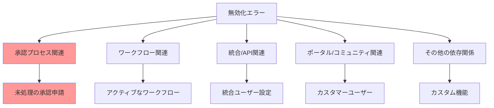
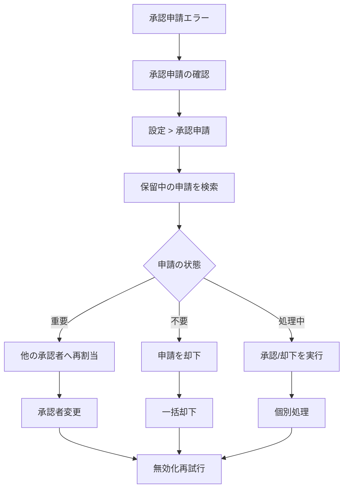
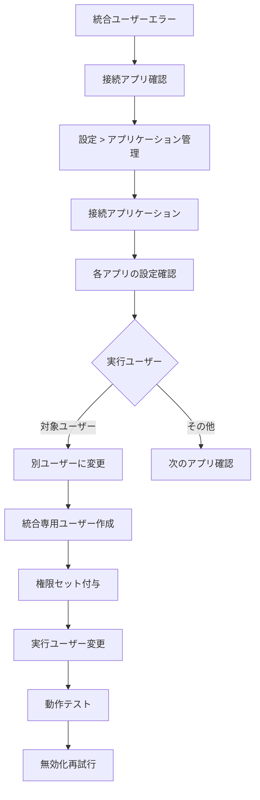
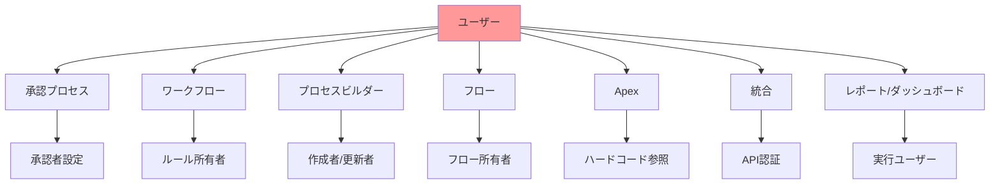
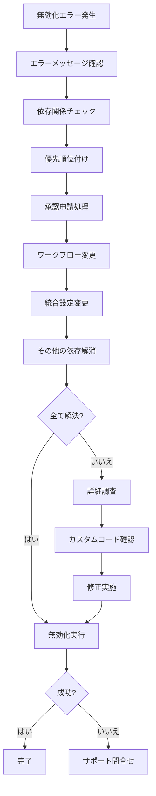
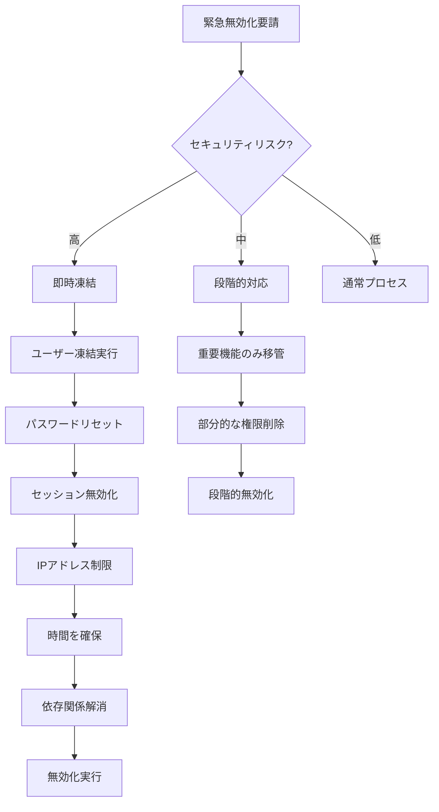

# ユーザーアカウントを無効化できない場合のトラブルシューティング方法

## What's this file?
> [!NOTE]
> **How**
>
> どのようにSalesforceのシステム管理者としてユーザーアカウントを無効化できない問題をトラブルシューティングするかについて記載しています。

## Conclusion (忙しいとき向け)
> [!IMPORTANT]
> **How** : どのように無効化できない問題を解決するか
>
> **Answer** : エラーメッセージから原因を特定し、承認申請・ワークフロー・統合ユーザー・カスタマーユーザーなどの依存関係を順次解消してから無効化を実行する

## 目次

<details>
<summary>目次を開く</summary>

- [よくある無効化エラーの種類](#よくある無効化エラーの種類)
- [エラー別の対処方法](#エラー別の対処方法)
- [システム的な依存関係の確認](#システム的な依存関係の確認)
- [段階的な解決アプローチ](#段階的な解決アプローチ)
- [予防策とベストプラクティス](#予防策とベストプラクティス)
- [緊急時の対応方法](#緊急時の対応方法)

</details>

## よくある無効化エラーの種類

### エラーメッセージの分類



### エラー頻度と影響度

| エラータイプ | 発生頻度 | 影響度 | 解決難易度 | 典型的な原因 |
|-------------|----------|--------|------------|-------------|
| **承認申請保留中** | 極高 | 中 | 低 | 退職時の引き継ぎ漏れ |
| **ワークフロー所有者** | 高 | 高 | 中 | ルール作成者の退職 |
| **統合ユーザー** | 中 | 極高 | 高 | API連携の設定 |
| **カスタマーユーザー** | 中 | 高 | 中 | ポータル管理者 |
| **カスタムApex参照** | 低 | 高 | 高 | ハードコード |
| **デフォルト設定** | 低 | 中 | 低 | 組織のデフォルト |

### エラーメッセージ例

```yaml
一般的なエラーメッセージ:
  承認関連:
    メッセージ: "このユーザには保留中の承認申請があります"
    原因: 承認プロセスで申請が滞留

  ワークフロー関連:
    メッセージ: "このユーザはアクティブなワークフロールールの所有者です"
    原因: ワークフロールールの作成者/更新者として設定

  統合関連:
    メッセージ: "このユーザは統合ユーザとして設定されています"
    原因: 接続アプリケーションやAPIアクセス設定

  コミュニティ関連:
    メッセージ: "このユーザはカスタマーユーザの管理者です"
    原因: Experience Cloudでの管理者設定

  その他:
    メッセージ: "このユーザを無効化できません"
    原因: カスタム機能での参照など
```

## エラー別の対処方法

### 1. 承認申請保留中エラーの解決



#### 承認申請の一括処理

```apex
// 保留中の承認申請を一括処理
public class ApprovalCleanup {

    public static void reassignPendingApprovals(Id oldUserId, Id newUserId) {
        // 保留中の承認申請を取得
        List<ProcessInstanceWorkitem> workItems = [
            SELECT Id, ProcessInstanceId, ActorId
            FROM ProcessInstanceWorkitem
            WHERE ActorId = :oldUserId
        ];

        // 新しい承認者に再割当
        for(ProcessInstanceWorkitem item : workItems) {
            item.ActorId = newUserId;
        }

        if(!workItems.isEmpty()) {
            update workItems;
        }

        System.debug('Reassigned ' + workItems.size() + ' pending approvals');
    }

    // 不要な申請を一括却下
    public static void rejectAllPendingApprovals(Id userId) {
        List<ProcessInstanceWorkitem> workItems = [
            SELECT Id, ProcessInstanceId
            FROM ProcessInstanceWorkitem
            WHERE ActorId = :userId
        ];

        List<Approval.ProcessWorkitemRequest> requests = new List<Approval.ProcessWorkitemRequest>();

        for(ProcessInstanceWorkitem item : workItems) {
            Approval.ProcessWorkitemRequest req = new Approval.ProcessWorkitemRequest();
            req.setWorkitemId(item.Id);
            req.setAction('Reject');
            req.setComments('User deactivation - Auto rejected');
            requests.add(req);
        }

        if(!requests.isEmpty()) {
            Approval.process(requests);
        }
    }
}
```

### 2. ワークフロー所有者エラーの解決

```yaml
解決手順:
  1. 影響を受けるワークフローの特定:
     パス: 設定 > ワークフロールール
     検索: 最終更新者 = 対象ユーザー

  2. 所有者の一括変更:
     方法A: メタデータAPI使用
     方法B: 変更セット
     方法C: 手動更新

  3. 具体的な変更作業:
     - 各ワークフロールールを開く
     - 編集モード
     - 保存（自動的に現在のユーザーが所有者に）

  4. 確認:
     - エラーメッセージの解消
     - ワークフローの動作確認
```

### 3. 統合ユーザーエラーの解決



#### 統合ユーザーのチェックと変更

| 確認箇所 | パス | 変更内容 | 注意事項 |
|----------|------|----------|----------|
| **接続アプリ** | 設定 > アプリケーション管理 > 接続アプリ | 実行ユーザー変更 | API連携影響確認 |
| **外部データソース** | 設定 > 外部データソース | 認証設定変更 | 接続テスト必須 |
| **名前付き認証情報** | 設定 > 名前付き認証情報 | ユーザー変更 | パスワード再設定要 |
| **Apexウェブサービス** | カスタムコード内 | ハードコード修正 | 全環境で変更 |

### 4. カスタマーユーザーエラーの解決

```yaml
Experience Cloud関連の解決:
  1. コミュニティ設定確認:
     - 設定 > デジタルエクスペリエンス > すべてのサイト
     - 各サイトの管理画面へ

  2. 管理者設定の確認:
     - 管理 > メンバー
     - 対象ユーザーのロール確認

  3. 変更作業:
     カスタマーユーザーの管理者変更:
       - 新しい管理者を追加
       - 既存の管理者権限を削除
       - 所有レコードの確認

  4. 関連設定:
     - ポータルロール
     - 共有ルール
     - アクセス権限
```

## システム的な依存関係の確認

### 依存関係の全体像



### 依存関係チェックツール

```apex
// ユーザー依存関係チェッククラス
public class UserDependencyChecker {

    public static Map<String, Integer> checkDependencies(Id userId) {
        Map<String, Integer> dependencies = new Map<String, Integer>();

        // 承認申請
        Integer approvals = [
            SELECT COUNT()
            FROM ProcessInstanceWorkitem
            WHERE ActorId = :userId
        ];
        dependencies.put('PendingApprovals', approvals);

        // ワークフロー（メタデータAPI必要）
        dependencies.put('WorkflowRules', checkWorkflowRules(userId));

        // スケジュール済みジョブ
        Integer scheduledJobs = [
            SELECT COUNT()
            FROM CronTrigger
            WHERE CreatedById = :userId
        ];
        dependencies.put('ScheduledJobs', scheduledJobs);

        // レポート/ダッシュボード
        Integer reports = [
            SELECT COUNT()
            FROM Report
            WHERE OwnerId = :userId
        ];
        dependencies.put('Reports', reports);

        // ダッシュボード
        Integer dashboards = [
            SELECT COUNT()
            FROM Dashboard
            WHERE RunningUserId = :userId
        ];
        dependencies.put('Dashboards', dashboards);

        return dependencies;
    }

    private static Integer checkWorkflowRules(Id userId) {
        // メタデータAPIを使用した実装が必要
        return 0;
    }
}
```

## 段階的な解決アプローチ

### 推奨解決フロー



### チェックリストによる体系的アプローチ

```markdown
## 無効化前チェックリスト

### 基本確認（5分）
- [ ] エラーメッセージの正確な記録
- [ ] ユーザーの役割と権限の確認
- [ ] 最終ログイン日時の確認
- [ ] 関連部門への影響確認

### 承認関連（10分）
- [ ] 保留中の承認申請数確認
- [ ] 重要な申請の特定
- [ ] 代替承認者の決定
- [ ] 一括処理の実行

### ワークフロー関連（20分）
- [ ] 所有ワークフロールール数確認
- [ ] アクティブなルールの特定
- [ ] 所有者変更または無効化
- [ ] テスト実行

### 統合関連（30分）
- [ ] 接続アプリケーション確認
- [ ] API利用状況確認
- [ ] 代替ユーザーの準備
- [ ] 切り替えテスト

### 最終確認（10分）
- [ ] 全エラーの解消確認
- [ ] 影響範囲の最終確認
- [ ] バックアップ計画
- [ ] 無効化実行
```

## 予防策とベストプラクティス

### 事前準備による予防

```yaml
定期的なクリーンアップ:
  月次タスク:
    - 未使用ワークフローの無効化
    - 古い承認申請の処理
    - 統合ユーザーの専用化

  四半期タスク:
    - ユーザー依存関係レポート
    - 不要な権限の削除
    - プロセスの標準化

  年次タスク:
    - 全体的な権限見直し
    - 統合アーキテクチャ改善
    - ドキュメント更新
```

### 設計時の考慮事項

| 機能 | 推奨設計 | 避けるべき設計 | 理由 |
|------|----------|----------------|------|
| **承認プロセス** | キューや役割使用 | 個人指定 | 異動・退職対応 |
| **ワークフロー** | 共有所有者 | 個人作成 | 保守性 |
| **統合** | 専用統合ユーザー | 個人アカウント | 可用性 |
| **レポート** | 共有フォルダ | 個人フォルダ | アクセス性 |
| **スケジュールジョブ** | システム管理者 | 一般ユーザー | 継続性 |

### 自動化による予防

```apex
// 退職前チェックバッチ
global class PreDeactivationCheck implements Database.Batchable<sObject> {

    global Database.QueryLocator start(Database.BatchableContext BC) {
        // 30日以上ログインしていないユーザーを対象
        return Database.getQueryLocator([
            SELECT Id, Name, LastLoginDate
            FROM User
            WHERE IsActive = true
            AND LastLoginDate < LAST_N_DAYS:30
        ]);
    }

    global void execute(Database.BatchableContext BC, List<User> scope) {
        List<Deactivation_Check__c> checks = new List<Deactivation_Check__c>();

        for(User u : scope) {
            Map<String, Integer> deps = UserDependencyChecker.checkDependencies(u.Id);

            Deactivation_Check__c check = new Deactivation_Check__c(
                User__c = u.Id,
                Check_Date__c = Date.today(),
                Pending_Approvals__c = deps.get('PendingApprovals'),
                Workflow_Rules__c = deps.get('WorkflowRules'),
                Reports_Owned__c = deps.get('Reports'),
                Has_Dependencies__c = hasDependencies(deps)
            );
            checks.add(check);
        }

        insert checks;
    }

    global void finish(Database.BatchableContext BC) {
        // 結果をメールで通知
    }

    private Boolean hasDependencies(Map<String, Integer> deps) {
        for(Integer count : deps.values()) {
            if(count > 0) return true;
        }
        return false;
    }
}
```

## 緊急時の対応方法

### 即座に無効化が必要な場合



### 緊急対応プロトコル

```yaml
レベル1 - 即時対応（5分以内）:
  アクション:
    1. ユーザー凍結
    2. パスワード強制リセット
    3. アクティブセッション終了
    4. IP制限追加（可能なら）

  効果:
    - ログイン完全阻止
    - 実行中処理は継続
    - データは保持

レベル2 - 短期対応（1時間以内）:
  アクション:
    1. 重要な承認申請の処理
    2. APIアクセスの停止
    3. 主要ワークフローの所有者変更

  効果:
    - 業務継続性確保
    - セキュリティ強化

レベル3 - 完全対応（24時間以内）:
  アクション:
    1. 全依存関係の解消
    2. ユーザー無効化
    3. 監査ログ作成
    4. 関係者への通知
```

### トラブルシューティングツール

```apex
// 緊急無効化サポートツール
public class EmergencyDeactivationTool {

    // 強制的に依存関係を解消
    public static void forceClearDependencies(Id userId) {
        // トランザクション制御
        Savepoint sp = Database.setSavepoint();

        try {
            // 承認申請の強制却下
            rejectAllApprovals(userId);

            // レポート/ダッシュボードの所有者変更
            transferReportsAndDashboards(userId);

            // その他のクリーンアップ
            additionalCleanup(userId);

            System.debug('Dependencies cleared for user: ' + userId);

        } catch(Exception e) {
            Database.rollback(sp);
            throw new DeactivationException(
                'Failed to clear dependencies: ' + e.getMessage()
            );
        }
    }

    private static void rejectAllApprovals(Id userId) {
        // 実装は前述の通り
    }

    private static void transferReportsAndDashboards(Id userId) {
        // システム管理者に一時的に移管
        User admin = [
            SELECT Id
            FROM User
            WHERE Profile.Name = 'システム管理者'
            AND IsActive = true
            LIMIT 1
        ];

        List<Report> reports = [
            SELECT Id FROM Report WHERE OwnerId = :userId
        ];

        for(Report r : reports) {
            r.OwnerId = admin.Id;
        }

        update reports;
    }
}
```

## 関連

- [ユーザー無効化と凍結の違い](2025.08.12.20.47_what_difference_deactivate_freeze_user_salesforce.md)
- [退職者ライセンスの管理](2025.08.12.20.56_how_handle_retired_user_license_salesforce.md)
- [ログインエラーのトラブルシューティング](2025.08.12.20.37_how_troubleshoot_salesforce_new_user_login_error.md)
- [Salesforce Help: ユーザーの無効化に関する考慮事項](https://help.salesforce.com/s/articleView?id=sf.users_deactivate_considerations.htm&type=5)
- [Salesforce Help: 承認プロセスの管理](https://help.salesforce.com/s/articleView?id=sf.approvals_manage.htm&type=5)
- [Salesforce Developer Guide: ユーザー管理のベストプラクティス](https://developer.salesforce.com/docs/atlas.en-us.api.meta/api/sforce_api_objects_user.htm)
