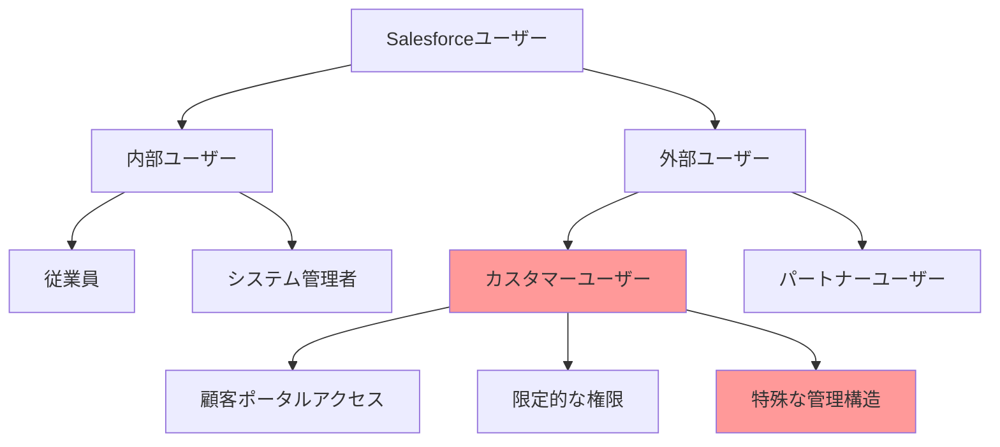
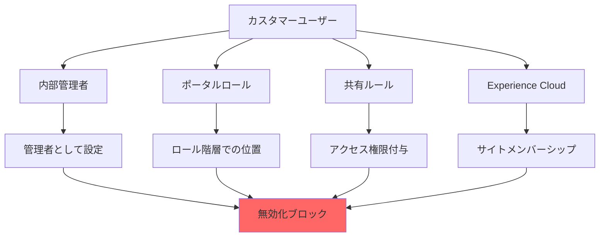
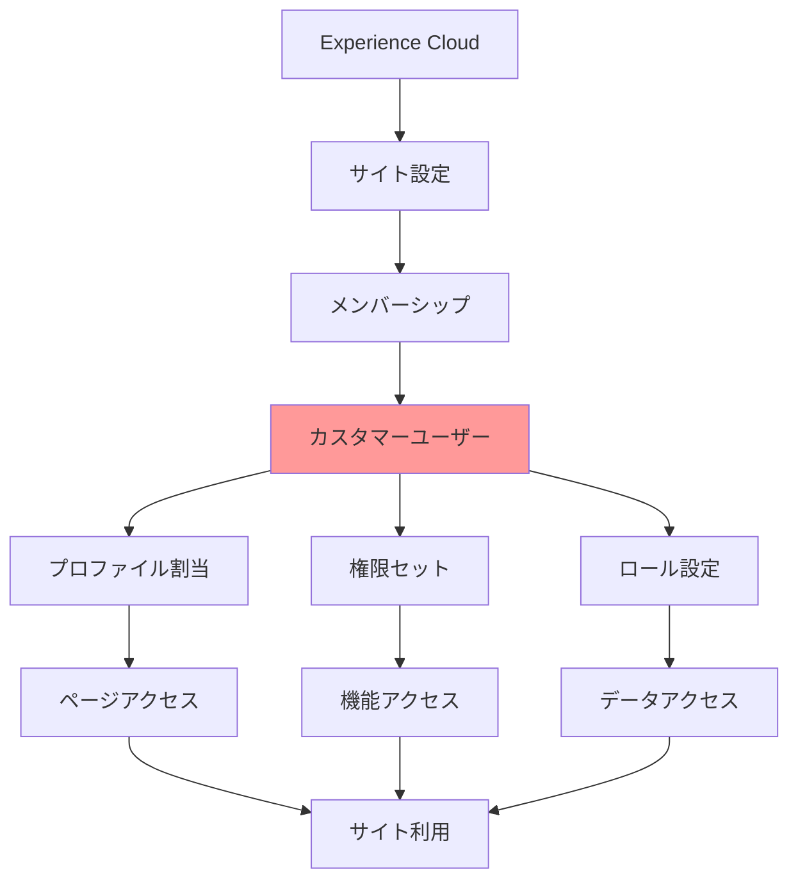
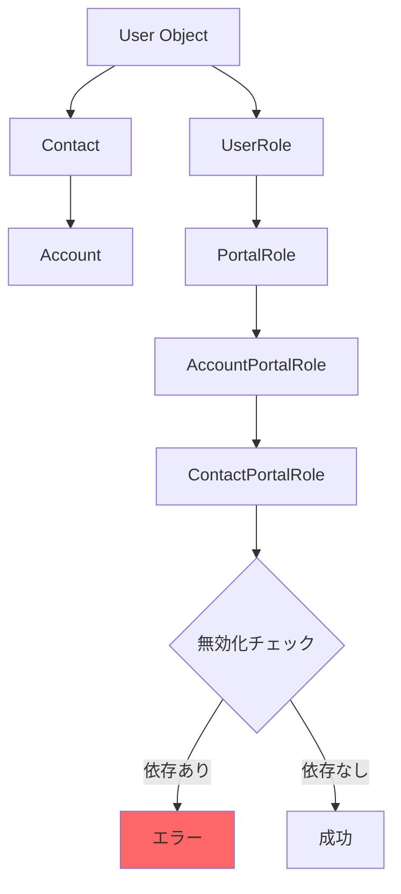
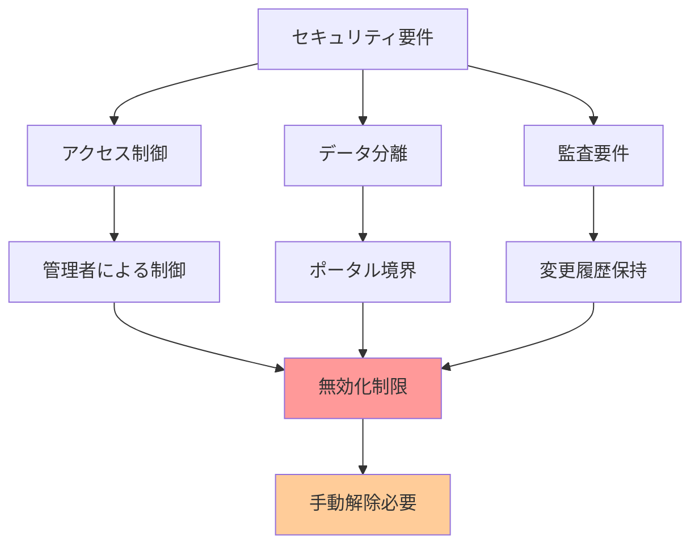
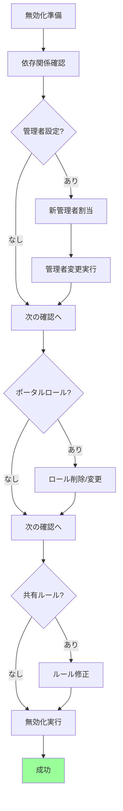

# なぜカスタマーユーザーアカウントを無効化できないのか

## What's this file?
> [!NOTE]
> **Why**
>
> **なぜ**Salesforceのシステム管理者としてカスタマーユーザーアカウントを無効化しようとするとエラーになるのかについて記載しています。

## Conclusion (忙しいとき向け)
> [!IMPORTANT]
> **Why** : **なぜ**カスタマーユーザーアカウントの無効化がエラーになるのか
>
> **Answer** : カスタマーユーザーは内部ユーザーの管理者設定、ポータルロール、共有ルール、Experience Cloudサイトとの複雑な依存関係があり、これらを解消しないと無効化できないため

## 目次
<details>
<summary>目次を開く</summary>

- [カスタマーユーザーの特殊性](#カスタマーユーザーの特殊性)
- [無効化を妨げる依存関係](#無効化を妨げる依存関係)
- [Experience Cloudアーキテクチャとの関係](#experience-cloudアーキテクチャとの関係)
- [技術的な制約と理由](#技術的な制約と理由)
- [セキュリティとライセンスの考慮事項](#セキュリティとライセンスの考慮事項)
- [解決のための前提条件](#解決のための前提条件)

</details>

## カスタマーユーザーの特殊性

### 内部ユーザーとカスタマーユーザーの違い



### カスタマーユーザーの管理構造

| 要素 | 内部ユーザー | カスタマーユーザー | 影響度 |
|------|--------------|-------------------|---------|
| **管理者設定** | 独立 | 内部ユーザーに依存 | 極高 |
| **ロール階層** | 組織ロール | ポータルロール | 高 |
| **共有設定** | 標準共有ルール | 特殊な共有モデル | 高 |
| **ライセンス** | ユーザーライセンス | Customer Community | 中 |
| **データアクセス** | 広範囲 | 制限付き | 高 |

### 管理者依存の仕組み

```yaml
カスタマーユーザーの管理構造:
  管理者設定:
    - 各カスタマーユーザーは内部ユーザーが管理
    - 管理者は複数のカスタマーユーザーを管理可能
    - 管理者がアクティブでないと操作不可

  依存関係:
    直接的:
      - ユーザー管理者（User.ManagerId）
      - アカウント所有者
      - 取引先責任者所有者

    間接的:
      - ポータルロール階層
      - 共有ルール
      - アクセス権限
```

## 無効化を妨げる依存関係

### 主要な依存関係マップ



### エラーメッセージの種類と原因

```yaml
典型的なエラーメッセージ:
  管理者関連:
    メッセージ: "このユーザーはカスタマーユーザーの管理者です"
    原因:
      - 他のカスタマーユーザーの管理者として設定
      - 管理者フィールドでの参照

  ポータルロール関連:
    メッセージ: "ポータルユーザーが存在します"
    原因:
      - アクティブなポータルロール
      - ロール階層での依存

  共有ルール関連:
    メッセージ: "共有ルールで参照されています"
    原因:
      - カスタマーユーザー共有ルール
      - 手動共有設定

  サイト関連:
    メッセージ: "Experience Cloudサイトのメンバーです"
    原因:
      - サイトメンバーシップ
      - コミュニティ権限
```

### 依存関係の連鎖

| レベル | 依存要素 | 解消の難易度 | 影響範囲 |
|--------|----------|--------------|----------|
| **レベル1** | サイトメンバーシップ | 低 | 個別サイト |
| **レベル2** | 共有ルール | 中 | データアクセス |
| **レベル3** | ポータルロール | 高 | 階層全体 |
| **レベル4** | 管理者設定 | 極高 | 複数ユーザー |

## Experience Cloudアーキテクチャとの関係

### カスタマーユーザーとExperience Cloud



### サイトとユーザーの結合

```yaml
Experience Cloud構造:
  サイトレベル:
    - サイトごとのメンバー管理
    - プロファイル別アクセス制御
    - カスタムページ権限

  ユーザーレベル:
    - 個別のログイン権限
    - コミュニティニックネーム
    - 最終アクセス追跡

  結合の強さ:
    強結合要素:
      - ログインアクセス
      - データ可視性
      - 機能利用権限

    弱結合要素:
      - UI設定
      - 個人設定
      - 通知設定
```

## 技術的な制約と理由

### データモデルの制約



### システム設計上の理由

| 制約事項 | 技術的理由 | ビジネス影響 | 回避策の有無 |
|----------|------------|--------------|---------------|
| **管理者必須** | データアクセス制御 | 顧客情報保護 | なし |
| **ロール階層** | 共有モデル実装 | 適切な可視性 | 一部可能 |
| **ライセンス管理** | 課金モデル | コスト最適化 | なし |
| **監査証跡** | コンプライアンス | 規制対応 | なし |

### Salesforceプラットフォームの設計思想

```yaml
設計原則:
  セキュリティファースト:
    - 最小権限の原則
    - 明示的な権限付与
    - 監査可能性の確保

  データ整合性:
    - 参照整合性の維持
    - カスケード削除の防止
    - 孤立データの防止

  マルチテナント考慮:
    - リソース分離
    - パフォーマンス保護
    - 公平なリソース配分
```

## セキュリティとライセンスの考慮事項

### セキュリティ上の制約



### ライセンスモデルの影響

```yaml
ライセンス構造:
  Customer Community:
    特徴:
      - 内部ユーザーに紐付く
      - 使用量ベース課金
      - 機能制限あり

    無効化への影響:
      - ライセンス数の管理
      - 使用状況の追跡
      - 再割当の制御

  Customer Community Plus:
    特徴:
      - より高度な機能
      - 個別ライセンス
      - 拡張権限

    無効化への影響:
      - より複雑な依存関係
      - 追加の確認事項
      - 移行の困難さ
```

### コンプライアンス要件

| 要件 | 内容 | カスタマーユーザーへの影響 | 対応必要性 |
|------|------|---------------------------|-------------|
| **データ保持** | 一定期間の保持義務 | 無効化後もデータ保持 | 必須 |
| **アクセスログ** | 監査証跡の維持 | 全アクセス履歴記録 | 必須 |
| **個人情報保護** | GDPR等への対応 | 削除権の考慮 | 状況による |
| **変更管理** | 承認プロセス | 無効化も承認対象 | 推奨 |

## 解決のための前提条件

### 無効化を可能にする手順



### 必要な事前作業チェックリスト

```markdown
## カスタマーユーザー無効化前チェックリスト

### 管理者関連
- [ ] 管理下のカスタマーユーザー確認
- [ ] 新しい管理者の選定
- [ ] 管理者変更の実行
- [ ] 変更後の動作確認

### ポータルロール関連
- [ ] 現在のロール確認
- [ ] ロール階層への影響確認
- [ ] ロールの削除または変更
- [ ] 共有設定への影響確認

### Experience Cloud関連
- [ ] サイトメンバーシップ確認
- [ ] アクセス権限の確認
- [ ] メンバーシップ削除
- [ ] サイト機能への影響確認

### データとアクセス
- [ ] 所有レコードの確認
- [ ] 共有ルールの確認
- [ ] 手動共有の確認
- [ ] データ移行の必要性判断
```

### 段階的アプローチの推奨

```yaml
推奨手順:
  Phase 1 - 調査（1-2時間）:
    - 全依存関係の洗い出し
    - 影響範囲の特定
    - リスク評価

  Phase 2 - 準備（2-4時間）:
    - 代替管理者の準備
    - 権限移行計画
    - バックアップ作成

  Phase 3 - 実行（1-2時間）:
    - 管理者変更
    - ロール調整
    - 共有ルール修正

  Phase 4 - 確認（30分）:
    - 無効化実行
    - 影響確認
    - ドキュメント更新
```

## 関連

- [ユーザーアカウントを無効化できない場合のトラブルシューティング](2025.08.12.21.32_how_troubleshoot_cannot_deactivate_user_salesforce.md)
- [ユーザー無効化と凍結の違い](2025.08.12.20.47_what_difference_deactivate_freeze_user_salesforce.md)
- [Service Cloudユーザーライセンスの割り当て方法](2025.08.12.20.12_how_assign_service_cloud_user_license_salesforce.md)
- [Salesforce Help: カスタマーユーザーの管理](https://help.salesforce.com/s/articleView?id=sf.networks_customer_user_mgmt.htm&type=5)
- [Salesforce Help: Experience Cloudユーザー](https://help.salesforce.com/s/articleView?id=sf.networks_users.htm&type=5)
- [Salesforce Developer Guide: ポータルユーザー管理](https://developer.salesforce.com/docs/atlas.en-us.api.meta/api/sforce_api_objects_user.htm)
