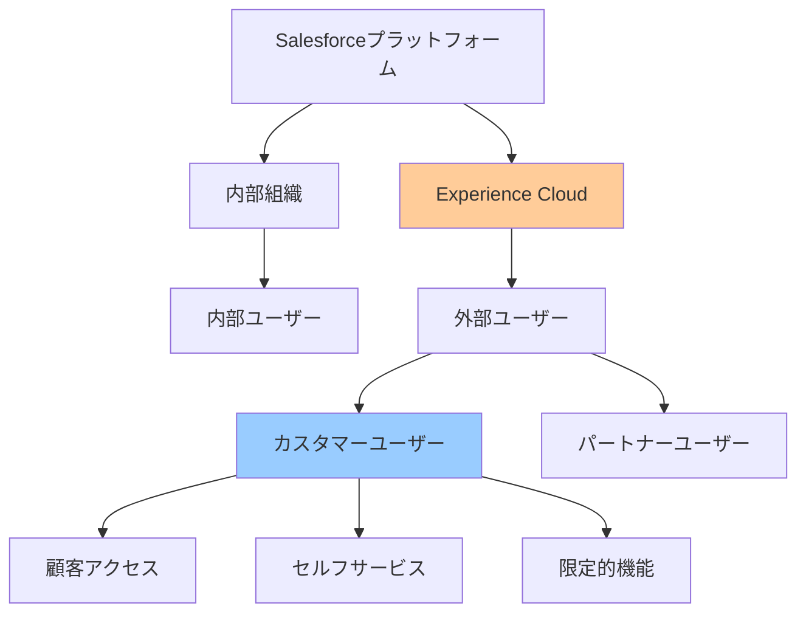
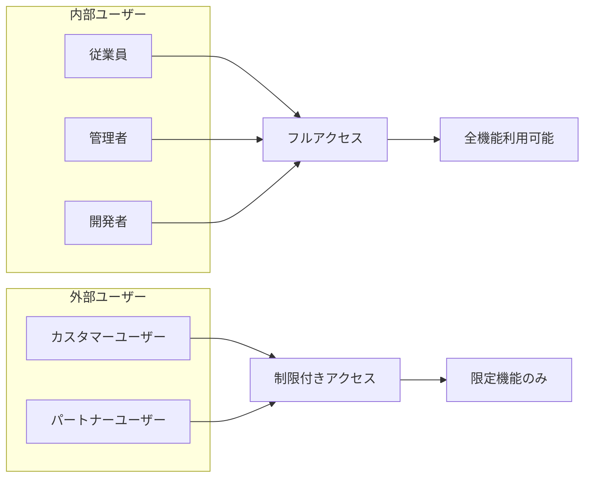
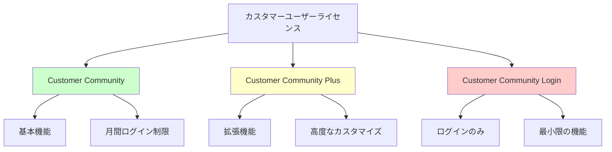
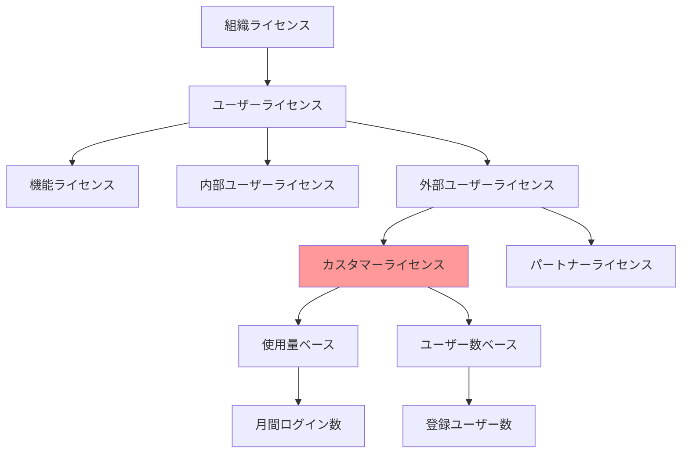
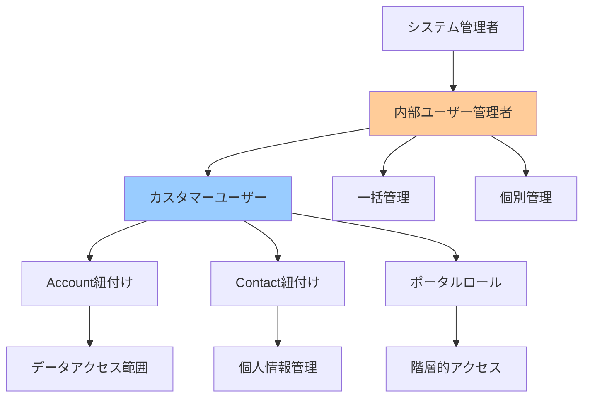
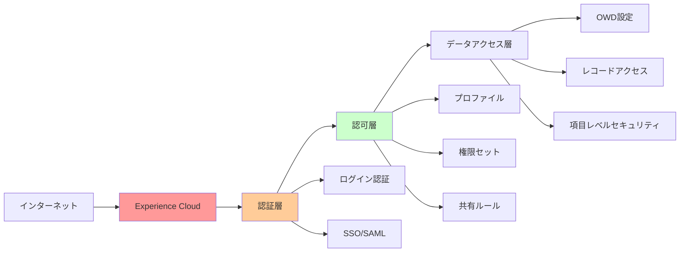
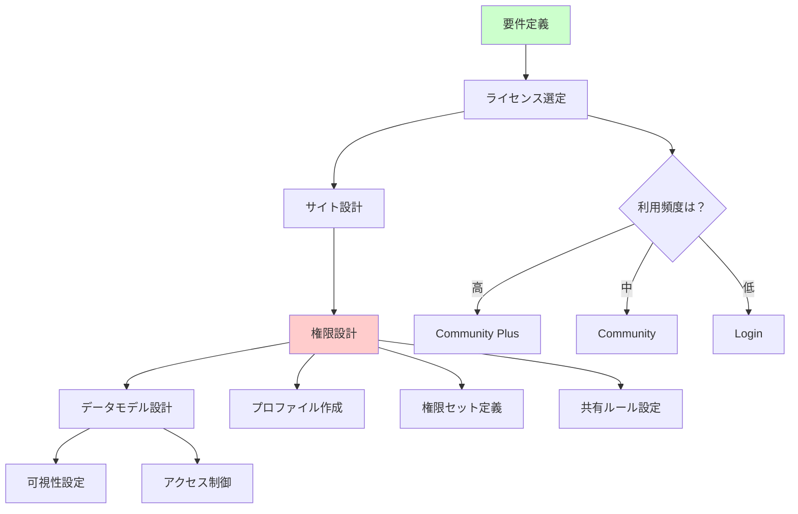

# Salesforceのカスタマーユーザーアカウントとは

## What's this file?
> [!NOTE]
> **What**
> 
> Salesforceのカスタマーユーザーアカウントとは何かについて記載しています。

## Conclusion (忙しいとき向け)
> [!IMPORTANT]
> **What** : カスタマーユーザーアカウントとは何か
> 
> **Answer** : 外部の顧客がExperience Cloud（旧Community Cloud）サイトを通じてSalesforceの限定的な機能にアクセスするための特殊なユーザーアカウントで、内部ユーザーと異なる管理構造とライセンス体系を持つ

## 目次

<details>
<summary>目次を開く</summary>

- [カスタマーユーザーの基本概念](#カスタマーユーザーの基本概念)
- [内部ユーザーとの違い](#内部ユーザーとの違い)
- [カスタマーユーザーの種類と特徴](#カスタマーユーザーの種類と特徴)
- [ライセンスモデルと制限](#ライセンスモデルと制限)
- [管理構造とアーキテクチャ](#管理構造とアーキテクチャ)
- [利用シナリオとユースケース](#利用シナリオとユースケース)

</details>

## カスタマーユーザーの基本概念

### カスタマーユーザーの定義



### カスタマーユーザーの基本特性

| 特性 | 説明 | 内部ユーザーとの違い |
|------|------|---------------------|
| **アクセス方法** | Experience Cloudサイト経由 | Salesforce直接ログイン |
| **データ可視性** | 自社関連データのみ | 組織全体のデータ |
| **機能範囲** | 限定的な機能セット | フル機能アクセス |
| **ライセンスコスト** | 低コスト | 高コスト |
| **管理方法** | 内部ユーザーが管理 | 独立管理 |

### Experience Cloudとの関係

```yaml
Experience Cloud（旧Community Cloud）:
  概要:
    - 外部ユーザー向けポータル作成プラットフォーム
    - カスタマイズ可能なユーザーエクスペリエンス
    - セキュアなデータ共有環境
    
  カスタマーユーザーの役割:
    - サイトへのログインと利用
    - 限定的なSalesforce機能へのアクセス
    - セルフサービスポータルの活用
    
  主な用途:
    - カスタマーサポート
    - 注文管理
    - ナレッジベース
    - コミュニティフォーラム
```

## 内部ユーザーとの違い

### ユーザータイプの比較



### 主要な相違点

```yaml
アクセス権限:
  内部ユーザー:
    - 全オブジェクトへのアクセス可能
    - 管理機能の利用
    - API完全アクセス
    - 開発ツール使用可能
    
  カスタマーユーザー:
    - 許可されたオブジェクトのみ
    - 管理機能なし
    - API制限あり
    - 開発ツール使用不可
    
データ可視性:
  内部ユーザー:
    - 組織全体のデータ
    - 全顧客情報
    - レポート・ダッシュボード作成
    
  カスタマーユーザー:
    - 自社関連データのみ
    - 個人/自社情報
    - 事前定義レポートのみ
```

### 機能制限の詳細

| 機能カテゴリ | 内部ユーザー | カスタマーユーザー | 制限理由 |
|-------------|--------------|-------------------|----------|
| **オブジェクトアクセス** | 全オブジェクト | 選択的オブジェクト | セキュリティ |
| **レコード作成** | 無制限 | 制限あり | ライセンス制約 |
| **ワークフロー実行** | 可能 | 一部可能 | リソース保護 |
| **カスタマイズ** | 完全可能 | 不可 | システム保護 |
| **API呼び出し** | 高制限 | 低制限 | パフォーマンス |

## カスタマーユーザーの種類と特徴

### ライセンスタイプ別分類



### 各ライセンスタイプの詳細

```yaml
Customer Community:
  特徴:
    - 基本的なセルフサービス機能
    - ケース管理
    - ナレッジベースアクセス
    
  制限:
    - 月間ログイン数制限
    - カスタムオブジェクト: 10個まで
    - 共有ルール: 限定的
    
  価格: 低コスト
  
Customer Community Plus:
  特徴:
    - 高度な機能セット
    - レポート・ダッシュボード
    - ワークフロー利用可能
    
  制限:
    - より緩い制限
    - カスタムオブジェクト: 100個まで
    - 高度な共有ルール
    
  価格: 中コスト
  
Customer Community Login:
  特徴:
    - 認証のみ
    - 最小限のデータアクセス
    - 基本的な閲覧機能
    
  制限:
    - 非常に限定的
    - カスタムオブジェクト: 使用不可
    - 共有ルール: 最小限
    
  価格: 最低コスト
```

### 機能比較マトリックス

| 機能 | Community | Community Plus | Login |
|------|-----------|----------------|-------|
| **ケース管理** | ✓ | ✓ | 閲覧のみ |
| **ナレッジベース** | ✓ | ✓ | ✓ |
| **カスタムオブジェクト** | 10 | 100 | 0 |
| **レポート作成** | ✗ | ✓ | ✗ |
| **ワークフロー** | 制限付き | ✓ | ✗ |
| **API アクセス** | 制限付き | ✓ | ✗ |
| **月間ログイン** | 制限あり | 無制限 | 制限あり |

## ライセンスモデルと制限

### ライセンス構造



### 制限事項の詳細

```yaml
オブジェクトレベル制限:
  標準オブジェクト:
    - Account: 読み取り専用
    - Contact: 自分のレコードのみ
    - Case: 作成・編集可能
    - Opportunity: アクセス不可（通常）
    
  カスタムオブジェクト:
    Community: 最大10個
    Community Plus: 最大100個
    Login: 使用不可
    
API制限:
  日次制限:
    Community: 200回/ユーザー
    Community Plus: 1000回/ユーザー
    Login: API使用不可
    
ストレージ制限:
  ファイルストレージ:
    Community: 2GB/ユーザー
    Community Plus: 2GB/ユーザー
    Login: 最小限
```

### ガバナー制限

| 制限項目 | 内部ユーザー | カスタマーユーザー | 影響 |
|----------|--------------|-------------------|------|
| **SOQL クエリ** | 100 | 100 | 同等 |
| **DML ステートメント** | 150 | 150 | 同等 |
| **CPU 時間** | 10秒 | 10秒 | 同等 |
| **ヒープサイズ** | 6MB | 3MB | 制限あり |
| **同時リクエスト** | 高 | 低 | パフォーマンス影響 |

## 管理構造とアーキテクチャ

### カスタマーユーザーの管理階層



### データモデルとの関係

```yaml
必須の関連付け:
  Account（取引先）:
    - すべてのカスタマーユーザーは取引先に紐付く
    - 取引先単位でのデータ分離
    - 取引先階層によるアクセス制御
    
  Contact（取引先責任者）:
    - 1対1の関係で紐付け必須
    - 個人情報の管理単位
    - ログイン情報の保持
    
  User（ユーザー）:
    - Contactから生成
    - 認証情報の管理
    - 権限セットの割り当て
    
管理者の役割:
  内部ユーザー（管理者）:
    - カスタマーユーザーの作成・編集
    - パスワードリセット
    - アクセス権限の管理
    - アクティブ/非アクティブ切り替え
```

### セキュリティアーキテクチャ



## 利用シナリオとユースケース

### 典型的な利用パターン

```yaml
B2Cシナリオ:
  カスタマーサポート:
    - ケースの作成と追跡
    - ナレッジベース検索
    - サポートチケット管理
    
  セルフサービスポータル:
    - 注文履歴確認
    - 請求書ダウンロード
    - アカウント情報更新
    
  コミュニティフォーラム:
    - 質問投稿
    - 回答共有
    - ベストプラクティス共有
    
B2Bシナリオ:
  パートナーポータル:
    - 見積もり確認
    - 契約管理
    - 共同作業スペース
    
  ディーラーポータル:
    - 在庫確認
    - 発注管理
    - 販売レポート閲覧
```

### 業界別活用例

| 業界 | 主な用途 | カスタマーユーザーの役割 | 必要なライセンス |
|------|----------|-------------------------|-----------------|
| **小売** | ECサイト連携 | 注文確認、返品処理 | Community |
| **金融** | オンラインバンキング | 口座照会、取引確認 | Community Plus |
| **製造** | サプライチェーン | 在庫確認、発注 | Community Plus |
| **ヘルスケア** | 患者ポータル | 予約、診療履歴 | Community Plus |
| **教育** | 学生ポータル | 成績確認、課題提出 | Community |

### 実装のベストプラクティス



## 関連

- [なぜカスタマーユーザーアカウントを無効化できないのか](2025.08.12.21.46_why_cannot_disable_customeruser_account_salesforce.md)
- [ユーザーアカウントを無効化できない場合のトラブルシューティング](2025.08.12.21.32_how_troubleshoot_cannot_deactivate_user_salesforce.md)
- [Service Cloudユーザーライセンスの割り当て方法](2025.08.12.20.12_how_assign_service_cloud_user_license_salesforce.md)
- [Salesforce Help: Experience Cloudの概要](https://help.salesforce.com/s/articleView?id=sf.networks_overview.htm&type=5)
- [Salesforce Help: カスタマーユーザーライセンス](https://help.salesforce.com/s/articleView?id=sf.users_license_types_communities.htm&type=5)
- [Salesforce Developer Guide: External User Management](https://developer.salesforce.com/docs/atlas.en-us.communities_dev.meta/communities_dev/)