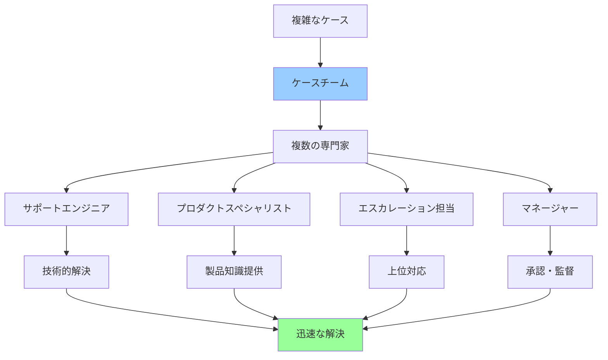
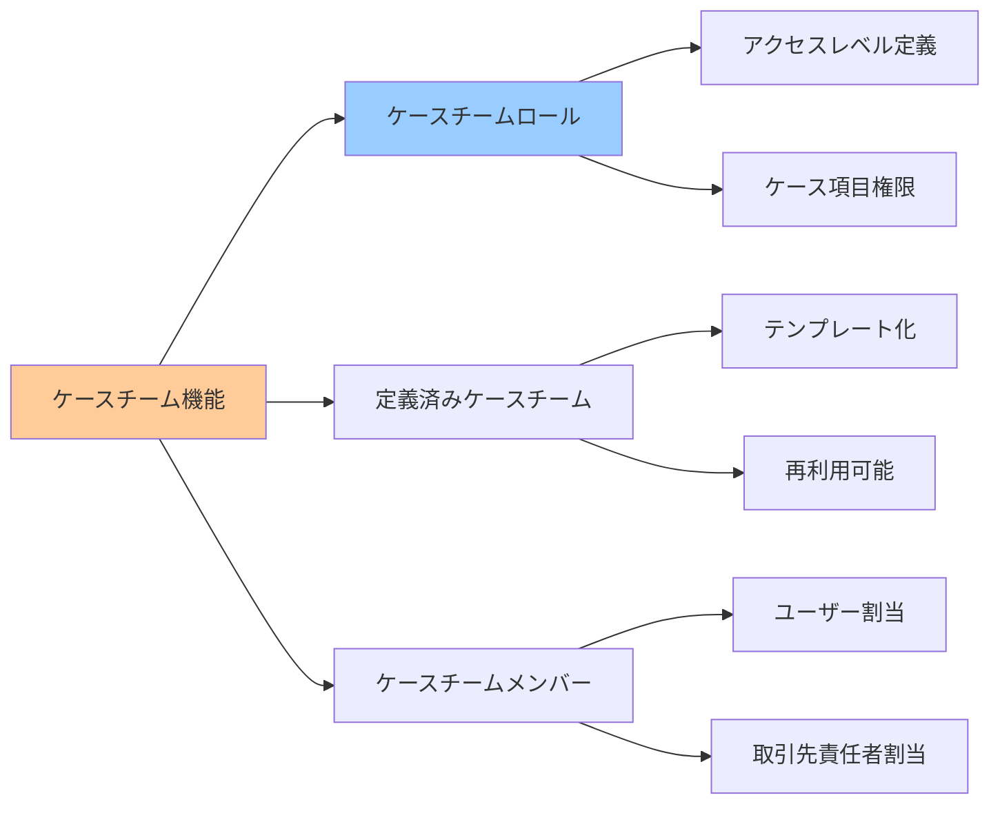
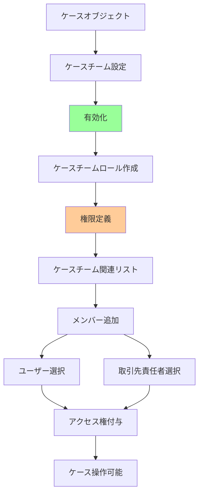
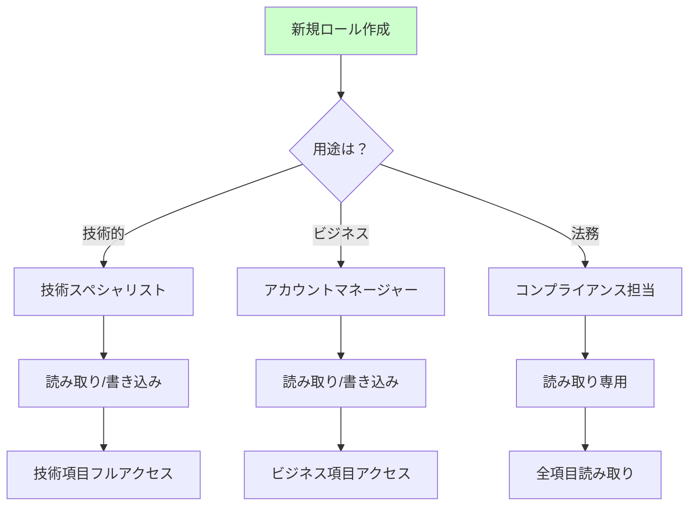
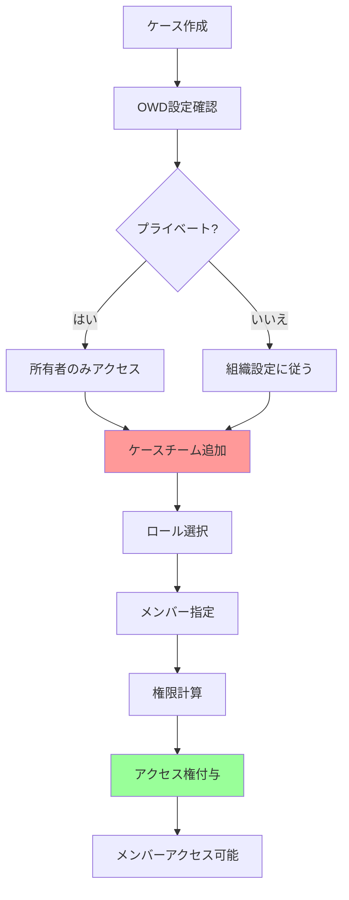
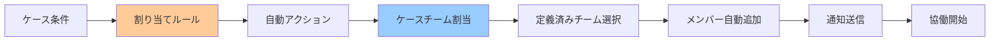
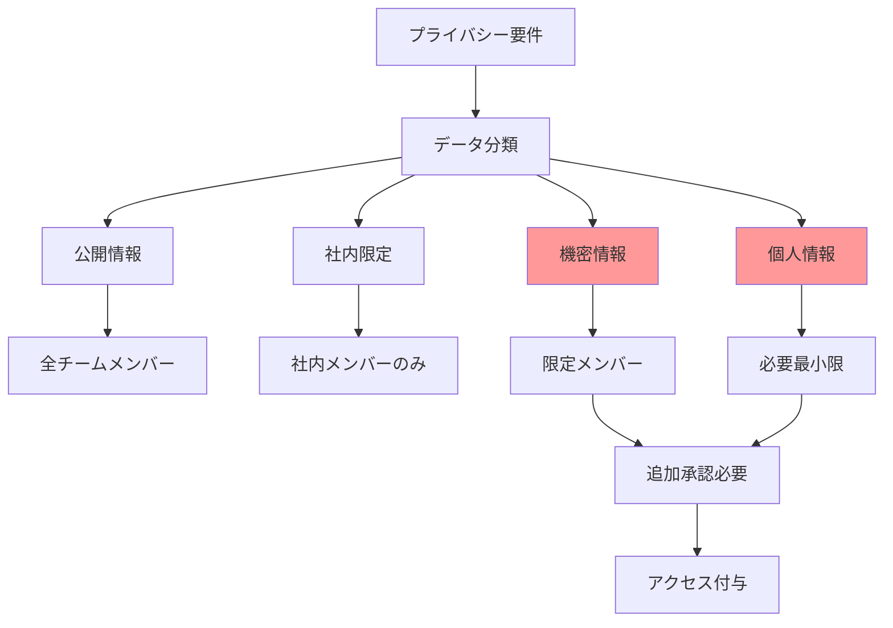
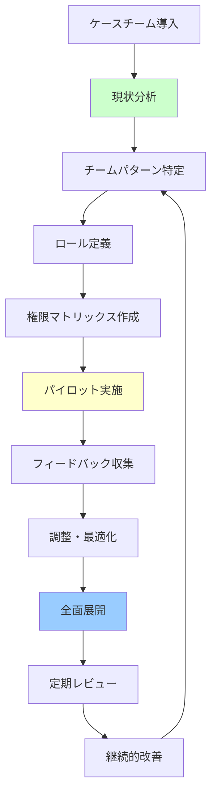

# Salesforceのケースチームとは

## What's this file?
> [!NOTE]
> **What**
> 
> Salesforceのケースチーム（Case Team）とは何かについて記載しています。

## Conclusion (忙しいとき向け)
> [!IMPORTANT]
> **What** : ケースチームとは何か
> 
> **Answer** : 複雑なカスタマーサポートケースに対して複数のユーザーが協力して対応するための機能で、定義済みのチームロールに基づいてケースへの限定的なアクセス権を付与する仕組み

## 目次

<details>
<summary>目次を開く</summary>

- [ケースチームの基本概念](#ケースチームの基本概念)
- [ケースチームの構成要素](#ケースチームの構成要素)
- [ケースチームロールの定義](#ケースチームロールの定義)
- [ケースチームの動作原理](#ケースチームの動作原理)
- [アクセス権限とセキュリティ](#アクセス権限とセキュリティ)
- [活用シナリオとベストプラクティス](#活用シナリオとベストプラクティス)

</details>

## ケースチームの基本概念

### ケースチームの定義と目的



### ケースチームの特徴

| 特徴 | 説明 | メリット |
|------|------|----------|
| **柔軟なアクセス制御** | 必要な権限のみ付与 | セキュリティ向上 |
| **一時的なコラボレーション** | ケース単位での協力 | 効率的なリソース活用 |
| **役割ベースの参加** | 明確な責任分担 | 専門性の活用 |
| **自動化可能** | ルールによる自動割当 | 作業効率化 |
| **履歴追跡** | チーム変更の記録 | 監査対応 |

### 通常の共有との違い

```yaml
ケースチーム:
  特徴:
    - 事前定義されたロール使用
    - ケース単位での限定的アクセス
    - 複数ユーザーの組織的対応
    - 役割に応じた権限差別化
    
  利点:
    - 管理の簡素化
    - 一貫性のある権限付与
    - チーム作業の可視化
    
手動共有:
  特徴:
    - 個別のアクセス権設定
    - 柔軟だが管理が煩雑
    - 標準化が困難
    - 履歴追跡が限定的
```

## ケースチームの構成要素

### 主要コンポーネント



### 各要素の詳細

```yaml
ケースチームロール:
  定義内容:
    - ロール名（例：技術サポート）
    - ケースアクセスレベル
    - ケース項目へのアクセス権
    
  設定可能な権限:
    ケースアクセス:
      - 読み取り専用
      - 読み取り/書き込み
      
    項目アクセス:
      - すべての項目
      - 特定項目のみ
      
定義済みケースチーム:
  用途:
    - よく使うチーム構成のテンプレート
    - 標準的なチーム編成の保存
    - 自動割当ルールでの使用
    
  構成:
    - チーム名
    - 含まれるロールとユーザー
    - デフォルトメンバー
```

### システムアーキテクチャ



## ケースチームロールの定義

### ロールタイプの例

| ロール名 | ケースアクセス | 主な責任 | 典型的な使用者 |
|----------|---------------|----------|----------------|
| **ケース所有者** | 読み取り/書き込み | 全体管理 | プライマリ担当者 |
| **技術サポート** | 読み取り/書き込み | 技術的解決 | エンジニア |
| **エスカレーション** | 読み取り/書き込み | 上位対応 | シニアスタッフ |
| **監督者** | 読み取り専用 | 監視・承認 | マネージャー |
| **関係者** | 読み取り専用 | 情報共有 | 関連部門 |

### ロール設計のベストプラクティス

```yaml
設計原則:
  最小権限の原則:
    - 必要最小限のアクセス権
    - 役割に応じた差別化
    - 過剰な権限の回避
    
  標準化:
    - 組織全体で一貫性
    - 命名規則の統一
    - 説明の明確化
    
  拡張性:
    - 将来の変更を考慮
    - 柔軟な構成
    - 再利用可能な設計
```

### カスタムロールの作成例



## ケースチームの動作原理

### アクセス権の付与フロー



### 権限の継承と上書き

```yaml
権限の階層:
  1. 組織の共有設定（OWD）:
     - 基本となるアクセスレベル
     - 最も制限的な設定
     
  2. ロール階層:
     - 上位ロールへの継承
     - マネージャーアクセス
     
  3. 共有ルール:
     - 条件ベースの共有
     - 自動的な権限拡張
     
  4. ケースチーム:
     - 個別ケースへの追加権限
     - ロールベースの付与
     
  5. 手動共有:
     - 最も柔軟
     - 個別対応
```

### 自動化との連携



## アクセス権限とセキュリティ

### 権限レベルの詳細

| アクセスタイプ | ケース本体 | ケース項目 | 関連レコード | 活動 |
|---------------|------------|------------|--------------|------|
| **読み取り専用** | 閲覧のみ | 指定項目のみ | 閲覧可能 | 閲覧のみ |
| **読み取り/書き込み** | 編集可能 | 指定項目編集可 | 編集可能 | 追加・編集可 |
| **所有者** | フル権限 | 全項目 | フル権限 | フル権限 |

### セキュリティ考慮事項

```yaml
データ保護:
  項目レベルセキュリティ:
    - 機密項目の非表示
    - ロール別の項目制御
    - 監査項目の保護
    
  レコードアクセス:
    - 最小権限の原則
    - 必要な期間のみ
    - 定期的な見直し
    
監査とコンプライアンス:
  追跡機能:
    - チーム変更履歴
    - アクセスログ
    - 権限変更記録
    
  レポート:
    - ケースチーム利用状況
    - アクセスパターン分析
    - 異常検知
```

### プライバシーとコンプライアンス



## 活用シナリオとベストプラクティス

### 典型的な利用シーン

```yaml
技術サポート:
  シナリオ:
    - 複雑な技術問題
    - 製品不具合調査
    - システム統合案件
    
  チーム構成:
    - L1サポート（初期対応）
    - L2エンジニア（技術調査）
    - 製品スペシャリスト
    - エスカレーションマネージャー
    
大口顧客対応:
  シナリオ:
    - VIP顧客のクレーム
    - 大規模契約の問題
    - SLA違反リスク
    
  チーム構成:
    - アカウントマネージャー
    - カスタマーサクセス
    - 技術リード
    - 事業部長
```

### 業界別の活用例

| 業界 | ケースタイプ | チーム構成例 | 特別な考慮事項 |
|------|-------------|-------------|----------------|
| **金融** | 不正取引調査 | セキュリティ、法務、顧客対応 | 機密性最重要 |
| **ヘルスケア** | 医療機器不具合 | 技術、品質保証、規制対応 | HIPAA準拠 |
| **製造** | 品質問題 | 品質管理、生産、顧客対応 | トレーサビリティ |
| **IT** | システム障害 | SRE、開発、顧客成功 | SLA管理 |

### 実装のベストプラクティス



### 運用上の注意点

```yaml
導入時の考慮事項:
  計画:
    - 既存プロセスとの整合性
    - ユーザートレーニング
    - 段階的展開
    
  設定:
    - シンプルなロール構成から開始
    - 過度な細分化を避ける
    - 定期的な見直し体制
    
運用中の管理:
  モニタリング:
    - 利用状況の追跡
    - パフォーマンス影響
    - ユーザーフィードバック
    
  最適化:
    - 不要なロールの削除
    - 権限の定期見直し
    - プロセスの自動化推進
```

### KPIと成功指標

| 指標 | 測定内容 | 目標値例 | 改善アクション |
|------|----------|----------|----------------|
| **解決時間** | ケースクローズまでの時間 | 20%短縮 | チーム編成最適化 |
| **初回解決率** | エスカレーション不要率 | 80%以上 | 適切な専門家配置 |
| **顧客満足度** | CSAT/NPS | 4.5/5以上 | 迅速な対応 |
| **チーム効率** | メンバーあたりケース数 | 適正範囲維持 | 負荷分散 |

## 関連

- [Service Cloudユーザーライセンスの割り当て方法](2025.08.12.20.12_how_assign_service_cloud_user_license_salesforce.md)
- [Salesforceの組織情報で設定できる項目](2025.08.12.19.34_what_salesforce_organization_information_settings.md)
- [Salesforce Help: ケースチームの設定](https://help.salesforce.com/s/articleView?id=sf.caseteam_setup.htm&type=5)
- [Salesforce Help: ケースチームロール](https://help.salesforce.com/s/articleView?id=sf.caseteam_roles.htm&type=5)
- [Salesforce Help: 定義済みケースチーム](https://help.salesforce.com/s/articleView?id=sf.caseteam_predefined.htm&type=5)
- [Trailhead: ケースチームでの協働](https://trailhead.salesforce.com/ja/content/learn/modules/service_basics/service_basics_case_teams)