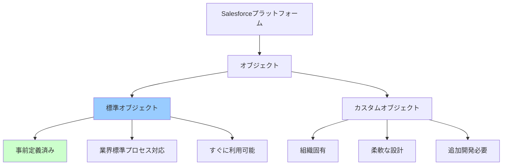
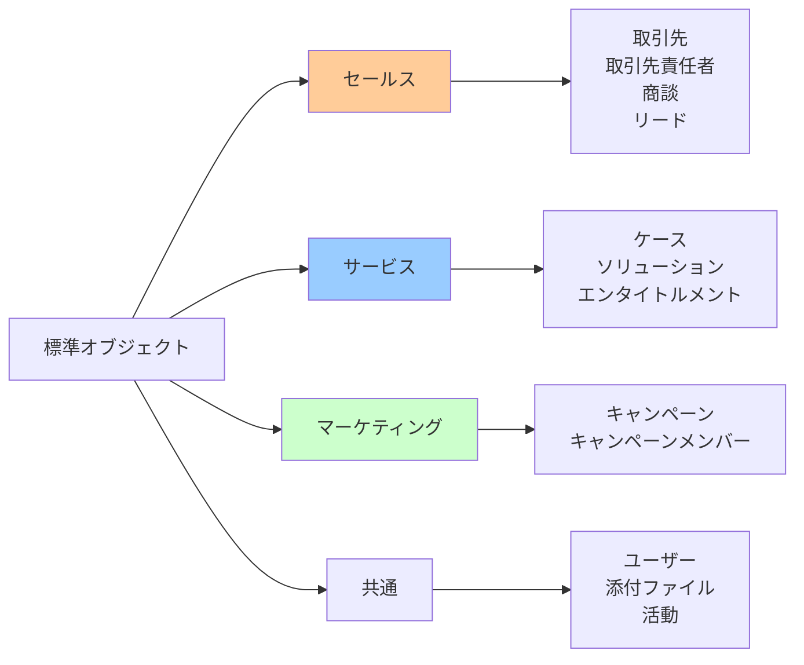
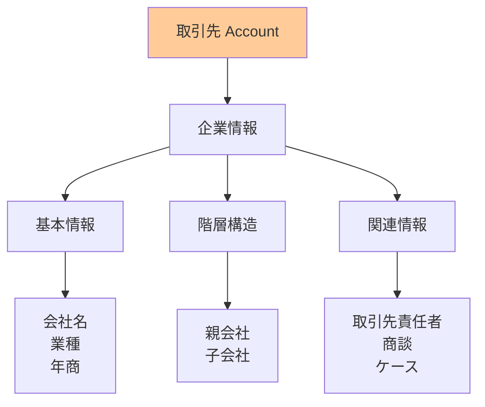
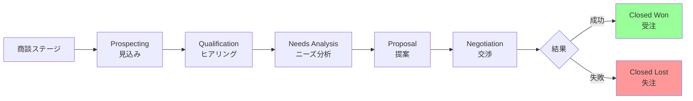
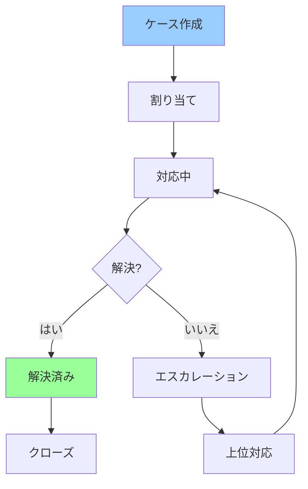
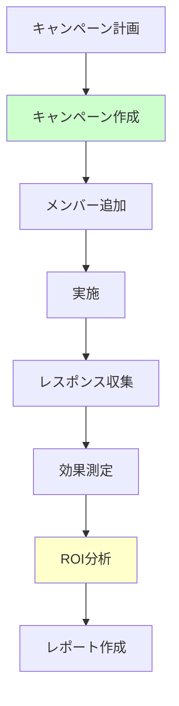
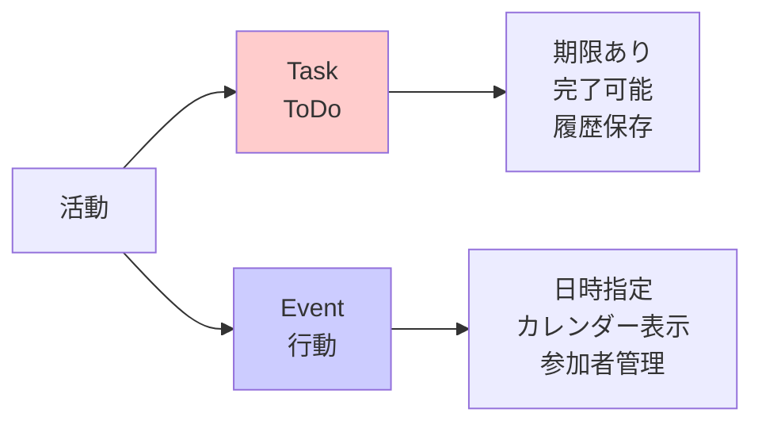
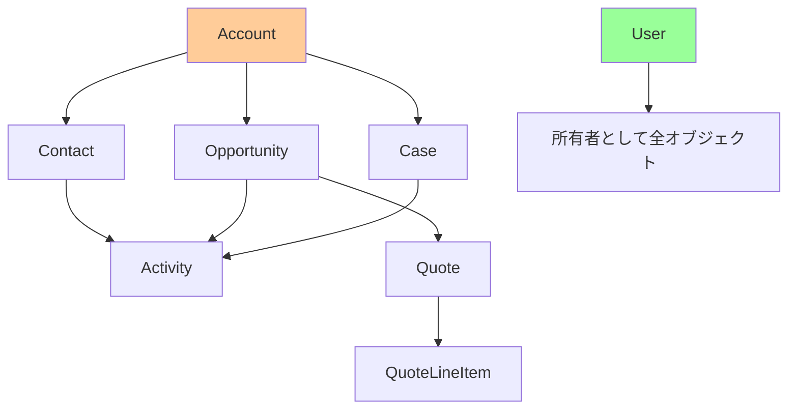

# Salesforceの標準オブジェクトとレコード種別

## What's this file?
> [!NOTE]
> **What**
> 
> Salesforceの標準オブジェクトとは何か、レコード種別ごとの特徴について記載しています。

## Conclusion (忙しいとき向け)
> [!IMPORTANT]
> **What** : 標準オブジェクトとは何か
> 
> **Answer** : Salesforceがデフォルトで提供する業務データを格納するための定義済みデータ構造で、取引先・取引先責任者・商談・ケースなど、CRM業務に必要な主要エンティティが含まれる

## 目次

<details>
<summary>目次を開く</summary>

- [標準オブジェクトの基本概念](#標準オブジェクトの基本概念)
- [主要な標準オブジェクト一覧](#主要な標準オブジェクト一覧)
- [セールス関連オブジェクト](#セールス関連オブジェクト)
- [サービス関連オブジェクト](#サービス関連オブジェクト)
- [マーケティング関連オブジェクト](#マーケティング関連オブジェクト)
- [その他の重要オブジェクト](#その他の重要オブジェクト)

</details>

## 標準オブジェクトの基本概念

### 標準オブジェクトとは



### 標準オブジェクトの特徴

| 特徴 | 説明 | メリット |
|------|------|----------|
| **即座に利用可能** | インストール時から使用可能 | 導入期間短縮 |
| **ベストプラクティス** | CRM業界の標準プロセス反映 | 品質保証 |
| **統合済み機能** | 他機能との連携設定済み | 開発工数削減 |
| **継続的な改善** | Salesforceが機能更新 | 最新機能の享受 |
| **多言語対応** | 標準ラベルの翻訳済み | グローバル展開容易 |

### オブジェクトとレコードの関係

```yaml
オブジェクト（テーブル）:
  定義:
    - データ構造の定義
    - 項目（フィールド）の集合
    - リレーションシップの定義
    
  例: 取引先オブジェクト
    
レコード（行）:
  定義:
    - オブジェクトの実際のデータ
    - 個別のインスタンス
    - 項目に値を持つ
    
  例: "株式会社ABC" という取引先レコード
```

## 主要な標準オブジェクト一覧

### カテゴリ別分類



### 主要オブジェクト一覧表

| カテゴリ | オブジェクト名（API名） | 日本語名 | 主な用途 |
|----------|------------------------|----------|----------|
| **セールス** | Account | 取引先 | 企業情報管理 |
| | Contact | 取引先責任者 | 個人情報管理 |
| | Opportunity | 商談 | 案件管理 |
| | Lead | リード | 見込み客管理 |
| | Quote | 見積 | 見積書管理 |
| **サービス** | Case | ケース | 問い合わせ管理 |
| | Solution | ソリューション | 解決策管理 |
| | Entitlement | エンタイトルメント | サポート権利管理 |
| **マーケティング** | Campaign | キャンペーン | マーケティング活動 |
| | CampaignMember | キャンペーンメンバー | 参加者管理 |
| **共通** | User | ユーザー | システム利用者 |
| | Task | ToDo | タスク管理 |
| | Event | 行動 | 予定管理 |

## セールス関連オブジェクト

### 取引先（Account）



```yaml
レコード例:
  取引先A:
    名前: 株式会社サンプル商事
    種別: 顧客
    業種: 製造業
    年商: 50億円
    従業員数: 500名
    
  取引先B:
    名前: テクノロジー株式会社
    種別: パートナー
    業種: IT
    年商: 100億円
    親取引先: グローバルテック株式会社
```

### 取引先責任者（Contact）

| 項目カテゴリ | 主要項目 | データ例 |
|-------------|----------|----------|
| **基本情報** | 姓、名、敬称 | 山田太郎様 |
| **連絡先** | メール、電話、携帯 | yamada@example.com |
| **所属情報** | 取引先、部署、役職 | 営業部部長 |
| **その他** | 誕生日、レポート先 | 上司情報など |

### 商談（Opportunity）



### リード（Lead）

```yaml
リードレコードの特徴:
  変換前:
    - 企業情報と個人情報が一体
    - マーケティング活動の対象
    - 営業活動前の状態
    
  変換プロセス:
    1. リード情報の精査
    2. 取引開始の判断
    3. 変換実行
    
  変換後:
    - 取引先レコード作成
    - 取引先責任者レコード作成
    - 商談レコード作成（オプション）
```

## サービス関連オブジェクト

### ケース（Case）



### ケースレコードの種類

| ケースタイプ | 優先度 | 典型的な内容 | SLA |
|-------------|--------|--------------|-----|
| **技術的問題** | 高 | システムエラー、バグ | 4時間 |
| **使い方相談** | 中 | 操作方法の問い合わせ | 1営業日 |
| **機能要望** | 低 | 新機能のリクエスト | 5営業日 |
| **クレーム** | 緊急 | サービス不満 | 2時間 |

### ソリューション（Solution）

```yaml
ソリューションレコード:
  用途:
    - よくある問題の解決策
    - ナレッジベース
    - セルフサービス支援
    
  構成要素:
    タイトル: 問題の要約
    詳細: 解決手順
    ケース関連付け: 解決したケース一覧
    
  例:
    タイトル: "ログインできない場合の対処法"
    カテゴリ: アカウント問題
    解決策: 
      1. パスワードリセット
      2. ブラウザキャッシュクリア
      3. サポート連絡
```

## マーケティング関連オブジェクト

### キャンペーン（Campaign）



### キャンペーンレコードタイプ

| タイプ | 目的 | チャネル | 測定指標 |
|--------|------|----------|----------|
| **ウェビナー** | リード獲得 | オンライン | 参加率、満足度 |
| **展示会** | ブランド認知 | オフライン | 来場者数、商談数 |
| **メールキャンペーン** | ナーチャリング | デジタル | 開封率、CTR |
| **広告** | 新規開拓 | マルチチャネル | インプレッション、CVR |

## その他の重要オブジェクト

### ユーザー（User）

```yaml
ユーザーレコードタイプ:
  内部ユーザー:
    - 従業員アカウント
    - フルライセンス
    - 全機能アクセス
    
  外部ユーザー:
    - カスタマーユーザー
    - パートナーユーザー
    - 限定的アクセス
    
  システムユーザー:
    - 統合ユーザー
    - 自動処理用
    - API専用
```

### 活動オブジェクト（Task/Event）



### 添付ファイルとメモ

| オブジェクト | 用途 | 保存形式 | 最大サイズ |
|-------------|------|----------|------------|
| **Attachment** | レガシー添付 | BLOB | 25MB |
| **ContentDocument** | 新ファイル管理 | バージョン管理 | 2GB |
| **Note** | 簡易メモ | テキスト | 32KB |
| **ContentNote** | リッチテキストメモ | HTML | 50MB |

### オブジェクト間の関係性



## 関連

- [Salesforceのカスタマーユーザーアカウントとは](2025.08.12.21.50_what_customeruser_account_salesforce.md)
- [Salesforceのケースチームとは](2025.08.12.21.54_what_salesforce_case_team.md)
- [Salesforceの組織情報で設定できる項目](2025.08.12.19.34_what_salesforce_organization_information_settings.md)
- [Salesforce Help: 標準オブジェクトリファレンス](https://help.salesforce.com/s/articleView?id=sf.dev_objectconcepts.htm&type=5)
- [Salesforce Developer: オブジェクトリファレンス](https://developer.salesforce.com/docs/atlas.en-us.api.meta/api/sforce_api_objects_list.htm)
- [Trailhead: データモデリング](https://trailhead.salesforce.com/ja/content/learn/modules/data_modeling)