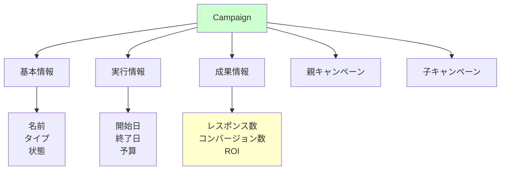
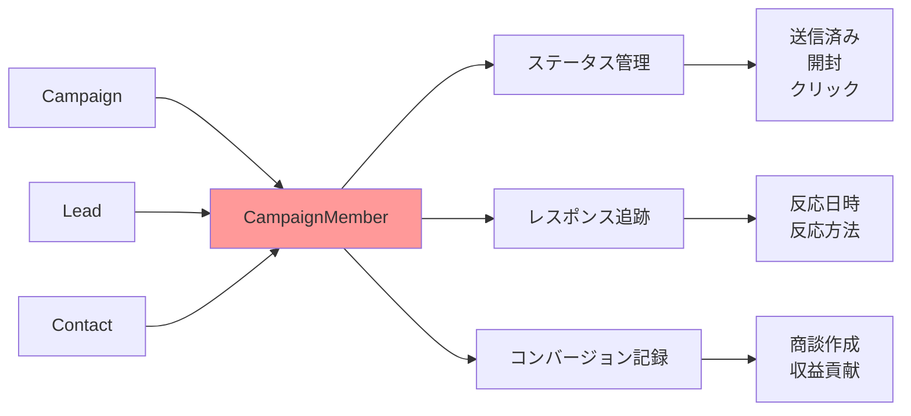
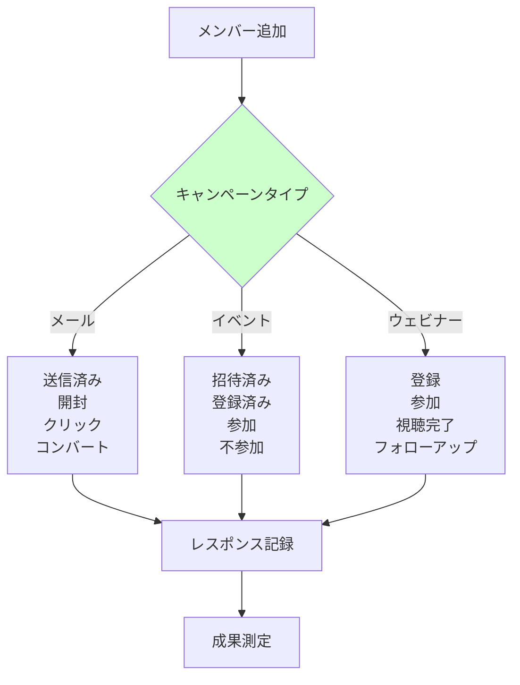
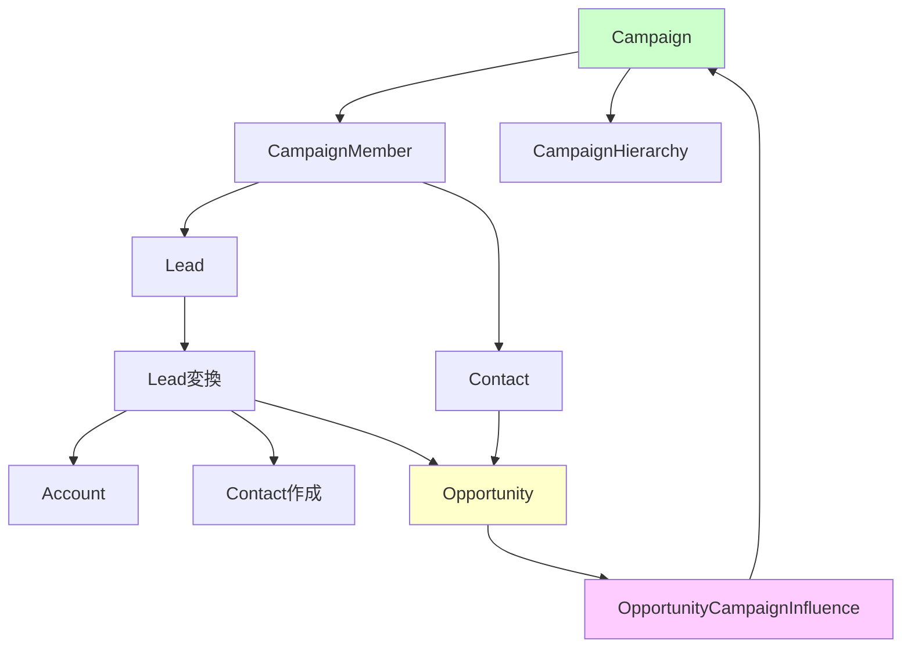
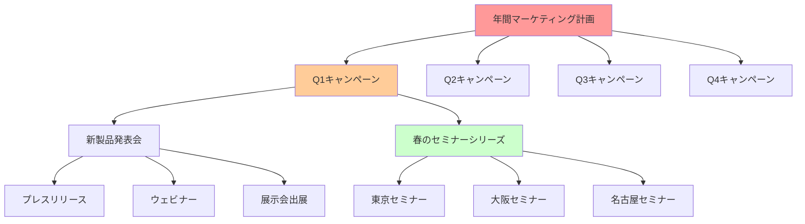
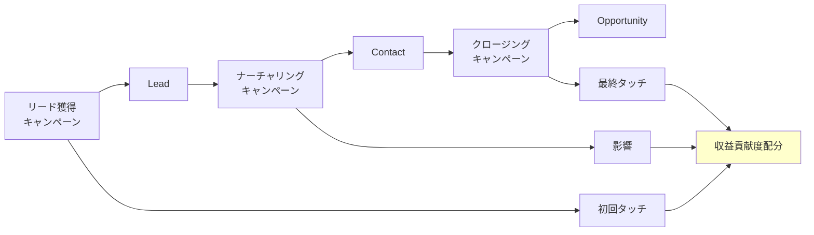
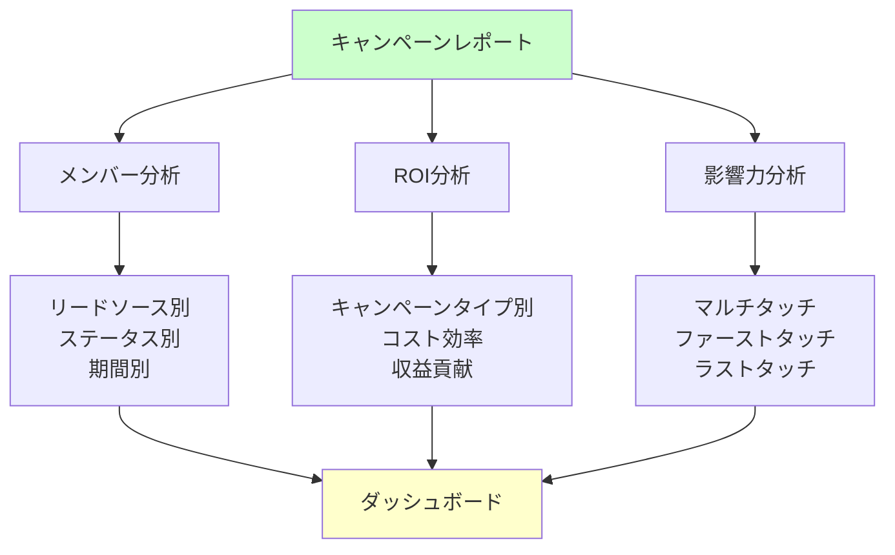
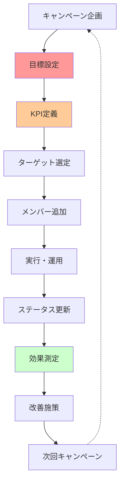

# Salesforceのキャンペーン関連オブジェクト

## What's this file?
> [!NOTE]
> **What**
> 
> Salesforceのキャンペーン（Campaign）に関連するオブジェクトとは何かについて記載しています。

## Conclusion (忙しいとき向け)
> [!IMPORTANT]
> **What** : キャンペーン関連オブジェクトとは何か
> 
> **Answer** : マーケティング活動を管理するCampaignオブジェクトを中心に、CampaignMember（参加者）、Lead/Contact（対象者）、Opportunity（成果）などが連携してマーケティングROIを追跡する仕組み

## 目次

<details>
<summary>目次を開く</summary>

- [キャンペーンオブジェクトの概要](#キャンペーンオブジェクトの概要)
- [キャンペーンメンバーオブジェクト](#キャンペーンメンバーオブジェクト)
- [キャンペーンと他オブジェクトの関係](#キャンペーンと他オブジェクトの関係)
- [キャンペーン階層と影響力](#キャンペーン階層と影響力)
- [キャンペーン統計と分析オブジェクト](#キャンペーン統計と分析オブジェクト)
- [活用パターンとベストプラクティス](#活用パターンとベストプラクティス)

</details>

## キャンペーンオブジェクトの概要

### キャンペーンの基本構造



### キャンペーンの主要項目

| カテゴリ | 項目名 | API名 | 説明 |
|----------|--------|-------|------|
| **基本情報** | キャンペーン名 | Name | マーケティング活動の名称 |
| | 種別 | Type | ウェビナー、展示会など |
| | 状況 | Status | 計画中、実行中、完了 |
| **期間** | 開始日 | StartDate | キャンペーン開始日 |
| | 終了日 | EndDate | キャンペーン終了日 |
| **予算** | 予算費用 | BudgetedCost | 計画予算 |
| | 実費用 | ActualCost | 実際の支出 |
| **成果** | 期待レスポンス | ExpectedResponse | 目標反応率 |
| | 期待収益 | ExpectedRevenue | 目標収益 |

### キャンペーンタイプ

```yaml
標準的なキャンペーンタイプ:
  広告:
    - バナー広告
    - 検索連動型広告
    - ソーシャルメディア広告
    
  イベント:
    - カンファレンス
    - ウェビナー
    - 展示会
    - セミナー
    
  デジタルマーケティング:
    - メールキャンペーン
    - コンテンツマーケティング
    - ソーシャルメディア
    
  その他:
    - ダイレクトメール
    - テレマーケティング
    - パートナーマーケティング
```

## キャンペーンメンバーオブジェクト

### CampaignMemberの役割



### CampaignMemberの主要項目

| 項目カテゴリ | 項目名 | 用途 | 値の例 |
|-------------|--------|------|--------|
| **識別情報** | CampaignId | キャンペーンとの紐付け | - |
| | LeadId/ContactId | 対象者の特定 | - |
| **ステータス** | Status | 参加状況の追跡 | 送信済み、反応あり |
| | HasResponded | レスポンス有無 | true/false |
| **日時** | FirstRespondedDate | 初回反応日 | 2025-08-12 |
| | CreatedDate | メンバー追加日 | 2025-08-01 |

### メンバーステータスの管理



## キャンペーンと他オブジェクトの関係

### 主要な関連オブジェクト



### オブジェクト間のリレーション

```yaml
直接的な関係:
  Campaign → CampaignMember:
    - 1対多の関係
    - 必須の関連
    - カスケード削除
    
  CampaignMember → Lead/Contact:
    - 多対1の関係
    - どちらか1つと関連
    - ポリモーフィックな関係
    
間接的な関係:
  Campaign → Opportunity:
    - CampaignInfluenceを介した多対多
    - 収益への貢献度追跡
    - 複数キャンペーンの影響測定
    
  Campaign → Account:
    - Contact/Opportunityを介した関連
    - 企業レベルでの効果測定
```

### OpportunityCampaignInfluence

| 項目 | 説明 | 用途 |
|------|------|------|
| **OpportunityId** | 関連する商談 | 成果の紐付け |
| **CampaignId** | 影響したキャンペーン | 貢献度の追跡 |
| **Influence** | 影響度（%） | ROI計算 |
| **ContactId** | 関連する取引先責任者 | タッチポイント特定 |

## キャンペーン階層と影響力

### キャンペーン階層構造



### 階層集計の仕組み

```yaml
親キャンペーンでの集計:
  自動集計項目:
    - 総メンバー数
    - 総レスポンス数
    - 総コンバージョン数
    - 総収益
    - 総コスト
    
  集計方法:
    - 子キャンペーンの値を合算
    - リアルタイム更新
    - 階層は最大5レベル
    
  活用例:
    年間計画:
      メンバー数: 10,000
      子キャンペーン:
        Q1: 2,500
        Q2: 3,000
        Q3: 2,000
        Q4: 2,500
```

### キャンペーン影響力モデル



## キャンペーン統計と分析オブジェクト

### CampaignStats（集計項目）

| 統計項目 | API名 | 計算方法 | 用途 |
|----------|-------|----------|------|
| **リード数** | NumberOfLeads | CampaignMember集計 | 新規獲得測定 |
| **コンバージョン数** | NumberOfConvertedLeads | 変換済みリード数 | 質の評価 |
| **取引先責任者数** | NumberOfContacts | 既存顧客参加 | エンゲージメント |
| **商談数** | NumberOfOpportunities | 生成された商談 | ビジネス影響 |
| **受注数** | NumberOfWonOpportunities | 成約商談数 | 最終成果 |
| **収益** | AmountAllOpportunities | 商談金額合計 | ROI計算 |

### ROI計算フィールド

```yaml
ROI関連項目:
  入力項目:
    BudgetedCost: 予算
    ActualCost: 実費用
    ExpectedRevenue: 期待収益
    
  計算項目:
    AmountWonOpportunities: 受注金額
    ROI: (受注金額 - 実費用) / 実費用 * 100
    
  分析例:
    ウェビナーキャンペーン:
      実費用: 100万円
      受注金額: 500万円
      ROI: 400%
```

### カスタムレポートタイプ



## 活用パターンとベストプラクティス

### 典型的な活用シナリオ

```yaml
B2Bマーケティング:
  リードジェネレーション:
    キャンペーン例:
      - ホワイトペーパーダウンロード
      - ウェビナー登録
      - 展示会出展
    測定指標:
      - 獲得リード数
      - MQL転換率
      - SQL転換率
      
  アカウントベースドマーケティング:
    キャンペーン例:
      - ターゲット企業向けイベント
      - エグゼクティブ向けセミナー
      - 個別提案会
    測定指標:
      - ターゲットアカウントのエンゲージメント
      - 商談化率
      - 案件規模
      
B2Cマーケティング:
  製品プロモーション:
    キャンペーン例:
      - 新製品発表
      - 季節キャンペーン
      - 会員限定セール
    測定指標:
      - リーチ数
      - コンバージョン率
      - 客単価向上
```

### キャンペーン設計のベストプラクティス



### データ管理のポイント

| 管理項目 | 推奨事項 | 注意点 |
|----------|----------|--------|
| **命名規則** | YYYY_MM_タイプ_名称 | 一貫性を保つ |
| **階層設計** | 年→四半期→月→個別 | 5階層まで |
| **ステータス管理** | キャンペーンタイプ別に標準化 | 多すぎない |
| **コスト入力** | 予算と実績を必ず記録 | ROI計算に必須 |
| **メンバー管理** | 重複を避ける | データ品質維持 |

### 自動化の活用

```yaml
プロセスビルダー/フロー:
  メンバー追加の自動化:
    - Webフォーム送信時
    - 特定条件のリード
    - イベント登録時
    
  ステータス更新の自動化:
    - メール開封時
    - リンククリック時
    - フォーム送信時
    
  フォローアップの自動化:
    - ステータス変更時のタスク作成
    - 一定期間後のメール送信
    - スコアリング更新
    
Apex トリガー:
  高度な処理:
    - 複雑な影響力計算
    - カスタムROI計算
    - 外部システム連携
```

## 関連

- [Salesforceの標準オブジェクトとレコード種別](2025.08.12.22.03_what_salesforce_standard_objects_by_records.md)
- [Salesforceの組織情報で設定できる項目](2025.08.12.19.34_what_salesforce_organization_information_settings.md)
- [Salesforce Help: キャンペーン管理](https://help.salesforce.com/s/articleView?id=sf.campaigns_def.htm&type=5)
- [Salesforce Help: キャンペーンメンバー](https://help.salesforce.com/s/articleView?id=sf.campaigns_members.htm&type=5)
- [Salesforce Help: キャンペーン影響力](https://help.salesforce.com/s/articleView?id=sf.campaigns_influence_intro.htm&type=5)
- [Trailhead: キャンペーンの基本](https://trailhead.salesforce.com/ja/content/learn/modules/campaign_basics)