# Salesforceオブジェクト間の関連性を理解する方法

## What's this file?
> [!NOTE]
> **How**
> 
> どのようにSalesforceの各オブジェクト間の関連性を理解し、完全な関係図を構築するかについて記載しています。

## Conclusion (忙しいとき向け)
> [!IMPORTANT]
> **How** : どのようにオブジェクト間の関連性を理解するか
> 
> **Answer** : Salesforceの主要オブジェクトは参照関係（ルックアップ）と主従関係でつながり、Account（取引先）を中心にContact、Opportunity、Caseなどがツリー構造を形成し、UserとActivityが横断的に関連する

## 目次

<details>
<summary>目次を開く</summary>

- [オブジェクト関係の基本概念](#オブジェクト関係の基本概念)
- [コアオブジェクトの関係図](#コアオブジェクトの関係図)
- [セールス系オブジェクトの関係](#セールス系オブジェクトの関係)
- [サービス系オブジェクトの関係](#サービス系オブジェクトの関係)
- [共通オブジェクトとの関係](#共通オブジェクトとの関係)
- [複雑な関係パターンの理解](#複雑な関係パターンの理解)

</details>

## オブジェクト関係の基本概念

### リレーションシップの種類

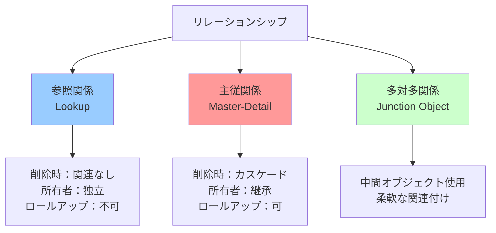

### リレーションシップの特性比較

| 特性 | 参照関係（Lookup） | 主従関係（Master-Detail） | 階層関係 |
|------|-------------------|-------------------------|----------|
| **必須項目** | 任意設定可能 | 常に必須 | 任意 |
| **親削除時** | 子は残る | 子も削除 | 制限あり |
| **共有設定** | 独立 | 親から継承 | 独立 |
| **ロールアップ集計** | 不可 | 可能 | 不可 |
| **親の変更** | 可能 | 条件付き可能 | 可能 |

### 関係の基数（カーディナリティ）

```yaml
1対1の関係:
  例: User ←→ UserDetail
  実装: 片方にユニークな参照項目
  
1対多の関係:
  例: Account ←→ Contact
  実装: 子に親への参照項目
  
多対多の関係:
  例: Contact ←→ Campaign
  実装: CampaignMember（中間オブジェクト）
```

## コアオブジェクトの関係図

### 中心的なオブジェクト関係

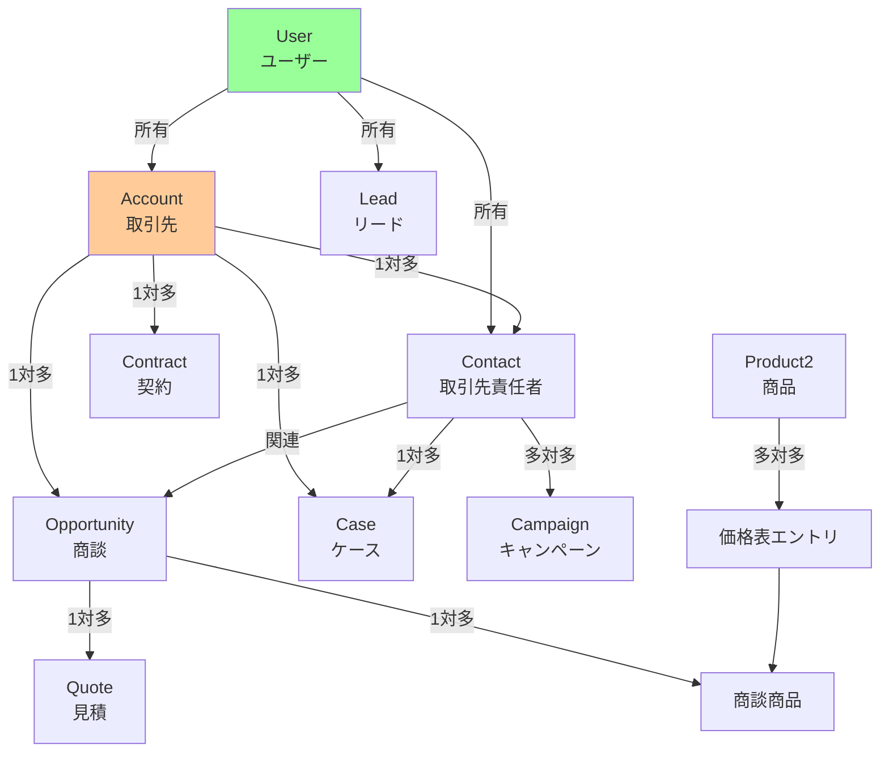

### Account中心の関係性

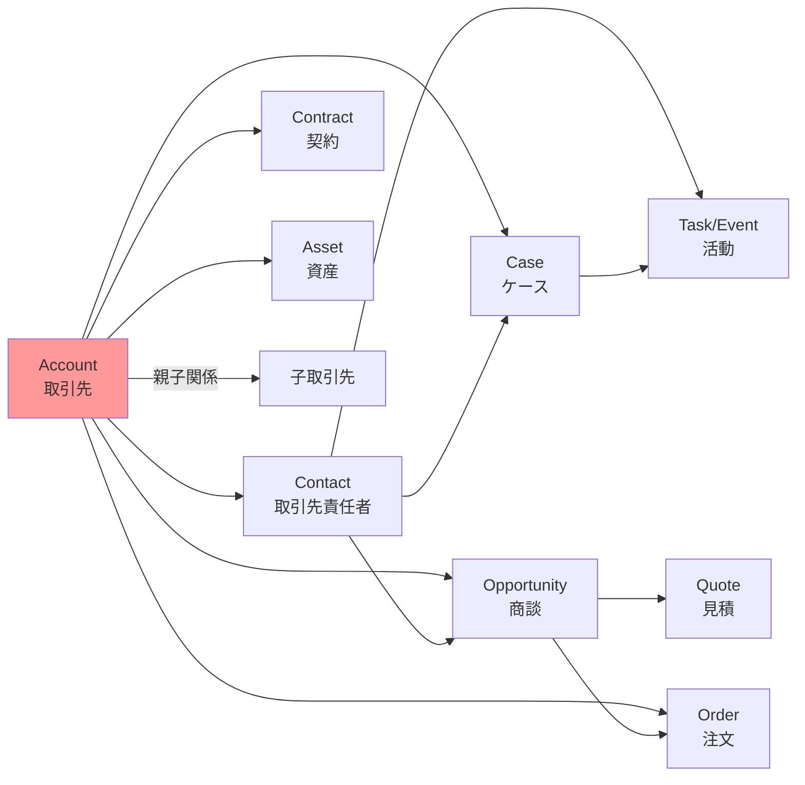

## セールス系オブジェクトの関係

### リードから商談への変換フロー

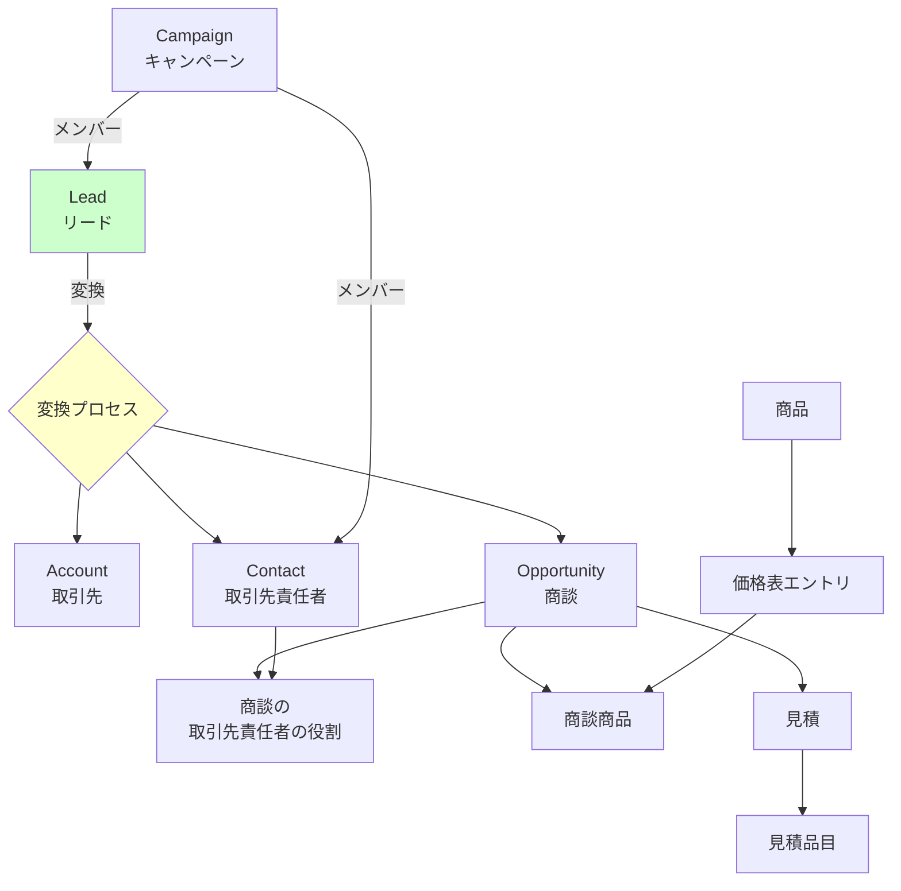

### 商品と価格の関係

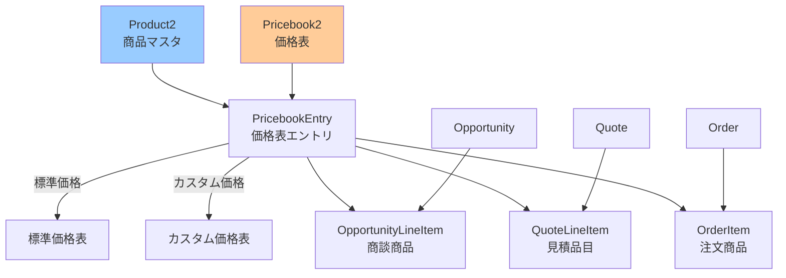

## サービス系オブジェクトの関係

### ケース管理の関係図

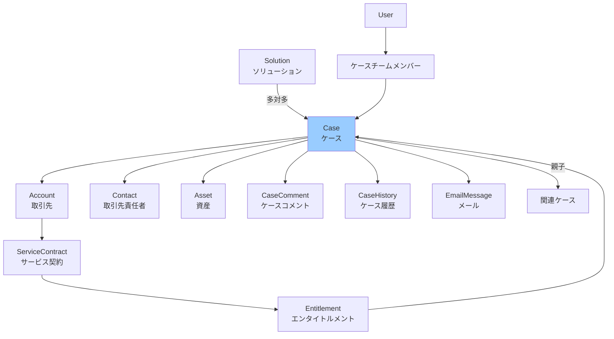

### 資産とサービス契約

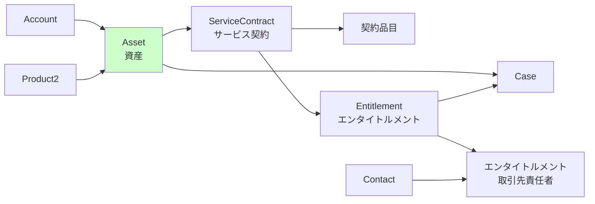

## 共通オブジェクトとの関係

### 活動（Task/Event）の関係

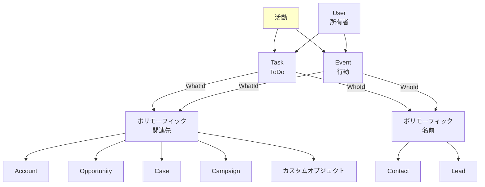

### 添付ファイルとコンテンツ

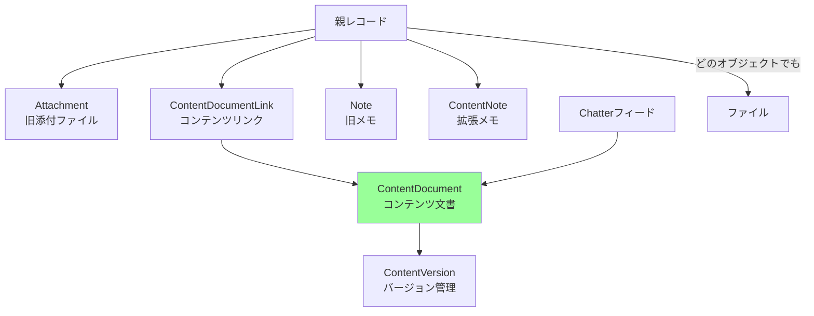

## 複雑な関係パターンの理解

### 多対多関係の実装パターン

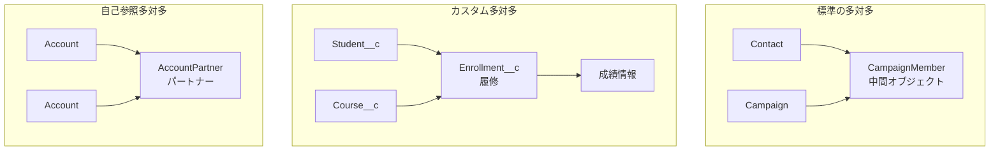

### 階層的な関係

```yaml
取引先階層:
  親取引先:
    - 最上位の持株会社
    - ParentId = null
    
  子会社:
    - ParentId = 親取引先ID
    - 最大5階層まで推奨
    
  関連項目:
    - Ultimate Parent（最上位親）
    - 階層ロールアップ

キャンペーン階層:
  年間計画:
    - 最上位キャンペーン
    
  四半期キャンペーン:
    - Parent Campaign = 年間計画
    
  個別施策:
    - Parent Campaign = 四半期
    - 統計情報の自動集計
```

### 共有とアクセス権の関係

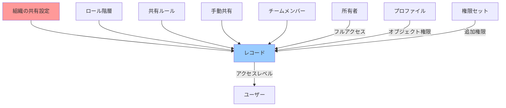

### 承認プロセスとの関係

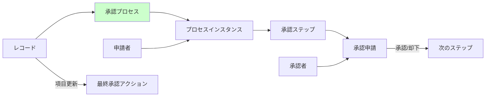

### システム全体の関係俯瞰図

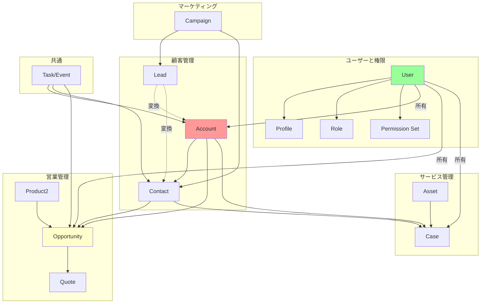

## 関連

- [Salesforceの標準オブジェクトとレコード種別](2025.08.12.22.03_what_salesforce_standard_objects_by_records.md)
- [Salesforceのキャンペーン関連オブジェクト](2025.08.12.22.09_what_salesforce_campaign_related_objects.md)
- [Salesforceのケースチームとは](2025.08.12.21.54_what_salesforce_case_team.md)
- [Salesforce Help: オブジェクトリレーションシップの概要](https://help.salesforce.com/s/articleView?id=sf.overview_of_custom_object_relationships.htm&type=5)
- [Salesforce Developer: ERD（Entity Relationship Diagrams）](https://developer.salesforce.com/docs/atlas.en-us.api.meta/api/data_model.htm)
- [Trailhead: データモデリング](https://trailhead.salesforce.com/ja/content/learn/modules/data_modeling)