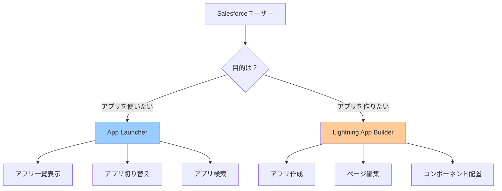
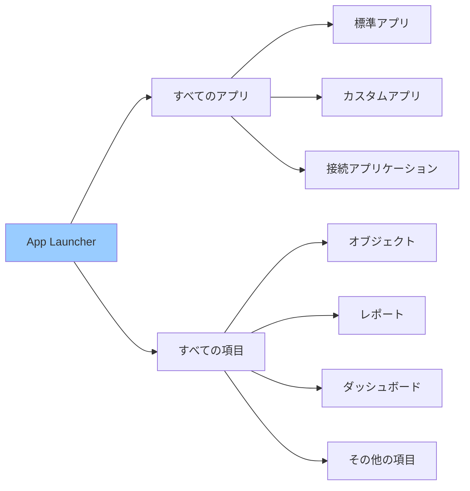
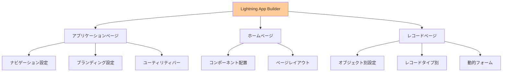
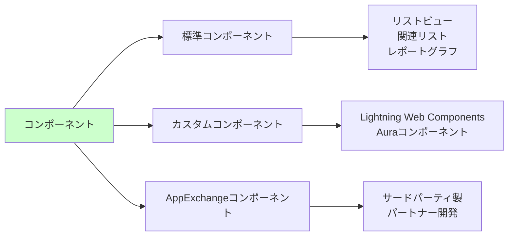
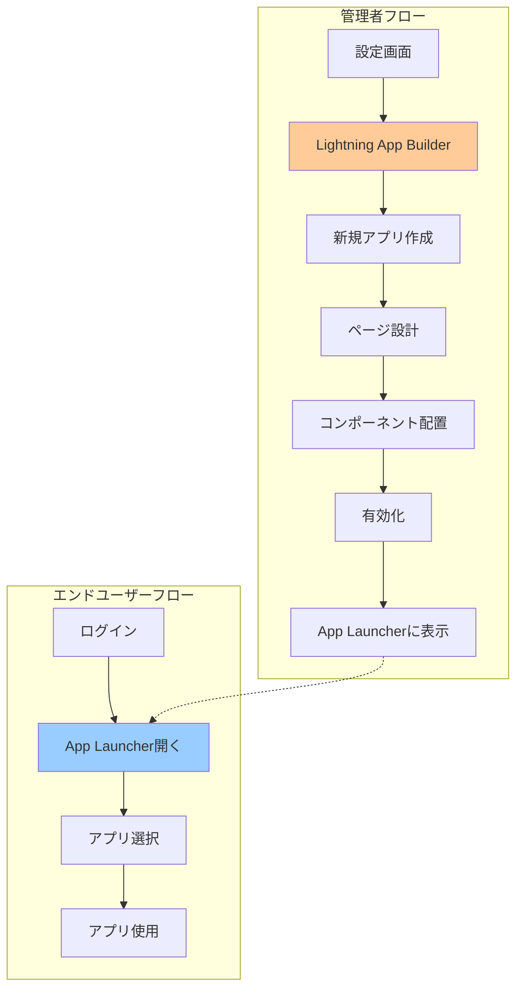
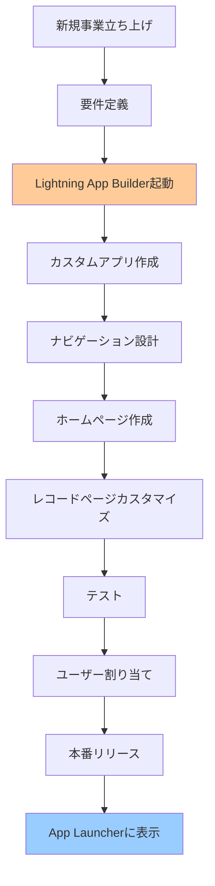
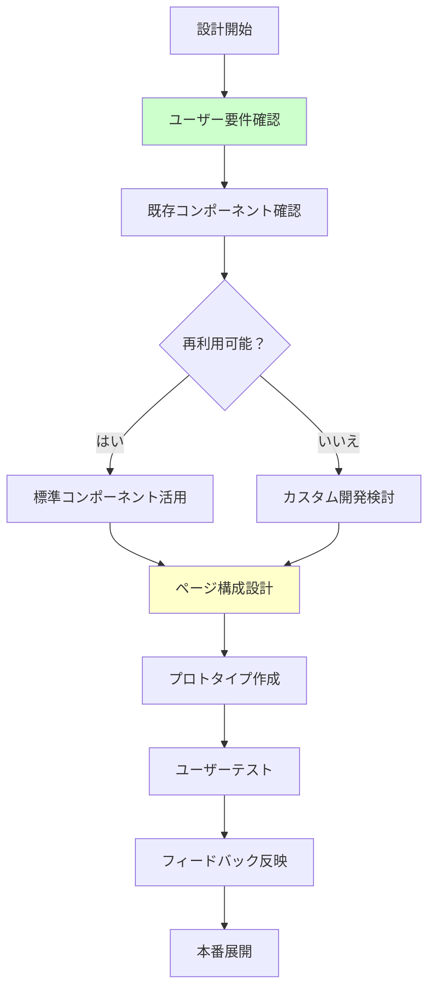

# App LauncherとLightning App Builderの違いを理解する方法

## What's this file?
> [!NOTE]
> **How**
> 
> どのようにSalesforceのApp LauncherとLightning App Builderの違いを理解し、適切に使い分けるかについて記載しています。

## Conclusion (忙しいとき向け)
> [!IMPORTANT]
> **How** : どのようにApp LauncherとLightning App Builderを区別するか
> 
> **Answer** : App Launcherはアプリを「使用・切り替える」ためのエンドユーザー向けツール、Lightning App Builderはアプリを「作成・編集する」ための管理者向け開発ツールという根本的な目的の違いがある

## 目次

<details>
<summary>目次を開く</summary>

- [基本的な違いの理解](#基本的な違いの理解)
- [App Launcherの詳細](#app-launcherの詳細)
- [Lightning App Builderの詳細](#lightning-app-builderの詳細)
- [機能比較と使い分け](#機能比較と使い分け)
- [実際の利用シーン](#実際の利用シーン)
- [設定と管理のベストプラクティス](#設定と管理のベストプラクティス)

</details>

## 基本的な違いの理解

### 目的と役割の違い



### 根本的な違い

| 特性 | App Launcher | Lightning App Builder |
|------|--------------|---------------------|
| **主な目的** | アプリケーションの利用 | アプリケーションの構築 |
| **対象ユーザー** | すべてのエンドユーザー | システム管理者・開発者 |
| **必要な権限** | 基本的な利用権限のみ | アプリケーションのカスタマイズ権限 |
| **アクセス方法** | ナビゲーションバーの9点グリッド | 設定メニューから |
| **主な機能** | 表示・検索・起動 | 作成・編集・削除 |

### 概念の位置づけ

```yaml
Lightning Experience全体:
  App Launcher（利用層）:
    - エンドユーザーインターフェース
    - アプリケーション切り替え
    - 日常業務での使用
    
  Lightning App Builder（構築層）:
    - 管理者インターフェース
    - アプリケーション設計
    - メタデータ定義
    
  関係性:
    - BuilderでつくったアプリがLauncherに表示される
    - Launcherは実行環境、Builderは開発環境
```

## App Launcherの詳細

### App Launcherの構成要素



### App Launcherの機能

```yaml
基本機能:
  アプリ表示:
    - アクセス可能なすべてのアプリを表示
    - タイル形式でビジュアル表示
    - お気に入り機能
    
  検索機能:
    - アプリ名で検索
    - 説明文でも検索可能
    - インクリメンタルサーチ
    
  カテゴリ分け:
    - Lightningアプリケーション
    - Classicアプリケーション
    - 接続アプリケーション
    - Visualforceアプリケーション
```

### App Launcherの表示制御

| 制御方法 | 設定場所 | 影響範囲 | 用途 |
|----------|----------|----------|------|
| **プロファイル** | アプリケーション設定 | プロファイル単位 | 基本的なアクセス制御 |
| **権限セット** | 割り当てられたアプリ | ユーザー単位 | 追加的なアクセス付与 |
| **アプリの表示設定** | アプリケーション管理 | アプリ単位 | 表示/非表示の切り替え |
| **ユーザー設定** | 個人設定 | 個人単位 | お気に入り管理 |

## Lightning App Builderの詳細

### Lightning App Builderの構成



### 作成可能なページタイプ

```yaml
アプリケーションページ:
  特徴:
    - アプリ全体の設定
    - ナビゲーションメニュー定義
    - ブランディング（色、ロゴ）
    
ホームページ:
  特徴:
    - ダッシュボード的な役割
    - 複数コンポーネントの組み合わせ
    - パーソナライズ可能
    
レコードページ:
  特徴:
    - オブジェクト別のページ
    - フィールド、関連リスト配置
    - 条件付き表示設定
```

### コンポーネントの管理



## 機能比較と使い分け

### 詳細な機能比較表

| 機能カテゴリ | App Launcher | Lightning App Builder |
|-------------|--------------|---------------------|
| **基本操作** | アプリの起動・切り替え | アプリの作成・編集・削除 |
| **ページ操作** | 閲覧のみ | レイアウト編集、コンポーネント配置 |
| **設定変更** | 個人のお気に入りのみ | システム全体の設定 |
| **権限要件** | 一般ユーザー権限 | アプリケーションのカスタマイズ権限 |
| **対象範囲** | 自分がアクセス可能なアプリ | 組織全体のアプリ |
| **カスタマイズ** | 不可 | 完全カスタマイズ可能 |

### 使用フローの違い



## 実際の利用シーン

### App Launcherの利用シーン

```yaml
営業担当者の1日:
  朝:
    - App Launcherから「セールス」アプリを選択
    - 商談管理を開始
    
  昼:
    - 「サービス」アプリに切り替え
    - カスタマーサポート状況確認
    
  夕方:
    - 「マーケティング」アプリで
    - キャンペーン結果確認
    
メリット:
  - ワンクリックでアプリ切り替え
  - 業務に応じた最適なアプリ選択
  - 統一されたユーザー体験
```

### Lightning App Builderの利用シーン



### 具体的な設定例

| シナリオ | 使用ツール | 実施内容 |
|----------|------------|----------|
| **新入社員のアプリアクセス** | App Launcher | 割り当てられたアプリの確認と利用開始 |
| **部門専用アプリの作成** | Lightning App Builder | カスタムアプリの新規作成と設定 |
| **既存アプリの改修** | Lightning App Builder | ページレイアウトの変更 |
| **日常業務でのアプリ切り替え** | App Launcher | 必要なアプリへの素早いアクセス |

## 設定と管理のベストプラクティス

### App Launcher管理のポイント

```yaml
アプリの整理:
  命名規則:
    - 部門名_機能名（例：営業_商談管理）
    - 用途が分かりやすい名前
    - 統一されたフォーマット
    
  説明文の活用:
    - アプリの目的を明記
    - 主な利用者を記載
    - 更新履歴の記録
    
  アイコンとカラー:
    - 部門別に色分け
    - 直感的なアイコン選択
    - ブランドガイドライン準拠
```

### Lightning App Builder設計指針



### 権限管理のベストプラクティス

| 対象 | App Launcher | Lightning App Builder |
|------|--------------|---------------------|
| **一般ユーザー** | ✓ 利用可能 | ✗ アクセス不可 |
| **パワーユーザー** | ✓ 利用可能 | △ 閲覧のみ可能な場合も |
| **システム管理者** | ✓ 利用可能 | ✓ フルアクセス |
| **開発者** | ✓ 利用可能 | ✓ 開発・テスト可能 |

### トラブルシューティング

```yaml
よくある問題と解決策:
  App Launcherに表示されない:
    原因:
      - プロファイル/権限セットの設定漏れ
      - アプリの非表示設定
      - ライセンス不足
    解決:
      - 権限設定の確認
      - アプリケーション管理での表示設定
      - ライセンス割り当て確認
      
  Lightning App Builderで保存できない:
    原因:
      - 必須コンポーネントの不足
      - 権限不足
      - 検証エラー
    解決:
      - エラーメッセージの確認
      - システム管理者権限の確認
      - コンポーネント設定の見直し
```

## 関連

- [Salesforceのエンジニア向け学習パス](2025.08.12.08.41_how_salesforce_learning_path_for_engineers.md)
- [Salesforceの組織情報で設定できる項目](2025.08.12.19.34_what_salesforce_organization_information_settings.md)
- [Salesforce Help: App Launcher](https://help.salesforce.com/s/articleView?id=sf.dev_apps_lightning_navigator.htm&type=5)
- [Salesforce Help: Lightning App Builder](https://help.salesforce.com/s/articleView?id=sf.lightning_app_builder_overview.htm&type=5)
- [Trailhead: Lightning App Builderの基本](https://trailhead.salesforce.com/ja/content/learn/modules/lightning_app_builder)
- [Salesforce Developer Guide: アプリケーション開発](https://developer.salesforce.com/docs/atlas.en-us.lightning.meta/lightning/)