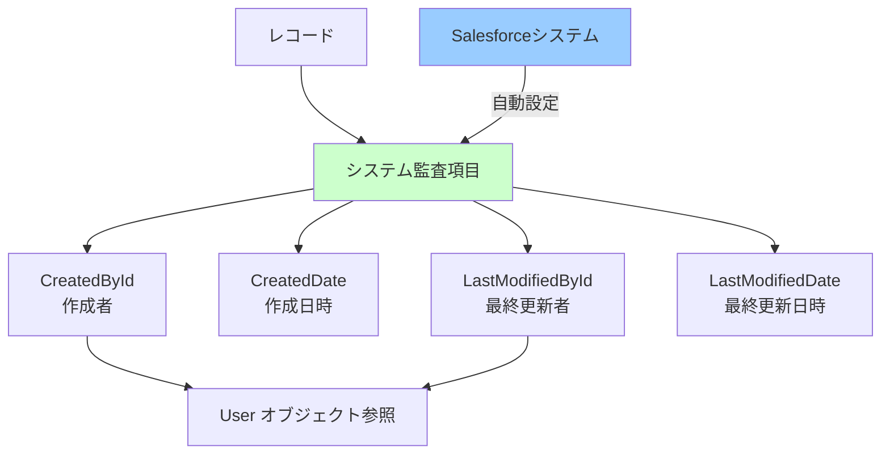
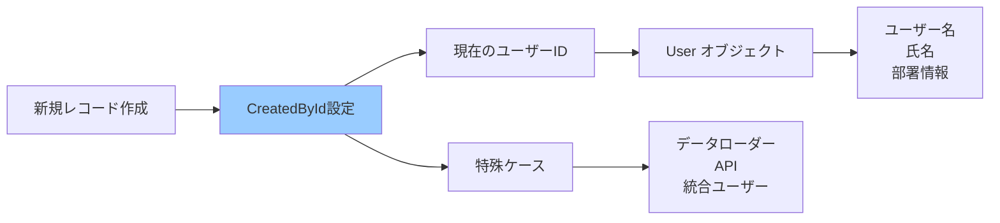
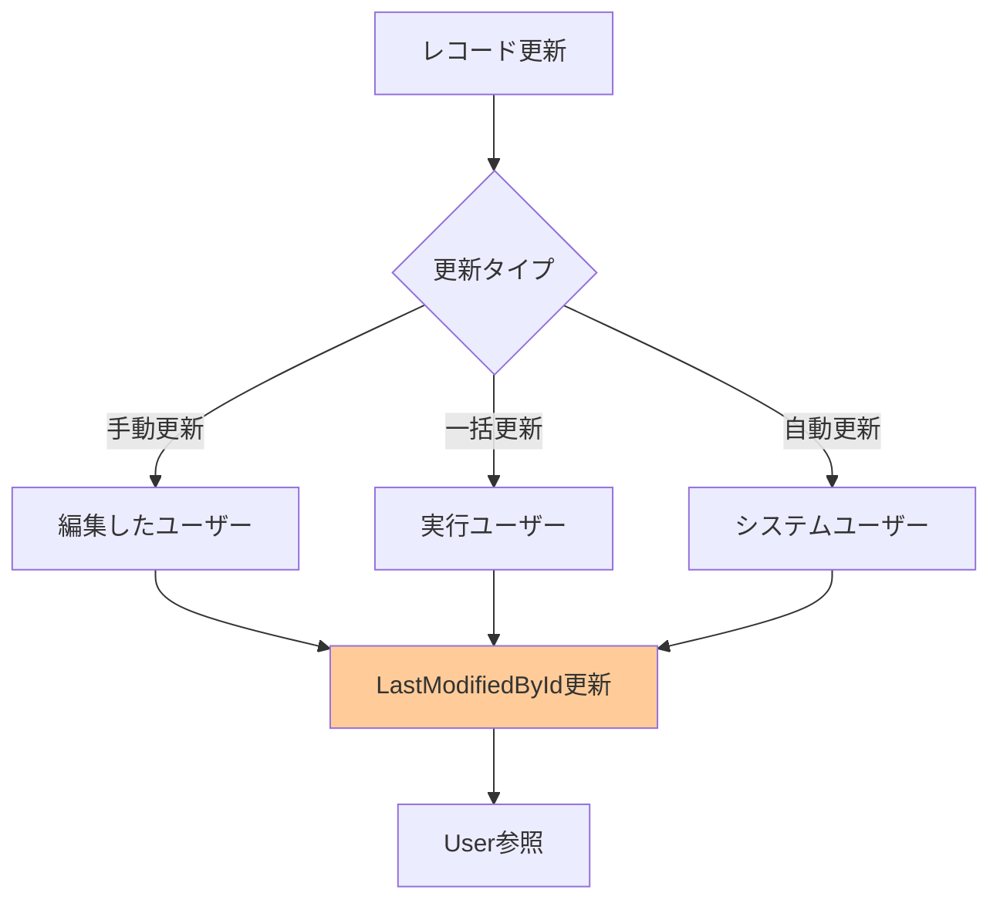
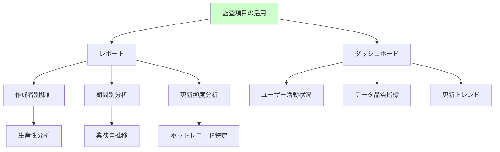
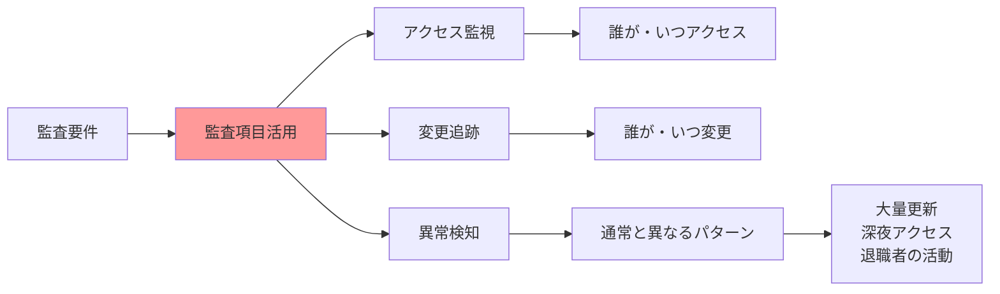
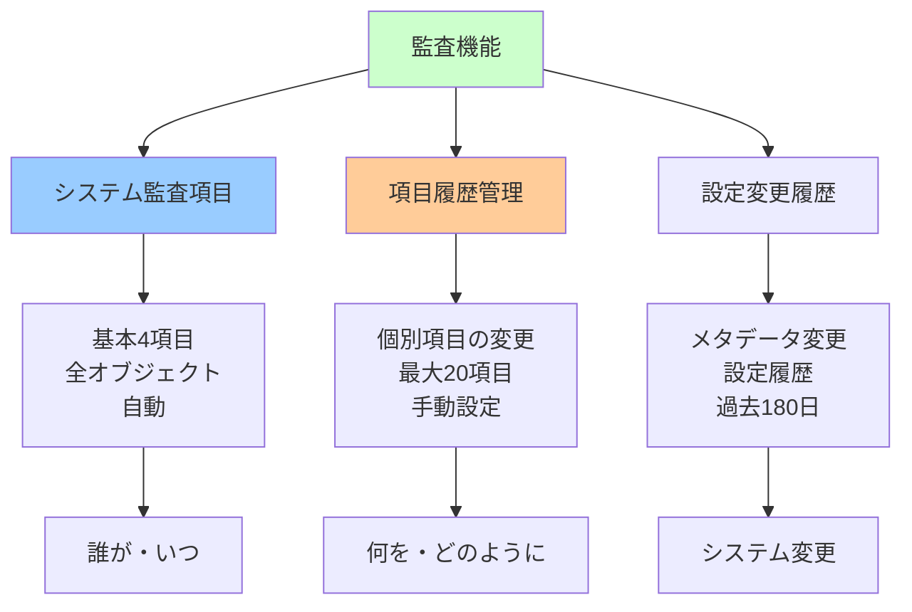
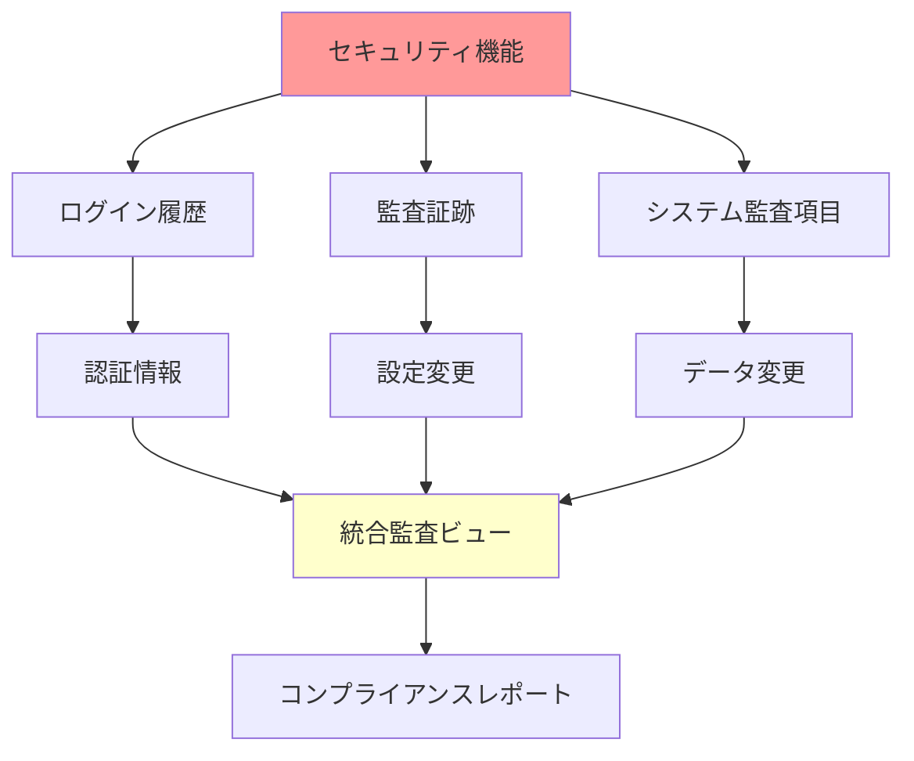
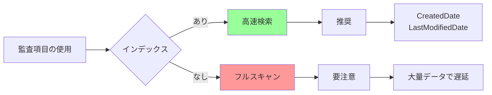

# Salesforceのシステム監査項目

## What's this file?
> [!NOTE]
> **What**
> 
> Salesforceのシステム監査項目とは何かについて記載しています。

## Conclusion (忙しいとき向け)
> [!IMPORTANT]
> **What** : システム監査項目とは何か
> 
> **Answer** : すべてのオブジェクトに自動的に追加される、レコードの作成者・作成日時・最終更新者・最終更新日時を記録する4つの読み取り専用項目で、データの変更履歴追跡とガバナンス管理に不可欠なメタデータ

## 目次

<details>
<summary>目次を開く</summary>

- [システム監査項目の概要](#システム監査項目の概要)
- [4つの基本監査項目](#4つの基本監査項目)
- [監査項目の技術的特性](#監査項目の技術的特性)
- [監査項目の活用方法](#監査項目の活用方法)
- [関連する監査機能](#関連する監査機能)
- [ベストプラクティスと注意点](#ベストプラクティスと注意点)

</details>

## システム監査項目の概要

### システム監査項目とは



### システム監査項目の目的

```yaml
主な目的:
  データガバナンス:
    - 変更責任者の明確化
    - 変更時期の記録
    - 監査証跡の提供
    
  コンプライアンス:
    - 規制要件への対応
    - 内部統制の実現
    - データ品質管理
    
  運用管理:
    - トラブルシューティング
    - パフォーマンス分析
    - ユーザー行動追跡
```

### 標準オブジェクトとカスタムオブジェクト

| オブジェクトタイプ | システム監査項目 | 追加設定 | 削除可能 |
|-------------------|-----------------|----------|----------|
| **標準オブジェクト** | 自動付与 | 不要 | 不可 |
| **カスタムオブジェクト** | 自動付与 | 不要 | 不可 |
| **外部オブジェクト** | なし | 不可 | - |
| **Big Object** | なし | 不可 | - |

## 4つの基本監査項目

### CreatedById（作成者）



### CreatedDate（作成日時）

```yaml
特性:
  データ型: DateTime
  タイムゾーン: UTC保存、表示時に変換
  精度: ミリ秒単位
  
表示形式:
  組織のデフォルト:
    - 日本: YYYY/MM/DD HH:MM
    - 米国: MM/DD/YYYY HH:MM AM/PM
    
  ユーザー設定:
    - 個人のロケール設定に従う
    - タイムゾーン自動変換
```

### LastModifiedById（最終更新者）



### LastModifiedDate（最終更新日時）

```yaml
更新トリガー:
  項目値の変更:
    - 任意の項目の更新
    - 関連リストの変更は含まない
    
  更新されないケース:
    - 子レコードの変更
    - 添付ファイルの追加
    - Chatterフィードの更新
    - 共有設定の変更
    
特殊な動作:
  ワークフロー:
    - 項目自動更新でも更新される
    - 更新者は実行ユーザー
    
  承認プロセス:
    - 承認/却下で更新
    - 更新者は承認者
```

## 監査項目の技術的特性

### API名と参照方法

| 表示名 | API名 | データ型 | 参照例 |
|--------|-------|----------|--------|
| 作成者 | CreatedById | Lookup(User) | CreatedBy.Name |
| 作成日 | CreatedDate | DateTime | CreatedDate |
| 最終更新者 | LastModifiedById | Lookup(User) | LastModifiedBy.Name |
| 最終更新日 | LastModifiedDate | DateTime | LastModifiedDate |

### SOQL での使用例

```sql
-- 基本的な監査項目の取得
SELECT Id, Name, CreatedById, CreatedDate, 
       LastModifiedById, LastModifiedDate
FROM Account
WHERE CreatedDate = TODAY

-- 作成者の詳細情報を含む
SELECT Id, Name, CreatedBy.Name, CreatedBy.Email,
       LastModifiedBy.Name, LastModifiedDate
FROM Contact
WHERE LastModifiedDate > LAST_N_DAYS:7

-- 特定ユーザーが更新したレコード
SELECT Id, Subject, LastModifiedDate
FROM Case
WHERE LastModifiedById = '005xx000001SVMX'
ORDER BY LastModifiedDate DESC
```

### レポートとダッシュボードでの活用



## 監査項目の活用方法

### データ品質管理

```yaml
古いデータの特定:
  条件設定:
    - LastModifiedDate < LAST_N_DAYS:365
    - 1年以上更新されていないレコード
    
  活用例:
    - データクレンジング対象の特定
    - アーカイブ候補の抽出
    - 顧客エンゲージメント分析

重複データの調査:
  分析方法:
    - 同時期に作成された類似レコード
    - CreatedDate が近い
    - CreatedById が同じ
    
  対処:
    - マージ候補の特定
    - データ入力ルールの改善
```

### ユーザー監視とコンプライアンス



### ワークフロー最適化

| 活用シーン | 監査項目の使い方 | 効果 |
|------------|-----------------|------|
| **SLA管理** | CreatedDateからの経過時間 | 対応時間の可視化 |
| **エスカレーション** | LastModifiedDateの停滞 | 放置案件の検出 |
| **生産性測定** | CreatedByIdの集計 | 個人/チーム評価 |
| **ボトルネック分析** | 更新間隔の計測 | プロセス改善 |

## 関連する監査機能

### 項目履歴管理との関係



### フィード追跡との違い

```yaml
システム監査項目:
  特徴:
    - 最新の情報のみ保持
    - 4項目固定
    - 削除不可
    
  用途:
    - 現在の状態確認
    - 基本的な追跡
    
フィード追跡:
  特徴:
    - 変更履歴を保持
    - 項目選択可能
    - Chatterと連携
    
  用途:
    - 詳細な変更追跡
    - コラボレーション
```

### セキュリティとの関連



## ベストプラクティスと注意点

### 活用のベストプラクティス

```yaml
レポート作成:
  推奨事項:
    - 定期的な監査レポートの作成
    - ダッシュボードでの可視化
    - 異常値アラートの設定
    
  レポートタイプ:
    - ユーザー活動レポート
    - データ品質レポート
    - コンプライアンスレポート

自動化:
  プロセスビルダー:
    - 長期間更新なしアラート
    - 担当者変更時の通知
    
  フロー:
    - データ品質チェック
    - 自動エスカレーション

データ保持:
  アーカイブ戦略:
    - LastModifiedDate基準
    - 段階的なアーカイブ
    - 監査要件の考慮
```

### 注意事項と制限

| 項目 | 注意点 | 対策 |
|------|--------|------|
| **更新不可** | 監査項目は直接編集不可 | データローダーでも変更不可 |
| **タイムゾーン** | UTC で保存 | 表示時の変換に注意 |
| **一括更新** | 大量更新で同一時刻 | バッチサイズの調整 |
| **削除レコード** | ごみ箱でも保持 | 完全削除まで残る |

### パフォーマンスへの影響



### トラブルシューティング

```yaml
よくある問題:
  時刻のずれ:
    原因: タイムゾーン設定
    解決: ユーザー設定確認
    
  更新者が不明:
    原因: 統合ユーザー使用
    解決: 統合ユーザーの識別
    
  一括更新の追跡:
    原因: 同時刻の大量更新
    解決: バッチIDの活用
    
  監査項目が見えない:
    原因: 項目レベルセキュリティ
    解決: 通常は全員参照可
```

## 関連

- [Salesforceのオブジェクト間の関連性](2025.08.12.22.25_how_salesforce_objects_relate_each_other.md)
- [Salesforceの標準オブジェクトとレコード種別](2025.08.12.22.03_what_salesforce_standard_objects_by_records.md)
- [Salesforce Help: システム項目](https://help.salesforce.com/s/articleView?id=sf.fields_system_fields.htm&type=5)
- [Salesforce Help: 項目履歴管理](https://help.salesforce.com/s/articleView?id=sf.tracking_field_history.htm&type=5)
- [Salesforce Developer: 監査項目の活用](https://developer.salesforce.com/docs/atlas.en-us.object_reference.meta/object_reference/system_fields.htm)
- [Trailhead: データ品質の基本](https://trailhead.salesforce.com/ja/content/learn/modules/data_quality)