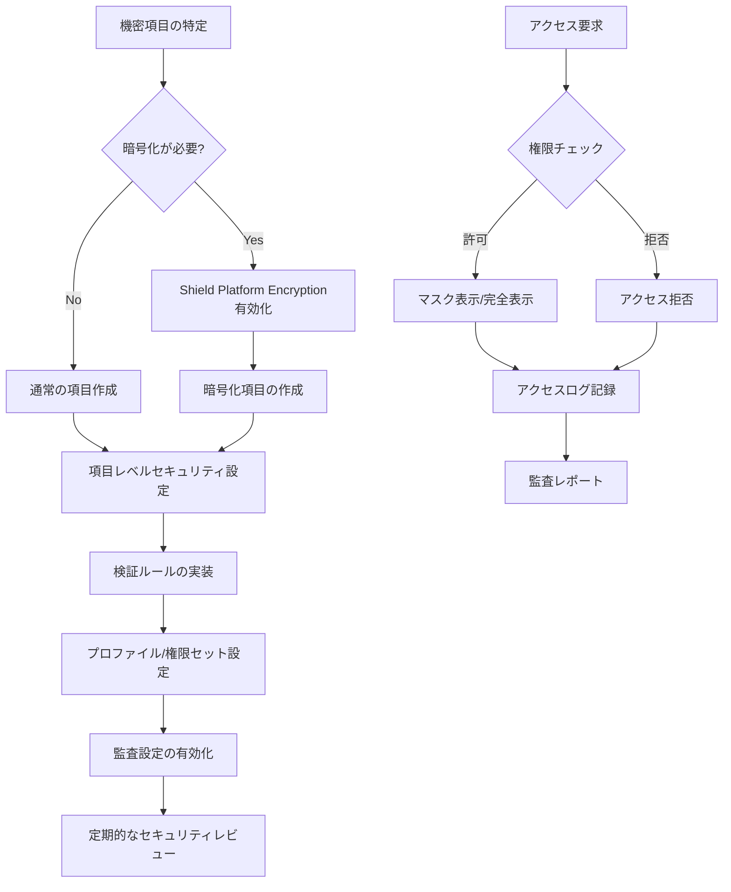

# Salesforceでクレジットカード番号などの機密項目のセキュリティを強制する方法

## What's this file?
> [!NOTE]
> **How**
> 
> どのようにSalesforceでクレジットカード番号などの機密情報を含む項目のセキュリティを強制するかについて記載しています。

## Conclusion (忙しいとき向け)
> [!IMPORTANT]
> **How** : どのようにSalesforceで機密項目のセキュリティを強制するか
> 
> **Answer** : 暗号化項目、項目レベルセキュリティ、検証ルール、プロファイル/権限セット、監査証跡を組み合わせて実装

## 目次

<details>
<summary>目次を開く</summary>

- [暗号化項目の設定](#暗号化項目の設定)
- [項目レベルセキュリティの設定](#項目レベルセキュリティの設定)
- [検証ルールの実装](#検証ルールの実装)
- [プロファイルと権限セットの管理](#プロファイルと権限セットの管理)
- [監査とコンプライアンス](#監査とコンプライアンス)
- [セキュリティ実装フロー](#セキュリティ実装フロー)

</details>

## 暗号化項目の設定

### Shield Platform Encryptionの有効化
- 設定 → セキュリティ → Platform Encryption
- 暗号化ポリシーの作成
- テナントシークレットの生成

### 暗号化項目の作成
```
項目の種類: テキスト（暗号化）
- 最大長: 16文字（クレジットカード番号用）
- マスク文字: *
- マスクタイプ: 最後の4桁を表示
```

## 項目レベルセキュリティの設定

### プロファイルごとの制御
1. 設定 → オブジェクトマネージャー → 対象オブジェクト選択
2. 項目とリレーション → クレジットカード番号項目
3. 項目レベルセキュリティの設定
   - 参照可能: 必要な役割のみ
   - 編集可能: より限定的に設定

### 権限セットでの細かい制御
```
権限セット名: CreditCard_Handler
- オブジェクトの設定
  - 対象オブジェクト: 読み取り、編集
  - クレジットカード番号項目: 読み取り、編集
```

## 検証ルールの実装

### クレジットカード番号の形式チェック
```formula
AND(
  NOT(ISBLANK(Credit_Card_Number__c)),
  NOT(REGEX(Credit_Card_Number__c, "^[0-9]{13,19}$"))
)
```
エラーメッセージ: "クレジットカード番号は13〜19桁の数字で入力してください"

### Luhnアルゴリズムの実装（簡易版）
```formula
NOT(MOD(
  VALUE(MID(Credit_Card_Number__c, 1, 1)) * 2 +
  VALUE(MID(Credit_Card_Number__c, 2, 1)) +
  /* ... 残りの桁の計算 ... */
  , 10) = 0
)
```

## プロファイルと権限セットの管理

### 役割ベースのアクセス制御
1. **一般ユーザー**
   - クレジットカード番号: 参照不可
   
2. **カスタマーサポート**
   - クレジットカード番号: マスク表示のみ参照可
   
3. **支払い処理担当**
   - クレジットカード番号: 参照・編集可

### APIアクセスの制限
- Connected Appの設定でOAuthスコープを制限
- APIユーザーには最小限の権限のみ付与

## 監査とコンプライアンス

### 項目履歴管理
1. オブジェクトの設定で「履歴管理を有効化」
2. クレジットカード番号項目を履歴管理対象に追加

### 監査証跡の設定
- ログイン履歴の監視
- 項目へのアクセスログ
- データエクスポートの記録

### Event Monitoringの活用
```SOQL
SELECT EventType, UserId, EventDate, Query
FROM EventLogFile
WHERE EventType IN ('Report', 'API', 'RestApi')
AND Query LIKE '%Credit_Card_Number__c%'
```

## セキュリティ実装フロー



## 関連
- [Salesforce Shield](https://help.salesforce.com/s/articleView?id=sf.security_pe_overview.htm)
- [項目レベルセキュリティ](https://help.salesforce.com/s/articleView?id=sf.admin_fls.htm)
- [PCI DSS コンプライアンス](https://compliance.salesforce.com/en/pci)
- [検証ルールの作成](https://help.salesforce.com/s/articleView?id=sf.validation_rules.htm)