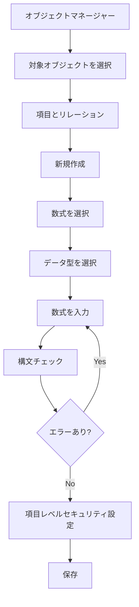

# Salesforceの数式項目とは

## What's this file?
> [!NOTE]
> **What**
> 
> Salesforceの数式項目とは何かについて記載しています。

## Conclusion (忙しいとき向け)
> [!IMPORTANT]
> **What** : Salesforceの数式項目とは何か
> 
> **Answer** : 他の項目の値や関数を使用して自動的に計算される読み取り専用の項目です。Excelの数式のように、リアルタイムで計算結果を表示します。

## 目次

<details>
<summary>目次を開く</summary>

- [数式項目の概要](#数式項目の概要)
- [数式項目の特徴](#数式項目の特徴)
- [数式項目の作成フロー](#数式項目の作成フロー)
- [数式項目の種類](#数式項目の種類)
- [よく使われる関数](#よく使われる関数)
- [使用例](#使用例)
- [制限事項](#制限事項)

</details>

## 数式項目の概要

数式項目は、Salesforceで他の項目の値を参照して自動的に計算される特殊な項目タイプです。データベースに値を保存せず、レコードが表示されるたびにリアルタイムで計算されます。

## 数式項目の特徴

### 主な特徴
- **読み取り専用**: ユーザーが直接編集することはできません
- **リアルタイム計算**: レコードを表示するたびに最新の値を計算
- **データ非保存**: データベースに値を保存しないため、ストレージを消費しません
- **自動更新**: 参照元の項目が更新されると自動的に再計算

### メリット
1. データの一貫性を保証
2. 手動計算のミスを防止
3. ストレージ容量の節約
4. メンテナンスが容易

## 数式項目の作成フロー



## 数式項目の種類

### 返り値のデータ型
1. **チェックボックス**: TRUE/FALSE を返す
2. **通貨**: 金額を返す
3. **日付**: 日付のみを返す
4. **日付/時間**: 日付と時刻を返す
5. **数値**: 整数または小数を返す
6. **パーセント**: パーセンテージを返す
7. **テキスト**: 文字列を返す
8. **時間**: 時間を返す

## よく使われる関数

### 基本的な関数
```
// テキスト関連
UPPER(text) - 大文字に変換
LOWER(text) - 小文字に変換
CONCATENATE(text1, text2) - 文字列結合
LEFT(text, num) - 左から指定文字数取得

// 日付関連
TODAY() - 今日の日付
NOW() - 現在の日時
YEAR(date) - 年を取得
MONTH(date) - 月を取得

// 条件関数
IF(condition, true_value, false_value) - 条件分岐
CASE(expression, value1, result1, value2, result2, ..., else_result) - 複数条件分岐
ISBLANK(field) - 空白チェック
ISPICKVAL(picklist_field, value) - 選択リスト値チェック
```

## 使用例

### 1. 商談の利益率計算
```
(Amount - Cost__c) / Amount * 100
```

### 2. リードの経過日数
```
TODAY() - CreatedDate
```

### 3. フルネームの生成
```
LastName & " " & FirstName
```

### 4. 商談ステージに基づく確度
```
CASE(StageName,
  "Prospecting", 10,
  "Qualification", 20,
  "Needs Analysis", 40,
  "Value Proposition", 60,
  "Decision Makers", 80,
  "Closed Won", 100,
  0)
```

### 5. 期限切れチェック
```
IF(CloseDate < TODAY(), "期限切れ", "有効")
```

## 制限事項

### 技術的制限
- **文字数制限**: 数式は最大5,000文字
- **コンパイルサイズ**: 最大5,000バイト
- **相互参照**: 数式項目は他の数式項目を参照できるが、循環参照は不可
- **SOQL**: WHERE句やORDER BY句では使用できない場合がある

### パフォーマンスへの影響
- 複雑な数式は表示速度に影響する可能性
- 多数のレコードを表示する際は注意が必要

### その他の制限
- ロングテキストエリア項目は参照不可
- 活動（Task/Event）の一部項目は参照不可
- 一部の標準項目は数式で使用不可

## 関連

- [Salesforce Help - 数式項目](https://help.salesforce.com/s/articleView?id=sf.customize_formuladef.htm)
- ロールアップサマリー項目（親子関係での集計）
- プロセスビルダー/フロー（より複雑な自動化）
- Apexトリガー（プログラムによる計算）