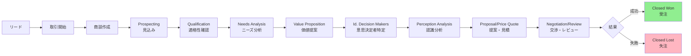
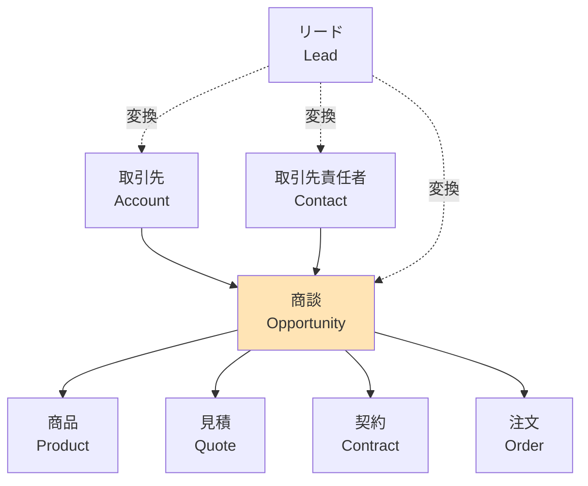

# Salesforceの商談（Opportunity）とは

## What's this file?
> [!NOTE]
> **What**
> 
> Salesforceの商談（Opportunity）とは何かについて記載しています。

## Conclusion (忙しいとき向け)
> [!IMPORTANT]
> **What** : Salesforceの商談（Opportunity）とは何か
> 
> **Answer** : 営業活動における収益の可能性を持つ取引を管理する標準オブジェクトです。見込み客や既存顧客との具体的な商談を追跡し、売上予測や営業プロセスの管理に使用されます。

## 目次

<details>
<summary>目次を開く</summary>

- [商談の概要](#商談の概要)
- [商談の主要項目](#商談の主要項目)
- [商談のライフサイクル](#商談のライフサイクル)
- [商談と他のオブジェクトの関係](#商談と他のオブジェクトの関係)
- [商談の種類](#商談の種類)
- [商談の管理機能](#商談の管理機能)
- [商談の活用シーン](#商談の活用シーン)

</details>

## 商談の概要

商談（Opportunity）は、Salesforceの中核となる標準オブジェクトの一つで、営業活動における収益機会を表現します。潜在的な売上から実際の受注まで、営業プロセス全体を可視化し管理することができます。

### 商談の特徴
- **売上予測**: 金額と確度に基づいた収益予測
- **フェーズ管理**: 営業プロセスの各段階を追跡
- **期限管理**: 商談のクローズ予定日を設定
- **チーム営業**: 複数の営業担当者での協業が可能

## 商談の主要項目

### 必須項目
1. **商談名**: 商談を識別する名前
2. **完了予定日**: 商談がクローズする予定日
3. **フェーズ**: 商談の現在の段階
4. **取引先**: 関連する取引先（Account）

### 重要な項目
- **金額**: 商談の予想収益額
- **確度（%）**: 成約の可能性をパーセンテージで表示
- **種別**: 新規ビジネス、既存ビジネスなどの分類
- **リードソース**: 商談の発生源
- **次のステップ**: 次に行うべきアクション
- **商談所有者**: 責任者となるユーザー

## 商談のライフサイクル



## 商談と他のオブジェクトの関係



### 関連オブジェクトの説明
- **取引先（Account）**: 商談は必ず取引先に紐づく
- **取引先責任者（Contact）**: 商談に関わる担当者を複数設定可能
- **商品（Product）**: 商談で販売する製品やサービス
- **見積（Quote）**: 商談から生成される正式な見積書
- **契約（Contract）**: 受注後の契約情報

## 商談の種類

### 1. 新規ビジネス
- 新しい顧客との初めての取引
- リードから変換された商談
- 市場開拓や新規開拓活動

### 2. 既存ビジネス
- 既存顧客への追加販売（アップセル）
- 関連商品の販売（クロスセル）
- 契約更新

### 3. パートナービジネス
- パートナー経由の商談
- 共同提案
- 紹介案件

## 商談の管理機能

### 売上予測
- **予測カテゴリ**: パイプライン、ベストケース、達成予測、クローズ済み
- **予測金額**: 金額 × 確度で自動計算
- **四半期・月次予測**: 期間別の集計

### 商談チーム
- 複数の営業担当者でチームを構成
- 役割の定義（営業責任者、技術担当、マネージャーなど）
- 収益分配の設定

### 競合管理
- 競合他社の情報を記録
- 強み・弱みの分析
- 対策の記録

### 商談履歴
- フェーズ変更の履歴
- 金額変更の追跡
- 活動履歴（メール、電話、商談など）

## 商談の活用シーン

### 1. 営業プロセス管理
```
- 各フェーズでの必須タスクの設定
- 承認プロセスの実装
- 自動化されたフォローアップ
```

### 2. レポートとダッシュボード
```
- パイプライン分析
- 勝率分析
- 営業担当者別パフォーマンス
- 商談ソース別分析
```

### 3. 売上予測
```
- 個人・チーム・組織レベルの予測
- シナリオプランニング
- 達成率のモニタリング
```

### 4. 営業生産性向上
```
- 商談の優先順位付け
- ネクストベストアクションの提案
- 成功パターンの分析と共有
```

## 関連

- [Salesforce Help - 商談の管理](https://help.salesforce.com/s/articleView?id=sf.opportunities.htm)
- リード管理（Lead Management）
- 取引先と取引先責任者（Account & Contact）
- 商品と価格表（Product & Price Book）
- 見積と契約（Quote & Contract）
- 売上予測（Forecasting）