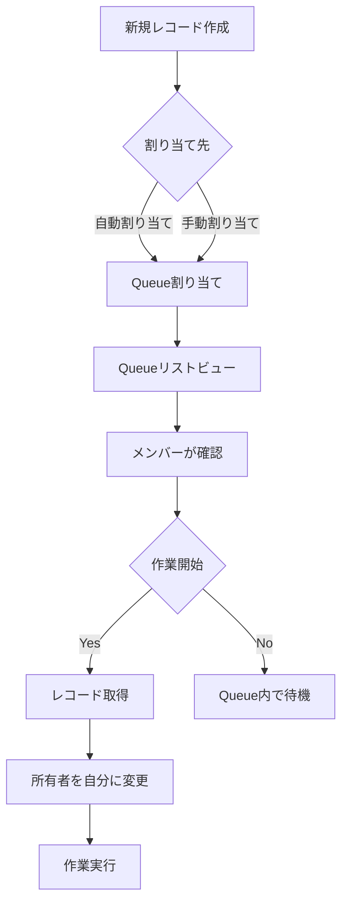
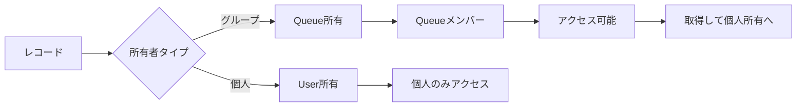
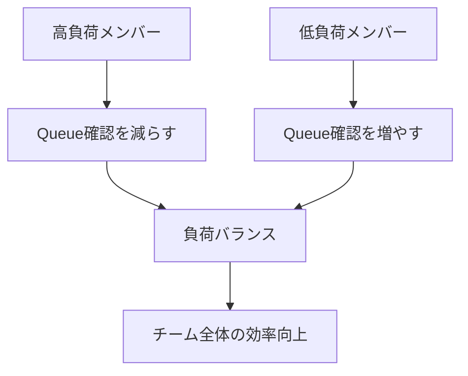

# SalesforceのQueue（キュー）とは何か

## What's this file?
> [!NOTE]
> **What**
> 
> SalesforceのQueue（キュー）とは何かについて記載しています。

## Conclusion (忙しいとき向け)
> [!IMPORTANT]
> **What** : SalesforceのQueue（キュー）とは何か
> 
> **Answer** : Queueは複数のユーザーが共有できるレコードの待ち行列で、チームメンバーが自分の処理能力に応じてレコードを取得して作業できる、効率的な作業分配システムです。

## 目次

目次を開く

- [Queueの基本概念](#queueの基本概念)
- [Queueの構成要素](#queueの構成要素)
- [Queueの動作フロー](#queueの動作フロー)
- [Queueが使用できるオブジェクト](#queueが使用できるオブジェクト)
- [QueueとOwnershipの関係](#queueとownershipの関係)
- [Queueの活用シーン](#queueの活用シーン)

## Queueの基本概念

Salesforce Queueは、複数のユーザーがレコードを共有して処理するための仕組みです。個人に直接割り当てるのではなく、グループ（Queue）に割り当てることで、メンバーが柔軟に作業を取得できます。

### Queueの特徴
- **共有所有権**: レコードは個人ではなくQueueが所有
- **プル型の作業分配**: ユーザーが自主的にレコードを取得
- **負荷分散**: チーム全体で作業を効率的に分配

## Queueの構成要素

### 1. Queue自体
- **名前**: キューの識別名
- **メールアドレス**: キュー専用のメール（オプション）
- **サポート対象オブジェクト**: Lead、Case、カスタムオブジェクトなど

### 2. Queueメンバー
- **ユーザー**: 個別のSalesforceユーザー
- **ロール**: 特定のロールに属する全ユーザー
- **ロール＆下位ロール**: ロール階層を含む
- **公開グループ**: 事前定義されたユーザーグループ

## Queueの動作フロー

### プロセスの詳細
1. **レコード作成・割り当て**: 新規レコードがQueueに割り当てられる
2. **リストビュー表示**: Queueメンバーがリストビューで確認
3. **レコード取得**: メンバーが処理するレコードを選択
4. **所有者変更**: 自分を所有者に設定して作業開始

## Queueが使用できるオブジェクト

### 標準オブジェクト
- **Lead**: リード管理での初期対応
- **Case**: カスタマーサポートのケース処理
- **Order**: 注文処理
- **Service Contract**: サービス契約

### カスタムオブジェクト
- **有効化が必要**: カスタムオブジェクトの設定で「キューでの使用を許可」をチェック

## QueueとOwnershipの関係

### 所有権の移行
1. **Queue所有**: 複数メンバーがアクセス可能
2. **個人取得**: Queueから個人所有に変更
3. **再割り当て**: 必要に応じてQueueに戻すことも可能

## Queueの活用シーン

### 1. カスタマーサポート
- **新規ケース**: サポートキューに自動割り当て
- **スキル別Queue**: 技術、請求、一般問い合わせなど
- **優先度別Queue**: 緊急、通常、低優先度

### 2. リード管理
- **地域別Queue**: 東日本、西日本などの地域別
- **製品別Queue**: 製品カテゴリごとの専門チーム
- **言語別Queue**: 英語対応、日本語対応など

### 3. 作業負荷の調整

## 関連
- Assignment Rules（割り当てルール）
- List Views（リストビュー）
- Public Groups（公開グループ）
- Omni-Channel（オムニチャネル）- より高度なルーティング
- Queue Email（キューメール設定）