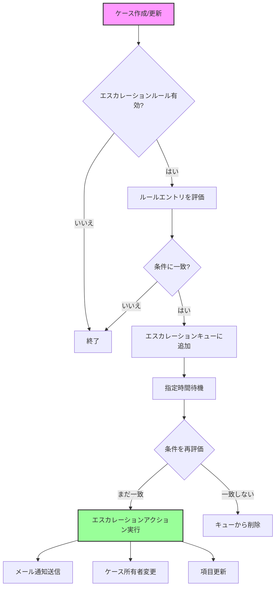

# Salesforceのエスカレーションルールとは

## What's this file?
> [!NOTE]
> **What**
> 
> Salesforceのエスカレーションルールとは何かについて記載しています。

## Conclusion (忙しいとき向け)
> [!IMPORTANT]
> **What** : Salesforceのエスカレーションルールとは何か
> 
> **Answer** : ケースが一定時間内に解決されない場合に、自動的に上位の担当者やチームに通知・割り当てを行うための自動化ルール

## 目次

<details>
<summary>目次を開く</summary>

- [概要](#概要)
- [主な構成要素](#主な構成要素)
- [エスカレーションルールの仕組み](#エスカレーションルールの仕組み)
- [設定例](#設定例)
- [ベストプラクティス](#ベストプラクティス)

</details>

## 概要

エスカレーションルールは、Salesforceのサービスクラウドで利用できる機能で、ケースが特定の条件を満たした際に自動的にエスカレーション（上申）を行います。これにより、重要なケースやSLAに違反しそうなケースを適切に管理できます。

## 主な構成要素

### 1. エスカレーションルール
- 組織に1つのみ有効化可能
- 複数のエントリを含むことができる

### 2. ルールエントリ
- エスカレーションルール内の個別の条件セット
- 条件、ビジネス時間、エスカレーションアクションを定義

### 3. エスカレーションアクション
- 指定時間経過後に実行されるアクション
- 最大5つのアクションを設定可能

## エスカレーションルールの仕組み



## 設定例

### ルールエントリの例

```
エントリ名: 優先度「高」のケース
条件: 
  - ケースの優先度 = 高
  - ステータス ≠ クローズ
ビジネス時間: 営業時間（9:00-18:00）

エスカレーションアクション:
  1. 30分後: サポートマネージャーにメール通知
  2. 2時間後: ケース所有者をシニアサポートチームに変更
  3. 4時間後: 部門長にメール通知、優先度を「緊急」に更新
```

## ベストプラクティス

### 1. シンプルな条件設定
- 複雑すぎる条件は避ける
- 明確で理解しやすい基準を使用

### 2. 段階的なエスカレーション
- 軽度なアクションから開始
- 徐々に重要度を上げる

### 3. ビジネス時間の活用
- 営業時間外を考慮
- 休日カレンダーを設定

### 4. テスト環境での検証
- 本番環境適用前に必ずテスト
- エスカレーションタイミングの確認

### 5. 定期的な見直し
- エスカレーション頻度の監視
- ルールの効果測定と調整

## 関連
- [Salesforceケース管理](https://help.salesforce.com/s/articleView?id=sf.cases_def.htm)
- [サービスレベル契約（SLA）](https://help.salesforce.com/s/articleView?id=sf.entitlements_overview.htm)
- [ワークフロールール](https://help.salesforce.com/s/articleView?id=sf.workflow_rules_new.htm)
- [プロセスビルダー](https://help.salesforce.com/s/articleView?id=sf.process_overview.htm)