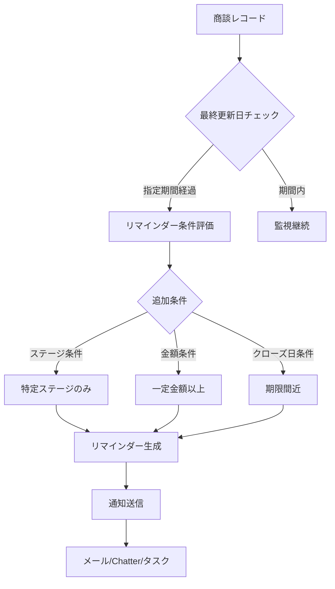
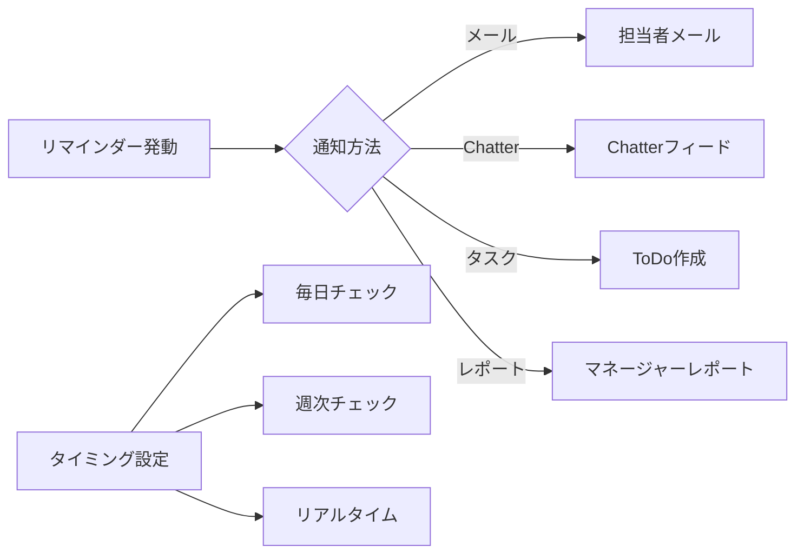
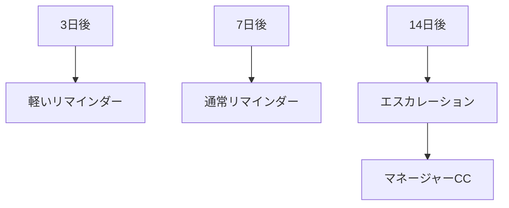

# SalesforceのOpportunity Update Reminder（商談更新リマインダー）とは何か

## What's this file?
> [!NOTE]
> **What**
> 
> SalesforceのOpportunity Update Reminder（商談更新リマインダー）とは何かについて記載しています。

## Conclusion (忙しいとき向け)
> [!IMPORTANT]
> **What** : SalesforceのOpportunity Update Reminder（商談更新リマインダー）とは何か
> 
> **Answer** : Opportunity Update Reminderは、一定期間更新されていない商談について営業担当者に自動的にリマインダーを送信する機能で、商談の停滞を防ぎ、パイプライン管理の精度を向上させるための仕組みです。

## 目次

目次を開く

- [Opportunity Update Reminderの基本概念](#opportunity-update-reminderの基本概念)
- [リマインダーの動作フロー](#リマインダーの動作フロー)
- [設定可能な条件](#設定可能な条件)
- [通知方法とタイミング](#通知方法とタイミング)
- [ベストプラクティス](#ベストプラクティス)

## Opportunity Update Reminderの基本概念

Opportunity Update Reminderは、商談（Opportunity）の更新が一定期間行われていない場合に、営業担当者やマネージャーに自動的に通知を送る機能です。これにより、商談の停滞を早期に発見し、適切なアクションを促すことができます。

### 主な目的
- **商談の停滞防止**: 長期間放置された商談の発見
- **パイプライン精度向上**: 定期的な更新による正確な予測
- **営業活動の可視化**: マネージャーによる活動状況の把握

## リマインダーの動作フロー

### プロセスの詳細
1. **定期的な監視**: システムが商談の最終更新日を定期的にチェック
2. **条件評価**: 設定された条件（日数、ステージ等）を評価
3. **リマインダー生成**: 条件に合致した商談について通知を作成
4. **通知配信**: 担当者やマネージャーに通知を送信

## 設定可能な条件

### 基本条件
- **更新されていない日数**: 3日、7日、14日、30日など
- **商談ステージ**: 特定のステージ（提案中、交渉中など）のみ対象
- **商談金額**: 一定金額以上の重要商談のみ

### 高度な条件
- **クローズ予定日との関係**: 期限が近い商談を優先
- **商談タイプ**: 新規/既存、製品別など
- **担当者の属性**: 特定のチームやロールのみ

## 通知方法とタイミング

### 通知の種類
1. **メール通知**
   - 件名: "商談更新リマインダー: [商談名]"
   - 本文: 最終更新日、現在のステージ、推奨アクション

2. **Chatter通知**
   - 商談レコードのフィードに投稿
   - @メンションで担当者に通知

3. **タスク作成**
   - "商談を更新してください"というタスクを自動作成
   - 期限日を設定可能

## ベストプラクティス

### 1. 段階的なリマインダー設定

### 2. ステージ別の設定
- **初期ステージ**: 更新頻度は低めに設定（7-14日）
- **中間ステージ**: 頻繁な更新を要求（3-5日）
- **最終ステージ**: 毎日の更新を推奨

### 3. 例外設定
- **長期商談**: 通常より長い期間を設定
- **保留中**: リマインダーを一時停止
- **季節性商談**: 特定期間のみ有効化

### 4. 効果測定
- リマインダー送信数の追跡
- 更新率の改善度測定
- 商談サイクルタイムへの影響分析

## 関連
- Opportunity Management（商談管理）
- Sales Cloud（セールスクラウド）
- Process Builder（プロセスビルダー）
- Flow Builder（フロービルダー）
- Email Alerts（メールアラート）
- Time-based Workflow（時間ベースワークフロー）