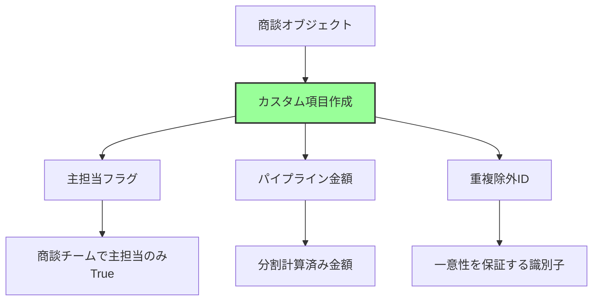
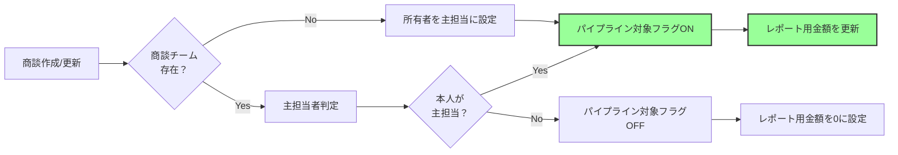

# Salesforceでパイプラインの商談重複カウントを回避する方法

## What's this file?
> [!NOTE]
> **How**
> 
> どのようにSalesforceでパイプラインの商談重複カウントを回避するかについて記載しています。

## Conclusion (忙しいとき向け)
> [!IMPORTANT]
> **How** : どのようにパイプラインの商談重複カウントを回避するか
> 
> **Answer** : カスタムレポートタイプの作成、重複検出ルールの設定、レポートでの適切なグルーピングとフィルタリングを組み合わせて実装する

## 目次

<details>
<summary>目次を開く</summary>

- [商談の重複カウント問題とは](#商談の重複カウント問題とは)
- [重複が発生する主な原因](#重複が発生する主な原因)
- [解決方法1: レポートでの対策](#解決方法1-レポートでの対策)
- [解決方法2: データモデルでの対策](#解決方法2-データモデルでの対策)
- [解決方法3: プロセス自動化での対策](#解決方法3-プロセス自動化での対策)
- [実装例](#実装例)

</details>

## 商談の重複カウント問題とは

パイプラインレポートで同一商談が複数回カウントされ、売上予測が実際より大きく表示される問題です。これにより、経営判断に影響を与える可能性があります。

## 重複が発生する主な原因

### 1. 商談チームの使用
- 複数のチームメンバーが関与
- 各メンバーごとに商談がカウント

### 2. 商談商品の複数登録
- 同一商談に複数商品
- 商品ごとに商談金額がカウント

### 3. 履歴トレンドレポート
- 期間内の変更履歴
- ステージ変更ごとに重複カウント

### 4. 関連オブジェクトの結合
- 不適切なJOIN条件
- 1対多の関係での重複

## 解決方法1: レポートでの対策

### レポートタイプの選択
```
推奨: 商談（主オブジェクト）のみ
避ける: 商談と商談商品
　　　　商談と商談チーム
```

### グルーピングとサマリー
```
1. 商談IDでグルーピング
2. 金額フィールドはMAX関数を使用
3. 重複除外（ユニーク）カウントを活用
```

### フィルター条件
```
- 主担当者のみ表示（商談チーム使用時）
- アクティブな商談のみ
- 特定のレコードタイプに限定
```

## 解決方法2: データモデルでの対策

### カスタム項目の作成



### 集計用オブジェクトの作成
```
パイプラインサマリーオブジェクト
├── 期間（月/四半期）
├── 担当者
├── 商談金額合計
└── 商談数（重複なし）
```

## 解決方法3: プロセス自動化での対策

### フローによる自動更新



### Apexトリガーでの制御
```apex
trigger OpportunityDuplicatePrevention on Opportunity (before insert, before update) {
    for (Opportunity opp : Trigger.new) {
        // 商談チームの主担当チェック
        if (opp.HasOpportunityTeam) {
            opp.Pipeline_Amount__c = calculatePipelineAmount(opp);
        } else {
            opp.Pipeline_Amount__c = opp.Amount;
        }
    }
}
```

## 実装例

### 1. カスタムレポートタイプ
```
名前: パイプライン分析（重複なし）
主オブジェクト: 商談
関連オブジェクト: なし
フィールド:
  - 商談ID
  - パイプライン金額（カスタム）
  - 主担当フラグ
  - ステージ
  - 完了予定日
```

### 2. レポートフィルター
```
条件:
  - 主担当フラグ = True
  - ステージ != Closed Won/Lost
  - 完了予定日 = 今四半期
  - レコードタイプ = 新規ビジネス
```

### 3. ダッシュボード設定
```
コンポーネント: パイプライン推移
  - X軸: 月
  - Y軸: パイプライン金額（SUM）
  - グルーピング: なし（重複防止済み）
```

### 4. 検証ルール
```
ルール名: 商談金額整合性チェック
エラー条件: 
  AND(
    HasOpportunityTeam,
    Pipeline_Amount__c > Amount
  )
エラーメッセージ: パイプライン金額が商談金額を超えています
```

## 関連
- [Salesforceレポートとダッシュボード](https://help.salesforce.com/s/articleView?id=sf.reports_dashboards.htm)
- [商談チーム管理](https://help.salesforce.com/s/articleView?id=sf.opportunity_teams_overview.htm)
- [カスタムレポートタイプ](https://help.salesforce.com/s/articleView?id=sf.reports_defining_report_types.htm)
- [重複管理](https://help.salesforce.com/s/articleView?id=sf.duplicate_management_overview.htm)