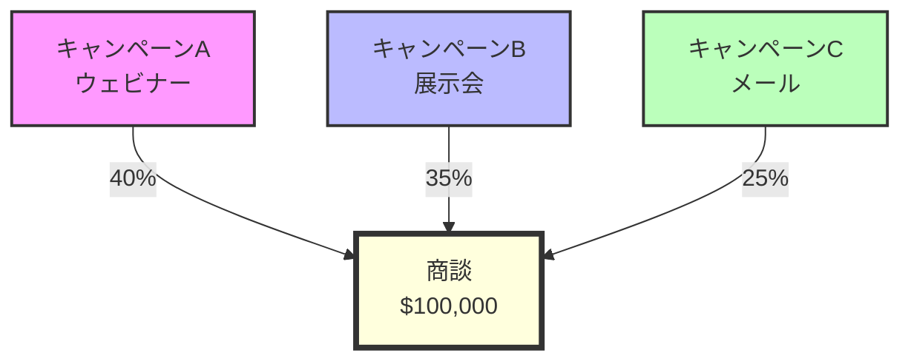
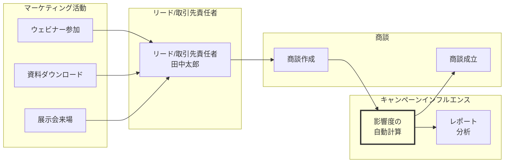

# Salesforceのキャンペーンインフルエンスとは

## What's this file?
> [!NOTE]
> **What**
> 
> Salesforceのキャンペーンインフルエンスとは何かについて記載しています。

## Conclusion (忙しいとき向け)
> [!IMPORTANT]
> **What** : キャンペーンインフルエンスとは何か
> 
> **Answer** : キャンペーンインフルエンスは、マーケティングキャンペーンが商談（Opportunity）に与えた影響を追跡・分析するSalesforceの機能です。複数のキャンペーンが1つの商談に貢献した場合、それぞれのキャンペーンの影響度を数値化して管理することができます。

## 目次

目次を開く

- [キャンペーンインフルエンスの概要](#キャンペーンインフルエンスの概要)
- [キャンペーンインフルエンスの種類](#キャンペーンインフルエンスの種類)
- [キャンペーンインフルエンスのモデル](#キャンペーンインフルエンスのモデル)
- [キャンペーンインフルエンスの仕組み](#キャンペーンインフルエンスの仕組み)
- [キャンペーンインフルエンスの活用場面](#キャンペーンインフルエンスの活用場面)

## キャンペーンインフルエンスの概要

キャンペーンインフルエンスは、Salesforceにおいてマーケティング活動の効果を測定するための重要な機能です。これにより、どのマーケティングキャンペーンが商談の成立に貢献したのかを可視化し、ROI（投資対効果）を正確に把握することができます。

### 主な特徴
- **複数キャンペーンの影響を追跡**: 1つの商談に対して複数のキャンペーンの貢献度を記録
- **影響度の数値化**: 各キャンペーンの影響をパーセンテージや金額で表現
- **自動割り当て**: ルールに基づいて影響度を自動的に計算・割り当て

## キャンペーンインフルエンスの種類

### 1. キャンペーンインフルエンス 1.0（従来版）
- 基本的なキャンペーン追跡機能
- 主キャンペーンのみを追跡
- シンプルな影響度の管理

### 2. キャンペーンインフルエンス 2.0（カスタマイザブルキャンペーンインフルエンス）
- より高度な追跡機能
- 複数のキャンペーンの影響を同時追跡
- カスタマイズ可能な属性モデル
- 自動関連付けルールの設定

## キャンペーンインフルエンスのモデル

### デフォルトモデル

### カスタムモデルの例

1. **ファーストタッチモデル**: 最初のキャンペーンに100%の影響度を割り当て
2. **ラストタッチモデル**: 最後のキャンペーンに100%の影響度を割り当て
3. **均等配分モデル**: すべてのキャンペーンに均等に影響度を配分
4. **時間減衰モデル**: 商談に近いキャンペーンほど高い影響度を割り当て

## キャンペーンインフルエンスの仕組み

### 自動関連付けのプロセス
1. **キャンペーンメンバーの追跡**: リードや取引先責任者のキャンペーン参加履歴を記録
2. **商談との関連付け**: 商談作成時に関連するキャンペーンメンバーを特定
3. **影響度の計算**: 設定されたモデルに基づいて各キャンペーンの影響度を算出
4. **レコードの作成**: キャンペーンインフルエンスレコードを自動生成

## キャンペーンインフルエンスの活用場面

### 1. マーケティングROIの測定
- キャンペーンごとの収益貢献度を正確に把握
- 投資対効果の高いキャンペーンを特定

### 2. マーケティング戦略の最適化
- 効果的なキャンペーンの組み合わせを発見
- リソース配分の最適化

### 3. セールスとマーケティングの連携強化
- 商談に貢献したマーケティング活動の可視化
- 営業チームへの有益な情報提供

### 4. レポートと分析
- キャンペーン別の商談影響額レポート
- マルチタッチアトリビューション分析
- キャンペーンパフォーマンスのダッシュボード

## 関連
- [Salesforceのキャンペーンオブジェクト](./2025.08.12.22.09_what_salesforce_campaign_related_objects.md)
- [Salesforceの商談（Opportunity）](./2025.08.13.06.57_what_salesforce_opportunity.md)
- Salesforceのレポートとダッシュボード
- マーケティングアトリビューションモデル