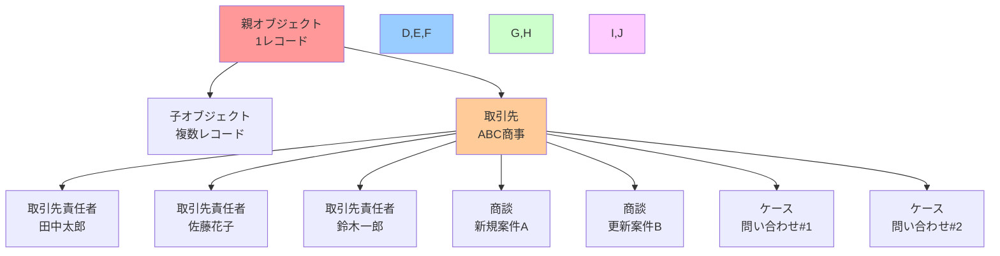
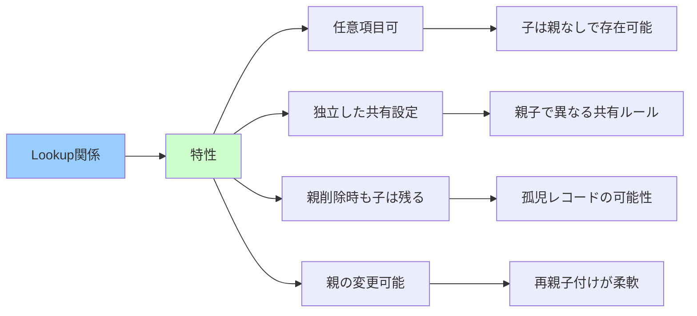
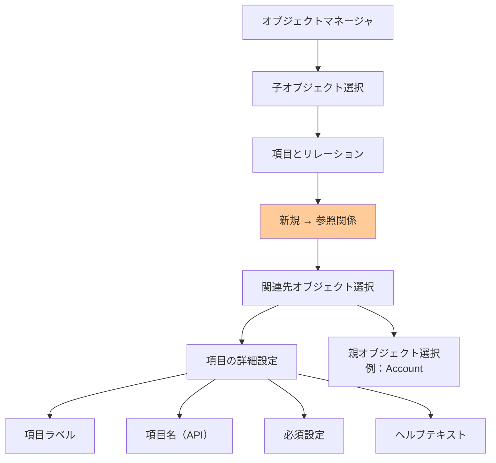
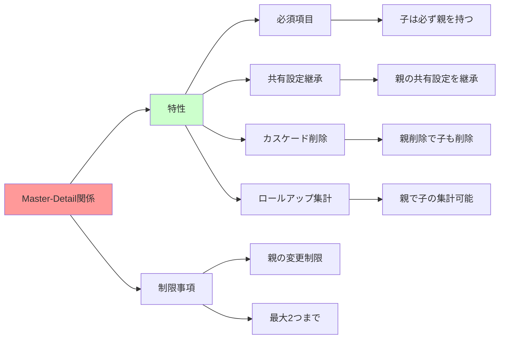
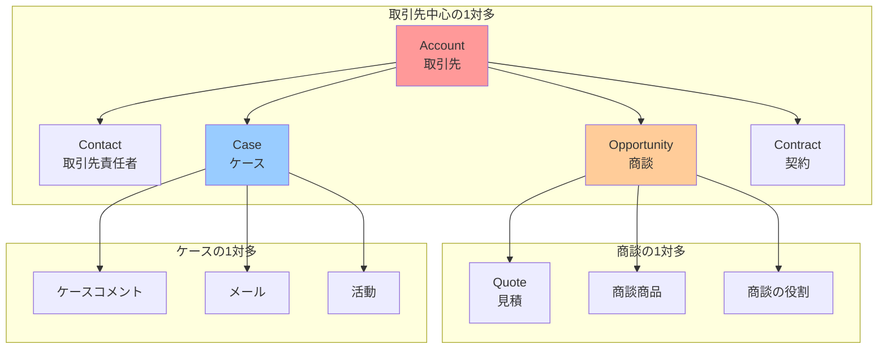
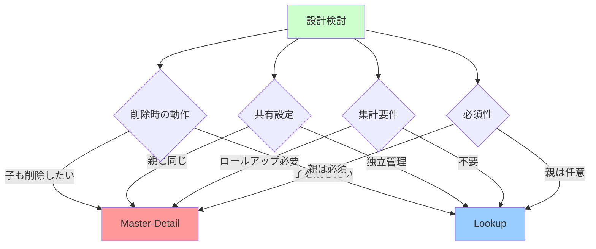
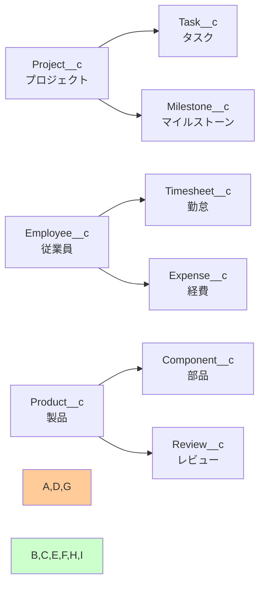
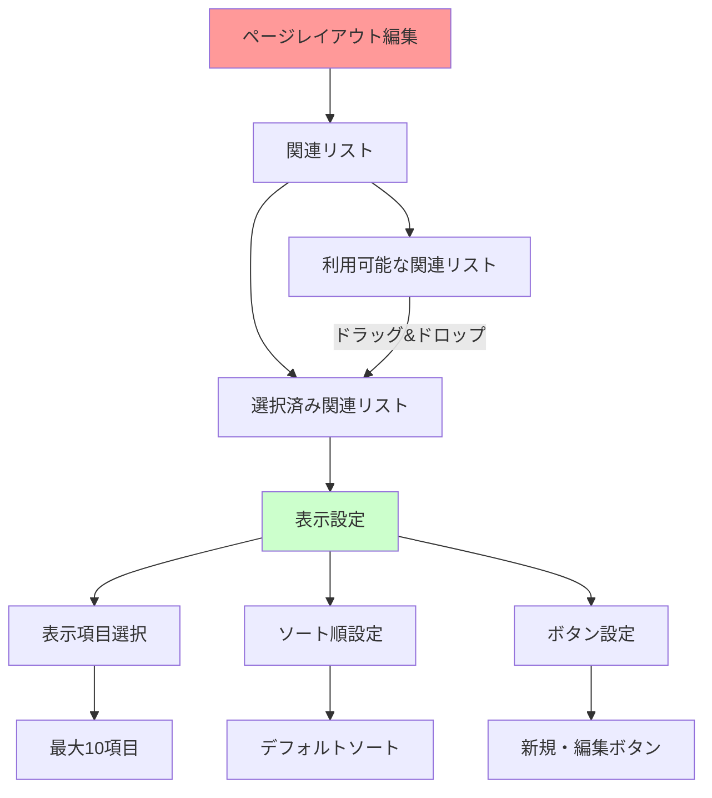

# Salesforceの1対多関係

## What's this file?
> [!NOTE]
> **What**
> 
> Salesforceの1対多関係とは何かについて記載しています。

## Conclusion (忙しいとき向け)
> [!IMPORTANT]
> **What** : 1対多関係とは何か
> 
> **Answer** : 親オブジェクトの1つのレコードに対して、子オブジェクトの複数のレコードが関連付けられる関係で、Salesforceでは参照関係（Lookup）または主従関係（Master-Detail）として実装される基本的なデータモデルパターン

## 目次

<details>
<summary>目次を開く</summary>

- [1対多関係の基本概念](#1対多関係の基本概念)
- [参照関係による1対多の実装](#参照関係による1対多の実装)
- [主従関係による1対多の実装](#主従関係による1対多の実装)
- [標準オブジェクトでの1対多関係の例](#標準オブジェクトでの1対多関係の例)
- [1対多関係の設計パターン](#1対多関係の設計パターン)
- [UI上での1対多関係の表示](#ui上での1対多関係の表示)

</details>

## 1対多関係の基本概念

### 1対多関係とは



### データベース観点での理解

```yaml
リレーショナルデータベースの概念:
  親テーブル（1側）:
    - プライマリキー（Id）を持つ
    - 1つのレコードが存在
    
  子テーブル（多側）:
    - 外部キー（親のId参照）を持つ
    - 複数レコードが同じ親を参照可能
    
Salesforceでの実装:
  親オブジェクト:
    - 通常のレコード
    - 子の存在を知らない（直接的には）
    
  子オブジェクト:
    - 親への参照項目を持つ
    - 項目タイプ：Lookup または Master-Detail
```

### 1対多関係の特徴

| 特徴 | 説明 | 例 |
|------|------|-----|
| **方向性** | 子から親への単方向参照 | Contact → Account |
| **カーディナリティ** | 1つの親に0〜多数の子 | 1取引先に複数商談 |
| **必須性** | 実装方法により異なる | Lookup：任意、Master-Detail：必須 |
| **削除動作** | 実装方法により異なる | 親削除時の子の扱い |

## 参照関係による1対多の実装

### Lookup（参照関係）の特性



### Lookupの実装例

```yaml
Case（ケース）オブジェクトの例:
  AccountId項目:
    型: Lookup(Account)
    必須: false
    説明: 関連する取引先
    
  ContactId項目:
    型: Lookup(Contact)
    必須: false
    説明: 関連する取引先責任者
    
動作:
  - Caseは取引先なしでも作成可能
  - 取引先を削除してもCaseは残る
  - Caseの取引先を後から変更可能
```

### Lookupの設定画面



## 主従関係による1対多の実装

### Master-Detail（主従関係）の特性



### Master-Detailの実装例

```yaml
OpportunityLineItem（商談商品）の例:
  OpportunityId項目:
    型: Master-Detail(Opportunity)
    必須: true（自動）
    説明: 親商談への参照
    
特別な機能:
  ロールアップ集計項目:
    - 商談の合計金額
    - 商品数のカウント
    - 最高価格商品
    - 最低価格商品
    
動作:
  - 商談なしでは商品追加不可
  - 商談削除で全商品も削除
  - 商談の共有設定を継承
```

### Master-DetailとLookupの比較

| 機能 | Lookup（参照） | Master-Detail（主従） |
|------|---------------|---------------------|
| **必須性** | 任意設定可能 | 常に必須 |
| **親の削除** | 子は残る | 子も削除（カスケード） |
| **共有設定** | 独立 | 親から継承 |
| **親の変更** | 可能 | 制限あり |
| **ロールアップ** | 不可 | 可能 |
| **レコード所有者** | 独自の所有者 | 親の所有者を継承 |

## 標準オブジェクトでの1対多関係の例

### 典型的な1対多関係



### 実際の使用例

```yaml
営業プロセスでの1対多:
  Account（取引先）:
    → Contact（取引先責任者）: 
      - 複数の担当者
      - 意思決定者、技術担当など
      
    → Opportunity（商談）:
      - 新規案件
      - 追加案件
      - 更新案件
      
カスタマーサービスでの1対多:
  Account（取引先）:
    → Case（ケース）:
      - 問い合わせ履歴
      - サポート案件
      - クレーム対応
      
    → Asset（資産）:
      - 購入製品
      - ライセンス
      - サービス契約
```

## 1対多関係の設計パターン

### 設計時の考慮事項



### ベストプラクティス

```yaml
命名規則:
  項目名:
    - 親オブジェクト名 + Id
    - 例：AccountId, OpportunityId
    
  表示ラベル:
    - 日本語で分かりやすく
    - 例：取引先、関連商談
    
パフォーマンス考慮:
  インデックス:
    - Lookup項目は自動インデックス
    - 検索性能の向上
    
  制限事項:
    - 1オブジェクトに40個まで
    - Master-Detailは2個まで
    
データ品質:
  検証ルール:
    - 親子の整合性チェック
    - ビジネスルールの実装
```

### カスタムオブジェクトでの実装例



## UI上での1対多関係の表示

### 関連リストの表示

```yaml
親レコードページでの表示:
  関連リスト:
    位置: レコード詳細の下部
    内容: 子レコードの一覧
    
  機能:
    - 新規作成ボタン
    - 編集・削除リンク
    - ソート・絞り込み
    - ページネーション
    
カスタマイズ:
  Lightning App Builder:
    - 関連リストコンポーネント
    - 表示項目の選択
    - アクション設定
```

### 関連リストの設定



### モバイルでの表示

```yaml
Salesforceモバイルアプリ:
  関連タブ:
    - スワイプで切り替え
    - 子レコード一覧表示
    
  ナビゲーション:
    - 親から子へ遷移
    - 子から親へ戻る
    
  制限事項:
    - 表示項目数制限
    - アクション制限
```

## 関連

- [Salesforceのオブジェクト間の関連性](2025.08.12.22.25_how_salesforce_objects_relate_each_other.md)
- [Salesforceの標準オブジェクトとレコード種別](2025.08.12.22.03_what_salesforce_standard_objects_by_records.md)
- [Salesforceのシステム監査項目](2025.08.13.06.48_what_salesforce_system_audit_fields.md)
- [Salesforce Help: オブジェクトリレーションシップの概要](https://help.salesforce.com/s/articleView?id=sf.overview_of_custom_object_relationships.htm&type=5)
- [Salesforce Help: 参照関係](https://help.salesforce.com/s/articleView?id=sf.relationships_considerations_lookup.htm&type=5)
- [Salesforce Help: 主従関係](https://help.salesforce.com/s/articleView?id=sf.relationships_considerations_master_detail.htm&type=5)
- [Trailhead: データモデリング](https://trailhead.salesforce.com/ja/content/learn/modules/data_modeling)