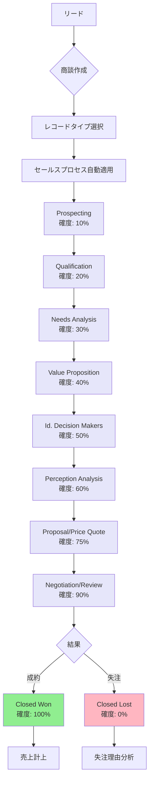

# Salesforceのセールスプロセスとは

## What's this file?
> [!NOTE]
> **What**
> 
> Salesforceのセールスプロセスとは何かについて記載しています。

## Conclusion (忙しいとき向け)
> [!IMPORTANT]
> **What** : Salesforceのセールスプロセスとは何か
> 
> **Answer** : 商談（Opportunity）のフェーズ管理を標準化し、営業活動の進捗を可視化・管理するための機能

## 目次

<details>
<summary>目次を開く</summary>

- [セールスプロセスの概要](#セールスプロセスの概要)
- [セールスプロセスの構成要素](#セールスプロセスの構成要素)
- [レコードタイプとの関係](#レコードタイプとの関係)
- [セールスプロセスの作成手順](#セールスプロセスの作成手順)
- [ベストプラクティス](#ベストプラクティス)
- [セールスプロセスフロー](#セールスプロセスフロー)

</details>

## セールスプロセスの概要

### 定義
セールスプロセスは、商談の進捗を管理するための**フェーズの順序を定義する機能**です。組織の営業手法に合わせて、商談がどのような段階を経て成約に至るかを標準化します。

### 主な目的
- 営業活動の標準化
- 進捗の可視化
- パイプライン管理の最適化
- 成約率の向上

## セールスプロセスの構成要素

### 1. フェーズ（Stage）
商談の進捗段階を表す値：
- Prospecting（見込み客開拓）
- Qualification（適格性確認）
- Needs Analysis（ニーズ分析）
- Value Proposition（価値提案）
- Id. Decision Makers（意思決定者特定）
- Perception Analysis（認識分析）
- Proposal/Price Quote（提案/見積）
- Negotiation/Review（交渉/レビュー）
- Closed Won（成約）
- Closed Lost（失注）

### 2. 確度（Probability）
各フェーズにおける成約確率：
```
Prospecting: 10%
Qualification: 20%
Needs Analysis: 30%
Value Proposition: 40%
Id. Decision Makers: 50%
Perception Analysis: 60%
Proposal/Price Quote: 75%
Negotiation/Review: 90%
Closed Won: 100%
Closed Lost: 0%
```

### 3. 予測カテゴリ（Forecast Category）
- Pipeline（パイプライン）
- Best Case（楽観的）
- Commit（確実）
- Closed（クローズ済み）
- Omitted（除外）

## レコードタイプとの関係

### レコードタイプごとの設定
1つの商談オブジェクトに対して、複数のセールスプロセスを定義可能：

```
レコードタイプ: 新規ビジネス
→ セールスプロセス: 新規顧客開拓プロセス

レコードタイプ: 既存顧客
→ セールスプロセス: アップセル/クロスセルプロセス

レコードタイプ: 更新
→ セールスプロセス: 契約更新プロセス
```

## セールスプロセスの作成手順

### 1. 設定画面へのアクセス
設定 → オブジェクトマネージャー → 商談 → セールスプロセス

### 2. 新規セールスプロセスの作成
1. 「新規」ボタンをクリック
2. 既存のプロセスをコピーまたは新規作成
3. プロセス名と説明を入力

### 3. フェーズの選択と並び替え
- 利用可能なフェーズから必要なものを選択
- ドラッグ&ドロップで順序を調整
- 不要なフェーズは除外

### 4. レコードタイプへの割り当て
作成したセールスプロセスを適切なレコードタイプに関連付け

## ベストプラクティス

### 1. シンプルに保つ
- フェーズ数は5〜9個程度が理想的
- 明確で理解しやすいフェーズ名を使用

### 2. 営業チームとの協議
- 実際の営業フローに即した設計
- 現場の意見を反映

### 3. 定期的な見直し
- 四半期ごとにプロセスの有効性を評価
- 必要に応じて調整

### 4. トレーニングの実施
- 新しいプロセスの説明会
- ベストプラクティスの共有

## セールスプロセスフロー



## 関連
- [商談管理](https://help.salesforce.com/s/articleView?id=sf.opportunities.htm)
- [レコードタイプ](https://help.salesforce.com/s/articleView?id=sf.customize_recordtype.htm)
- [予測の設定](https://help.salesforce.com/s/articleView?id=sf.forecasts3_intro.htm)
- [パスの設定](https://help.salesforce.com/s/articleView?id=sf.path_overview.htm)