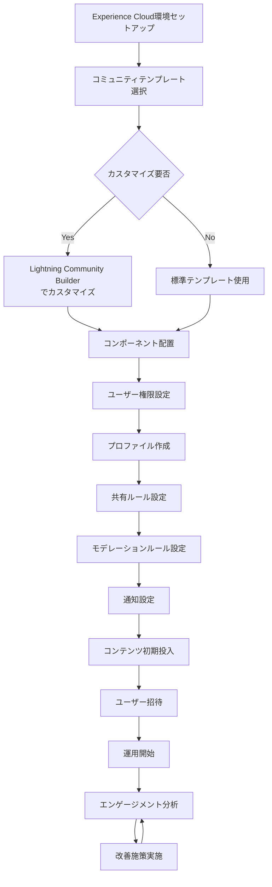

# SalesforceのExperience Cloudを使った顧客間コラボレーションの実現方法

## What's this file?
> [!NOTE]
> **How**
> 
> どのようにExperience Cloudを使って顧客間のコラボレーションを実現するかについて記載しています。

## Conclusion (忙しいとき向け)
> [!IMPORTANT]
> **How** : どのようにExperience Cloudで顧客間コラボレーションを実現するか
> 
> **Answer** : Experience Cloudのコミュニティ機能、ディスカッションフォーラム、ケース共有、ナレッジベースを活用して、顧客同士が知識やベストプラクティスを共有できる環境を構築する

## 目次

目次を開く

- [Experience Cloudとは](#experience-cloudとは)
- [顧客間コラボレーションの主要機能](#顧客間コラボレーションの主要機能)
- [実装フロー](#実装フロー)
- [ベストプラクティス](#ベストプラクティス)

## Experience Cloudとは

Experience Cloud（旧Community Cloud）は、Salesforceが提供する顧客向けポータルサイト構築プラットフォームです。顧客、パートナー、従業員が情報を共有し、協力できるオンラインコミュニティを作成できます。

## 顧客間コラボレーションの主要機能

### 1. ディスカッションフォーラム
- **Chatter Groups**: トピック別のグループ作成
- **Q&A Board**: 質問と回答の投稿
- **アイデア共有**: 製品改善案の投稿と投票

### 2. ナレッジ共有
- **Knowledge Articles**: FAQ、How-to記事の共有
- **ドキュメントライブラリ**: ファイル共有とバージョン管理
- **ビデオチュートリアル**: 動画コンテンツの配信

### 3. ケースコラボレーション
- **ケース共有**: 類似問題の解決策共有
- **エスカレーション**: 専門家への質問転送
- **解決済みケースの参照**: 過去の事例活用

### 4. イベント・ウェビナー
- **バーチャルイベント**: オンライン勉強会
- **ユーザーミートアップ**: 地域別交流会
- **エキスパートセッション**: 専門家による講習

## 実装フロー

## ベストプラクティス

### 1. コミュニティガバナンス
- **モデレーター設置**: 投稿内容の品質管理
- **コミュニティガイドライン**: 利用規約の明確化
- **報酬システム**: バッジやポイント制度

### 2. エンゲージメント向上施策
- **定期的なコンテンツ更新**: 新鮮な情報提供
- **エキスパート認定**: 活発なユーザーの表彰
- **ゲーミフィケーション**: ランキングやバッジ

### 3. セキュリティ設定
- **データアクセス制御**: 適切な共有設定
- **個人情報保護**: PII（個人識別情報）の管理
- **監査ログ**: アクティビティ追跡

### 4. 成功指標の設定
- **活性度**: ログイン頻度、投稿数
- **解決率**: 質問への回答率
- **満足度**: NPS、CSATスコア

## 関連
- [Salesforce Experience Cloud公式ドキュメント](https://help.salesforce.com/s/articleView?id=sf.networks_overview.htm&type=5)
- [Lightning Community Builderガイド](https://help.salesforce.com/s/articleView?id=sf.community_designer_overview.htm&type=5)
- [Salesforceコミュニティベストプラクティス](https://trailhead.salesforce.com/ja/content/learn/modules/community_cloud_basics)