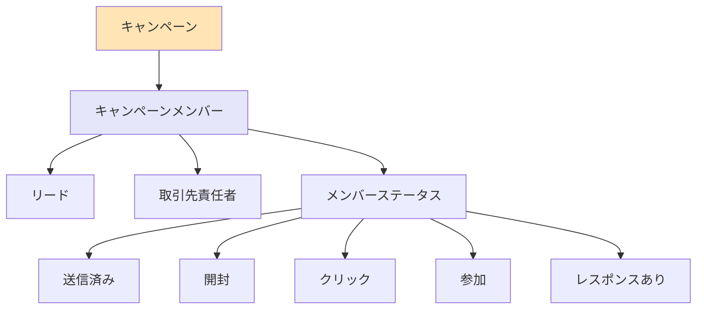
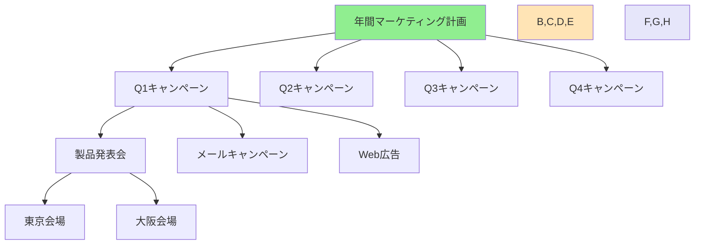
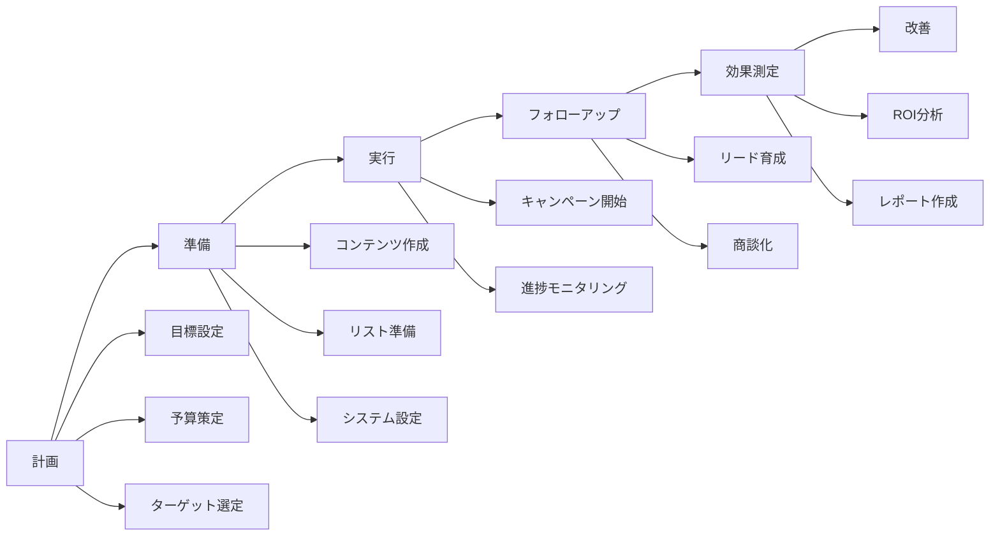
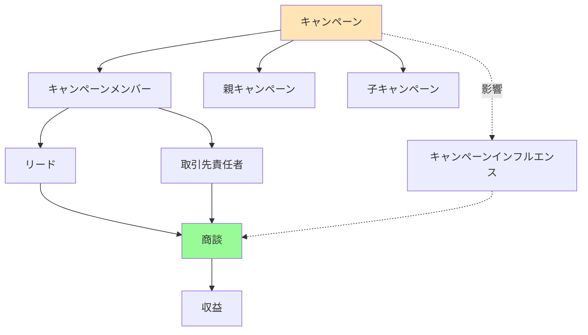

# Salesforceのキャンペーンとは

## What's this file?
> [!NOTE]
> **What**
> 
> Salesforceのキャンペーンとは何かについて記載しています。

## Conclusion (忙しいとき向け)
> [!IMPORTANT]
> **What** : Salesforceのキャンペーンとは何か
> 
> **Answer** : マーケティング活動を管理・追跡するための標準オブジェクトです。展示会、セミナー、広告、メールマーケティングなどの施策と、それに対するリードや取引先責任者の反応を一元管理し、ROIを測定できます。

## 目次

<details>
<summary>目次を開く</summary>

- [キャンペーンの概要](#キャンペーンの概要)
- [キャンペーンの種類](#キャンペーンの種類)
- [キャンペーンメンバー](#キャンペーンメンバー)
- [キャンペーン階層](#キャンペーン階層)
- [キャンペーンの効果測定](#キャンペーンの効果測定)
- [キャンペーンのワークフロー](#キャンペーンのワークフロー)
- [キャンペーンと他オブジェクトの関係](#キャンペーンと他オブジェクトの関係)

</details>

## キャンペーンの概要

キャンペーンは、Salesforceでマーケティング活動を体系的に管理するための標準オブジェクトです。マーケティング施策の計画から実行、効果測定まで一連のプロセスを支援します。

### キャンペーンの主な機能
- **マーケティング活動の追跡**: 各種施策の実施状況を管理
- **リード生成の追跡**: キャンペーンから生成されたリードを追跡
- **ROI分析**: 投資対効果を自動計算
- **メンバー管理**: 参加者の反応やステータスを記録

## キャンペーンの種類

### マーケティングチャネル別
1. **展示会・イベント**
   - トレードショー
   - セミナー・ウェビナー
   - カンファレンス

2. **デジタルマーケティング**
   - メールマーケティング
   - Web広告
   - ソーシャルメディア
   - コンテンツマーケティング

3. **従来型マーケティング**
   - ダイレクトメール
   - テレマーケティング
   - 印刷広告

4. **パートナーマーケティング**
   - 共同キャンペーン
   - 紹介プログラム

## キャンペーンメンバー

キャンペーンメンバーは、キャンペーンに参加したリードや取引先責任者を表します。



### メンバーステータスの例
- **メールキャンペーン**: 送信済み → 開封 → クリック → コンバージョン
- **イベント**: 招待済み → 登録 → 参加 → フォローアップ済み
- **ウェビナー**: 登録 → リマインド送信 → 参加 → 録画視聴

## キャンペーン階層

キャンペーンは階層構造を持つことができ、大規模なマーケティング戦略を体系的に管理できます。



## キャンペーンの効果測定

### 主要指標
1. **リード生成数**: キャンペーンから生成されたリード数
2. **商談創出数**: キャンペーンから創出された商談数
3. **成約数**: キャンペーン経由で成約した商談数
4. **収益**: キャンペーン経由の売上金額
5. **ROI**: (収益 - コスト) / コスト × 100

### 自動計算項目
```
予算コスト: 計画時の予算
実コスト: 実際にかかった費用
リード数: 生成されたリード総数
コンバージョン率: 商談化率
商談数: 創出された商談数
成約商談数: 受注した商談数
成約商談金額: 受注金額の合計
ROI: 投資対効果の自動計算
```

## キャンペーンのワークフロー



## キャンペーンと他オブジェクトの関係



### 関連オブジェクトの説明
- **リード**: キャンペーンから新規生成される見込み客
- **取引先責任者**: 既存顧客のキャンペーン参加者
- **商談**: キャンペーンから創出されるビジネス機会
- **キャンペーンインフルエンス**: 複数キャンペーンの商談への影響度

## 関連

- [Salesforce Help - キャンペーン管理](https://help.salesforce.com/s/articleView?id=sf.campaigns.htm)
- リード管理とナーチャリング
- マーケティングオートメーション（Pardot/Marketing Cloud）
- レポートとダッシュボード
- キャンペーンインフルエンス
- 商談管理