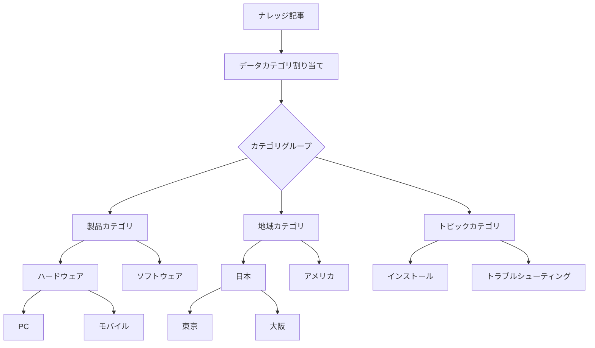
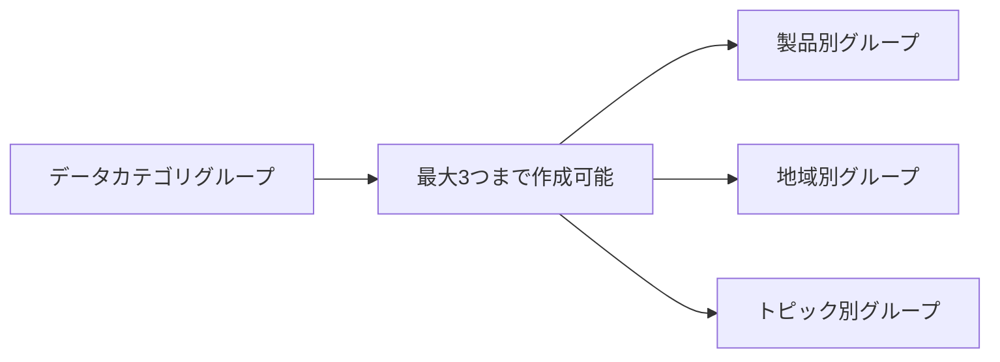
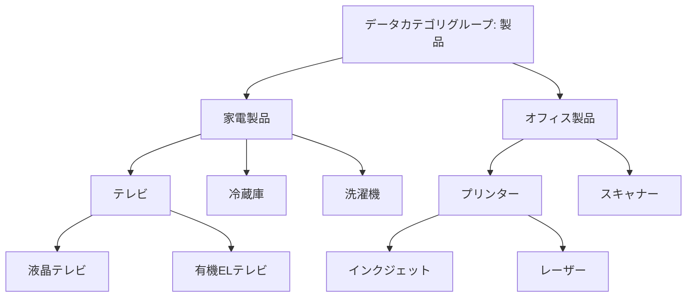
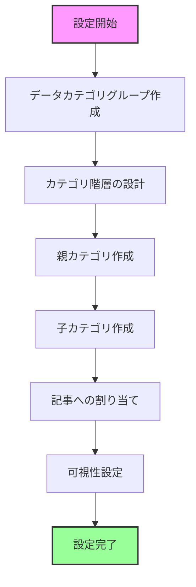

# Salesforce Knowledgeのデータカテゴリとは

## What's this file?
> [!NOTE]
> **What**
> 
> Salesforce Knowledgeのデータカテゴリとは何かについて記載しています。

## Conclusion (忙しいとき向け)
> [!IMPORTANT]
> **What** : Salesforce Knowledgeのデータカテゴリとは何か
> 
> **Answer** : ナレッジ記事を分類・整理するための階層構造を持つカテゴリシステムで、ユーザーが必要な情報を効率的に検索・フィルタリングできるようにする仕組み

## 目次

目次を開く

- [データカテゴリの概要](#データカテゴリの概要)
- [データカテゴリの特徴](#データカテゴリの特徴)
- [データカテゴリグループ](#データカテゴリグループ)
- [データカテゴリの階層構造](#データカテゴリの階層構造)
- [データカテゴリの設定フロー](#データカテゴリの設定フロー)
- [ユースケース](#ユースケース)

## データカテゴリの概要

データカテゴリは、Salesforce Knowledgeの記事を分類・整理するための仕組みです。これにより、ユーザーは関連する記事を素早く見つけることができます。

## データカテゴリの特徴

### 1. 階層構造
- 親子関係を持つツリー構造で管理
- 最大5階層まで設定可能
- 1つのカテゴリグループあたり最大100個のカテゴリ

### 2. 複数割り当て
- 1つの記事に複数のデータカテゴリを割り当て可能
- 異なるカテゴリグループから複数選択可能

### 3. 可視性制御
- プロファイルやロールベースでカテゴリの可視性を制御
- 特定のユーザーグループに特定のカテゴリのみ表示

## データカテゴリグループ

データカテゴリグループは、カテゴリの最上位の分類です。

### グループの例
- **製品別**: 製品ラインや製品タイプで分類
- **地域別**: 地理的な場所やマーケットで分類
- **トピック別**: 問題の種類や内容で分類

## データカテゴリの階層構造

## データカテゴリの設定フロー

## ユースケース

### 1. カスタマーサポート
- 製品別、問題タイプ別に記事を分類
- サポートエージェントが迅速に解決策を検索

### 2. 内部ナレッジベース
- 部門別、プロセス別に文書を整理
- 新入社員のオンボーディングに活用

### 3. パートナーポータル
- パートナーレベル別に情報を分類
- 認定レベルに応じた技術文書の提供

## 関連
- Salesforce Knowledge の概要
- ナレッジ記事タイプ
- ナレッジの検索と表示設定
- データカテゴリの可視性設定