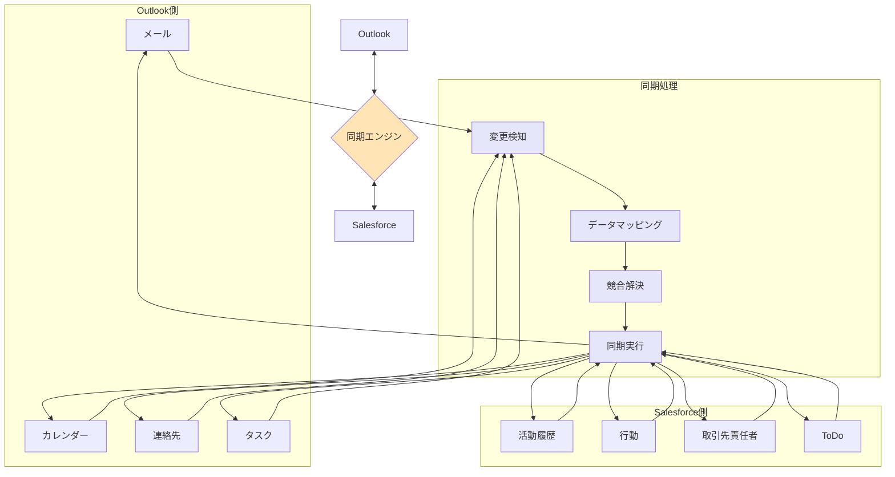

# SalesforceとOutlook間で同期可能な項目

## What's this file?
> [!NOTE]
> **What**
> 
> SalesforceとOutlook間で同期可能な項目とは何かについて記載しています。

## Conclusion (忙しいとき向け)
> [!IMPORTANT]
> **What** : SalesforceとOutlook間で同期可能な項目とは何か
> 
> **Answer** : メール、イベント（予定）、連絡先、タスクの4つの主要項目が双方向同期可能

## 目次

<details>
<summary>目次を開く</summary>

- [同期可能な主要項目](#同期可能な主要項目)
- [各項目の同期詳細](#各項目の同期詳細)
- [同期の方向と設定](#同期の方向と設定)
- [同期の制限事項](#同期の制限事項)
- [同期プロセスフロー](#同期プロセスフロー)

</details>

## 同期可能な主要項目

### 1. メール（Email）
- Outlookの送受信メール
- Salesforceの活動履歴
- 添付ファイル

### 2. イベント（Events/予定）
- Outlookカレンダーの予定
- Salesforceの行動レコード
- 定期的な予定

### 3. 連絡先（Contacts）
- Outlook連絡先
- Salesforceの取引先責任者
- 個人連絡先情報

### 4. タスク（Tasks）
- OutlookのTo-Do
- SalesforceのToDoレコード
- 期限と優先度

## 各項目の同期詳細

### メールの同期
**Outlook → Salesforce**
- 件名
- 本文
- 送信者/受信者情報
- 送信日時
- 添付ファイル（サイズ制限あり）

**同期される場所**
- 関連する取引先、取引先責任者、商談の活動履歴

### イベントの同期
**同期される項目**
```
- 件名（Subject）
- 開始日時（Start DateTime）
- 終了日時（End DateTime）
- 場所（Location）
- 説明（Description）
- 参加者（Attendees）
- リマインダー（Reminder）
- 公開/非公開設定（Private Flag）
```

### 連絡先の同期
**基本情報**
- 氏名（姓・名）
- 会社名
- 役職
- 部署

**連絡先情報**
- メールアドレス（複数可）
- 電話番号（会社・携帯・自宅）
- FAX番号
- 住所（会社・自宅）

**その他**
- 誕生日
- メモ/コメント
- カスタム項目（設定による）

### タスクの同期
**同期される項目**
- 件名
- 期限日
- 優先度
- ステータス（未着手/進行中/完了）
- 説明/コメント
- リマインダー設定

## 同期の方向と設定

### 双方向同期
最新の変更が両システムに反映：
- 連絡先の基本情報
- イベントの詳細
- タスクのステータス

### 単方向同期オプション
管理者設定により制御可能：
- Outlook → Salesforceのみ
- Salesforce → Outlookのみ

### 同期の頻度
- リアルタイム同期（Lightning Sync）
- 定期同期（15分〜1時間間隔）
- 手動同期オプション

## 同期の制限事項

### サイズ制限
- メール本文: 32KB
- 添付ファイル: 25MB（設定による）
- イベントの説明: 32KB

### 項目の制限
**同期されない項目**
- カスタムオブジェクト（一部例外あり）
- 数式項目
- 暗号化項目
- リッチテキストの書式（一部）

### その他の制限
- 定期的な予定の例外処理
- プライベート項目の取り扱い
- 削除されたレコードの処理

## 同期プロセスフロー



## 関連
- [Outlook Integration](https://help.salesforce.com/s/articleView?id=sf.outlookcrm_intro.htm)
- [Lightning Sync](https://help.salesforce.com/s/articleView?id=sf.exchange_sync_intro.htm)
- [Einstein Activity Capture](https://help.salesforce.com/s/articleView?id=sf.aac_intro.htm)
- [同期の設定ガイド](https://help.salesforce.com/s/articleView?id=sf.email_int_user_view.htm)