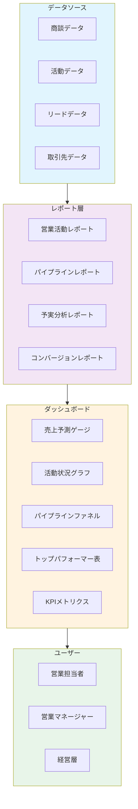

# Salesforce営業活動ダッシュボード

## What's this file?
> [!NOTE]
> **What**
> 
> Salesforce営業活動ダッシュボードとは何かについて記載しています。

## Conclusion (忙しいとき向け)
> [!IMPORTANT]
> **What** : Salesforce営業活動ダッシュボードとは何か
> 
> **Answer** : 営業チームの活動と成果を可視化し、リアルタイムで営業パフォーマンスを追跡・分析できるインタラクティブなデータ視覚化ツール

## 目次

目次を開く

- [営業活動ダッシュボードの概要](#営業活動ダッシュボードの概要)
- [主要な構成要素](#主要な構成要素)
- [ダッシュボードのコンポーネント](#ダッシュボードのコンポーネント)
- [営業活動の可視化フロー](#営業活動の可視化フロー)
- [主要なメトリクス](#主要なメトリクス)
- [ダッシュボードの種類](#ダッシュボードの種類)

## 営業活動ダッシュボードの概要

営業活動ダッシュボードは、Salesforceで営業チームの活動状況と成果をリアルタイムで可視化するツールです。レポートやグラフィックコンポーネントを組み合わせて、営業パフォーマンスの全体像を把握できます。

### 主な特徴
- リアルタイムデータの表示
- 複数のレポートの統合表示
- インタラクティブな操作性
- モバイル対応
- 自動更新機能

## 主要な構成要素

### 1. データソース
- 商談（Opportunity）
- 活動（Activity）
- リード（Lead）
- 取引先（Account）
- キャンペーン（Campaign）

### 2. レポート
- 営業活動レポート
- パイプラインレポート
- 予実分析レポート
- コンバージョン率レポート

### 3. 視覚化要素
- グラフ（棒グラフ、円グラフ、折れ線グラフ）
- ゲージチャート
- ファネルチャート
- テーブル
- メトリクス表示

## ダッシュボードのコンポーネント

## 営業活動の可視化フロー

```mermaid
flowchart LR
    subgraph Input["データ入力"]
        I1[活動記録]
        I2[商談更新]
        I3[リード登録]
    end
    
    subgraph Process["データ処理"]
        P1[集計処理]
        P2[フィルタリング]
        P3[計算式適用]
    end
    
    subgraph Visualization["可視化"]
        V1[グラフ生成]
        V2[指標計算]
        V3[レイアウト調整]
    end
    
    subgraph Output["出力"]
        O1[ダッシュボード表示]
        O2[自動更新]
        O3[共有・配信]
    end
    
    Input --> Process
    Process --> Visualization
    Visualization --> Output
    
    style Input fill:#bbdefb
    style Process fill:#c5e1a5
    style Visualization fill:#ffccbc
    style Output fill:#f8bbd0
```

## 主要なメトリクス

### 営業活動指標
- 電話・メール件数
- 商談数
- 訪問件数
- 提案書提出数

### パフォーマンス指標
- 売上達成率
- 商談成約率
- 平均商談サイクル
- 顧客獲得コスト（CAC）

### パイプライン指標
- 商談総額
- ステージ別商談数
- 予測精度
- パイプライン速度

## ダッシュボードの種類

### 1. 営業担当者向けダッシュボード
個人の活動状況と目標達成状況を表示

### 2. マネージャー向けダッシュボード
チーム全体のパフォーマンスと個人別の成績を表示

### 3. 経営層向けダッシュボード
全社的な売上状況と予測を表示

### 4. カスタムダッシュボード
特定の要件に応じてカスタマイズしたダッシュボード

## 関連
- [Salesforce レポート機能](./what_salesforce_reports.md)
- [Salesforce 商談管理](./2025.08.13.06.57_what_salesforce_opportunity.md)
- [営業プロセス管理](./2025.08.13.07.15_what_sales_process_salesforce.md)
- [キャンペーン管理](./2025.08.13.07.24_what_salesforce_campaign.md)