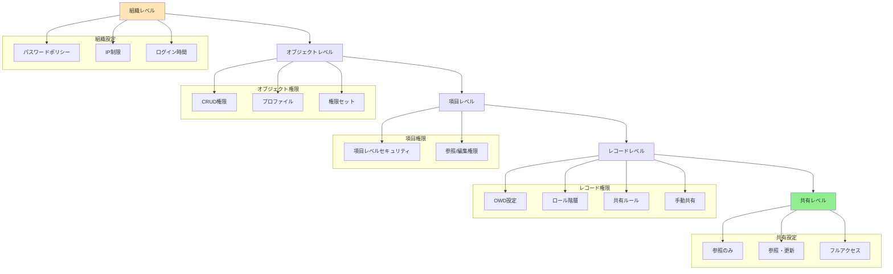

# Salesforceの階層レベルとは

## What's this file?
> [!NOTE]
> **What**
> 
> Salesforceの階層レベルとは何かについて記載しています。

## Conclusion (忙しいとき向け)
> [!IMPORTANT]
> **What** : Salesforceの階層レベルとは何か
> 
> **Answer** : 組織内のデータアクセス権限を制御する5つのレベル（組織、オブジェクト、項目、レコード、共有）からなる階層構造

## 目次

<details>
<summary>目次を開く</summary>

- [階層レベルの概要](#階層レベルの概要)
- [5つの階層レベル](#5つの階層レベル)
- [ロール階層](#ロール階層)
- [テリトリー階層](#テリトリー階層)
- [階層レベルの相互関係](#階層レベルの相互関係)
- [階層構造フロー](#階層構造フロー)

</details>

## 階層レベルの概要

### 定義
Salesforceの階層レベルは、**データへのアクセス権限を段階的に制御する仕組み**です。上位から下位まで5つのレベルで構成され、各レベルで異なる制御が可能です。

### 主な目的
- セキュリティの確保
- 適切なデータアクセス管理
- 組織構造の反映
- コンプライアンス対応

## 5つの階層レベル

### 1. 組織レベル（Organization Level）
**最上位の設定**
- パスワードポリシー
- ログイン時間の制限
- IPアドレス制限
- シングルサインオン設定

### 2. オブジェクトレベル（Object Level）
**オブジェクト単位の権限**
- CRUD権限（作成・参照・編集・削除）
- すべて表示・すべて変更権限
- プロファイル/権限セットで制御

### 3. 項目レベル（Field Level）
**項目単位の権限**
- 項目レベルセキュリティ（FLS）
- 参照可能/編集可能の設定
- 必須項目の設定

### 4. レコードレベル（Record Level）
**個別レコードの権限**
```
制御方法：
- 組織の共有設定（OWD）
- ロール階層
- 共有ルール
- 手動共有
- Apexによる共有
```

### 5. 共有レベル（Sharing Level）
**データ共有の詳細制御**
- 参照のみ
- 参照・更新
- フルアクセス

## ロール階層

### ロール階層の特徴
1. **上位アクセス権**
   - 上位ロールは下位ロールのデータにアクセス可能
   - 「上司にレコードへのアクセス権を許可」オプション

2. **階層構造の例**
```
CEO
├── 営業本部長
│   ├── 東日本営業部長
│   │   ├── 東京営業課長
│   │   └── 横浜営業課長
│   └── 西日本営業部長
│       ├── 大阪営業課長
│       └── 福岡営業課長
└── マーケティング本部長
    └── マーケティング部長
```

### ロール階層の設定
- 設定 → ユーザ → ロール
- ドラッグ&ドロップで階層を構築
- 各ユーザにロールを割り当て

## テリトリー階層

### テリトリー階層の特徴
1. **地域/製品別の管理**
   - 地理的な営業テリトリー
   - 製品ラインごとの区分
   - 顧客セグメント別の管理

2. **複数階層の管理**
   - 1人のユーザが複数のテリトリーに所属可能
   - テリトリーごとに異なるアクセス権限

### エンタープライズテリトリー管理
```
設定項目：
- テリトリータイプ
- テリトリーモデル
- テリトリー階層
- 割り当てルール
```

## 階層レベルの相互関係

### アクセス権限の決定フロー
1. 組織レベルでの基本設定
2. プロファイルでオブジェクト権限確認
3. 項目レベルセキュリティのチェック
4. レコード所有者/共有設定の確認
5. 最終的なアクセス権限の決定

### 権限の積み上げ原則
- より制限的な設定が優先
- 明示的な権限付与が必要
- 階層による自動的な権限継承

## 階層構造フロー



## 関連
- [セキュリティの実装](https://help.salesforce.com/s/articleView?id=sf.security_overview.htm)
- [ロール階層の設定](https://help.salesforce.com/s/articleView?id=sf.users_roles.htm)
- [共有設定](https://help.salesforce.com/s/articleView?id=sf.sharing_rules_overview.htm)
- [項目レベルセキュリティ](https://help.salesforce.com/s/articleView?id=sf.admin_fls.htm)