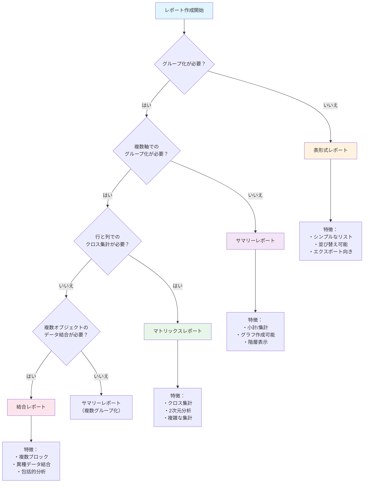
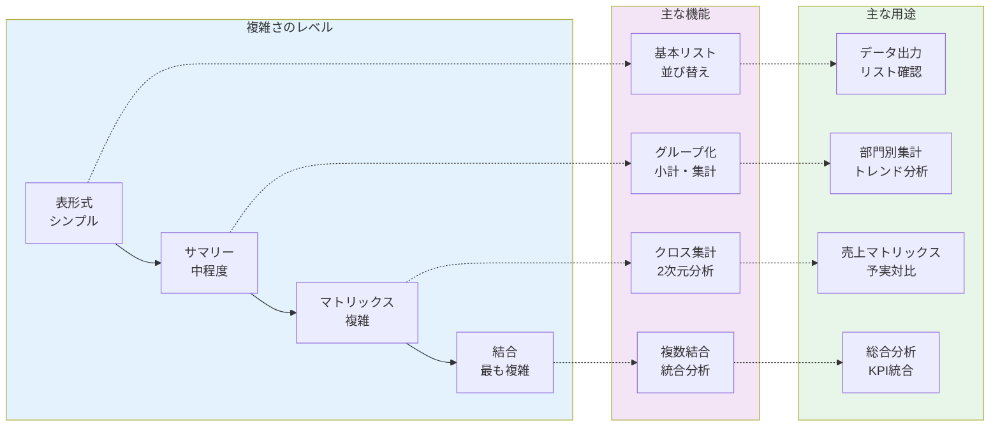
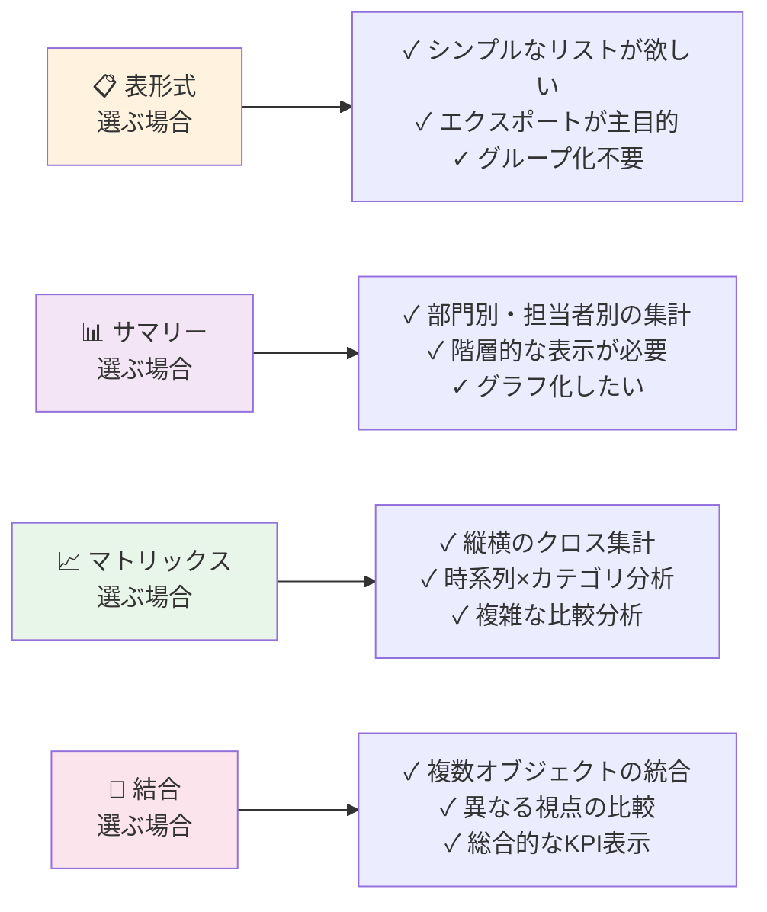

# Salesforceレポート形式タイプ完全リスト

## What's this file?
> [!NOTE]
> **What**
> 
> Salesforceで利用可能なレポート形式タイプの完全リストとは何かについて記載しています。

## Conclusion (忙しいとき向け)
> [!IMPORTANT]
> **What** : Salesforceレポート形式タイプの完全リストとは何か
> 
> **Answer** : Salesforceで利用可能な4つの基本レポート形式（表形式、サマリー、マトリックス、結合）と、それぞれの特徴・用途・制限事項を体系的にまとめたもの

## 目次

<details>
<summary>目次を開く</summary>

- [レポート形式タイプの概要](#レポート形式タイプの概要)
- [レポート形式の視覚的比較](#レポート形式の視覚的比較)
- [表形式レポート（Tabular Report）](#表形式レポートtabular-report)
- [サマリーレポート（Summary Report）](#サマリーレポートsummary-report)
- [マトリックスレポート（Matrix Report）](#マトリックスレポートmatrix-report)
- [結合レポート（Joined Report）](#結合レポートjoined-report)
- [レポート形式の選択フロー](#レポート形式の選択フロー)
- [各レポート形式の比較](#各レポート形式の比較)

</details>

## レポート形式タイプの概要

Salesforceには4つの基本的なレポート形式があり、それぞれ異なる目的とデータの表示方法を持っています。

### レポート形式の種類
1. **表形式レポート** - 最もシンプルなリスト形式
2. **サマリーレポート** - グループ化と小計を含む形式
3. **マトリックスレポート** - 行と列でグループ化する形式
4. **結合レポート** - 複数のレポートを結合する形式

## レポート形式の視覚的比較

```mermaid
flowchart TB
    subgraph Tabular["📋 表形式レポート"]
        direction LR
        T1[営業担当者] --- T2[商談名] --- T3[金額] --- T4[完了予定日]
        T5[田中太郎] --- T6[A社案件] --- T7[¥500,000] --- T8[2025/03/31]
        T9[鈴木花子] --- T10[B社案件] --- T11[¥300,000] --- T12[2025/04/15]
    end
    
    subgraph Summary["📊 サマリーレポート"]
        direction TB
        S1[部門: 営業1部]
        S1 --> S2[田中太郎: ¥500,000]
        S1 --> S3[山田次郎: ¥700,000]
        S1 --> S4[小計: ¥1,200,000]
        S5[部門: 営業2部]
        S5 --> S6[鈴木花子: ¥300,000]
        S5 --> S7[佐藤三郎: ¥400,000]
        S5 --> S8[小計: ¥700,000]
        S9[総計: ¥1,900,000]
    end
    
    subgraph Matrix["📈 マトリックスレポート"]
        direction TB
        M1[" "]
        M2[Q1] -.-> M1
        M3[Q2] -.-> M1
        M4[Q3] -.-> M1
        M5[営業1部] --> M6[¥300K]
        M5 --> M7[¥400K]
        M5 --> M8[¥500K]
        M9[営業2部] --> M10[¥200K]
        M9 --> M11[¥250K]
        M9 --> M12[¥250K]
    end
    
    subgraph Joined["🔗 結合レポート"]
        direction LR
        J1[ブロック1:<br/>商談レポート]
        J2[ブロック2:<br/>活動レポート]
        J3[ブロック3:<br/>ケースレポート]
        J1 -.-> J4[統合ビュー]
        J2 -.-> J4
        J3 -.-> J4
    end
    
    style Tabular fill:#fff3e0,stroke:#ff6f00
    style Summary fill:#f3e5f5,stroke:#9c27b0
    style Matrix fill:#e8f5e9,stroke:#4caf50
    style Joined fill:#fce4ec,stroke:#e91e63
```



## 表形式レポート（Tabular Report）

### 📋 視覚的イメージ
```
┌─────────────┬────────────┬──────────┬──────────────┐
│ 営業担当者   │ 商談名      │ 金額      │ 完了予定日     │
├─────────────┼────────────┼──────────┼──────────────┤
│ 田中太郎     │ A社案件     │ ¥500,000 │ 2025/03/31   │
│ 鈴木花子     │ B社案件     │ ¥300,000 │ 2025/04/15   │
│ 山田次郎     │ C社案件     │ ¥700,000 │ 2025/03/20   │
│ 佐藤三郎     │ D社案件     │ ¥400,000 │ 2025/04/30   │
└─────────────┴────────────┴──────────┴──────────────┘
```

### 特徴
- 最もシンプルで基本的なレポート形式
- Excelのようなスプレッドシート形式
- 行ごとにレコードを表示
- 並び替えや検索が容易

### 用途
- シンプルなリスト表示
- エクスポート用データの準備
- メール送信リストの作成
- 基本的なデータ確認

### 制限事項
- グループ化不可
- グラフ作成不可（リストビューチャートを除く）
- ダッシュボードでの使用制限あり

## サマリーレポート（Summary Report）

### 📊 視覚的イメージ
```
▼ 部門: 営業1部
  ├─ 田中太郎    ¥500,000
  ├─ 山田次郎    ¥700,000
  └─ 【小計】    ¥1,200,000

▼ 部門: 営業2部
  ├─ 鈴木花子    ¥300,000
  ├─ 佐藤三郎    ¥400,000
  └─ 【小計】    ¥700,000

【総計】         ¥1,900,000
```

### 特徴
- 最大3レベルまでのグループ化が可能
- 小計、平均、最大、最小などの集計
- グラフ表示対応
- 階層的なデータ表示

### 用途
- 部門別売上集計
- 担当者別活動実績
- 商品カテゴリ別分析
- 期間別トレンド分析

### 利用可能な集計関数
- 合計（SUM）
- 平均（AVG）
- 最大値（MAX）
- 最小値（MIN）
- レコード数（COUNT）

## マトリックスレポート（Matrix Report）

### 📈 視覚的イメージ
```
              │   Q1    │   Q2    │   Q3    │   Q4    │  合計
─────────────┼─────────┼─────────┼─────────┼─────────┼─────────
営業1部       │ ¥300K   │ ¥400K   │ ¥500K   │ ¥600K   │ ¥1,800K
営業2部       │ ¥200K   │ ¥250K   │ ¥250K   │ ¥300K   │ ¥1,000K
営業3部       │ ¥150K   │ ¥200K   │ ¥300K   │ ¥350K   │ ¥1,000K
─────────────┼─────────┼─────────┼─────────┼─────────┼─────────
合計          │ ¥650K   │ ¥850K   │ ¥1,050K │ ¥1,250K │ ¥3,800K
```

### 特徴
- 行と列の両方でグループ化
- クロス集計表の作成
- 2次元のデータ分析
- より複雑な集計が可能

### 用途
- 商品×地域の売上分析
- 担当者×月別の実績表
- チャネル×商品カテゴリの分析
- 部門×四半期の予実対比

### グループ化の制限
- 行：最大4レベル
- 列：最大2レベル
- 合計：最大6レベル

## 結合レポート（Joined Report）

### 🔗 視覚的イメージ
```
┌─────────────────────┬─────────────────────┬─────────────────────┐
│  ブロック1: 商談     │  ブロック2: 活動     │  ブロック3: ケース   │
├─────────────────────┼─────────────────────┼─────────────────────┤
│ 営業1部 ¥1,200K     │ 営業1部 150件       │ 営業1部 25件        │
│ 営業2部 ¥700K      │ 営業2部 120件       │ 営業2部 30件        │
│ 営業3部 ¥900K      │ 営業3部 100件       │ 営業3部 20件        │
└─────────────────────┴─────────────────────┴─────────────────────┘
                    統合ビュー（共通軸：部門）
```

### 特徴
- 最大5つのレポートブロックを結合
- 異なるレポートタイプの組み合わせ
- 共通項目での結合
- 複数オブジェクトのデータを一画面表示

### 用途
- 商談と活動の統合分析
- リードと商談のファネル分析
- 複数部門の実績比較
- 関連データの包括的分析

### 制限事項
- エクスポート形式に制限
- 一部のグラフタイプが使用不可
- パフォーマンスへの影響

## レポート形式の選択フロー



## 各レポート形式の比較



### 機能比較表

| 機能 | 📋 表形式 | 📊 サマリー | 📈 マトリックス | 🔗 結合 |
|------|-----------|-------------|-----------------|----------|
| グループ化 | ❌ | ✅（3レベル） | ✅（行4・列2） | ✅ |
| 小計・集計 | ❌ | ✅ | ✅ | ✅ |
| グラフ作成 | ⚠️（制限あり） | ✅ | ✅ | ⚠️ |
| ダッシュボード利用 | ⚠️ | ✅ | ✅ | ✅ |
| エクスポート | ✅ | ✅ | ✅ | ⚠️ |
| 条件付き書式 | ✅ | ✅ | ✅ | ✅ |
| バケット項目 | ✅ | ✅ | ✅ | ✅ |

### レポート形式選択クイックガイド



## 関連
- [Salesforce営業活動ダッシュボード](./2025.08.13.07.40_what_salesforce_sales_activity_dashboard.md)
- [Salesforceレポート作成ガイド](./what_salesforce_report_creation_guide.md)
- [Salesforceダッシュボード設計](./what_salesforce_dashboard_design.md)
- [Salesforceデータ分析ベストプラクティス](./what_salesforce_data_analysis_best_practices.md)