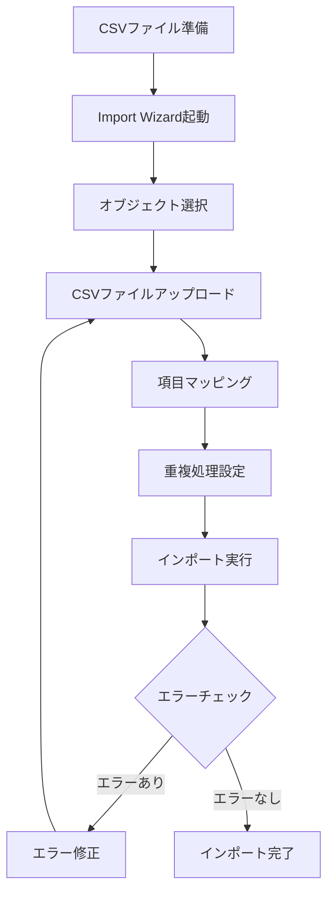

# Salesforce Import Wizardとは

## What's this file?
> [!NOTE]
> **What**
> 
> Salesforce Import Wizardとは何かについて記載しています。

## Conclusion (忙しいとき向け)
> [!IMPORTANT]
> **What** : Salesforce Import Wizardとは何か
> 
> **Answer** : Salesforceの標準機能で、CSVファイルを使用して取引先、取引先責任者、リード、ソリューション、カスタムオブジェクトのデータを一括でインポートできるツール

## 目次

目次を開く

- [概要](#概要)
- [主な特徴](#主な特徴)
- [インポート可能なオブジェクト](#インポート可能なオブジェクト)
- [制限事項](#制限事項)
- [インポートフロー](#インポートフロー)
- [Data Import Wizardとの違い](#data-import-wizardとの違い)

## 概要

Import Wizardは、Salesforceに標準で搭載されているデータインポートツールです。CSVファイルを使用して、複数のレコードを一度にSalesforceにインポートすることができます。

## 主な特徴

1. **シンプルなUI**: ウィザード形式で直感的に操作可能
2. **自動マッピング**: CSVの列名とSalesforceの項目名を自動でマッチング
3. **重複管理**: 既存レコードの更新や重複チェックが可能
4. **エラーレポート**: インポートエラーの詳細を確認可能

## インポート可能なオブジェクト

| オブジェクト | 最大レコード数 |
|------------|-------------|
| 取引先・取引先責任者 | 50,000件 |
| リード | 50,000件 |
| ソリューション | 50,000件 |
| カスタムオブジェクト | 50,000件 |

## 制限事項

- **レコード数**: 一度にインポートできるのは最大50,000件まで
- **ファイルサイズ**: CSVファイルは最大1MBまで
- **項目数**: インポートできる項目数に制限あり
- **リレーション**: 複雑なリレーションの構築には不向き

## インポートフロー

## Data Import Wizardとの違い

Import WizardはClassic版の名称で、Lightning Experience版では「Data Import Wizard」と呼ばれます。基本的な機能は同じですが、UIが異なります。

| 項目 | Import Wizard (Classic) | Data Import Wizard (Lightning) |
|-----|------------------------|-------------------------------|
| UI | Classic UI | Lightning UI |
| 機能 | 基本機能のみ | 拡張機能あり |
| 使いやすさ | シンプル | より直感的 |

## 関連

### 関連ツール
- **Data Loader**: より大量のデータインポートに対応（最大500万件）
- **Workbench**: API経由でのデータ操作が可能
- **ETLツール**: 複雑なデータ変換やスケジュール実行に対応

### 使い分けの指針
- **Import Wizard**: 少量データの単発インポート
- **Data Loader**: 大量データや定期的なインポート
- **ETLツール**: 複雑な変換処理や自動化が必要な場合