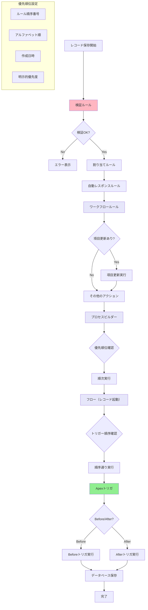

# Salesforceでルールの優先順位によってアクションの実行順序を決定する方法

## What's this file?
> [!NOTE]
> **How**
> 
> どのようにSalesforceでルールの優先順位によってアクションの実行順序を決定するかについて記載しています。

## Conclusion (忙しいとき向け)
> [!IMPORTANT]
> **How** : どのようにルールの優先順位によってアクションの実行順序を決定するか
> 
> **Answer** : 自動化ツールの種類別の実行順序と、各ツール内での優先順位設定により制御

## 目次

<details>
<summary>目次を開く</summary>

- [自動化ツールの実行順序](#自動化ツールの実行順序)
- [各ツールの優先順位設定](#各ツールの優先順位設定)
- [実行順序の制御方法](#実行順序の制御方法)
- [競合と依存関係の管理](#競合と依存関係の管理)
- [実行順序フロー](#実行順序フロー)

</details>

## 自動化ツールの実行順序

### 標準的な実行順序
Salesforceでは、以下の順序で自動化ツールが実行されます：

1. **検証ルール**
2. **割り当てルール**
3. **自動レスポンスルール**
4. **ワークフロールール**
5. **エスカレーションルール**
6. **プロセスビルダー**
7. **フロー（レコード起動）**
8. **Apexトリガ**

### 同一ツール内の順序
```
実行順序の決定要因：
- ルールの順序番号
- アルファベット順（順序未指定時）
- 作成日時（一部のツール）
- 明示的な優先度設定
```

## 各ツールの優先順位設定

### ワークフロールール
**順序制御方法**
- ルール名のアルファベット順で実行
- 同時に複数のルールが該当する場合は全て実行
- 項目更新は他のアクションより先に実行

### プロセスビルダー
**優先順位の設定**
1. プロセス一覧画面で順序を変更
2. ドラッグ&ドロップで並び替え
3. 番号が小さいほど優先度が高い

### フロー
**実行順序の制御**
```
設定可能な項目：
- トリガー順序（1〜2000）
- 実行タイミング（レコード保存前/後）
- 条件の評価順序
```

### 割り当てルール
**優先順位の管理**
1. ルールエントリの順序で評価
2. 最初に一致したルールで処理終了
3. 上位のエントリほど優先

## 実行順序の制御方法

### 1. 順序番号の活用
```
例：フローのトリガー順序
- フローA: トリガー順序 = 1
- フローB: トリガー順序 = 2
- フローC: トリガー順序 = 3
→ A → B → C の順で実行
```

### 2. 条件の最適化
**実行を制御する条件設定**
- より具体的な条件を上位に配置
- 汎用的な条件は下位に配置
- 相互排他的な条件で競合回避

### 3. 依存関係の明示化
```
依存関係の例：
1. ワークフロー: ステータスを「承認待ち」に更新
2. プロセスビルダー: ステータスが「承認待ち」の場合に承認申請
→ 実行順序により正しく動作
```

### 4. 統合フローへの移行
**複数の自動化を1つのフローに統合**
- 実行順序を完全に制御可能
- パフォーマンスの向上
- デバッグの容易化

## 競合と依存関係の管理

### 競合の回避方法
1. **重複チェック**
   - 同じ項目を更新する複数のルール
   - 条件の重複確認

2. **実行コンテキストの考慮**
   - 再帰的な実行の防止
   - 実行回数の制限設定

### 依存関係の文書化
```
推奨される文書化項目：
- ルール名と目的
- 実行順序と優先度
- 依存する他のルール
- 更新される項目
- 想定される影響範囲
```

## 実行順序フロー



## 関連
- [自動化ツールの選択](https://help.salesforce.com/s/articleView?id=sf.process_which_tool.htm)
- [実行順序と処理](https://help.salesforce.com/s/articleView?id=sf.process_order_of_execution.htm)
- [フローのトリガー順序](https://help.salesforce.com/s/articleView?id=sf.flow_trigger_order.htm)
- [ワークフロールール](https://help.salesforce.com/s/articleView?id=sf.workflow_rules_new.htm)