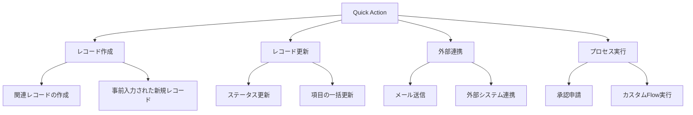
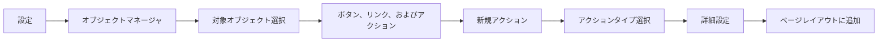

# Salesforce Quick Action とは

## What's this file?
> [!NOTE]
> **What**
> 
> Salesforce Quick Actionとは何かについて記載しています。

## Conclusion (忙しいとき向け)
> [!IMPORTANT]
> **What** : Salesforce Quick Actionとは何か
> 
> **Answer** : レコードページ、リストビュー、グローバルヘッダーから素早く特定のアクションを実行できる機能。ボタンやリンクとして表示され、レコードの作成・更新、メール送信、カスタムVisualforceページの表示などが可能。

## 目次

目次を開く

- [Quick Actionの概要](#quick-actionの概要)
- [Quick Actionの種類](#quick-actionの種類)
- [Quick Actionのユースケース](#quick-actionのユースケース)
- [Quick Actionの設定方法](#quick-actionの設定方法)
- [Quick Actionの配置場所](#quick-actionの配置場所)

## Quick Actionの概要

Quick Actionは、Salesforceユーザーが頻繁に実行するタスクを素早く完了できるようにする機能です。通常は複数のクリックやページ遷移が必要な作業を、1つのボタンクリックで実行できます。

### 主な特徴
- **効率性**: 複雑な操作を簡略化
- **カスタマイズ性**: 組織のビジネスプロセスに合わせて設定可能
- **モバイル対応**: Lightning ExperienceとSalesforceモバイルアプリの両方で利用可能

## Quick Actionの種類

### 1. グローバルアクション
- どこからでもアクセス可能
- グローバルヘッダーに表示
- 例：新規取引先の作成、新規商談の作成

### 2. オブジェクト固有のアクション
- 特定のオブジェクトのレコードページで利用可能
- レコードのコンテキストを引き継ぐ
- 例：商談から見積を作成、取引先責任者にメール送信

### 3. 標準アクション
- Salesforceが提供する事前定義されたアクション
- 例：投稿、ファイル、新規イベント、新規ToDo

### 4. カスタムアクション
- 組織独自のビジネスプロセスに対応
- Visualforce、Lightning Component、Flowを使用

## Quick Actionのユースケース

### 具体例
1. **営業活動**
   - 商談から見積書を即座に作成
   - 活動の記録を素早く作成
   
2. **カスタマーサービス**
   - ケースのステータスを「解決済み」に更新
   - フォローアップメールの送信

3. **マーケティング**
   - リードをキャンペーンに追加
   - リードの取引開始

## Quick Actionの設定方法

### 基本的な設定手順

### アクションタイプ
1. **レコードを作成**: 新規レコードの作成
2. **レコードを更新**: 既存レコードの更新
3. **Visualforce**: カスタムVisualforceページの表示
4. **Lightning Component**: Lightning Componentの実行
5. **Flow**: 自動化されたプロセスの実行

## Quick Actionの配置場所

### 1. レコードページ
- Chatterパブリッシャー
- ページレイアウトのQuick Actionセクション
- Lightning レコードページのアクションコンポーネント

### 2. リストビュー
- リストビューの一括アクション
- 個別レコードのアクションメニュー

### 3. グローバルヘッダー
- グローバルアクションメニュー（+アイコン）
- どのページからでもアクセス可能

### 4. モバイルアプリ
- アクションバー
- スワイプアクション

## 関連
- [Salesforce Lightning Experience](https://help.salesforce.com/s/articleView?id=sf.lex_intro.htm)
- [Process Builder と Flow Builder](https://help.salesforce.com/s/articleView?id=sf.process_overview.htm)
- [ページレイアウト](https://help.salesforce.com/s/articleView?id=sf.customize_layout.htm)
- [Salesforce モバイルアプリ](https://help.salesforce.com/s/articleView?id=sf.salesforce_app.htm)