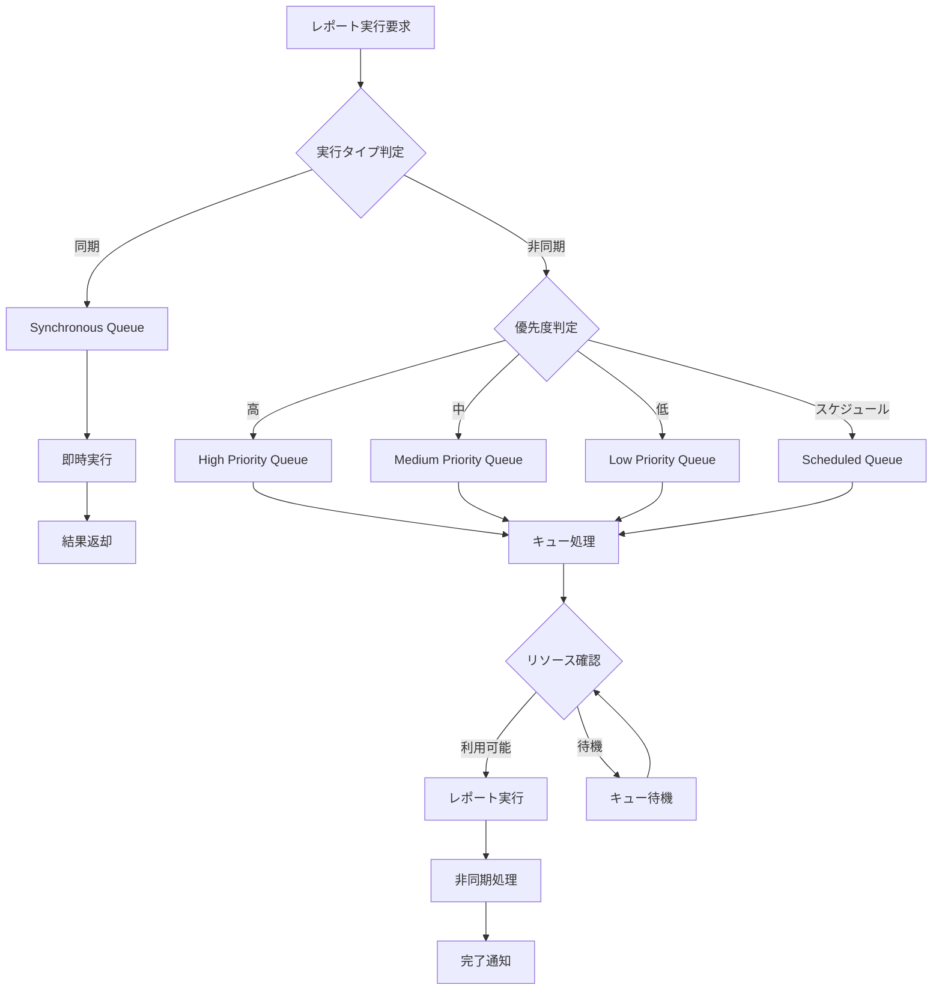

# Salesforceレポートキュータイプ完全リスト

## What's this file?
> [!NOTE]
> **What**
> 
> Salesforceレポートキュータイプとは何かについて記載しています。

## Conclusion (忙しいとき向け)
> [!IMPORTANT]
> **What** : Salesforceレポートキュータイプとは何か
> 
> **Answer** : レポートの実行優先度や処理順序を管理するためのカテゴリで、同期/非同期、優先度別に5つのタイプに分類される

## 目次

<details>
<summary>目次を開く</summary>

- [概要](#概要)
- [レポートキュータイプ一覧](#レポートキュータイプ一覧)
- [キュータイプ詳細](#キュータイプ詳細)
- [処理フロー](#処理フロー)
- [使用上の注意点](#使用上の注意点)
- [ベストプラクティス](#ベストプラクティス)

</details>

## 概要

Salesforceのレポートキュータイプは、レポート実行の優先度と処理方法を管理するシステムです。組織のパフォーマンスを最適化し、リソースを効率的に配分するために使用されます。

## レポートキュータイプ一覧

| キュータイプ | 実行方式 | 優先度 | 最大実行時間 | 用途 |
|------------|---------|--------|------------|------|
| **Synchronous (同期)** | リアルタイム | 最高 | 2分 | 即座に結果が必要な小規模レポート |
| **High Priority (高優先度)** | 非同期 | 高 | 10分 | 重要な業務レポート |
| **Medium Priority (中優先度)** | 非同期 | 中 | 30分 | 定期的な分析レポート |
| **Low Priority (低優先度)** | 非同期 | 低 | 60分 | バックグラウンド処理 |
| **Scheduled (スケジュール)** | 非同期 | 可変 | 120分 | 定期実行レポート |

## キュータイプ詳細

### 1. Synchronous (同期)
- **特徴**: ユーザーが待機中に実行
- **制限**: 200行以下のデータ
- **タイムアウト**: 2分
- **使用例**: ダッシュボードコンポーネント、クイックビュー

### 2. High Priority (高優先度)
- **特徴**: 優先的にキューで処理
- **制限**: 2,000行まで
- **タイムアウト**: 10分
- **使用例**: 経営レポート、KPIダッシュボード

### 3. Medium Priority (中優先度)
- **特徴**: 標準的な処理順序
- **制限**: 50,000行まで
- **タイムアウト**: 30分
- **使用例**: 週次・月次レポート

### 4. Low Priority (低優先度)
- **特徴**: リソース空き時に実行
- **制限**: 1,000,000行まで
- **タイムアウト**: 60分
- **使用例**: データエクスポート、大量分析

### 5. Scheduled (スケジュール)
- **特徴**: 指定時刻に自動実行
- **制限**: 2,000,000行まで
- **タイムアウト**: 120分
- **使用例**: 日次バッチ、定期配信

## 処理フロー



## 使用上の注意点

### リソース制限
1. **同時実行数**: 各キュータイプごとに上限あり
2. **CPU時間**: 組織全体で共有
3. **メモリ使用量**: レポートサイズに依存

### パフォーマンス考慮事項
- **ピーク時間帯**: 高優先度キューも混雑する可能性
- **データ量**: 大量データは低優先度キューを推奨
- **複雑度**: 複雑な計算は非同期実行を選択

## ベストプラクティス

### 1. 適切なキュータイプの選択
```
IF データ量 < 200行 AND 即時性が必要
  → Synchronous
ELSE IF ビジネスクリティカル
  → High Priority
ELSE IF 定期レポート
  → Scheduled
ELSE
  → Medium/Low Priority
```

### 2. パフォーマンス最適化
- インデックス付き項目でフィルタ
- 不要な項目を除外
- 集計関数の適切な使用

### 3. モニタリング
- キュー状態の定期確認
- 実行時間の監視
- エラー率の追跡

## 関連

### 関連機能
- **レポートビルダー**: レポート作成ツール
- **ダッシュボード**: レポート可視化
- **Analytics API**: プログラマティックアクセス

### 関連設定
- **組織の設定**: キュー制限の確認
- **ユーザー権限**: レポート実行権限
- **ガバナー制限**: API制限との関係