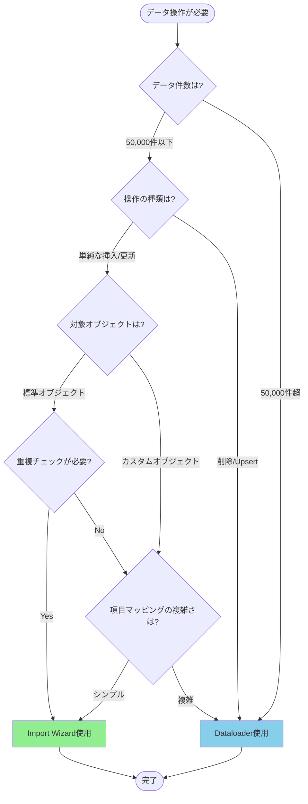

# Salesforce DataloaderとImport Wizardの使い分け方法

## What's this file?
> [!NOTE]
> **How**
> 
> どのようにSalesforce DataloaderとImport Wizardを使い分けるかについて記載しています。

## Conclusion (忙しいとき向け)
> [!IMPORTANT]
> **How** : どのようにSalesforce DataloaderとImport Wizardを使い分けるか
> 
> **Answer** : データ量と操作の複雑さで判断。50,000件以下で単純な操作ならImport Wizard、それ以上または複雑な操作ならDataloaderを使用

## 目次

目次を開く

- [1. 使い分けフローチャート](#1-使い分けフローチャート)
- [2. Import Wizardの特徴](#2-import-wizardの特徴)
- [3. Dataloaderの特徴](#3-dataloaderの特徴)
- [4. 機能比較表](#4-機能比較表)
- [5. 具体的な使用シナリオ](#5-具体的な使用シナリオ)

## 1. 使い分けフローチャート

## 2. Import Wizardの特徴

### 利点
- **UIベースで直感的**: ブラウザ上で操作完結
- **重複チェック機能**: 自動的に重複レコードを検出
- **項目マッピング支援**: ドラッグ&ドロップで簡単マッピング
- **インストール不要**: Salesforce標準機能として利用可能

### 制限事項
- **データ量制限**: 最大50,000件まで
- **対応オブジェクト制限**: 
  - 取引先
  - 取引先責任者
  - リード
  - ソリューション
  - キャンペーンメンバー（更新のみ）
  - カスタムオブジェクト
- **操作制限**: 挿入と更新のみ（削除不可）

## 3. Dataloaderの特徴

### 利点
- **大量データ処理**: 最大500万件まで処理可能
- **全オブジェクト対応**: 標準・カスタム問わず全オブジェクト
- **全CRUD操作対応**: 挿入、更新、Upsert、削除、エクスポート
- **バッチ処理**: コマンドラインでの自動化可能
- **高度な機能**: 
  - バルクAPI使用
  - 並列処理
  - エラーログ出力

### 注意点
- **別途インストール必要**: デスクトップアプリケーション
- **学習コスト**: UIが複雑で習熟が必要
- **設定ファイル管理**: XML設定ファイルの理解が必要

## 4. 機能比較表

| 機能 | Import Wizard | Dataloader |
|------|--------------|------------|
| 最大処理件数 | 50,000件 | 500万件 |
| 対応オブジェクト | 限定的（6種類） | 全オブジェクト |
| 操作種類 | 挿入・更新 | 挿入・更新・Upsert・削除・エクスポート |
| 重複チェック | あり | なし（手動設定要） |
| スケジュール実行 | 不可 | 可能 |
| インストール | 不要 | 必要 |
| 使いやすさ | 簡単 | 中級〜上級者向け |

## 5. 具体的な使用シナリオ

### Import Wizardを選ぶべきケース
1. **新規リードの一括登録**（1,000件程度）
2. **既存取引先の住所情報更新**（5,000件以下）
3. **重複チェックが必要なデータインポート**
4. **初心者によるデータ操作**

### Dataloaderを選ぶべきケース
1. **月次の大量データ更新**（10万件以上）
2. **不要レコードの一括削除**
3. **複数オブジェクト間の関連データ処理**
4. **定期的な自動データ連携**
5. **添付ファイルやContentDocumentの操作**

## 関連
- Salesforce データ管理
- バルクAPI
- データインポートベストプラクティス
- Salesforce データ品質管理