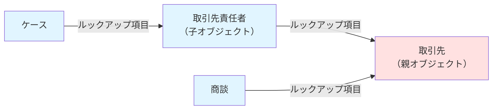
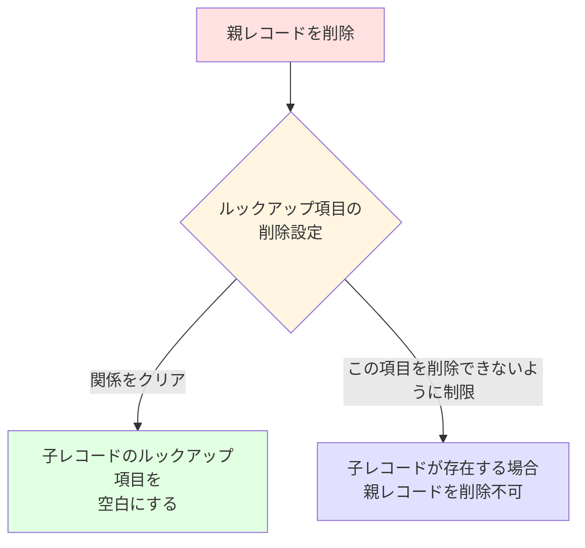
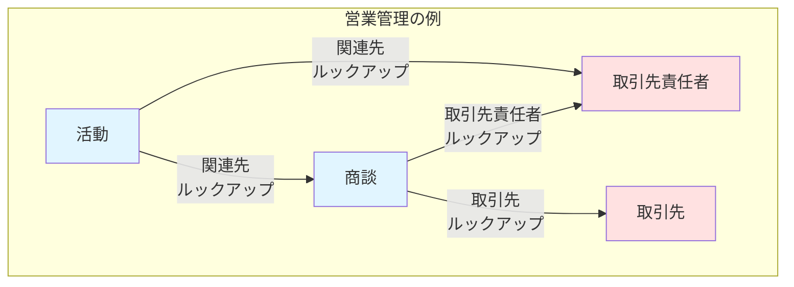
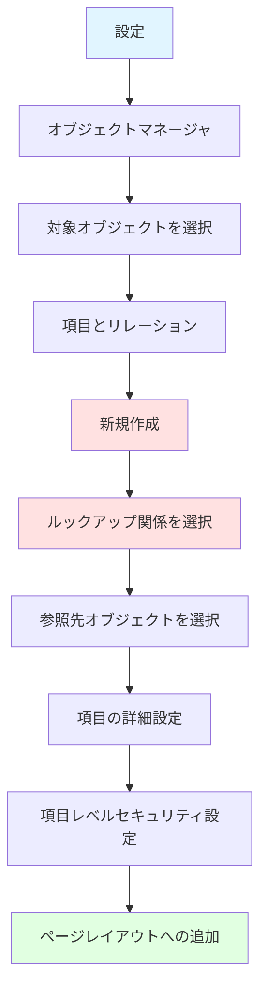

# Salesforceの参照関係におけるルックアップ項目

## What's this file?
> [!NOTE]
> **What**
> 
> Salesforceの参照関係におけるルックアップ項目とは何かについて記載しています。

## Conclusion (忙しいとき向け)
> [!IMPORTANT]
> **What** : Salesforceの参照関係におけるルックアップ項目とは何か
> 
> **Answer** : ルックアップ項目は、Salesforceで2つのオブジェクト間に任意の参照関係を作成する項目タイプで、削除時の動作が柔軟で、親レコードが削除されても子レコードは残る特徴を持つ。

## 目次

目次を開く

- [ルックアップ項目の基本概念](#ルックアップ項目の基本概念)
- [ルックアップ項目の特徴](#ルックアップ項目の特徴)
- [主従関係との違い](#主従関係との違い)
- [ルックアップ項目の使用例](#ルックアップ項目の使用例)
- [ルックアップ項目の設定方法](#ルックアップ項目の設定方法)

## ルックアップ項目の基本概念

ルックアップ項目は、Salesforceにおける**リレーション（関係）項目**の一種です。あるオブジェクトから別のオブジェクトのレコードを参照するための項目タイプで、データベースにおける外部キーに相当します。

## ルックアップ項目の特徴

### 1. 任意の関係性
- 子レコードに親レコードを設定することは**任意**（必須ではない）
- 空白値を許可できる

### 2. 削除時の動作

### 3. 柔軟性
- 1つのオブジェクトに最大40個のルックアップ項目を作成可能
- 自己参照（同じオブジェクトへの参照）も可能

## 主従関係との違い

| 特徴 | ルックアップ関係 | 主従関係 |
|------|-----------------|----------|
| 親レコードの必須性 | 任意 | 必須 |
| 親レコード削除時 | 子レコードは残る | 子レコードも削除 |
| 最大作成数 | 40個 | 2個 |
| 所有者の継承 | なし | あり |
| 積み上げ集計項目 | 使用不可 | 使用可能 |

## ルックアップ項目の使用例

### 実際のビジネスシナリオ

### 一般的な使用ケース
1. **取引先と取引先責任者**: 取引先責任者が複数の取引先に関連付けられる場合
2. **商談と取引先**: 商談は取引先を参照するが、取引先が削除されても商談記録は保持
3. **ケースと取引先責任者**: サポートケースが特定の取引先責任者に関連

## ルックアップ項目の設定方法

### 作成手順

### 設定時の考慮事項

1. **ルックアップフィルタ**: 選択可能なレコードを制限
2. **削除時の動作**: 「関係をクリア」または「削除を制限」を選択
3. **必須設定**: ビジネス要件に応じて必須/任意を決定

## 関連

- [Salesforceのリレーション（関係）の種類](https://help.salesforce.com/s/articleView?id=sf.relationships_overview.htm)
- [主従関係との使い分け](https://developer.salesforce.com/docs/atlas.ja-jp.object_reference.meta/object_reference/relationships_among_objects.htm)
- [ルックアップフィルタの設定方法](https://help.salesforce.com/s/articleView?id=sf.fields_lookup_filters.htm)