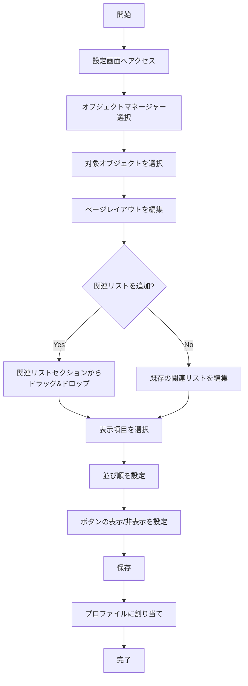

# Salesforceの関連リストとは何か

## What's this file?
> [!NOTE]
> **What**
> 
> Salesforceの関連リストとは何かについて記載しています。

## Conclusion (忙しいとき向け)
> [!IMPORTANT]
> **What** : Salesforceの関連リストとは何か
> 
> **Answer** : オブジェクト間の関係性に基づいて、親レコードに関連する子レコードを表示するリスト形式のUI要素。主従関係や参照関係で結ばれたレコードを一覧表示し、詳細ページから直接操作できる機能。

## 目次

<details>
<summary>目次を開く</summary>

- [関連リストの基本概念](#関連リストの基本概念)
- [関連リストの表示条件](#関連リストの表示条件)
- [関連リストの種類](#関連リストの種類)
- [関連リストの機能](#関連リストの機能)
- [関連リストの設定方法](#関連リストの設定方法)
- [関連リストのカスタマイズ](#関連リストのカスタマイズ)
- [関連リストの制限事項](#関連リストの制限事項)

</details>

## 関連リストの基本概念

関連リストは、Salesforceのレコード詳細ページに表示される機能で、現在のレコードに関連する他のレコードを一覧形式で表示します。

### 主な特徴
- **親子関係の可視化**: 親レコードから子レコードを直接確認
- **データの整理**: 関連情報を構造化して表示
- **迅速なアクセス**: 関連レコードへのクイックナビゲーション
- **インライン編集**: リストから直接レコードを編集可能

## 関連リストの表示条件

関連リストが表示されるための条件：

1. **オブジェクト間の関係**
   - 主従関係（Master-Detail）
   - 参照関係（Lookup）
   - 多対多の関係（Junction Object経由）

2. **ユーザー権限**
   - オブジェクトへの参照権限
   - 項目レベルセキュリティ
   - レコードレベルのアクセス権

3. **ページレイアウト設定**
   - 管理者による関連リストの配置設定
   - プロファイル別のレイアウト割り当て

## 関連リストの種類

### 標準関連リスト
- 取引先責任者（Account → Contacts）
- 商談（Account → Opportunities）
- ケース（Account → Cases）
- 活動（任意のオブジェクト → Activities）
- メモ&添付ファイル（Notes & Attachments）
- Chatterフィード

### カスタム関連リスト
- カスタムオブジェクトの関連リスト
- カスタム参照項目による関連リスト
- Junction Objectを介した多対多の関連リスト

## 関連リストの機能

### 基本機能
1. **レコードの表示**
   - 最大200件まで表示
   - ページネーション機能
   - ソート機能

2. **レコードの操作**
   - 新規作成
   - 編集（インライン編集対応）
   - 削除
   - クローン作成

3. **表示のカスタマイズ**
   - 表示項目の選択
   - 並び順の設定
   - フィルター条件の適用

## 関連リストの設定方法



### 設定手順の詳細

1. **ページレイアウトでの設定**
   ```
   設定 → オブジェクトマネージャー → 対象オブジェクト → ページレイアウト
   ```

2. **関連リストの追加**
   - 左側のパレットから関連リストをドラッグ
   - レイアウト上の希望の位置にドロップ

3. **プロパティの設定**
   - 表示する項目を選択（最大10項目）
   - デフォルトの並び順を指定
   - 標準ボタンの表示/非表示を制御

## 関連リストのカスタマイズ

### Lightning Experience での拡張機能

1. **拡張関連リスト**
   - 最大10列まで表示可能
   - 列幅の調整が可能
   - インライン編集の強化

2. **関連リストクイックリンク**
   - ページ上部に関連リストへのショートカット表示
   - クリックで該当セクションへジャンプ

3. **動的関連リスト**
   - 条件に基づいた動的な表示制御
   - レコードタイプ別の関連リスト表示

### モバイルでの関連リスト

- **Salesforce モバイルアプリ**
  - スワイプによるナビゲーション
  - コンパクトレイアウトでの表示
  - オフライン対応

## 関連リストの制限事項

### 技術的制限
1. **表示件数の制限**
   - デフォルト: 5件
   - 最大表示: 200件
   - それ以上は「すべて表示」リンクから確認

2. **項目数の制限**
   - 最大10項目まで表示可能
   - 参照項目は1階層まで

3. **パフォーマンスへの影響**
   - 関連リストが多いとページ読み込みが遅くなる
   - 複雑な項目計算は避けるべき

### 使用上の注意点

1. **セキュリティ**
   - 項目レベルセキュリティが適用される
   - 共有ルールによるアクセス制限

2. **データの整合性**
   - 削除時の連鎖削除設定に注意
   - 必須項目の設定による制約

3. **ユーザビリティ**
   - 過度な関連リストは画面を複雑にする
   - 重要度に応じた配置が必要

## 関連

### 関連する機能
- **ページレイアウト**: 関連リストの配置を制御
- **Lightning アプリケーションビルダー**: より柔軟な関連リスト配置
- **リストビュー**: 複数レコードの一覧表示機能
- **レポート**: より高度なデータ分析

### 関連する概念
- **オブジェクトリレーション**: 関連リストの基盤となる関係性
- **主従関係**: 親子関係を定義する強い結合
- **参照関係**: より柔軟な関係性を提供
- **Junction Object**: 多対多の関係を実現

### ベストプラクティス
- 関連リストは業務フローに沿って配置する
- 使用頻度の高い関連リストを上部に配置
- 不要な関連リストは非表示にしてパフォーマンスを向上
- モバイルユーザーを考慮したシンプルな構成